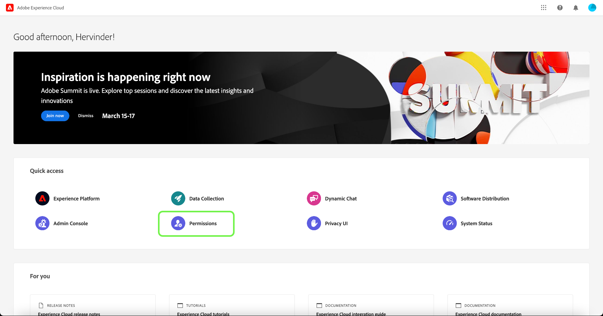
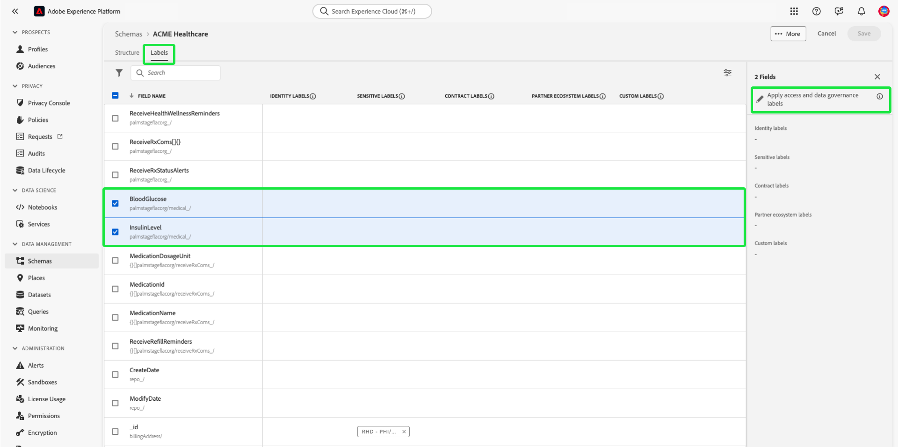
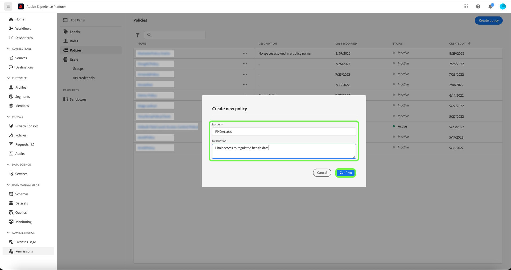

# Guía completa de control de acceso basado en atributos

Utilice el control de acceso basado en atributos en Adobe Experience Platform para ofrecerse a usted y a otros clientes conscientes de la privacidad de varias marcas una mayor flexibilidad para administrar el acceso de los usuarios. El acceso a objetos individuales, como campos de esquema y audiencias, se puede conceder con directivas basadas en los atributos y la función del objeto. Esta función le permite conceder o revocar el acceso a objetos individuales para usuarios de Experience Platform específicos de su organización.

Esta funcionalidad le permite categorizar campos de esquema, audiencias, etc. con etiquetas que definen ámbitos organizativos o de uso de datos. Puede aplicar estas mismas etiquetas a recorridos, ofertas y otros objetos en Adobe Journey Optimizer. Al mismo tiempo, los administradores pueden definir políticas de acceso relacionadas con los campos de esquema del Modelo de datos de experiencia (XDM) y administrar mejor qué usuarios o grupos (usuarios internos, externos o de terceros) pueden acceder a esos campos.

>[!NOTE]
>
>Este documento se centra en el caso de uso de las políticas de control de acceso. Si está intentando configurar directivas que rijan el **uso** de los datos en lugar de los usuarios de Experience Platform que tienen acceso a ellos, consulte la guía completa sobre [control de datos](../../data-governance/e2e.md) en su lugar.

## Introducción

Este tutorial requiere una comprensión práctica de los siguientes componentes de Experience Platform:

* [[!DNL Experience Data Model (XDM)] Sistema](../../xdm/home.md): El marco estandarizado mediante el cual Experience Platform organiza los datos de experiencia del cliente.
   * [Aspectos básicos de la composición de esquemas](../../xdm/schema/composition.md): obtenga información sobre los componentes básicos de los esquemas XDM, incluidos los principios clave y las prácticas recomendadas en la composición de esquemas.
   * [Tutorial del editor de esquemas](../../xdm/tutorials/create-schema-ui.md): Aprenda a crear esquemas personalizados mediante la interfaz de usuario del editor de esquemas.
* [Servicio de segmentación de Adobe Experience Platform](../../segmentation/home.md): El motor de segmentación de [!DNL Experience Platform] se usa para crear segmentos de audiencia a partir de los perfiles de clientes en función de los comportamientos y atributos de los clientes.

### Resumen del caso de uso

Pasará por un flujo de trabajo de control de acceso basado en atributos de ejemplo en el que creará y asignará funciones, etiquetas y directivas para configurar si los usuarios pueden acceder o no a recursos específicos de su organización. Esta guía utiliza un ejemplo de restricción del acceso a datos confidenciales para mostrar el flujo de trabajo. Este caso de uso se describe a continuación:

Es un proveedor de atención médica y desea configurar el acceso a los recursos de su organización.

* Su equipo interno de mercadotecnia debería poder obtener acceso a **[!UICONTROL PHI/ Datos de mantenimiento regulados]**.
* Su agencia externa no debería poder acceder a los datos de **[!UICONTROL PHI/ Datos de mantenimiento regulados]**.

Para ello, debe configurar las funciones, los recursos y las directivas.

Lo hará:

* [Etiquetar las funciones de los usuarios](#label-roles): use el ejemplo de un proveedor de atención médica (Grupo empresarial ACME) cuyo grupo de marketing trabaja con agencias externas.
* [Etiquete sus recursos (campos de esquema y audiencias)](#label-resources): Asigne la etiqueta **[!UICONTROL PHI/ Datos de estado regulados]** a los recursos y audiencias de esquema.
* [Activar la directiva que los vinculará](#policy): habilite la directiva predeterminada para impedir el acceso a los campos y audiencias de esquema conectando las etiquetas de los recursos a las etiquetas de la función. Los usuarios con etiquetas coincidentes recibirán acceso al campo de esquema y al segmento en todas las zonas protegidas.

## Permisos

[!UICONTROL Permisos] es el área de Experience Cloud donde los administradores pueden definir roles de usuario y directivas para administrar permisos para características y objetos dentro de una aplicación de producto.

Mediante [!UICONTROL Permisos], puede crear y administrar roles y asignar los permisos de recursos deseados para estos roles. [!UICONTROL Permisos] también le permite administrar las etiquetas, las zonas protegidas y los usuarios asociados a una función específica.

Póngase en contacto con el administrador del sistema para obtener acceso si no tiene privilegios de administrador.

Una vez que tengas privilegios de administrador, ve a [Adobe Experience Cloud](https://experience.adobe.com/) e inicia sesión con tus credenciales de Adobe. Una vez que hayas iniciado sesión, aparecerá la página **[!UICONTROL Información general]** de tu organización para la que tengas privilegios de administrador. Esta página muestra los productos a los que está suscrita su organización, junto con otros controles para agregar usuarios y administradores a la organización. Seleccione **[!UICONTROL Permisos]** para abrir el área de trabajo de la integración con Experience Platform.

Aparece el área de trabajo Permisos para la interfaz de usuario de Experience Platform, que se abre en la página **[!UICONTROL Información general]**.

## Aplicar etiquetas a una función {#label-roles}

>[!CONTEXTUALHELP]
>id="platform_permissions_labels_about"
>title="¿Qué son las etiquetas?"
>abstract="Utilice etiquetas para clasificar los conjuntos de datos y campos según las directivas de uso que se aplican a esos datos. Adobe Experience Platform proporciona varias etiquetas de uso de datos <strong>principales</strong> definidas por Adobe, que abarcan una amplia variedad de restricciones comunes aplicables a la gobernanza de datos. Por ejemplo, las etiquetas confidenciales <strong>S</strong> como RHD (datos de salud regulados) le permiten clasificar los datos que hacen referencia a información de salud protegida (PHI). También puede definir sus propias etiquetas personalizadas para que se adapten a las necesidades de su organización."
>additional-url="https://experienceleague.adobe.com/docs/experience-platform/data-governance/labels/overview.html?lang=es#understanding-data-usage-labels" text="Información general sobre las etiquetas de uso de datos"

Las funciones son formas de categorizar los tipos de usuarios que interactúan con la instancia de Experience Platform y son componentes básicos de las directivas de control de acceso. Una función tiene un conjunto determinado de permisos y los miembros de la organización pueden asignarse a una o varias funciones, según el ámbito de acceso que necesiten.

Para empezar, seleccione **[!UICONTROL Roles]** en el panel de navegación izquierdo y, a continuación, seleccione **[!UICONTROL Grupo de trabajo ACME]**.

A continuación, selecciona **[!UICONTROL Etiquetas]** y luego selecciona **[!UICONTROL Agregar etiquetas]**.

Aparecerá una lista de todas las etiquetas de su organización. Seleccione **[!UICONTROL RHD]** para agregar la etiqueta para **[!UICONTROL PHI/Datos de mantenimiento regulados]** y luego seleccione **[!UICONTROL Guardar]**.

>[!NOTE]
>
>Al agregar un grupo de organización a una función, todos los usuarios de ese grupo se agregarán a la función. Cualquier cambio en el grupo de organización (usuarios eliminados o añadidos) se actualizará automáticamente dentro de la función.

## Aplicar etiquetas a campos de esquema {#label-resources}

Ahora que ha configurado un rol de usuario con la etiqueta [!UICONTROL RHD], el siguiente paso es agregar esa misma etiqueta a los recursos que desea controlar para ese rol.

En el panel de navegación superior, seleccione **conmutador de aplicaciones**, representado por el icono  y, a continuación, seleccione **[!UICONTROL Experience Platform]**.

Seleccione **[!UICONTROL Esquemas]** en el panel de navegación izquierdo y, a continuación, seleccione **[!UICONTROL ACME Healthcare]** de la lista de esquemas que aparecen.

A continuación, seleccione **[!UICONTROL Etiquetas]** para ver una lista que muestra los campos asociados con el esquema. Desde aquí, puede asignar etiquetas a uno o varios campos a la vez. Seleccione los campos **[!UICONTROL Glucosa de sangre]** y **[!UICONTROL Nivel de insulina]** y, a continuación, seleccione **[!UICONTROL Aplicar etiquetas de acceso y control de datos]**.

Aparece el cuadro de diálogo **[!UICONTROL Editar etiquetas]**, que le permite elegir las etiquetas que desea aplicar a los campos de esquema. Para este caso de uso, seleccione la etiqueta **[!UICONTROL PHI/ Datos de mantenimiento regulados]** y luego seleccione **[!UICONTROL Guardar]**.

>[!NOTE]
>
>Cuando se agrega una etiqueta a un campo, esa etiqueta se aplica al recurso principal de ese campo (una clase o un grupo de campos). Si la clase principal o el grupo de campos están empleados por otros esquemas, esos esquemas heredarán la misma etiqueta.

## Aplicación de etiquetas a audiencias

>[!NOTE]
>
>Cualquier audiencia que utilice un atributo etiquetado debe etiquetarse del mismo modo si desea que se le apliquen las mismas restricciones de acceso.

Una vez que haya completado el etiquetado de los campos de esquema, puede empezar a etiquetar las audiencias.

Seleccione **[!UICONTROL Audiencias]** en la sección **[!UICONTROL Clientes]** de la navegación izquierda. Se muestra una lista de las audiencias disponibles en su organización. En este ejemplo, las dos audiencias siguientes deben etiquetarse como si contuvieran datos confidenciales de estado:

* Glucosa en sangre > 100
* Insulina &lt;50

Seleccione **[!UICONTROL Glucosa en sangre >100]** (por el nombre de la audiencia, no la casilla de verificación) para comenzar a etiquetar a la audiencia.

Aparecerá la pantalla del segmento **[!UICONTROL Detalles]**. Seleccione **[!UICONTROL Administrar acceso]**.

Aparece el cuadro de diálogo **[!UICONTROL Aplicar etiquetas de acceso y control de datos]**, que le permite elegir las etiquetas que desea aplicar a la audiencia. Para este caso de uso, seleccione la etiqueta **[!UICONTROL PHI/ Datos de mantenimiento regulados]** y luego seleccione **[!UICONTROL Guardar]**.

Repita los pasos anteriores con **[!UICONTROL Insulina &lt;50]**.

>[!NOTE]
>
> Asigne las etiquetas creadas en el área de trabajo [!UICONTROL Permissions] (como las etiquetas de segmento anteriores) a varios objetos de Adobe Journey Optimizer mediante [Control de acceso de nivel de objeto](https://experienceleague.adobe.com/es/docs/journey-optimizer/using/access-control/object-based-access).&quot;

## Activación de la directiva de control de acceso {#policy}

La directiva de control de acceso predeterminada aprovecha las etiquetas para definir qué funciones de usuario tienen acceso a recursos específicos de Experience Platform. En este ejemplo, se denegará el acceso a los campos y audiencias de esquema en todas las zonas protegidas a los usuarios que no tengan una función que tenga las etiquetas correspondientes en el campo de esquema.

Para activar la directiva de control de acceso, seleccione [!UICONTROL Permisos] en el panel de navegación izquierdo y, a continuación, seleccione **[!UICONTROL Directivas]**.

A continuación, seleccione los puntos suspensivos (`...`) junto a la **[!UICONTROL Directiva de control de acceso a nivel de campo predeterminado]** y aparecerá un menú desplegable con controles para editar, activar, eliminar o duplicar la función. Seleccione **[!UICONTROL Activar]** de la lista desplegable.

Aparecerá el cuadro de diálogo Activar directiva, que le pedirá que confirme la activación. Seleccione **[!UICONTROL Confirmar]**.

Se ha recibido la confirmación de la activación de la directiva y ha vuelto a la página [!UICONTROL Políticas].

<!-- ## Create an access control policy {#policy}

>[!CONTEXTUALHELP]
>id="platform_permissions_policies_about"
>title="What are policies?"
>abstract="Policies are statements that bring attributes together to establish permissible and impermissible actions. Every organization comes with a default policy that you must activate to define rules for resources like segments and schema fields. Default policies can neither be edited nor deleted. However, default policies can be activated or deactivated."
>additional-url="https://experienceleague.adobe.com/docs/experience-platform/access-control/abac/permissions-ui/policies.html?lang=es" text="Manage policies"

>[!CONTEXTUALHELP]
>id="platform_permissions_policies_about_create"
>title="Create a policy"
>abstract="Create a policy to define the actions that your users can and cannot take against your segments and schema fields."
>additional-url="https://experienceleague.adobe.com/docs/experience-platform/access-control/abac/permissions-ui/policies.html?lang=es#create-a-new-policy" text="Create a policy"

>[!CONTEXTUALHELP]
>id="platform_permissions_policies_edit_permitdeny"
>title="Configure permissible and impermissible actions for a policy"
>abstract="A <b>deny access to</b> policy will deny users access when the criteria is met. Combined with <b>The following being false</b> - all users will be denied access unless they meet the matching criteria set. This type of policy allows you to protect a sensitive resource and only allow access to users with matching labels.  A <b>permit access to</b> policy will permit users access when the criteria are met. When combined with <b>The following being true</b> - users will be given access if they meet the matching criteria set. This does not explicitly deny access to users, but adds a permit access. This type of policy allows you to give additional access to resource and in addition to those users who might already have access through role permissions."
>additional-url="https://experienceleague.adobe.com/docs/experience-platform/access-control/abac/permissions-ui/policies.html?lang=es#edit-a-policy" text="Edit a policy"

>[!CONTEXTUALHELP]
>id="platform_permissions_policies_edit_resource"
>title="Configure permissions for a resource"
>abstract="A resource is the asset or object that a user can or cannot access. Resources can be segments or schemas fields. You can configure write, read, or delete permissions for segments and schema fields."

>[!CONTEXTUALHELP]
>id="platform_permissions_policies_edit_condition"
>title="Edit conditions"
>abstract="Apply conditional statements to your policy to configure user access to certain resources. Select match all to require users to have roles with the same labels as a resource to be permitted access. Select match any to require users to have a role with just one label matching a label on a resource. Labels can either be defined as core or custom labels, with core labels representing labels created and provided by Adobe and custom labels representing labels that you created for your organization."

Access control policies leverage labels to define which user roles have access to specific Experience Platform resources. Policies can either be local or global and can override other policies. In this example, access to schema fields and segments will be denied in all sandboxes for users who don't have the corresponding labels in the schema field.

>[!NOTE]
>
>A "deny policy" is created to grant access to sensitive resources because the role grants permission to the subjects. The written policy in this example **denies** you access if you are missing the required labels.
a
To create an access control policy, select **[!UICONTROL Permissions]** from the left navigation and then select **[!UICONTROL Policies]**. Next, select **[!UICONTROL Create policy]**.

The **[!UICONTROL Create new policy]** dialog appears, prompting you to enter a name and an optional description. Select **[!UICONTROL Confirm]** when finished.

To deny access to the schema fields, use the dropdown arrow and select **[!UICONTROL Deny access to]** and then select **[!UICONTROL No resource selected]**. Next, select **[!UICONTROL Schema Field]** and then select **[!UICONTROL All]**.

The table below shows the conditions available when creating a policy:

| Conditions | Description |
| --- | --- |
| The following being false| When 'Deny access to' is set, access will be restricted if the user does not meet the criteria selected. |
| The following being true| When 'Permit access to' is set, access will be permitted if the user meets the selected criteria. |
| Matches any| The user has a label that matches any label applied to a resource. |
| Matches all| The user has all labels that matches all labels applied to a resource. |
| Core label| A core label is an Adobe-defined label that is available in all Experience Platform instances.|
| Custom label| A custom label is a label that has been created by your organization.|

Select **[!UICONTROL The following being false]** and then select **[!UICONTROL No attribute selected]**. Next, select the user **[!UICONTROL Core label]**, then select **[!UICONTROL Matches all]**. Select the resource **[!UICONTROL Core label]** and finally select **[!UICONTROL Add resource]**.

>[!TIP]
>
>A resource is the asset or object that a subject can or cannot access. Resources can be segments or schemas.

To deny access to the segments, use the dropdown arrow and select **[!UICONTROL Deny access to]** and then select **[!UICONTROL No resource selected]**. Next, select **[!UICONTROL Segment]** and then select **[!UICONTROL All]**.

Select **[!UICONTROL The following being false]** and then select **[!UICONTROL No attribute selected]**. Next, select the user **[!UICONTROL Core label]**, then select **[!UICONTROL Matches all]**. Select the resource **[!UICONTROL Core label]** and finally select **[!UICONTROL Save]**.

Select **[!UICONTROL Activate]** to activate the policy, and a dialog appears which prompts you to confirm activation. Select **[!UICONTROL Confirm]** and then select **[!UICONTROL Close]**.

 -->

## Pasos siguientes

Ha completado la aplicación de etiquetas a un rol, campos de esquema y audiencias. La agencia externa asignada a estas funciones tiene restringido el acceso a la visualización de estas etiquetas y sus valores en la vista de esquema, conjunto de datos y perfil. Estos campos también están restringidos para no utilizarse en la definición del segmento al utilizar el Generador de segmentos.

Para obtener más información sobre el control de acceso basado en atributos, vea la [descripción general del control de acceso basado en atributos](./overview.md).

El siguiente vídeo tiene como objetivo facilitar la comprensión del control de acceso basado en atributos y describe cómo configurar funciones, recursos y directivas.

>[!VIDEO](https://video.tv.adobe.com/v/3451831?learn=on&captions=spa)
