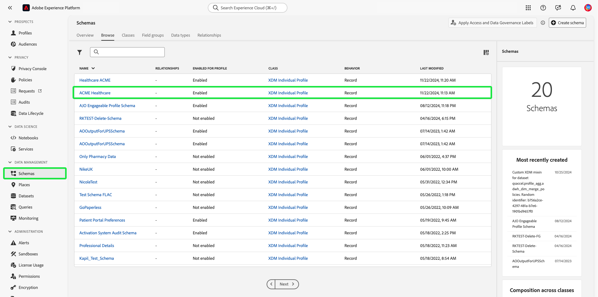

# Guía de extremo a extremo del control de acceso basado en atributos

El control de acceso basado en atributos es una capacidad de Adobe Experience Platform que proporciona a los clientes con múltiples marcas y con conciencia de la privacidad buena flexibilidad para administrar el acceso de los usuarios. El acceso a objetos individuales, como campos de esquema y segmentos, se puede conceder o denegar con políticas basadas en los atributos y la función del objeto. Esta función le permite conceder o revocar acceso a objetos individuales para usuarios específicos de Platform de su organización.

Esta funcionalidad le permite categorizar campos de esquema, segmentos, etc. con etiquetas que definen ámbitos organizativos o de uso de datos. Puede aplicar las mismas etiquetas a recorridos, ofertas y otros objetos en Adobe Journey Optimizer. Paralelamente, los administradores pueden definir las políticas de acceso que rodean los campos de esquema del Modelo de datos de experiencia (XDM) y administrar mejor qué usuarios o grupos (usuarios internos, externos o de terceros) pueden acceder a dichos campos.

>[!NOTE]
>
>Este documento se centra en el caso de uso de las políticas de control de acceso. Si está intentando configurar directivas para que rijan la variable **use** de los datos, en lugar de los usuarios de Platform a los que tienen acceso, consulte la guía de extremo a extremo sobre [administración de datos](../../data-governance/e2e.md) en su lugar.

## Primeros pasos

Este tutorial requiere una comprensión práctica de los siguientes componentes de Platform:

* [[!DNL Experience Data Model (XDM)] Sistema](../../xdm/home.md): El marco estandarizado mediante el cual el Experience Platform organiza los datos de experiencia del cliente.
   * [Aspectos básicos de la composición del esquema](../../xdm/schema/composition.md): Obtenga información sobre los componentes básicos de los esquemas XDM, incluidos los principios clave y las prácticas recomendadas en la composición de esquemas.
   * [Tutorial del Editor de esquemas](../../xdm/tutorials/create-schema-ui.md): Obtenga información sobre cómo crear esquemas personalizados mediante la interfaz de usuario del Editor de esquemas.
* [Servicio de segmentación de Adobe Experience Platform](../../segmentation/home.md): El motor de segmentación dentro de [!DNL Platform] se utiliza para crear segmentos de audiencia a partir de perfiles de clientes en función de los comportamientos y atributos de los clientes.

### Información general del caso de uso

Realizará un flujo de trabajo de control de acceso basado en atributos de ejemplo en el que creará y asignará funciones, etiquetas y políticas para configurar si los usuarios pueden o no acceder a recursos específicos de su organización. Esta guía utiliza un ejemplo de restricción del acceso a los datos confidenciales para mostrar el flujo de trabajo. Este caso de uso se describe a continuación:

Es un proveedor de atención médica y desea configurar el acceso a los recursos de su organización.

* El equipo de marketing interno debe poder acceder a **[!UICONTROL Datos de Salud Regulados/ PHI]** datos.
* Su agencia externa no debería poder acceder a **[!UICONTROL Datos de Salud Regulados/ PHI]** datos.

Para ello, debe configurar funciones, recursos y políticas.

Usted:

* [Etiquetado de funciones para los usuarios](#label-roles): Utilice el ejemplo de un proveedor de atención médica (ACME Business Group) cuyo grupo de marketing trabaja con agencias externas.
* [Etiquetado de recursos (campos de esquema y segmentos)](#label-resources): Asigne la variable **[!UICONTROL Datos de Salud Regulados/ PHI]** a recursos y segmentos de esquema.
* 
   * [Active la directiva que los vinculará: ](#policy): Active la directiva predeterminada para evitar el acceso a los campos y segmentos de esquema conectando las etiquetas de los recursos con las etiquetas de la función. A los usuarios con etiquetas coincidentes se les otorgará acceso al campo de esquema y al segmento en todos los entornos limitados.

## Permisos

[!UICONTROL Permisos] es el área de Experience Cloud en la que los administradores pueden definir funciones de usuario y políticas para administrar permisos para funciones y objetos dentro de una aplicación de producto.

Hasta [!UICONTROL Permisos], puede crear y administrar funciones y asignar los permisos de recursos deseados para estas funciones. [!UICONTROL Los permisos también le permiten administrar las etiquetas, las zonas protegidas y los usuarios asociados a una función específica.]

Póngase en contacto con el administrador del sistema para obtener acceso si no tiene privilegios de administrador.

Una vez que tenga privilegios de administrador, vaya a [Adobe Experience Cloud](https://experience.adobe.com/) e inicie sesión con sus credenciales de Adobe. Una vez que haya iniciado sesión, la variable **[!UICONTROL Información general]** para su organización tiene privilegios de administrador para . Esta página muestra los productos a los que está suscrita su organización, junto con otros controles para agregar usuarios y administradores a la organización. Select **[!UICONTROL Permisos]** para abrir el espacio de trabajo para la integración de Platform.

Aparece el espacio de trabajo Permisos para la interfaz de usuario de Platform , que se abre en la variable **[!UICONTROL Funciones]** página.

## Aplicar etiquetas a una función {#label-roles}

>[!CONTEXTUALHELP]
>id="platform_permissions_labels_about"
>title="¿Qué son las etiquetas?"
>abstract="Las etiquetas permiten categorizar conjuntos de datos y campos según las políticas de uso que se aplican a esos datos. Platform proporciona varias etiquetas de uso de datos “principales” definidas por Adobe, que abarcan una amplia variedad de restricciones comunes aplicables a la gobernanza de datos. Por ejemplo, las etiquetas confidenciales “S” como RHD (datos de salud regulados) le permiten categorizar los datos que hacen referencia a información médica protegida (PHI). También puede definir etiquetas personalizadas propias que se ajusten a las necesidades de su organización."
>additional-url="https://experienceleague.adobe.com/docs/experience-platform/data-governance/labels/overview.html?lang=es#understanding-data-usage-labels" text="Información general sobre las etiquetas de uso de datos"

>[!CONTEXTUALHELP]
>id="platform_permissions_labels_about_create"
>title="Creación de etiquetas nuevas"
>abstract="Puede crear sus propias etiquetas personalizadas para adaptarlas a las necesidades de su organización. Las etiquetas personalizadas se pueden utilizar para aplicar configuraciones de gobernanza y control de acceso a los datos."
>additional-url="https://experienceleague.adobe.com/docs/experience-platform/data-governance/labels/overview.html?lang=es#manage-labels" text="Administración de etiquetas personalizadas"

>[!CONTEXTUALHELP]
>id="platform_permissions_roles_about"
>title="¿Qué son las funciones?"
>abstract="Las funciones son formas de categorizar los tipos de usuarios que interactúan con la instancia de Platform y que constituyen bloques de creación de las directivas de control de acceso. Una función tiene un conjunto determinado de permisos y los miembros de su organización pueden asignarse a una o más funciones, según el ámbito de acceso de visualización o escritura que necesiten."
>additional-url="https://experienceleague.adobe.com/docs/experience-platform/access-control/abac/permissions-ui/roles.html?lang=es" text="Administración de funciones"

>[!CONTEXTUALHELP]
>id="platform_permissions_roles_about_create"
>title="Creación de una nueva función"
>abstract="Puede crear una nueva función para categorizar mejor a los usuarios que acceden a la instancia de Platform. Por ejemplo, puede crear una función para un equipo interno de marketing y aplicarle la etiqueta RHD, lo que permite al equipo acceder a la información médica protegida (PHI). Alternativamente, también puede crear una función para una agencia externa y denegarle el acceso a los datos de PHI al no aplicarle la etiqueta RHD."
>additional-url="https://experienceleague.adobe.com/docs/experience-platform/access-control/abac/permissions-ui/roles.html?lang=es#create-a-new-role" text="Creación de una función nueva"

>[!CONTEXTUALHELP]
>id="platform_permissions_roles_details"
>title="Información general de funciones"
>abstract="El cuadro de diálogo de información general de funciones muestra los recursos y zonas protegidas a los que puede acceder una función determinada."

Las funciones son formas de categorizar los tipos de usuarios que interactúan con la instancia de Platform y son componentes básicos de las políticas de control de acceso. Una función tiene un conjunto determinado de permisos y los miembros de su organización pueden asignarse a una o más funciones, según el alcance de acceso que necesiten.

Para empezar, seleccione **[!UICONTROL Grupo empresarial ACME]** desde el **[!UICONTROL Funciones]** página.

A continuación, seleccione **[!UICONTROL Etiquetas]** y, a continuación, seleccione **[!UICONTROL Agregar etiquetas]**.

Aparecerá una lista de todas las etiquetas de su organización. Select **[!UICONTROL RHD]** para añadir la etiqueta **[!UICONTROL Datos de Salud Regulados/PHI]**. Espere unos momentos para que aparezca una marca de verificación azul junto a la etiqueta y, a continuación, seleccione **[!UICONTROL Guardar]**.

>[!NOTE]
>
>Al agregar un grupo de organización a una función, todos los usuarios de ese grupo se agregarán a la función. Cualquier cambio en el grupo de organización (usuarios eliminados o agregados) se actualizará automáticamente dentro de la función.

## Aplicar etiquetas a campos de esquema {#label-resources}

Ahora que ha configurado una función de usuario con el [!UICONTROL RHD] , el siguiente paso es agregar la misma etiqueta a los recursos que desea controlar para esa función.

Select **[!UICONTROL Esquemas]** en el panel de navegación izquierdo y, a continuación, seleccione **[!UICONTROL Atención médica de ACME]** de la lista de esquemas que aparecen.

A continuación, seleccione **[!UICONTROL Etiquetas]** para ver una lista que muestra los campos asociados al esquema. Desde aquí puede asignar etiquetas a uno o varios campos a la vez. Seleccione el **[!UICONTROL Glucosa sanguínea]** y **[!UICONTROL InsulinaLevel]** y, a continuación, seleccione **[!UICONTROL Aplicar etiquetas de acceso y control de datos]**.

La variable **[!UICONTROL Editar etiquetas]** , que le permite elegir las etiquetas que desea aplicar a los campos de esquema. Para este caso de uso, seleccione la opción **[!UICONTROL Datos de Salud Regulados/ PHI]** etiqueta y, a continuación, seleccione **[!UICONTROL Guardar]**.

>[!NOTE]
>
>Cuando se agrega una etiqueta a un campo, esa etiqueta se aplica al recurso principal de ese campo (ya sea una clase o un grupo de campos). Si la clase principal o el grupo de campos están empleados por otros esquemas, estos esquemas heredarán la misma etiqueta.

## Aplicar etiquetas a segmentos

Una vez que haya completado el etiquetado de los campos de esquema, puede empezar a etiquetar los segmentos.

Select **[!UICONTROL Segmentos]** desde el panel de navegación izquierdo. Se muestra una lista de segmentos disponibles en su organización. En este ejemplo, se deben etiquetar los dos segmentos siguientes, ya que contienen datos de estado confidenciales:

* Glucosa en sangre >100
* Insulina &lt;50

Select **[!UICONTROL Glucosa en sangre >100]** para empezar a etiquetar el segmento.

El segmento **[!UICONTROL Detalles]** se abre. Select **[!UICONTROL Administrar acceso]**.

La variable **[!UICONTROL Editar etiquetas]** , que le permite elegir las etiquetas que desea aplicar al segmento. Para este caso de uso, seleccione la opción **[!UICONTROL Datos de Salud Regulados/ PHI]** etiqueta y, a continuación, seleccione **[!UICONTROL Guardar]**.

Repita los pasos anteriores con **[!UICONTROL Insulina &lt;50]**.

## Activar la directiva de control de acceso {#policy}

La directiva de control de acceso predeterminada utilizará etiquetas para definir qué funciones de usuario tienen acceso a recursos específicos de la plataforma. En este ejemplo, se denegará el acceso a los campos y segmentos de esquema en todos los entornos limitados para los usuarios que no estén en una función que tenga las etiquetas correspondientes en el campo de esquema.

Para activar la directiva de control de acceso, seleccione [!UICONTROL Permisos] en el panel de navegación izquierdo y, a continuación, seleccione **[!UICONTROL Políticas]**.

A continuación, seleccione los puntos suspensivos (`...`) junto al nombre de las directivas y un menú desplegable muestra los controles para editar, activar, eliminar o duplicar la función. Select **[!UICONTROL Activar]** en la lista desplegable .

Aparece el cuadro de diálogo Activar directiva que le solicita que confirme la activación. Select **[!UICONTROL Confirmar]**.

Se recibe la confirmación de la activación de la directiva y se le devuelve al [!UICONTROL Políticas] página.

<!-- ## Create an access control policy {#policy}

>[!CONTEXTUALHELP]
>id="platform_permissions_policies_about"
>title="What are policies?"
>abstract="Policies are statements that bring attributes together to establish permissible and impermissible actions. Every organization comes with a default policy that you must activate to define rules for resources like segments and schema fields. Default policies can neither be edited nor deleted. However, default policies can be activated or deactivated."
>additional-url="https://experienceleague.adobe.com/docs/experience-platform/access-control/abac/permissions-ui/policies.html?lang=en" text="Manage policies"

>[!CONTEXTUALHELP]
>id="platform_permissions_policies_about_create"
>title="Create a policy"
>abstract="Create a policy to define the actions that your users can and cannot take against your segments and schema fields."
>additional-url="https://experienceleague.adobe.com/docs/experience-platform/access-control/abac/permissions-ui/policies.html?lang=en#create-a-new-policy" text="Create a policy"

>[!CONTEXTUALHELP]
>id="platform_permissions_policies_edit_permitdeny"
>title="Configure permissible and impermissible actions for a policy"
>abstract="A <b>deny access to</b> policy will deny users access when the criteria is met. Combined with <b>The following being false</b> - all users will be denied access unless they meet the matching criteria set. This type of policy allows you to protect a sensitive resource and only allow access to users with matching labels.  A <b>permit access to</b> policy will permit users access when the criteria are met. When combined with <b>The following being true</b> - users will be given access if they meet the matching criteria set. This does not explicitly deny access to users, but adds a permit access. This type of policy allows you to give additional access to resource and in addition to those users who might already have access through role permissions." 
>additional-url="https://experienceleague.adobe.com/docs/experience-platform/access-control/abac/permissions-ui/policies.html?lang=en#edit-a-policy" text="Edit a policy"

>[!CONTEXTUALHELP]
>id="platform_permissions_policies_edit_resource"
>title="Configure permissions for a resource"
>abstract="A resource is the asset or object that a user can or cannot access. Resources can be segments or schemas fields. You can configure write, read, or delete permissions for segments and schema fields."

>[!CONTEXTUALHELP]
>id="platform_permissions_policies_edit_condition"
>title="Edit conditions"
>abstract="Apply conditional statements to your policy to configure user access to certain resources. Select match all to require users to have roles with the same labels as a resource to be permitted access. Select match any to require users to have a role with just one label matching a label on a resource. Labels can either be defined as core or custom labels, with core labels representing labels created and provided by Adobe and custom labels representing labels that you created for your organization."

Access control policies leverage labels to define which user roles have access to specific Platform resources. Policies can either be local or global and can override other policies. In this example, access to schema fields and segments will be denied in all sandboxes for users who don't have the corresponding labels in the schema field.

>[!NOTE]
>
>A "deny policy" is created to grant access to sensitive resources because the role grants permission to the subjects. The written policy in this example **denies** you access if you are missing the required labels.

To create an access control policy, select **[!UICONTROL Permissions]** from the left navigation and then select **[!UICONTROL Policies]**. Next, select **[!UICONTROL Create policy]**.

The **[!UICONTROL Create new policy]** dialog appears, prompting you to enter a name and an optional description. Select **[!UICONTROL Confirm]** when finished.

To deny access to the schema fields, use the dropdown arrow and select **[!UICONTROL Deny access to]** and then select **[!UICONTROL No resource selected]**. Next, select **[!UICONTROL Schema Field]** and then select **[!UICONTROL All]**.

The table below shows the conditions available when creating a policy:

| Conditions | Description |
| --- | --- |
| The following being false| When 'Deny access to' is set, access will be restricted if the user does not meet the criteria selected. |
| The following being true| When 'Permit access to' is set, access will be permitted if the user meets the selected criteria. |
| Matches any| The user has a label that matches any label applied to a resource. |
| Matches all| The user has all labels that matches all labels applied to a resource. |
| Core label| A core label is an Adobe-defined label that is available in all Platform instances.|
| Custom label| A custom label is a label that has been created by your organization.|

Select **[!UICONTROL The following being false]** and then select **[!UICONTROL No attribute selected]**. Next, select the user **[!UICONTROL Core label]**, then select **[!UICONTROL Matches all]**. Select the resource **[!UICONTROL Core label]** and finally select **[!UICONTROL Add resource]**.

>[!TIP]
>
>A resource is the asset or object that a subject can or cannot access. Resources can be segments or schemas.

To deny access to the segments, use the dropdown arrow and select **[!UICONTROL Deny access to]** and then select **[!UICONTROL No resource selected]**. Next, select **[!UICONTROL Segment]** and then select **[!UICONTROL All]**.

Select **[!UICONTROL The following being false]** and then select **[!UICONTROL No attribute selected]**. Next, select the user **[!UICONTROL Core label]**, then select **[!UICONTROL Matches all]**. Select the resource **[!UICONTROL Core label]** and finally select **[!UICONTROL Save]**.

Select **[!UICONTROL Activate]** to activate the policy, and a dialog appears which prompts you to confirm activation. Select **[!UICONTROL Confirm]** and then select **[!UICONTROL Close]**.

 -->

## Pasos siguientes

Ha completado la aplicación de etiquetas a una función, campos de esquema y segmentos. La agencia externa asignada a estas funciones está restringida de ver estas etiquetas y sus valores en el esquema, el conjunto de datos y la vista de perfil. Estos campos también están restringidos de utilizarse en la definición del segmento al usar el Generador de segmentos.

Para obtener más información sobre el control de acceso basado en atributos, consulte la [información general sobre el control de acceso basado en atributos](./overview.md).
