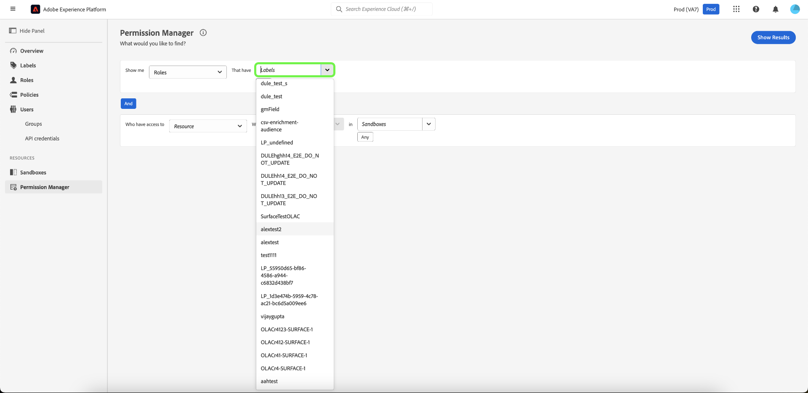

# Administrador de permisos

>[!NOTE]
>
>Para obtener acceso al [!UICONTROL Administrador de permisos], debe ser administrador de productos. Si no tiene privilegios de administrador, póngase en contacto con el administrador del sistema para obtener acceso.

Use consultas simples en el [!UICONTROL Administrador de permisos] para crear informes concisos que le ayudarán a comprender la administración de acceso y a ahorrar tiempo en la validación de permisos de acceso en muchos flujos de trabajo y niveles de granularidad. Puede usar [!UICONTROL Administrador de permisos] para buscar usuarios que pertenezcan a un grupo de usuarios y que tengan privilegios de acceso especificados, así como roles que tengan etiquetas específicas.

## Realizar una búsqueda de usuarios dentro de un grupo de usuarios especificado {#search-users}

>[!CONTEXTUALHELP]
>id="platform_permission_manager"
>title="Administrador de permisos"
>abstract="Utilice los selectores desplegables de la página para obtener informes de nivel de acceso de diferentes niveles de granularidad para usuarios y funciones."
<!-- >additional-url="https://experienceleague.adobe.com/docs/experience-platform/access-control/abac/permissions-manager/permissions.html" text="Permission manager" -->

En la lista desplegable, seleccione el atributo **[!UICONTROL Usuarios]**.

A continuación, seleccione el **[!UICONTROL grupo de usuarios]** que desee buscar mediante la lista desplegable.

>[!INFO]
>
>[!UICONTROL Grupo de usuarios] no es un campo obligatorio. Solo puede seleccionar un grupo de usuarios para cada informe.

Para un informe más granular, puede especificar el recurso con acciones en una zona protegida concreta. Seleccione el **[!UICONTROL recurso]**, **[!UICONTROL acciones]** y **[!UICONTROL zonas protegidas]** con la lista desplegable y, a continuación, seleccione **[!UICONTROL Mostrar resultados]**.

>[!INFO]
>
>[!UICONTROL El recurso], [!UICONTROL las acciones] y [!UICONTROL las zonas protegidas] no son campos obligatorios. Solo se puede seleccionar un [!UICONTROL recurso] para cada informe. Una acción o zona protegida se puede eliminar una vez agregada seleccionando **&#39;x&#39;** junto a la selección que desee eliminar.

Se informa de una lista de usuarios y su dirección de correo electrónico en función de los criterios seleccionados. Utilice el menú de filtro de la izquierda para actualizar los atributos y los resultados. Para obtener más información sobre un usuario específico, seleccione el nombre de usuario en la lista.

## Buscar funciones con etiquetas específicas {#search-roles}

En la lista desplegable, seleccione el atributo **[!UICONTROL Roles]**.

>[!INFO]
>
>[!UICONTROL Etiquetas] no es un campo obligatorio. Puede seleccionar varias etiquetas, que se enumerarán debajo de esta lista desplegable una vez seleccionadas. Una vez agregada, se puede eliminar una etiqueta seleccionando **&#39;x&#39;** junto a la acción.

A continuación, seleccione las **[!UICONTROL Etiquetas]** que quiera buscar mediante la lista desplegable.

Para un informe más granular, puede especificar el recurso con acciones en una zona protegida concreta. Seleccione el **[!UICONTROL recurso]**, **[!UICONTROL acciones]** y **[!UICONTROL zonas protegidas]** con la lista desplegable y, a continuación, seleccione **[!UICONTROL Mostrar resultados]**.

>[!INFO]
>
>[!UICONTROL El recurso], [!UICONTROL las acciones] y [!UICONTROL las zonas protegidas] no son campos obligatorios. Solo se puede seleccionar un [!UICONTROL recurso] para cada informe. Una acción o zona protegida se puede eliminar una vez agregada seleccionando **&#39;x&#39;** junto a la selección que desee eliminar.

Se informa de una lista de funciones en función de los criterios seleccionados. Utilice el menú de filtro de la izquierda para actualizar los atributos y los resultados. Para obtener más información sobre una función específica, seleccione la función en la lista.

Se muestra la siguiente información para cada rol que coincida con sus criterios:

| Atributo | Descripción |
| --- | --- |
| Descripción | Una breve descripción de la función. |
| Etiquetas | Una lista de etiquetas asociadas al rol. |
| Zonas protegidas | Una lista de entornos limitados que contienen esta función. |
| Modificado el | La fecha y la marca de tiempo de la última actualización de la función. |
| Creado el | La fecha y la marca de tiempo de la creación de la función. |
| Creado por | Detalles del creador de la función. |

## Pasos siguientes

Ahora ha aprendido a generar informes para usuarios y funciones. Para obtener más información sobre el control de acceso basado en atributos, consulte la [descripción general del control de acceso basado en atributos](../overview.md).
