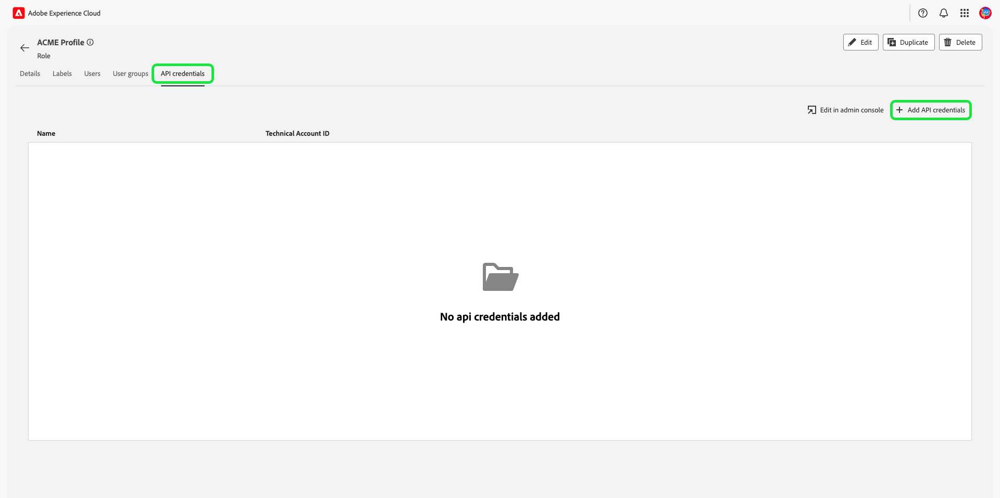

# Administración de permisos de una función

>[!IMPORTANT]
>
>El control de acceso utiliza un ID de usuario (un ID único interno asignado a un usuario) para conceder permisos. Cuando se migra una organización de Adobe ID a un ID empresarial, se perderán todos los permisos establecidos para sus usuarios, ya que el ID de usuario cambia y el control de acceso utiliza el ID de usuario recién generado. Si su organización se migra a un ID empresarial, póngase en contacto con su representante de Adobe para migrar su ID de usuario de Adobe ID a un ID empresarial.

Permisos es el área del Experience Cloud donde los administradores pueden definir funciones de usuario y directivas de acceso para administrar permisos de acceso para funciones y objetos dentro de una aplicación de producto.

Mediante Permisos de , , puede crear y administrar funciones, así como asignar los permisos de recursos deseados para estas. Los permisos también le permiten administrar las etiquetas, las zonas protegidas y los usuarios asociados a una función específica.

Justo después de [creación de una función nueva](#create-a-new-role), volverá a la **[!UICONTROL Funciones]** pestaña. Si está editando permisos para una función existente, seleccione la función en el **[!UICONTROL Funciones]** pestaña. También puede utilizar la opción de filtro para filtrar los resultados y encontrar un rol.

## Filtrar funciones

Seleccione el icono de canal () para mostrar una lista de controles de filtro y ayudar a reducir los resultados.

Los siguientes filtros están disponibles para las funciones en la interfaz de usuario:

| Filtro | Descripción |
| --- | --- |
| [!UICONTROL Creado entre] | Seleccione una fecha de inicio o de finalización para definir un intervalo de fechas en el que filtrar los resultados. |
| [!UICONTROL Creado por] | Filtre por creador de funciones seleccionando un usuario en la lista desplegable. |
| [!UICONTROL Modificado entre] | Seleccione una fecha de inicio o de finalización para definir un intervalo de fechas en el que filtrar los resultados. |
| [!UICONTROL Modificado por] | Filtre por modificador de función seleccionando un usuario en la lista desplegable. |

Para eliminar un filtro, seleccione la &quot;X&quot; en el icono de la píldora para el filtro en cuestión o seleccione **[!UICONTROL Borrar todo]** para eliminar todos los filtros.

## Detalles del rol

Seleccione la función en el **[!UICONTROL Funciones]** , que abrirá la página de detalles de la función.

La pestaña de detalles proporciona una descripción general de la función. La descripción general muestra el nombre de la función, la descripción de la función, el nombre del usuario que creó y modificó la función, cuándo se creó y modificó la función y los permisos asociados a la función. Si es necesario, se pueden modificar el nombre y la descripción de la función.

## Administrar etiquetas de un rol

Seleccione el **[!UICONTROL Etiquetas]** para abrir la página etiquetas de funciones y, a continuación, seleccione **[!UICONTROL Añadir etiquetas]** para asignar etiquetas al rol.

Las etiquetas se muestran en esta página. La lista muestra el nombre de la etiqueta, el nombre descriptivo, la categoría y su descripción.

Seleccione las etiquetas de la lista que desee añadir a la función y, a continuación, seleccione **[!UICONTROL Guardar]**

Las etiquetas añadidas aparecen en **[!UICONTROL Etiquetas]** pestaña.

Para quitar una etiqueta de un rol, seleccione la **X** junto al nombre de las etiquetas.

## Administración de zonas protegidas para la función

Seleccione el **[!UICONTROL Zonas protegidas]** para abrir la página de entornos limitados de funciones. Aquí puede ver una lista de las zonas protegidas que se agregaron a la función.

Para agregar más zonas protegidas a una función, seleccione **[!UICONTROL Editar]**.

La siguiente pantalla le solicita que elija qué permisos de recursos que existen en los entornos limitados se incluirán en la función con la lista desplegable. Cuando termine, seleccione **[!UICONTROL Guardar y salir]**.

## Administrar usuarios para la función

Seleccione el **[!UICONTROL Usuarios]** para abrir la página roles, usuarios y, a continuación, seleccione **[!UICONTROL Agregar usuarios]** para asignar usuarios a la función.

Seleccione los usuarios de la lista que desee agregar al rol. También puede utilizar la barra de búsqueda para buscar el usuario introduciendo su nombre o dirección de correo electrónico y, a continuación, seleccionar **[!UICONTROL Guardar]**

Los usuarios añadidos aparecen en **[!UICONTROL Usuarios]** pestaña.

Para quitar un usuario de un rol, seleccione la opción **X** junto al nombre de usuario.

## Administrar credenciales de API para la función

Seleccione el **[!UICONTROL Credenciales de API]** para abrir la página credenciales de la API de funciones y, a continuación, seleccione **[!UICONTROL Añadir credenciales de API]** para asignar credenciales de API a la función.

Seleccione las credenciales de la API de la lista que desee añadir a la función y, a continuación, seleccione **[!UICONTROL Guardar]**

Las credenciales de API añadidas aparecen en **[!UICONTROL Credenciales de API]** pestaña.

Para quitar credenciales de API de un rol, seleccione la opción **X** junto al nombre de la credencial de la API.

El **[!UICONTROL Quitar credenciales de API]** aparece un cuadro de diálogo que le solicita que confirme la eliminación.

Se le devolverá a la **[!UICONTROL Credenciales de API]** pestaña.

## Administración de grupos de usuarios para funciones

Los grupos de usuarios son varios usuarios que se han agrupado y tienen acceso para ejecutar las mismas funciones.

Seleccione el **[!UICONTROL Grupos de usuarios]** para abrir la página roles, grupos de usuarios y, a continuación, seleccione **[!UICONTROL Agregar grupos]** para asignar grupos de usuarios al rol.

Seleccione los grupos de usuarios de la lista que desee agregar a la función. También puede utilizar la barra de búsqueda para buscar el grupo de usuarios introduciendo el nombre del grupo y seleccionando **[!UICONTROL Guardar]**

El grupo de usuarios agregado aparece bajo **[!UICONTROL Grupos de usuarios]** pestaña.

Para quitar un grupo de usuarios de una función, seleccione la opción **X** junto al nombre del grupo de usuarios.

El **[!UICONTROL Quitar grupo de usuarios]** aparece un cuadro de diálogo que le solicita que confirme la eliminación.

Se le devolverá a la **[!UICONTROL Grupos de usuarios]** pestaña.

## Adición de usuarios a Experience Platform mediante un perfil de producto

Para añadir un usuario a un perfil de producto, inicie sesión en el Admin Console y seleccione **[!UICONTROL Adición de usuarios]**

El **[!UICONTROL Añadir usuarios a su equipo]** aparece el cuadro de diálogo. Introduzca la dirección de correo electrónico del usuario, el nombre (opcional) y los apellidos (opcional).

Seleccione el icono de lápiz para seleccionar productos y grupos de usuarios, y seleccione **[!UICONTROL Adobe Experience Platform]**, luego seleccione **[!UICONTROL AEP-Default-All-Users]**, luego seleccione  **[!UICONTROL Guardar]**.

## Pasos siguientes

Con los permisos establecidos, puede continuar con el siguiente paso para [administrar usuarios](users.md).
