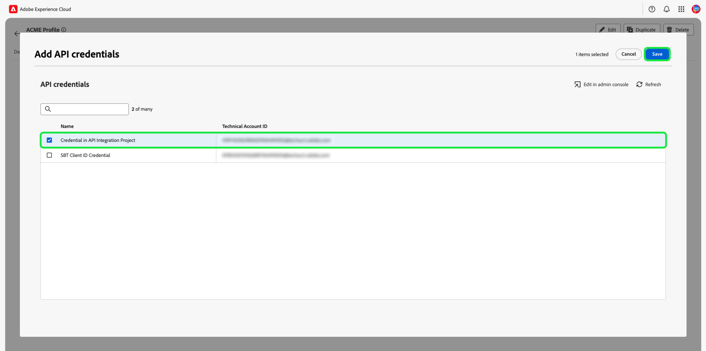

# Administración de permisos de una función {#manage-role-permissions}

>[!CONTEXTUALHELP]
>id="platform_permissions_roles_about"
>title="¿Qué son las funciones?"
>abstract="Las funciones definen el acceso que un administrador, un especialista o un usuario final tiene a los recursos de su organización. Clasifican los usuarios que interactúan con la instancia de Platform y son los componentes básicos de las políticas de control de acceso. Una función tiene un conjunto determinado de permisos y a los miembros de su organización se les puede asignar una o más funciones, según el ámbito de vista o acceso de escritura que necesiten."
>additional-url="https://experienceleague.adobe.com/docs/experience-platform/access-control/abac/permissions-ui/roles.html?lang=es" text="Administrar funciones"

>[!IMPORTANT]
>
>El control de acceso utiliza un ID de usuario (un ID único interno asignado a un usuario) para conceder permisos. Cuando se migra una organización de Adobe ID a un ID empresarial, se perderán todos los permisos establecidos para sus usuarios, ya que el ID de usuario cambia y el control de acceso utiliza el ID de usuario recién generado. Si su organización se migra a un ID empresarial, póngase en contacto con su representante de Adobe para migrar su ID de usuario de Adobe ID a un ID empresarial.

Permisos es el área del Experience Cloud donde los administradores pueden definir funciones de usuario y directivas de acceso para administrar permisos de acceso para funciones y objetos dentro de una aplicación de producto.

Mediante Permisos, puede crear y administrar funciones, así como asignar los permisos de recursos deseados para estas. Los permisos también le permiten administrar las etiquetas, las zonas protegidas y los usuarios asociados a una función específica.

Inmediatamente después de que [cree un nuevo rol](#create-a-new-role), volverá a la ficha **[!UICONTROL Roles]**. Si está editando permisos para una función existente, seleccione la función en la ficha **[!UICONTROL Funciones]**. También puede utilizar la opción de filtro para filtrar los resultados y encontrar un rol.

## Filtrar funciones

Seleccione el icono de canal () para mostrar una lista de controles de filtro y ayudar a reducir los resultados.

Los siguientes filtros están disponibles para las funciones en la interfaz de usuario:

| Filtro | Descripción |
| --- | --- |
| [!UICONTROL Creado entre] | Seleccione una fecha de inicio o de finalización para definir un intervalo de fechas en el que filtrar los resultados. |
| [!UICONTROL Creado por] | Filtre por creador de funciones seleccionando un usuario en la lista desplegable. |
| [!UICONTROL Modificado entre] | Seleccione una fecha de inicio o de finalización para definir un intervalo de fechas en el que filtrar los resultados. |
| [!UICONTROL Modificado por] | Filtre por modificador de función seleccionando un usuario en la lista desplegable. |

Para quitar un filtro, selecciona la &quot;X&quot; en el icono de la píldora para el filtro en cuestión o selecciona **[!UICONTROL Borrar todo]** para eliminar todos los filtros.

## Detalles del rol {#role-details}

>[!CONTEXTUALHELP]
>id="platform_permissions_roles_details"
>title="Información general sobre la función"
>abstract="El cuadro de diálogo de información general de funciones muestra los detalles de la función, incluidos los recursos y los entornos limitados a los que una función determinada puede acceder. Puede administrar etiquetas, usuarios, grupos de usuarios y credenciales de API para la función navegando a la pestaña correspondiente dentro del espacio de trabajo de la función."
>additional-url="https://experienceleague.adobe.com/en/docs/experience-platform/access-control/abac/permissions-ui/permissions#manage-labels-for-a-role" text="Administrar etiquetas de un rol"
>additional-url="https://experienceleague.adobe.com/en/docs/experience-platform/access-control/abac/permissions-ui/permissions#manage-users-for-a-role" text="Administrar usuarios de un rol"

Seleccione el rol de la ficha **[!UICONTROL Roles]**, la cual abrirá el tablero [!UICONTROL Detalles] del rol.

El panel [!UICONTROL Detalles] proporciona información general sobre el rol. La descripción general muestra el nombre de la función, la descripción, el creador y el último modificador, junto con las fechas de creación y modificación. También muestra los permisos adjuntos a la función y la lista de zonas protegidas asignadas. El nombre y la descripción de la función se pueden modificar, si es necesario.

## Administrar etiquetas de un rol

Seleccione la ficha **[!UICONTROL Etiquetas]** para abrir el área de trabajo de etiquetas de roles y, a continuación, seleccione **[!UICONTROL Agregar etiquetas]** para asignar etiquetas al rol.

Se muestra el cuadro de diálogo **[!UICONTROL Aplicar etiquetas de acceso y control de datos]**, que presenta una lista de etiquetas. La lista muestra el nombre de la etiqueta, el nombre descriptivo, la categoría y su descripción.

Seleccione las etiquetas de la lista que desee agregar al rol y después seleccione **[!UICONTROL Guardar]**

Las etiquetas agregadas aparecen en la ficha **[!UICONTROL Etiquetas]**.

Para quitar una etiqueta de un rol, selecciónela y después seleccione **[!UICONTROL Quitar etiquetas]**.

## Administrar zonas protegidas para un rol

Seleccione la ficha **[!UICONTROL Detalles]** y vaya a la sección **[!UICONTROL Zonas protegidas]**. Seleccione **[!UICONTROL Ver todo]** para ver la lista completa de zonas protegidas agregadas a la función.

Para agregar más zonas protegidas a un rol, selecciona **[!UICONTROL Editar]** en la parte superior derecha de la interfaz de usuario.

La siguiente pantalla le solicita que elija qué recursos de zonas protegidas incluir en la función mediante la lista desplegable. Cuando termine, selecciona **[!UICONTROL Guardar]** y luego **[!UICONTROL Cerrar]**.

## Administrar usuarios de un rol

Seleccione la ficha **[!UICONTROL Usuarios]** para abrir el área de trabajo de funciones [!UICONTROL Usuarios] y, a continuación, seleccione **[!UICONTROL Agregar usuarios]** para asignar usuarios a la función.

Aparecerá el cuadro de diálogo **[!UICONTROL Agregar usuarios]**. Seleccione los usuarios de la lista que desee agregar al rol. También puede usar la barra de búsqueda para buscar al usuario al escribir su nombre o dirección de correo electrónico y, a continuación, seleccionar **[!UICONTROL Guardar]**

Los usuarios agregados aparecen en la ficha **[!UICONTROL Usuarios]**.

Para quitar un usuario de un rol, seleccione el icono **X** junto al nombre del usuario.

El siguiente vídeo tiene como objetivo ayudarle a comprender la creación de una función nueva y a administrar usuarios para esa función.

>[!VIDEO](https://video.tv.adobe.com/v/336081/?learn=on)

## Administrar credenciales de API para un rol {#manage-api-credentials-for-role}

>[!IMPORTANT]
>
> Para usar y administrar credenciales de API en [!UICONTROL Permisos], los usuarios deben tener privilegios de administrador del sistema.

Para utilizar las API de Experience Platform como usuario o desarrollador, el administrador del sistema debe agregar las credenciales de la API además del conjunto de permisos dado a una función. Para obtener una guía completa sobre cómo crear y asignar credenciales de API, así como los permisos necesarios, consulte el tutorial paso a paso en [autenticar y acceder a las API de Experience Platform](../../../landing/api-authentication.md#generate-credentials).

Seleccione la ficha **[!UICONTROL Credenciales de API]** para abrir el área de trabajo de credenciales de API de roles y, a continuación, seleccione **[!UICONTROL Agregar credenciales de API]** para asignar credenciales de API al rol.

Aparecerá el cuadro de diálogo **[!UICONTROL Agregar credenciales de API]**. Seleccione las credenciales de la API de la lista para agregarlas al rol y, a continuación, seleccione **[!UICONTROL Guardar]**

Las credenciales de API agregadas aparecen en la ficha **[!UICONTROL Credenciales de API]**.

Para quitar una credencial de API de un rol, seleccione el icono **X** junto al nombre de la credencial de API.

Aparece el cuadro de diálogo **[!UICONTROL Quitar credenciales de API]**, que le solicita que confirme la eliminación. Seleccione **[!UICONTROL Confirmar]** para finalizar la eliminación de la credencial seleccionada.

Se le devolverá a la ficha **[!UICONTROL Credenciales de API]**.

## Administrar grupos de usuarios para un rol

Los grupos de usuarios son varios usuarios que se han agrupado y tienen acceso para ejecutar las mismas funciones.

Seleccione la ficha **[!UICONTROL Grupos de usuarios]** para abrir el área de trabajo de grupos de usuarios del rol y, a continuación, seleccione **[!UICONTROL Agregar grupos]** para asignar grupos de usuarios al rol.

Aparecerá el cuadro de diálogo **[!UICONTROL Agregar grupos]**. Seleccione los grupos de usuarios de la lista que desee agregar a la función. También puede usar la barra de búsqueda para buscar el grupo de usuarios al escribir el nombre del grupo y seleccionar **[!UICONTROL Guardar]**

El grupo de usuarios agregados aparece en la ficha **[!UICONTROL Grupos de usuarios]**.

Para quitar un grupo de usuarios de un rol, seleccione el icono **X** junto al nombre del grupo de usuarios.

Aparece el cuadro de diálogo **[!UICONTROL Quitar grupo de usuarios]**, que le solicita que confirme la eliminación. Seleccione **[!UICONTROL Confirmar]** para eliminar el grupo de usuarios seleccionado.

Volverá a la ficha **[!UICONTROL Grupos de usuarios]**.

## Añadir usuarios al Experience Platform

Como administrador del sistema, puede otorgar acceso de desarrollador a un usuario para que pueda [crear integraciones](../../../landing/api-authentication.md#generate-credentials) en Adobe Developer Console.

Para agregar un Experience Platform de usuario, inicia sesión en el [Admin Console](https://adminconsole.adobe.com) y selecciona **[!UICONTROL Agregar usuarios]**.

Aparece el cuadro de diálogo **[!UICONTROL Añadir usuarios a su equipo]**. Introduzca la dirección de correo electrónico, el nombre (opcional) y los apellidos (opcional) del usuario. A continuación, seleccione **[!UICONTROL Productos]**.

Aparecerá el cuadro de diálogo **[!UICONTROL Seleccionar productos]**. Seleccione **[!UICONTROL Adobe Experience Platform]**.

Aparecerá el cuadro de diálogo **[!UICONTROL Seleccionar perfiles de producto]**. Seleccione **[!UICONTROL AEP-Default-All-Users]** y luego seleccione **[!UICONTROL Guardar]**.

Revise la información y, a continuación, seleccione **[!UICONTROL Guardar]** para agregar al usuario.

## Pasos siguientes

Con los permisos establecidos, puede continuar con el siguiente paso para [administrar usuarios](users.md).
