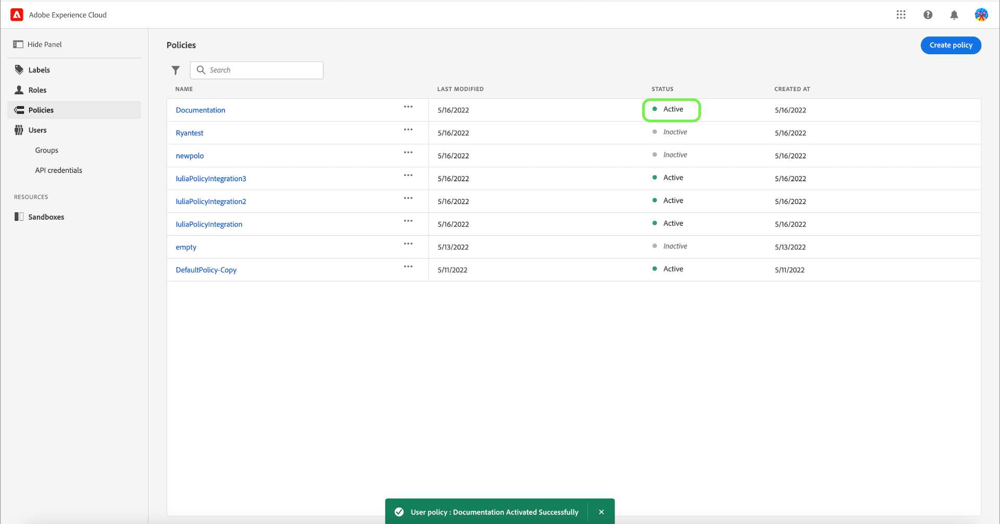

# Administrar las políticas de control de acceso

Las políticas de control de acceso son instrucciones que unen atributos para establecer acciones permisibles e inadmisibles. Las políticas de acceso pueden ser locales o globales y pueden anular otras directivas.

>[!IMPORTANT]
>
>Las políticas de acceso no deben confundirse con las políticas de uso de datos, que controlan cómo se utilizan los datos en Adobe Experience Platform en lugar de qué usuarios de la organización tienen acceso a ellos. Consulte la guía sobre la creación [políticas de uso de datos](../../../data-governance/policies/create.md) para obtener más información.

## Crear una directiva nueva

Para crear una directiva nueva, seleccione la opción **[!UICONTROL Políticas]** en la barra lateral y seleccione **[!UICONTROL Crear directiva]**.

La variable **[!UICONTROL Crear una directiva nueva]** , solicitándole que escriba un nombre y una descripción opcional. Cuando termine, seleccione **[!UICONTROL Confirmar]**.

Con la flecha desplegable, seleccione si desea **Permita el acceso a** () un recurso o **Denegar acceso a** () un recurso.

A continuación, seleccione el recurso que desee incluir en la directiva mediante el menú desplegable y busque el tipo de acceso, lea o escriba.

A continuación, con la flecha desplegable, seleccione la condición que desee aplicar a esta directiva, **Lo siguiente es verdadero** () o **siendo false lo siguiente** ().

Seleccione el icono de signo más para **Añadir expresión de coincidencias** o **Agregar grupo de expresiones** para el recurso.

En el menú desplegable, seleccione la opción **Recurso**.

A continuación, en la lista desplegable , seleccione la opción **Coincide**.

A continuación, en el menú desplegable, seleccione el tipo de etiqueta (**[!UICONTROL Etiqueta principal]** o **[!UICONTROL Etiqueta personalizada]**) para que coincida con la etiqueta asignada al usuario en las funciones.

Finalmente, seleccione la **Sandbox** que desea que se apliquen las condiciones de directiva mediante el menú desplegable.

Select **Agregar recurso** para agregar más recursos. Una vez finalizado, seleccione **[!UICONTROL Guardar y salir]**.

La nueva directiva se ha creado correctamente y se le redirige al **[!UICONTROL Políticas]** , donde verá que la política recién creada aparece en la lista.

## Editar una directiva

Para editar una política existente, seleccione la política en la **[!UICONTROL Políticas]** pestaña . Como alternativa, utilice la opción de filtro para filtrar los resultados y encontrar la directiva que desea editar.

A continuación, seleccione los puntos suspensivos (`…`) junto al nombre de las directivas y un menú desplegable muestra los controles para editar, desactivar, eliminar o duplicar la función. Seleccione Editar en la lista desplegable.

Aparecerá la pantalla de permisos de directivas. Realice las actualizaciones y seleccione **[!UICONTROL Guardar y salir]**.

La directiva se actualiza correctamente y se le redirige al **[!UICONTROL Políticas]** pestaña .

## Duplicar una directiva

Para duplicar una directiva existente, seleccione la directiva en la **[!UICONTROL Políticas]** pestaña . Como alternativa, utilice la opción de filtro para filtrar los resultados y encontrar la directiva que desea editar.

A continuación, seleccione los puntos suspensivos (`…`) junto al nombre de una política y un menú desplegable muestra los controles para editar, desactivar, eliminar o duplicar la función. Seleccione duplicar en la lista desplegable.

La variable **[!UICONTROL Duplicar directiva]** , pidiéndole que confirme la duplicación.

La nueva directiva aparece en la lista como una copia del original en la **[!UICONTROL Políticas]** pestaña .

## Eliminar una directiva

Para eliminar una directiva existente, seleccione la directiva en la sección **[!UICONTROL Políticas]** pestaña . Como alternativa, utilice la opción de filtro para filtrar los resultados y encontrar la política que desea eliminar.

A continuación, seleccione los puntos suspensivos (`…`) junto al nombre de una política y un menú desplegable muestra los controles para editar, desactivar, eliminar o duplicar la función. Seleccione eliminar en la lista desplegable.

La variable **[!UICONTROL Eliminar directiva de usuario]** , pidiéndole que confirme la eliminación.

Volverá a la **[!UICONTROL políticas]** y aparece una confirmación de eliminación emergente.

## Activar una directiva

Para activar una directiva existente, selecciónela en el **[!UICONTROL Políticas]** pestaña . Como alternativa, utilice la opción de filtro para filtrar los resultados y encontrar la política que desea eliminar.

A continuación, seleccione los puntos suspensivos (`…`) junto al nombre de una política y un menú desplegable muestra los controles para editar, activar, eliminar o duplicar la función. Seleccione activar en la lista desplegable.

La variable **[!UICONTROL Activar la directiva de usuario]** , pidiéndole que confirme la activación.

Volverá a la **[!UICONTROL políticas]** y aparece una ventana emergente de confirmación de activación. El estado de la directiva se muestra como activo.

## Pasos siguientes

Con una nueva directiva creada, puede continuar con el paso siguiente a [administrar permisos para una función](permissions.md).
