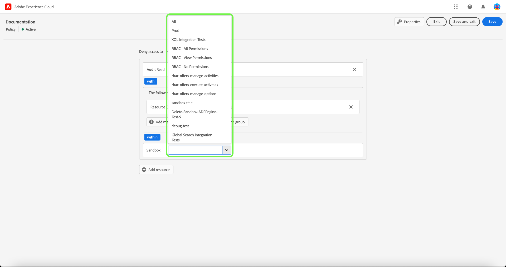

# Administrar directivas de control de acceso

Las políticas de control de acceso son instrucciones que unen atributos para establecer acciones permisibles e inadmisibles. Las directivas de acceso pueden ser locales o globales, y pueden invalidar otras directivas. Adobe proporciona una directiva predeterminada que se puede activar inmediatamente o siempre que su organización esté lista para empezar a controlar el acceso a objetos específicos en función de las etiquetas. La directiva predeterminada aprovecha las etiquetas aplicadas a los recursos para denegar el acceso a menos que los usuarios tengan una función con una etiqueta coincidente.

>[!IMPORTANT]
>
>Las políticas de acceso no se deben confundir con las políticas de uso de datos, que controlan cómo se utilizan los datos en Adobe Experience Platform en lugar de los usuarios de su organización que tienen acceso a ellos. Consulte la guía sobre la creación de [políticas de uso de datos](../../../data-governance/policies/create.md) para obtener más información.

<!-- ## Create a new policy

To create a new policy, select the **[!UICONTROL Policies]** tab in the sidebar and select **[!UICONTROL Create Policy]**.

The **[!UICONTROL Create a new policy]** dialog appears, prompting you to enter a name, and an optional description. When finished, select **[!UICONTROL Confirm]**.

Using the dropdown arrow select if you would like to **Permit access to** () a resource or **Deny access to** () a resource.

Next, select the resource that you would like to include in the policy using the dropdown menu and search access type, read or write.

Next, using the dropdown arrow select the condition you would like to apply to this policy, **The following being true** () or **The following being false** ().

Select the plus icon to **Add matches expression** or **Add expression group** for the resource. 

Using the dropdown, select the **Resource**.

Next, using the dropdown select the **Matches**.

Next, using the dropdown, select the type of label (**[!UICONTROL Core label]** or **[!UICONTROL Custom label]**) to match the label assigned to the User in roles.

Finally, select the **Sandbox** that you would like the policy conditions to apply to, using the dropdown menu.

Select **Add resource** to add more resources. Once finished, select **[!UICONTROL Save and exit]**.

The new policy is successfully created, and you are redirected to the **[!UICONTROL Policies]** tab, where you will see the newly created policy appear in the list. 

## Edit a policy

To edit an existing policy, select the policy from the **[!UICONTROL Policies]** tab. Alternatively, use the filter option to filter the results to find the policy you want to edit.

Next, select the ellipsis (`…`) next to the policies name, and a dropdown displays controls to edit, deactivate, delete, or duplicate the role. Select edit from the dropdown.

The policy permissions screen appears. Make the updates then select **[!UICONTROL Save and exit]**.

The policy is successfully updated, and you are redirected to the **[!UICONTROL Policies]** tab.

## Duplicate a policy

To duplicate an existing policy, select the policy from the **[!UICONTROL Policies]** tab. Alternatively, use the filter option to filter the results to find the policy you want to edit.

Next, select the ellipsis (`…`) next to a policies name, and a dropdown displays controls to edit, deactivate, delete, or duplicate the role. Select duplicate from the dropdown.

The **[!UICONTROL Duplicate policy]** dialog appears, prompting you to confirm the duplication. 

The new policy appears in the list as a copy of the original on the **[!UICONTROL Policies]** tab.

## Delete a policy

To delete an existing policy, select the policy from the **[!UICONTROL Policies]** tab. Alternatively, use the filter option to filter the results to find the policy you want to delete.

Next, select the ellipsis (`…`) next to a policies name, and a dropdown displays controls to edit, deactivate, delete, or duplicate the role. Select delete from the dropdown.

The **[!UICONTROL Delete user policy]** dialog appears, prompting you to confirm the deletion. 

You are returned to the **[!UICONTROL policies]** tab and a confirmation of deletion pop over appears.

 -->

## Configurar la directiva de una zona protegida

>[!IMPORTANT]
>
>De manera predeterminada, la característica [!UICONTROL Inclusión automática] está activada para todos los clientes, lo que significa que todas las zonas protegidas se agregan a la directiva.

>[!NOTE]
>
>La directiva **[!UICONTROL Default-Label-Based-Access-Control-Policy]** es actualmente la única disponible para la configuración.

Para ver las zonas protegidas asociadas a una directiva, selecciónela en la ficha **[!UICONTROL Directivas]**.

A continuación, seleccione la directiva y, a continuación, seleccione la pestaña **[!UICONTROL Zonas protegidas]**. Se muestra una lista de los entornos limitados asociados a la directiva.

### Agregar directiva a todas las zonas protegidas

Use la opción **[!UICONTROL Inclusión automática]** en la ficha **[!UICONTROL Zonas protegidas]** para activar la directiva para todas las zonas protegidas.

![La ficha [!UICONTROL Zonas protegidas] que muestra la opción [!UICONTROL Inclusión automática].](../../images/flac-ui/abac-policies-auto-include.png)

Aparece el cuadro de diálogo **[!UICONTROL Habilitar inclusión automática]** que le solicita que confirme su selección. Seleccione **[!UICONTROL Habilitar]** para completar la configuración.

![El cuadro de diálogo [!UICONTROL Habilitar inclusión automática] que resalta [!UICONTROL Habilitar].](../../images/flac-ui/abac-policies-auto-include-enable.png)

>[!SUCCESS]
>
>La directiva se activa para todas las zonas protegidas existentes y se agregará automáticamente a cualquier zona protegida nueva cuando esté disponible.

### Agregar directiva para seleccionar zonas protegidas

>[!IMPORTANT]
>
>Las zonas protegidas futuras no se incluirán en la directiva de forma predeterminada si se desactiva la opción [!UICONTROL Inclusión automática]. Deberá administrar y agregar entornos limitados manualmente a la directiva.

Use la opción **[!UICONTROL Inclusión automática]** en la pestaña **[!UICONTROL Zonas protegidas]** para deshabilitar la directiva para todas las zonas protegidas.

![La ficha [!UICONTROL Zonas protegidas] que muestra la opción [!UICONTROL Inclusión automática].](../../images/flac-ui/abac-policies-auto-include.png)

En la ficha **[!UICONTROL Zonas protegidas]**, seleccione **[!UICONTROL Agregar zonas protegidas]** para seleccionar las zonas protegidas a las que se aplicará esta directiva.

![La ficha [!UICONTROL Zonas protegidas] muestra una lista de las zonas protegidas agregadas a la directiva.](../../images/flac-ui/abac-policies-sandboxes-tab-add.png)

Aparecerá una lista de zonas protegidas. Seleccione la zona protegida que desee añadir en la lista. También puede utilizar la barra de búsqueda para buscar la zona protegida. Seleccione **[!UICONTROL Guardar]**.

![La página [!UICONTROL Agregar zonas protegidas] muestra una lista de las zonas protegidas existentes que se pueden agregar a la directiva.](../../images/flac-ui/abac-policies-sandboxes-list.png)

>[!SUCCESS]
>
>Las zonas protegidas seleccionadas se han agregado correctamente a la directiva.

### Eliminación de zonas protegidas de una directiva

Para quitar una zona protegida, seleccione el icono **X** junto al nombre de la zona protegida.

![La ficha [!UICONTROL Zonas protegidas] muestra una lista de zonas protegidas, en la que se resalta [!UICONTROL X] que se van a eliminar.](../../images/flac-ui/abac-policies-remove-sandbox-x.png)

Aparecerá el cuadro de diálogo **[!UICONTROL Quitar]** que le pedirá que confirme su selección. Seleccione **[!UICONTROL Confirmar]** para completar la eliminación.

![El cuadro de diálogo [!UICONTROL Quitar] que resalta [!UICONTROL Confirmar].](../../images/flac-ui/abac-policies-remove-sandbox.png)

>[!SUCCESS]
>
>La zona protegida seleccionada se ha eliminado correctamente de la directiva.

## Activar una política {#activate-policy}

>[!CONTEXTUALHELP]
>id="platform_permissions_policies_about"
>title="¿Qué son las directivas?"
>abstract="Las directivas son declaraciones que reúnen atributos para establecer acciones permitidas y no permitidas. Cada organización viene con una directiva predeterminada que debe activar para comenzar a controlar el acceso a objetos específicos en función de las etiquetas. Las etiquetas aplicadas a los recursos deniegan el acceso a menos que se asigne a los usuarios una función con una etiqueta coincidente. Las directivas predeterminadas no se pueden editar ni eliminar, pero se pueden activar o desactivar."
>additional-url="https://experienceleague.adobe.com/es/docs/experience-platform/access-control/abac/permissions-ui/labels?lang=es" text="Administrar etiquetas"

Para activar una directiva existente, selecciónela en la ficha **[!UICONTROL Directivas]**.

A continuación, seleccione los puntos suspensivos (`…`) junto al nombre de una directiva y aparecerá una lista desplegable con controles para editar, activar, eliminar o duplicar la función. Seleccione activar en el menú desplegable.

Aparecerá el cuadro de diálogo **[!UICONTROL Activar directiva]**, que le pedirá que confirme la activación.

Se le devolverá a la ficha **[!UICONTROL directivas]** y aparecerá una ventana emergente de confirmación de activación. El estado de la política se muestra como activa.

## Pasos siguientes

Con una directiva activada, puede continuar con el siguiente paso para [administrar permisos para un rol](permissions.md).
