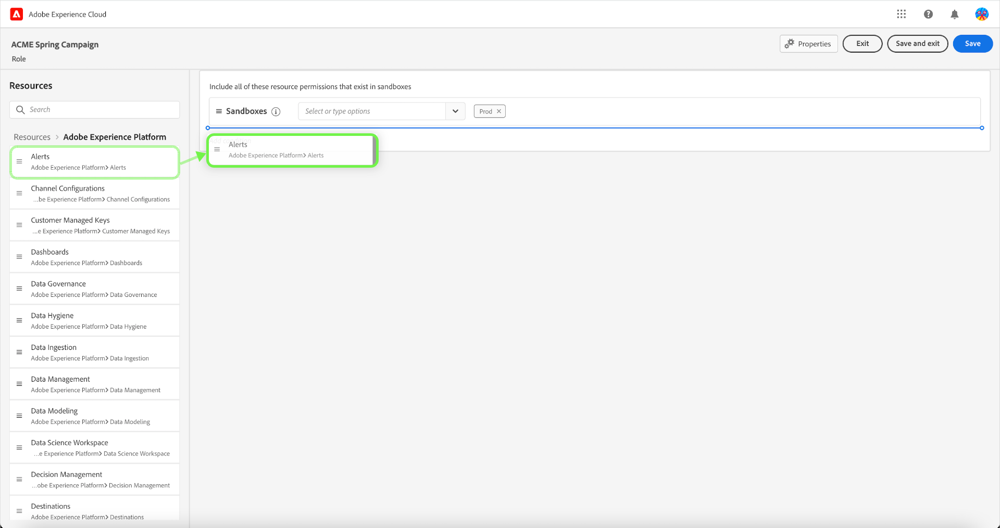

# Administrar funciones

Las funciones definen el acceso que un administrador, un especialista o un usuario final tiene a los recursos de su organización. En un entorno de control de acceso basado en funciones, el aprovisionamiento de acceso de los usuarios se agrupa a través de responsabilidades y necesidades comunes. Una función tiene un conjunto determinado de permisos y a los miembros de su organización se les puede asignar una o más funciones, según el ámbito de vista o acceso de escritura que necesiten.

## Crear una nueva función

Para crear una función nueva, seleccione la opción **[!UICONTROL Funciones]** en la barra lateral y seleccione **[!UICONTROL Crear rol]**.

El **[!UICONTROL Crear una función nueva]** aparece un cuadro de diálogo en el que se le solicita que introduzca un nombre y una descripción opcional.

Cuando termine, seleccione **[!UICONTROL Confirmar]**.

A continuación, seleccione los permisos de recurso que desea incluir en la función mediante el menú desplegable.

Para añadir recursos adicionales, seleccione **[!UICONTROL Adobe Experience Platform]** en el panel de navegación izquierdo, que muestra una lista de recursos. También puede introducir el nombre del recurso en la barra de búsqueda del panel de navegación izquierdo.

Haga clic en el recurso correspondiente, arrástrelo y suéltelo en el panel principal.

Seleccione los permisos de recurso que desee incluir en la función mediante el menú desplegable. Repita este proceso para todos los recursos que desee incluir en el rol. Cuando termine, seleccione **[!UICONTROL Guardar y salir]**.

La nueva función se ha creado correctamente y se le redirigirá a **[!UICONTROL Funciones]** página, donde verá la función recién creada en la lista.

Consulte las secciones sobre [administración de permisos para una función](#manage-permissions-for-a-role) para obtener más información sobre cómo administrar los permisos de funciones una vez creados.

## Duplicación de un rol

Para duplicar una función existente, seleccione la función en el **[!UICONTROL Funciones]** pestaña. También puede utilizar la opción de filtro para filtrar los resultados y encontrar la función que desea duplicar.

A continuación, seleccione **[!UICONTROL Duplicar]** en la parte superior derecha de la pantalla.

El **[!UICONTROL Duplicar función]** aparece un cuadro de diálogo que le solicita que confirme la duplicación.

A continuación, se le redirigirá a la página de detalles de la función, donde podrá cambiar el nombre y los permisos de la función. Los detalles, las etiquetas y las zonas protegidas se duplican con respecto a la función anterior. Los usuarios deberán añadirse a través de la pestaña usuarios. Puede ver el [administrar permisos para una función](permissions.md) para obtener más información sobre cómo agregar detalles, etiquetas, zonas protegidas y usuarios a un rol.

Haga clic en la flecha izquierda para volver a la **[!UICONTROL Funciones]** pestaña.

La nueva función aparecerá en la lista de **[!UICONTROL Funciones]** página.

## Eliminar un rol

Seleccione los puntos suspensivos (`…`) junto al nombre de un rol, y un menú desplegable muestra controles para editar, eliminar o duplicar el rol. Seleccione eliminar de la lista desplegable.

El **[!UICONTROL Eliminar función de usuario]** aparece un cuadro de diálogo que le solicita que confirme la eliminación.

Se le devolverá a la **[!UICONTROL Funciones]** pestaña.

## Pasos siguientes

Con una función nueva creada, puede continuar con el siguiente paso para [administrar permisos para una función](permissions.md).
