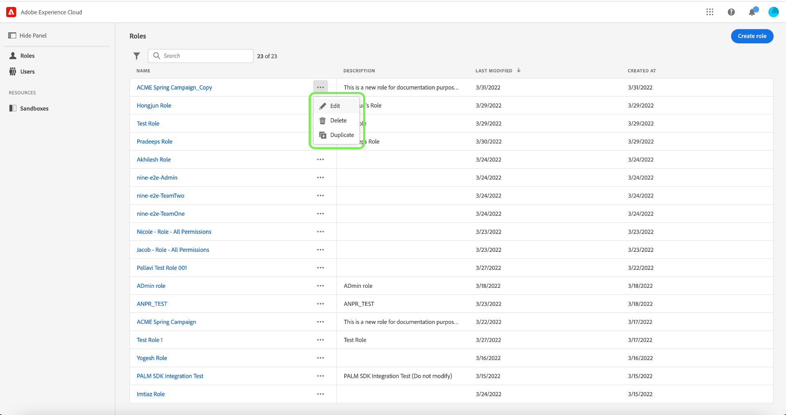

# Administrar funciones

Las funciones definen el acceso que un administrador, un especialista o un usuario final tiene a los recursos de su organización. En un entorno de control de acceso basado en roles, el aprovisionamiento de acceso de los usuarios se agrupa a través de responsabilidades y necesidades comunes. Una función tiene un conjunto determinado de permisos y los miembros de su organización pueden asignarse a una o más funciones, según el ámbito de vista o acceso de escritura que necesiten.

## Crear una función nueva

Para crear una función nueva, seleccione la opción **[!UICONTROL Funciones]** en la barra lateral y seleccione **[!UICONTROL Crear función]**.

La variable **[!UICONTROL Crear una función nueva]** , solicitándole que escriba un nombre y una descripción opcional.

Cuando termine, seleccione **[!UICONTROL Confirmar]**.

A continuación, seleccione los permisos de recursos que desee incluir en la función mediante el menú desplegable.

Para añadir recursos adicionales, seleccione **[!UICONTROL Adobe Experience Platform]** en el panel de navegación izquierdo, que muestra una lista de recursos. Como alternativa, introduzca el nombre del recurso en la barra de búsqueda del panel de navegación izquierdo.

Haga clic y arrastre el recurso correspondiente y suéltelo en el panel principal.

Seleccione los permisos de recursos que desee incluir en la función mediante el menú desplegable. Repita esto para todos los recursos que desee incluir para la función. Cuando termine, seleccione **[!UICONTROL Guardar y salir]**.

La nueva función se crea correctamente y se le redirige al **[!UICONTROL Funciones]** , donde verá que la función recién creada aparece en la lista.

Consulte las secciones de [administración de permisos para una función](#manage-permissions-for-a-role) para obtener más información sobre cómo administrar los permisos de funciones una vez creados.

## Duplicar una función

Para duplicar una función existente, seleccione la función en la **[!UICONTROL Funciones]** pestaña . Como alternativa, utilice la opción de filtro para filtrar los resultados y encontrar la función que desea duplicar.

A continuación, seleccione **[!UICONTROL Duplicar]** en la parte superior derecha de la pantalla.

La variable **[!UICONTROL Duplicar función]** , pidiéndole que confirme la duplicación.

A continuación, se le dirigirá a la página de detalles de la función, donde podrá cambiar el nombre y los permisos de la función. Los Details, Labels y Sandboxes se duplican a partir de la función anterior. Los usuarios deberán agregarse a través de la pestaña usuarios . Puede ver la [administrar permisos para una función](permissions.md) documento para obtener más información sobre cómo agregar Detalles, Etiquetas, Simuladores para pruebas y Usuarios a una función.

Haga clic en la flecha izquierda para volver a la **[!UICONTROL Funciones]** pestaña .

La nueva función aparecerá en la lista de la **[!UICONTROL Funciones]** página.

## Eliminar una función

Seleccione los puntos suspensivos (`…`) junto al nombre de una función y un menú desplegable muestra los controles para editar, eliminar o duplicar la función. Seleccione eliminar en la lista desplegable.

La variable **[!UICONTROL Eliminar función de usuario]** , pidiéndole que confirme la eliminación.

Volverá a la **[!UICONTROL Funciones]** pestaña .

## Pasos siguientes

Con una función nueva creada, puede continuar con el paso siguiente a [administrar permisos para una función](permissions.md).
