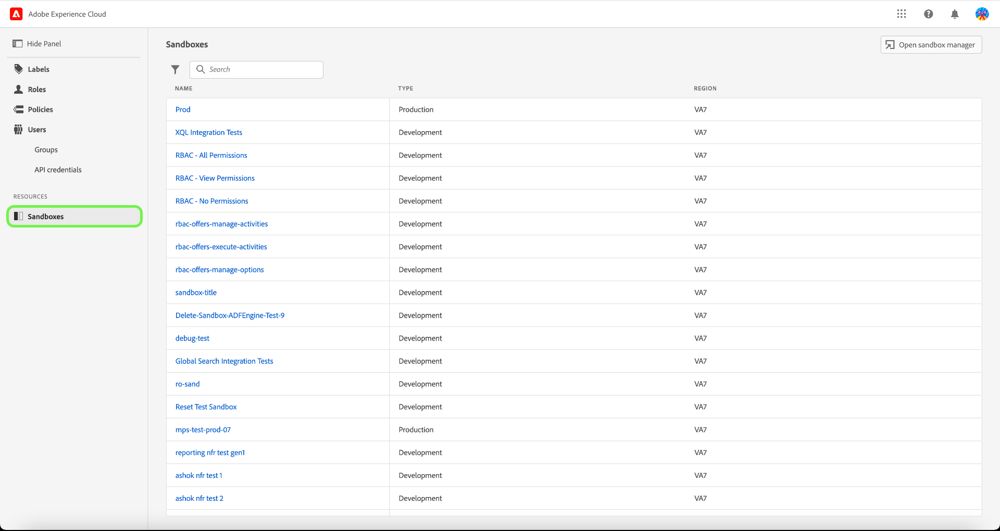

# Administrar zonas protegidas

Los entornos limitados son particiones virtuales en una sola instancia de Experience Platform, lo que permite una integración perfecta con el proceso de desarrollo de sus aplicaciones de experiencia digital. Todo el contenido y las acciones realizadas en una zona protegida se limitan únicamente a esa zona protegida y no afectan a ninguna otra. Para obtener más información sobre las zonas protegidas, consulte la [Información general sobre las zonas protegidas](../../../sandboxes/home.md).

## Configuración de zonas protegidas

Para ver los detalles y las funciones que tiene asignada/con una zona protegida, seleccione la pestaña **[!UICONTROL Zonas protegidas]**.

Aparecerá una lista de zonas protegidas. Seleccione la zona protegida que desee ver en la lista. También puede utilizar la barra de búsqueda para buscar la zona protegida introduciendo el nombre.

La pestaña Detalles proporciona información general sobre la zona protegida. La descripción general muestra el nombre, el tipo, la región, la fecha de modificación, quién modificó la zona protegida y el estado de la zona protegida.

Seleccione la ficha **[!UICONTROL Roles]** para ver los roles a los que está asignada la zona protegida.

## Pasos siguientes

Ahora ha aprendido a ver los detalles de la zona protegida y las funciones a las que está asignada actualmente. Para obtener información general de alto nivel sobre las zonas protegidas en Experience Platform, consulte la [documentación de información general sobre las zonas protegidas](../../sanboxes/../ui/overview.md).
