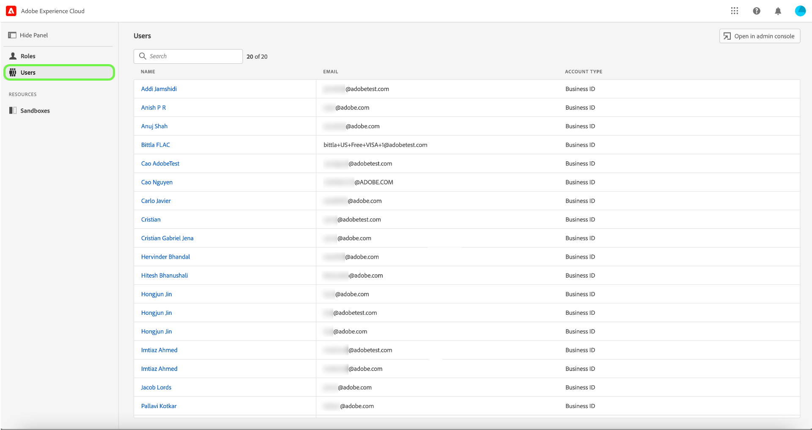

# Administración de usuarios

Si desea ver los detalles del usuario y las funciones a las que están asignados, seleccione la opción **[!UICONTROL Usuarios]** pestaña .

Aparecerá una lista de usuarios. Seleccione el usuario que desee ver en la lista. También puede utilizar la barra de búsqueda para buscar al usuario introduciendo su nombre o dirección de correo electrónico.

La pestaña de detalles proporciona una descripción general del usuario. La descripción general muestra el nombre de los usuarios, el tipo de cuenta, el correo electrónico, el ID de autenticación, la información de contacto y los detalles de ubicación.

Seleccione el **[!UICONTROL Funciones]** para ver las funciones a las que está asignado el usuario.

## Pasos siguientes

Ya ha aprendido a ver los detalles del usuario y las funciones a las que se han agregado. Para obtener más información sobre el control de acceso basado en atributos, consulte la [información general sobre el control de acceso basado en atributos](../overview.md).
