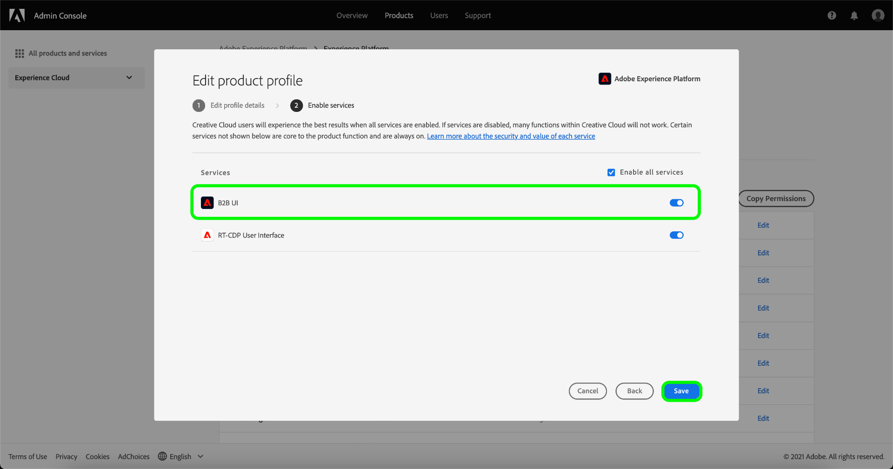

# Creación de un nuevo perfil de producto en Adobe Admin Console

Para empezar a crear un nuevo perfil, ve a la pestaña **[!UICONTROL Perfiles de producto]** y selecciona **[!UICONTROL Nuevo perfil]**.

Aparecerá el cuadro de diálogo **[!UICONTROL Crear un nuevo perfil de producto]**, en el que se le pedirá que escriba un perfil, un nombre para mostrar opcional y una descripción opcional. En **[!UICONTROL Notificaciones de usuarios]**, puede cambiar si se notificará por correo electrónico a los usuarios cuando se agreguen o eliminen del perfil.

Cuando termine, seleccione **[!UICONTROL Siguiente]**.

La siguiente pantalla le solicita que elija qué servicios de Platform Services incluir en el perfil. Seleccione el botón de alternancia situado junto a un servicio para desactivarlo. Si se deshabilita un servicio, todas las funciones asociadas con ese servicio no estarán disponibles para los usuarios asignados a este perfil de producto. Cuando termine, seleccione **[!UICONTROL Guardar]**.

Los clientes con derecho a B2B o B2P Edition tienen acceso a la interfaz de usuario de B2B. La interfaz de usuario B2B se puede aprovisionar para los usuarios mediante el [!UICONTROL menú Habilitar servicios]. Seleccione la opción junto a [!UICONTROL IU B2B] para habilitar el servicio para un perfil de producto en particular y, a continuación, seleccione **[!UICONTROL Guardar]**.

La opción de IU B2B permite a los usuarios ver flujos de trabajo B2B en torno a la administración de cuentas y oportunidades, así como crear segmentos relacionados con B2B. Para obtener más información, consulte la documentación de [[!DNL Adobe Real-Time Customer Data Platform B2B Edition]](../../rtcdp/b2b-overview.md).

El nuevo perfil de producto se ha creado correctamente y se le redirigirá a la [página de permisos de edición](#edit-permissions) del perfil. Consulte las secciones sobre [administración de permisos](#manage-permissions-for-a-product-profile) y [administración de usuarios](#manage-users-for-a-product-profile) para obtener más información sobre cómo administrar perfiles de producto una vez que se crean.

## Pasos siguientes

Con un nuevo perfil de producto creado, puedes continuar con el siguiente paso para [administrar permisos para un perfil de producto](permissions.md)
