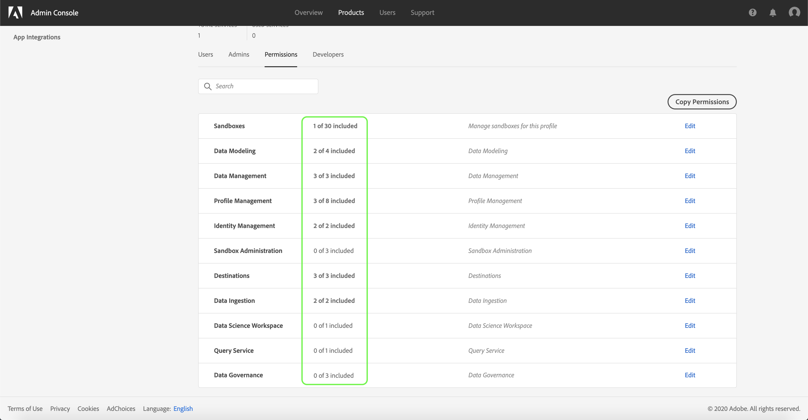

# Administrar permisos para un perfil de producto

Inmediatamente después de [crear un nuevo perfil](#create-a-new-product-profile)de producto, se le pedirá que configure los permisos del perfil. Si está editando permisos para un perfil existente, seleccione el perfil en la ficha Perfiles **** del producto para abrir la página de detalles del perfil y, a continuación, haga clic en **[!UICONTROL Permisos]**.

Los permisos se dividen en categorías y se enumeran en esta página. La lista muestra el nombre de la categoría, el número de permisos que contiene (y cuántos están activos) y su descripción.

Seleccione cualquier categoría de la lista para abrir la página **[!UICONTROL Editar permisos]** .

La página **[!UICONTROL Editar permisos]** proporciona un espacio de trabajo para agregar y quitar permisos del perfil de productos seleccionado. La parte izquierda de la pantalla muestra una lista de categorías de permisos. Al seleccionar una categoría, se cambian los permisos que se muestran en Elementos **[!UICONTROL de permisos]** disponibles.

Para agregar un permiso, seleccione el icono **más (+)** junto al nombre del permiso. También puede seleccionar **[!UICONTROL Añadir todo]** para agregar todos los permisos de la categoría actual al perfil. Los permisos añadidos aparecen en Elementos **[!UICONTROL de permisos]** incluidos.

>[!NOTE]
>
>La lista Elementos **[!UICONTROL de permisos]** incluidos solo muestra los permisos agregados de la categoría seleccionada actualmente.

Para quitar un permiso, seleccione el icono **X** junto al nombre del permiso o seleccione **[!UICONTROL Quitar todo]** para quitar todos los permisos de la categoría actual. Los permisos eliminados vuelven a aparecer en Elementos de permisos **[!UICONTROL disponibles]**.

Continúe con las categorías disponibles y agregue los permisos deseados. Cuando termine, seleccione **[!UICONTROL Guardar]**.

La ficha **[!UICONTROL Permisos]** del perfil del producto vuelve a aparecer y muestra que los permisos seleccionados ya están activos.

## Pasos siguientes

Con los permisos establecidos, puede continuar con el siguiente paso para [administrar los detalles y servicios de un perfil de productos](details-and-services.md)