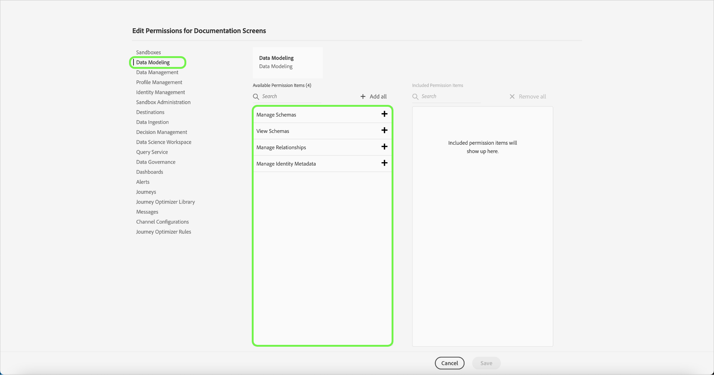
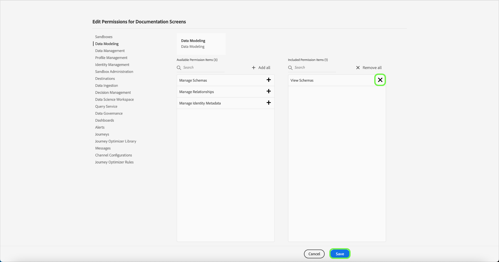

# Administración de permisos para un perfil de producto

Inmediatamente después de [crear un nuevo perfil de producto](#create-a-new-product-profile), se le pedirá que configure los permisos del perfil. Si está editando permisos para un perfil existente, seleccione el perfil en la ficha **[!UICONTROL Perfiles de producto]** para abrir la página de detalles del perfil y, a continuación, seleccione **[!UICONTROL Permisos]**.

Los permisos se dividen en categorías y se enumeran en esta página. La lista muestra el nombre de la categoría, el número de permisos que contiene (y cuántos están activos) y su descripción. Consulte la tabla en [Permisos de recursos](/help/access-control/home.md#permissions) para obtener un desglose de los permisos disponibles para cada rol.

Seleccione cualquier categoría de la lista para abrir la página **[!UICONTROL Editar permisos]**.

La página **[!UICONTROL Editar permisos]** proporciona un área de trabajo para agregar y quitar permisos del perfil de producto seleccionado. La parte izquierda de la pantalla muestra una lista de categorías de permisos. Al seleccionar una categoría, se cambian los permisos que se muestran en **[!UICONTROL Elementos de permisos disponibles]**.

Por ejemplo, para actualizar los permisos de Modelado de datos, seleccione **[!UICONTROL Modelado de datos]**.

Para agregar un permiso, seleccione el icono más **(+)** junto al nombre del permiso. También puede seleccionar **[!UICONTROL Agregar todos]** para agregar todos los permisos de la categoría actual al perfil. Los permisos agregados aparecen en **[!UICONTROL Elementos de permisos incluidos]**.

>[!NOTE]
>
>La lista **[!UICONTROL Elementos de permisos incluidos]** solo muestra los permisos agregados de la categoría seleccionada actualmente.

Para quitar un permiso, selecciona el icono **X** junto al nombre del permiso o selecciona **[!UICONTROL Quitar todo]** para quitar todos los permisos de la categoría actual. Los permisos eliminados vuelven a aparecer en **[!UICONTROL Elementos de permisos disponibles]**.

Continúe recorriendo las categorías disponibles y añadiendo los permisos que desee. Cuando termine, seleccione **[!UICONTROL Guardar]**.

La ficha **[!UICONTROL Permisos]** del perfil del producto vuelve a aparecer y muestra que los permisos seleccionados ya están activos.

## Pasos siguientes

Con los permisos establecidos, puede continuar con el siguiente paso para [administrar detalles y servicios para un perfil de producto](details-and-services.md)
