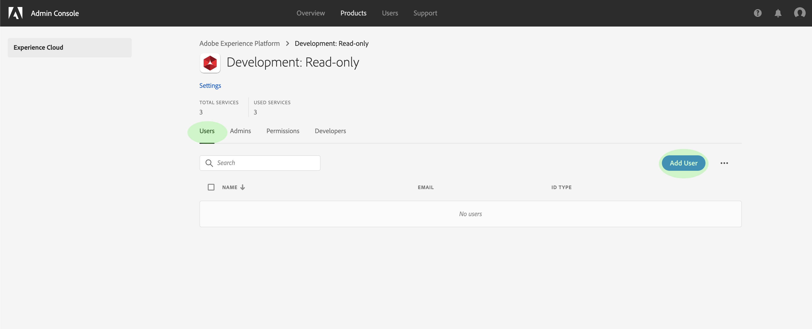
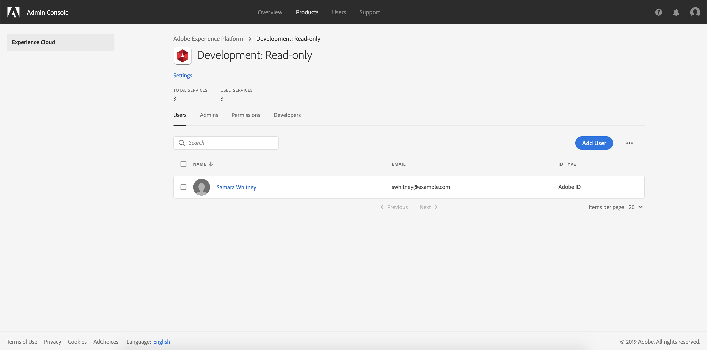

# Administrar usuarios para un perfil de producto

Para asignar o quitar usuarios de un perfil de producto, abra la página de detalles del perfil y vaya a la ficha **[!UICONTROL Usuarios]**. Desde aquí, haga clic en **[!UICONTROL Añadir usuario]**.

Aparece el cuadro de diálogo **[!UICONTROL Añadir usuario]**. Con el campo de búsqueda, puede buscar usuarios para agregarlos por nombre o por correo electrónico. A medida que escriba, los usuarios coincidentes aparecerán en una ventana de autocompletar debajo del cuadro de texto.

>[!NOTE]
>
>Si un usuario no aparece en la ventana de autocompletar, introduzca su dirección de correo electrónico completa en la barra de búsqueda. Se enviará una invitación al correo electrónico con instrucciones sobre cómo configurar una cuenta de Adobe ID.

Una vez seleccionado un usuario, haga clic en **[!UICONTROL Guardar]** para agregarlo al perfil del producto.

La ficha **[!UICONTROL Usuarios]** del perfil del producto vuelve a aparecer, donde ahora aparece el usuario agregado.

## Pasos siguientes

Ahora que ha aprendido a controlar el acceso a [!DNL Platform] funciones a través de [!DNL Admin Console], consulte la sección del apéndice en la [información general del control de acceso](../home.md) para obtener más información sobre cada permiso individual y las [!DNL Platform] funcionalidades a las que conceden acceso.