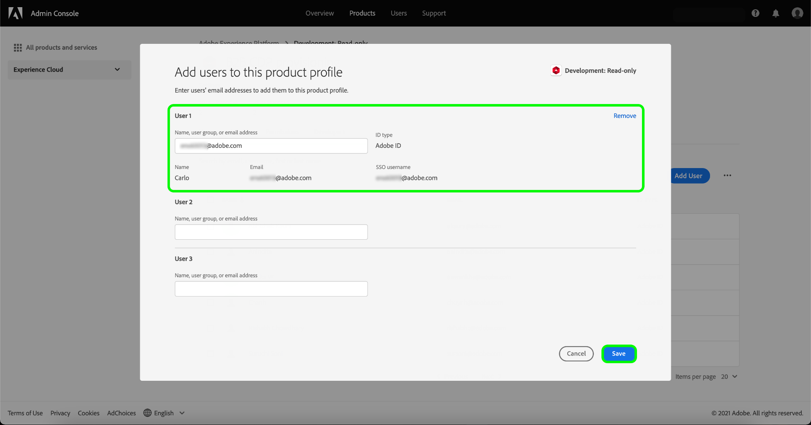

# Administración de usuarios para un perfil de producto

Para asignar o quitar usuarios de un perfil de producto, abra la página de detalles del perfil y vaya a la pestaña **[!UICONTROL Usuarios]**. Aquí, seleccione **[!UICONTROL Agregar usuario]**.

![La página de detalles del perfil de producto muestra los usuarios enumerados en la ficha [!UICONTROL Usuarios].](../images/add-user.png)

Aparecerá el cuadro de diálogo **[!UICONTROL Agregar usuario]**. Con el campo de búsqueda, puede buscar usuarios para agregar por nombre o por correo electrónico. A medida que escribe, los usuarios coincidentes aparecen en una ventana de autocompletar debajo del cuadro de texto.

>[!NOTE]
>
>Si un usuario no aparece en la ventana de autocompletar, introduzca su dirección de correo electrónico completa en la barra de búsqueda. Se enviará una invitación al correo electrónico con instrucciones para configurar una cuenta de Adobe ID.

Una vez que haya seleccionado un usuario, seleccione **[!UICONTROL Guardar]** para agregarlo al perfil del producto.

El siguiente vídeo tiene como objetivo ayudarle a comprender la administración de administradores para un perfil de producto.

>[!VIDEO](https://video.tv.adobe.com/v/333860/?learn=on)

## Pasos siguientes

Ahora que ha aprendido a controlar el acceso a las características de Experience Platform a través de [!DNL Admin Console], vea la sección del apéndice en la [descripción general del control de acceso](../home.md) para obtener más información sobre cada permiso individual y las funcionalidades de Experience Platform a las que conceden acceso.
