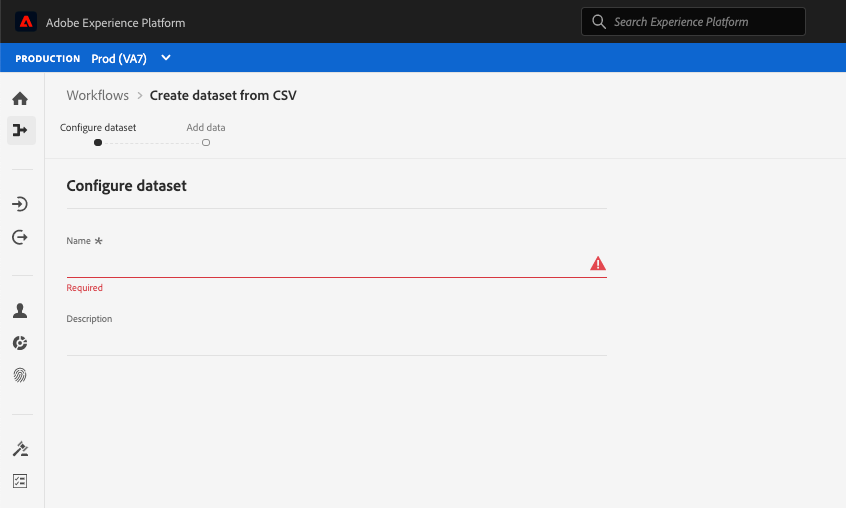

# Funciones de accesibilidad en el Experience Platform

Adobe Experience Platform está comprometido a proporcionar funciones accesibles e inclusivas a todas las personas, incluidos los usuarios que trabajan con dispositivos de asistencia, como software de reconocimiento de voz y lectores de pantalla. Este documento describe las funciones generales de accesibilidad que admite Platform, incluida la navegación mediante teclado, la estructura semántica, el contraste suficiente entre los elementos en primer plano y los elementos en segundo plano, y la compatibilidad con las tecnologías de asistencia.

## Tecnologías de asistencia

Los usuarios con discapacidades suelen depender del hardware y el software, conocidos como tecnologías de asistencia, para acceder al contenido digital y utilizar productos de software. Adobe Experience Platform admite varios tipos de tecnologías de asistencia (AT), como lectores de pantalla, zoom y software de reconocimiento de voz, siguiendo las prácticas recomendadas de accesibilidad, como el uso de código semántico, equivalentes de texto, etiquetas y ARIA donde sea necesario. Los elementos interactivos de la interfaz de usuario (IU) del Experience Platform utilizan las etiquetas, los nombres accesibles y las funciones correspondientes que identifican tanto su finalidad como su estado actual. Esto garantiza que las tecnologías de asistencia, como los lectores de pantalla, puedan leer las etiquetas y otra información a los usuarios para que puedan interactuar fácilmente con los controles de aplicación.

## Accesibilidad del teclado

El Experience Platform se esfuerza por admitir la accesibilidad completa del teclado.

Los siguientes elementos de navegación facilitan la accesibilidad:
* La tecla de tabulación cambia entre elementos de la interfaz de usuario, secciones y grupos de menús.
* Las teclas de flecha se mueven dentro de los grupos de menús para definir el enfoque en elementos activos individuales.
* Mayús + Tab se mueve hacia atrás en el orden de tabulación.
* Las teclas Retorno (Intro) y Barra espaciadora activan los elementos seleccionados.
* La tecla escape (ESC) actúa como botón de cancelación para cerrar un cuadro de diálogo cuando está presente.
* El Experience Platform muestra un borde azul alrededor de un elemento seleccionado para mostrar una indicación clara de qué elemento de la interfaz de usuario está seleccionado actualmente.

## Paletas de color y contraste

El Experience Platform se esfuerza por [WCAG 2.1 AA](https://www.w3.org/TR/WCAG/) conformidad, incluidos los requisitos para el contraste de color. La interfaz de usuario del Experience Platform proporciona suficiente contraste en la aplicación para garantizar una experiencia de visualización accesible para los usuarios con deficiencias de visión o color bajas.

## Validación de campo requerida

Al agregar datos, crear esquemas o definir segmentos, los campos obligatorios se indican visualmente, utilizando un asterisco junto a la etiqueta de texto de un campo y programáticamente. Estos campos déclencheur la validación cuando se introducen datos no válidos en los campos y al guardarlos. Si un campo requerido no supera la validación, aparece delineado en rojo con un icono de error y también aparece una descripción por escrito del problema que debe solucionarse.

