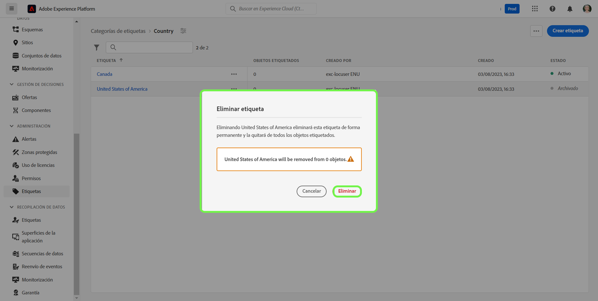

# Guía de administración de etiquetas

Las etiquetas permiten administrar taxonomías de metadatos para clasificar objetos empresariales y facilitar así la detección y la categorización. Las etiquetas contribuyen a identificar atributos taxonómicos importantes para los públicos con los que trabajarán sus equipos, de modo que puedan encontrarlos más rápido, además pueden agrupar públicos comunes en un descriptor. Debe identificar las categorías de etiquetas comunes, como regiones geográficas, unidades de negocio, líneas de productos, proyectos, equipos, intervalos de tiempo (trimestres, meses, años) o cualquier otra información que aporte significado y facilite el descubrimiento de públicos para su equipo. 

## Crear una etiqueta {#create-tag}

Para crear una etiqueta nueva, seleccione **[!UICONTROL etiquetas]** en el panel de navegación izquierdo y elija la categoría que desee.

Seleccione **[!UICONTROL Crear etiqueta]** para generar una etiqueta nueva.

Aparece el cuadro de diálogo **[!UICONTROL Crear etiqueta]** y se le solicita que escriba un nombre de etiqueta exclusivo. Cuando haya terminado, seleccione **[!UICONTROL Guardar]**.

La nueva etiqueta se ha creado correctamente. Se le redirigirá a la pantalla de etiquetas y verá en la lista la etiqueta recién generada.

## Edición de una etiqueta {#edit-tag}

La edición de una etiqueta es útil cuando hay errores ortográficos, actualizaciones de las convenciones de nomenclatura o actualizaciones de terminología. Si edita una etiqueta, se mantendrá la asociación de la etiqueta con cualquier objeto donde esté aplicada actualmente.

Para editar una etiqueta existente, en la lista de categoría de etiquetas, seleccione los puntos suspensivos (`...`) junto al nombre de la etiqueta que desee editar. El menú desplegable muestra los controles para editar, mover o archivar la etiqueta. Seleccione **[!UICONTROL Editar]** en el menú desplegable.

Aparece el cuadro de diálogo **[!UICONTROL Editar etiqueta]** que le solicita que edite el nombre de la etiqueta. Cuando haya terminado, seleccione **[!UICONTROL Guardar]**.

El nombre de la etiqueta se ha actualizado correctamente. Se le redirigirá a la pantalla de etiquetas y verá la etiqueta actualizada en la lista.

## Mover una etiqueta entre categorías {#move-tag}

Las etiquetas se pueden mover a otras categorías. Al mover una etiqueta, se mantiene la asociación de la etiqueta con cualquier objeto al que se aplique en ese momento.

Para mover una etiqueta existente, en la lista de categorías, seleccione los puntos suspensivos (`...`) junto al nombre de la etiqueta que desea mover. El menú desplegable muestra los controles para editar, mover o archivar la etiqueta. Seleccionar **[!UICONTROL Editar]** en el menú desplegable.

Aparece el cuadro de diálogo **[!UICONTROL Mover etiqueta]**, que le solicita que seleccione la categoría a la que se debe mover la etiqueta seleccionada.

Puede desplazarse y seleccionar de la lista o, alternativamente, utilizar la función de búsqueda para escribir el nombre de la categoría. Cuando haya terminado, seleccione **[!UICONTROL Mover]**.

La etiqueta se ha movido correctamente y se le redirigirá a la pantalla de etiquetas, donde verá la lista actualizada y ya no aparecerá la etiqueta.

La etiqueta aparecerá ahora en la categoría de etiqueta seleccionada anteriormente.

## Archivar una etiqueta {#archive-tag}

El estado de una etiqueta se puede cambiar entre activo y archivado. Las etiquetas archivadas no se eliminan de los objetos en los que ya se han aplicado, pero ya no se pueden aplicar a objetos nuevos. Para cada etiqueta, el mismo estado se refleja en todos los objetos. Esto es especialmente útil cuando desea mantener las asociaciones de etiqueta y objeto actuales, pero no desea que la etiqueta se utilice en el futuro.

Para archivar una etiqueta existente, en la lista de categoría de etiquetas, seleccione los puntos suspensivos (`...`) junto al nombre de la etiqueta que desea archivar. El menú desplegable muestra los controles para editar, mover o archivar la etiqueta. Seleccione **[!UICONTROL Archivar]** en el menú desplegable.

Aparece el cuadro de diálogo **[!UICONTROL Archivar etiqueta]**, que le solicita que confirme el archivo de la etiqueta. Seleccione **[!UICONTROL Archivar]**.

La etiqueta se archiva correctamente y se le redirige a la pantalla de etiquetas. Verá que la lista de etiquetas actualizada ahora muestra el estado de la etiqueta como `Archived`.

## Restaurar una etiqueta archivada {#restore-archived-tag}

Si desea aplicar una etiqueta `Archived` a los objetos nuevos, la etiqueta debe estar en un estado `Active`. Restaurar una etiqueta archivada devolverá una etiqueta a su estado `Active`.

Para restaurar una etiqueta archivada, en la lista de categoría de etiqueta, seleccione los puntos suspensivos (`...`) junto al nombre de la etiqueta que desea restaurar. Un menú desplegable muestra los controles para restaurar o eliminar la etiqueta. Seleccione **[!UICONTROL Restaurar]** en el menú desplegable.

Aparece el cuadro de diálogo **[!UICONTROL Restaurar etiqueta]**, que le solicita que confirme la restauración de etiquetas. Seleccione **[!UICONTROL Restaurar]**.

La etiqueta se ha restaurado correctamente y se le redirigirá a la pantalla de etiquetas. Verá que la lista de etiquetas actualizada ahora muestra el estado de la etiqueta como `Active`.

## Eliminar una etiqueta {#delete-tag}

>[!NOTE]
>
>Solo las etiquetas que están en un estado `Archived` y no están asociadas a ningún objeto se pueden eliminar.

Si elimina una etiqueta, se quitará por completo del sistema.

Para eliminar una etiqueta archivada, en la lista de categoría de etiqueta, seleccione los puntos suspensivos (`...`) junto al nombre de la etiqueta que desea eliminar. Un menú desplegable muestra los controles para restaurar o eliminar la etiqueta. En el menú desplegable, seleccione **[!UICONTROL Eliminar]**.

Aparece el cuadro de diálogo **[!UICONTROL Eliminar etiqueta]**, solicitándole que confirme la eliminación de la etiqueta. Seleccione **[!UICONTROL Eliminar]**.

La etiqueta se ha eliminado correctamente y se le redirigirá a la pantalla de etiquetas. La etiqueta ya no aparece en la lista y se ha eliminado por completo.

## Visualización de objetos etiquetados {#view-tagged}

Cada etiqueta tiene una página de detalles a la que se puede acceder desde el inventario de etiquetas. Esta página incluye todos los objetos que actualmente tienen esa etiqueta aplicada, lo que permite a los usuarios ver objetos relacionados de diferentes aplicaciones y capacidades en una sola vista.

Para ver la lista de objetos etiquetados, busque la etiqueta dentro de una categoría de etiqueta y seleccione la etiqueta.

Aparece la página de [!UICONTROL Objetos etiquetados], mostrando un inventario de objetos etiquetados.

## Pasos siguientes

Ya ha aprendido a administrar etiquetas. Para obtener una descripción general de alto nivel de las etiquetas en Experience Platform, consulte la [documentación de información general sobre etiquetas](../overview.md).
