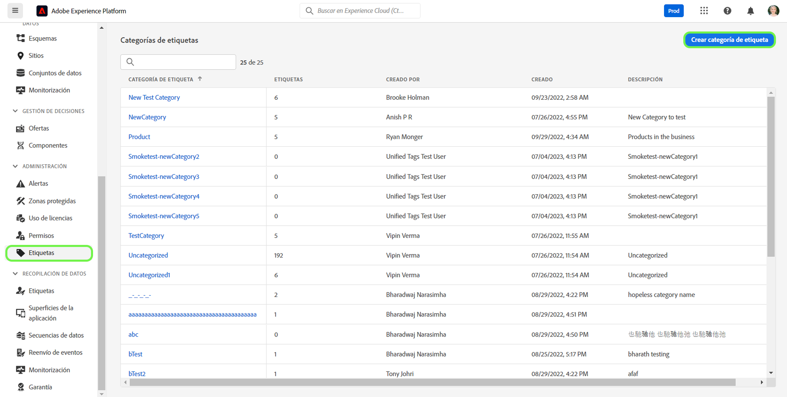
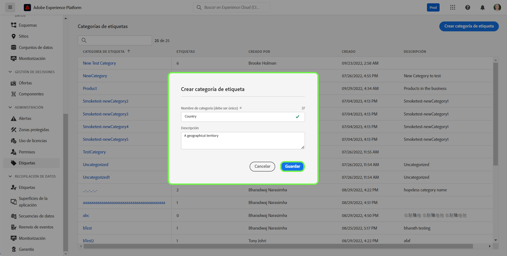
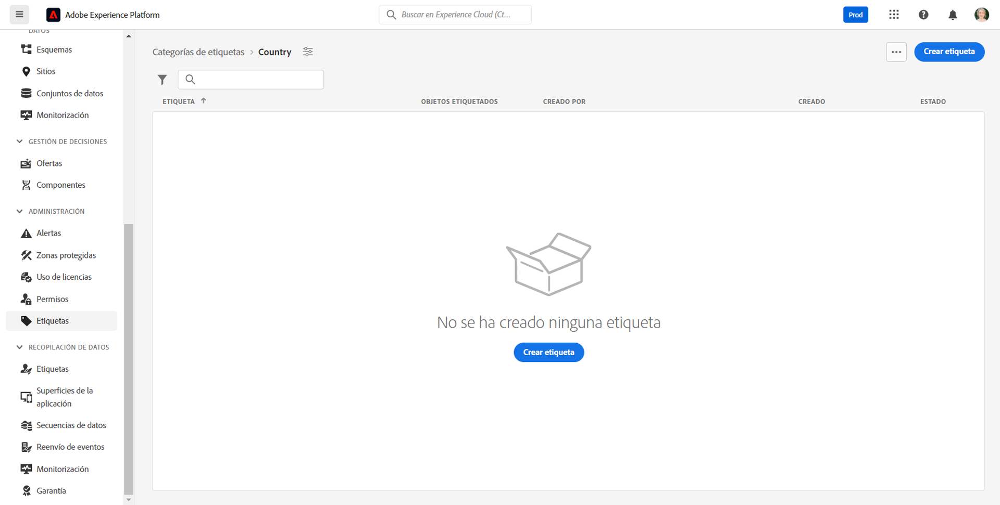
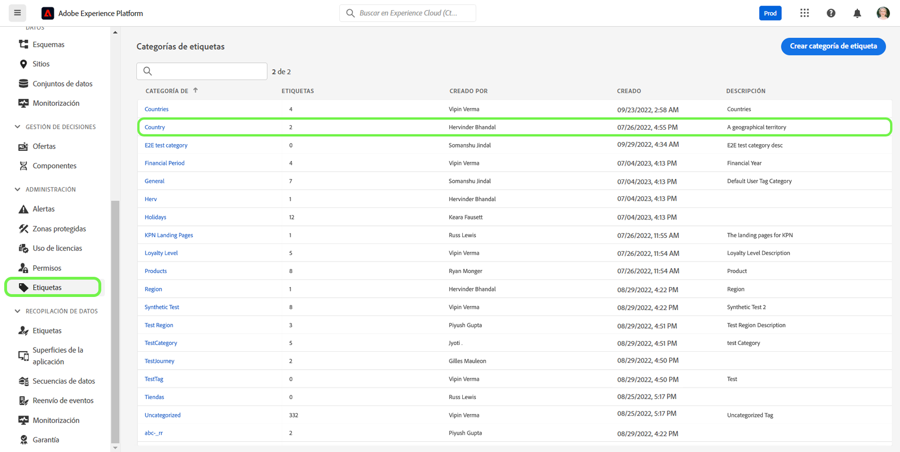
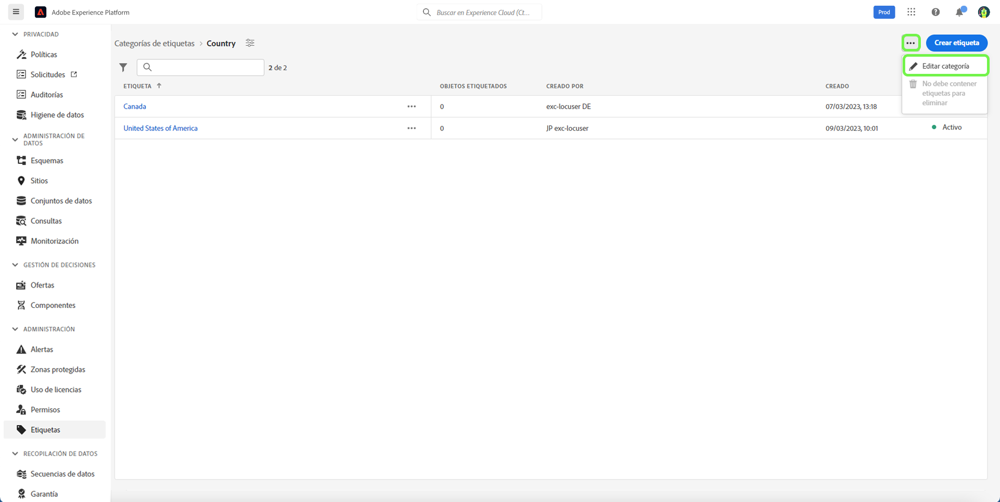
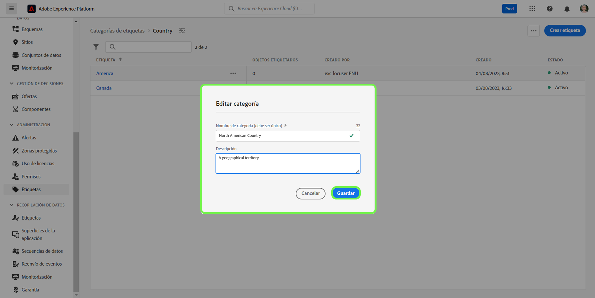
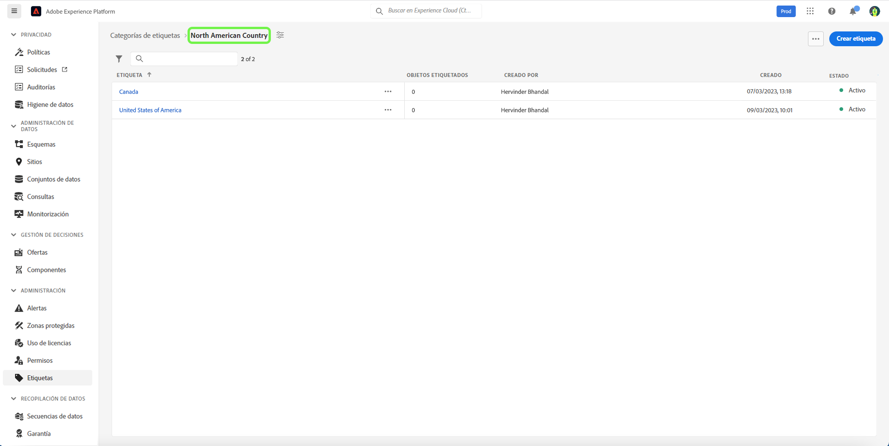
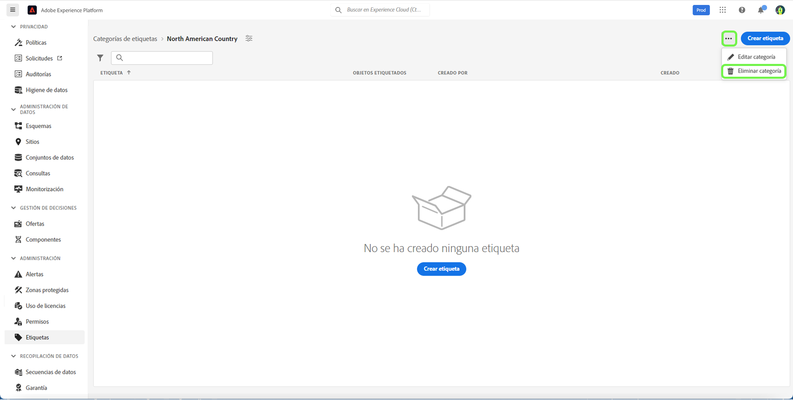
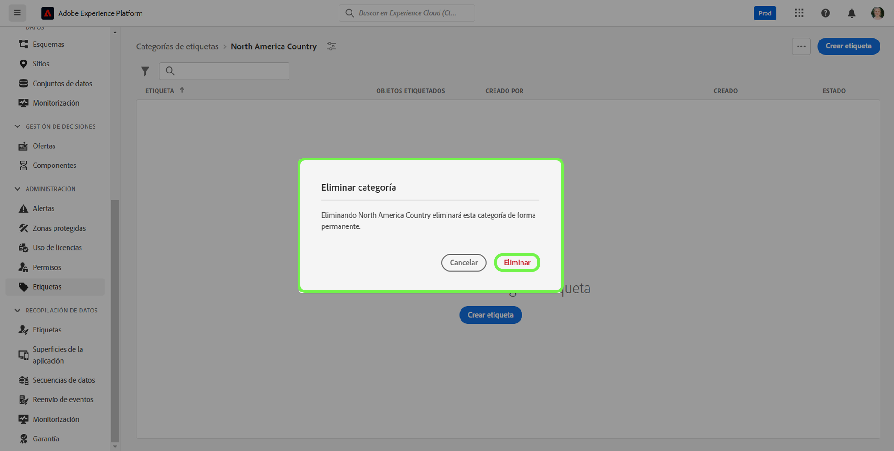

# Guía de categorías de etiquetas

Las categorías de etiquetas las agrupan en conjuntos significativos para proporcionar más contexto y aclarar mejor sus propósitos. Cualquier etiqueta con categoría tiene el nombre de la etiqueta precedido del nombre de la categoría y, a continuación, dos puntos.

## Crear una categoría de etiqueta {#create-tag-category}

Para crear una nueva categoría, seleccione **[!UICONTROL etiquetas]** en el panel de navegación izquierdo, y seleccione [!UICONTROL Crear categoría de etiqueta].

Aparece el cuadro de diálogo **[!UICONTROL Crear categoría de etiqueta]** en el que se le solicita que introduzca un nombre de categoría único y una descripción opcional. Cuando haya terminado, seleccione **[!UICONTROL Guardar]**.

La nueva categoría de etiqueta se ha creado correctamente y se le redirigirá a la página de creación de etiquetas, donde podrá asignar nuevas etiquetas. Para obtener más información sobre la creación de etiquetas, consulte el documento [administración de etiquetas](./managing-tags.md#create-a-tag-create-tag).

## Editar categoría de etiqueta {#edit-tag-category}

>[!NOTE]
>
>Al editar o cambiar el nombre de una categoría de etiqueta, se mantiene la asociación de la etiqueta con cualquier objeto al que se aplique actualmente.

Para editar una categoría de etiqueta, seleccione **[!UICONTROL etiquetas]** en el panel de navegación izquierdo y la categoría de etiqueta que desea editar.

En la categoría de etiqueta, seleccione los puntos suspensivos (`...`) junto a [!UICONTROL Crear etiqueta]. La lista desplegable muestra los controles para editar la categoría o eliminar, seleccione **[!UICONTROL Editar categoría]**.

Aparece el cuadro de diálogo **[!UICONTROL Editar categoría]**, que le solicita que actualice el nombre de la categoría y la descripción opcional. Cuando haya terminado, seleccione **[!UICONTROL Guardar]**.

La categoría de etiqueta se ha actualizado correctamente y se le redirigirá a la categoría de etiqueta.

## Eliminar categoría de etiqueta {#delete-tag-category}

>[!NOTE]
>
>Para poder eliminar una categoría de etiqueta, debe estar vacía y libre de etiquetas.

Para eliminar una categoría de etiqueta, seleccione **[!UICONTROL etiquetas]** en el panel de navegación izquierdo, y seleccione la categoría de etiqueta que desee eliminar.

En la categoría de etiqueta, seleccione los puntos suspensivos (`...`) junto a [!UICONTROL Crear etiqueta]. Una lista desplegable muestra los controles para editar la categoría o eliminar, seleccione **[!UICONTROL Eliminar categoría]**.

Aparece el cuadro de diálogo **[!UICONTROL Eliminar categoría]**, que le solicita que confirme la eliminación de la categoría de etiqueta. Seleccione **[!UICONTROL Eliminar]** para confirmar.

La categoría de etiqueta se ha eliminado correctamente y se le redirigirá a la página de inventario de categoría de etiqueta. La categoría de etiqueta ya no aparece en la lista y se ha eliminado por completo.

## Pasos siguientes

Ahora ha aprendido a administrar las categorías de etiquetas. Puede continuar con el siguiente paso para [administrar las etiquetas](./managing-tags.md).
