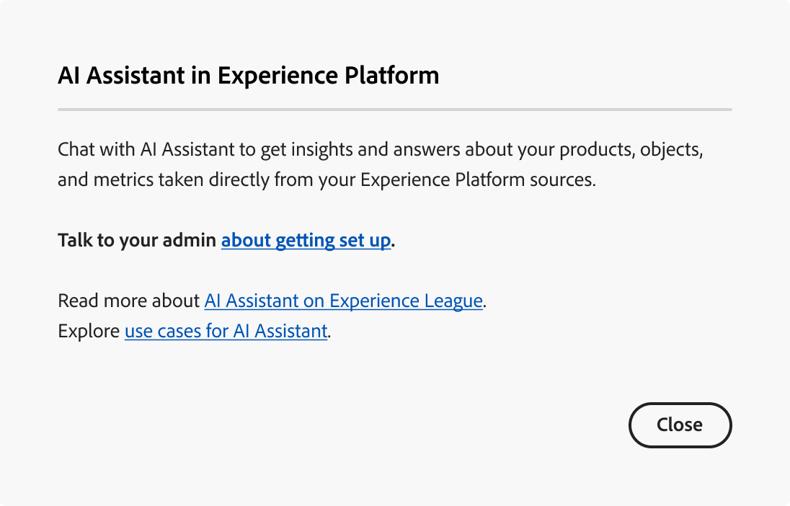

# Acceso al asistente de IA en Experience Platform

Puede acceder al asistente de IA en varias aplicaciones de Adobe Experience Cloud.

>[!IMPORTANT]
>
>Si recibe un mensaje emergente en la interfaz de usuario de permisos que le informa de que su organización debe aceptar primero términos legales adicionales para obtener acceso al asistente de IA, póngase en contacto con el equipo de su cuenta de Adobe para obtener instrucciones sobre estos términos.

El acceso al asistente de IA se rige por los siguientes parámetros:

* **Acceda a la aplicación:** Puede acceder al Asistente de IA en Adobe Experience Platform, Adobe Real-Time CDP, Adobe Journey Optimizer y [Customer Journey Analytics](https://experienceleague.adobe.com/en/docs/analytics-platform/using/ai-assistant).
<!-- * **Contractual access:** Your company must agree to certain [!DNL GenAI]-related legal terms before your organization can use AI Assistant. Contact your organization's administrator or your Adobe Account Team if you are not able to access AI Assistant.  -->
* **Permisos:** Use la interfaz de usuario de [permisos](../access-control/abac/ui/permissions.md) para conceder o revocar el acceso al Asistente de IA en su organización. Para usar el Asistente de IA, un usuario dado debe pertenecer a un rol que esté aprovisionado con los permisos **Habilitar el Asistente de IA** y **Ver perspectivas operativas**.
   * Como administrador, puede agregar **Habilitar el asistente de IA** a un rol determinado y agregar un usuario a ese rol para permitirles acceder al asistente de IA en su organización.
   * Como administrador, puede agregar **Ver perspectivas operativas** a una función determinada y agregar un usuario a esa función para permitirles usar las capacidades de perspectivas operativas del Asistente de inteligencia artificial. Las perspectivas operativas están actualmente en fase beta.

Use la interfaz de usuario de [permisos](../access-control/abac/ui/roles.md) para conceder permisos para usar el Ayudante de IA en Experience Platform y Journey Optimizer. Para obtener información sobre cómo acceder al asistente de IA en Customer Journey Analytics. Lea la documentación en [Customer Journey Analytics](https://experienceleague.adobe.com/en/docs/analytics-platform/using/ai-assistant).

Puede haber dos razones por las que no puede acceder al Asistente de IA:

1. Está utilizando una organización que no reúne los requisitos legales para utilizar el asistente de IA;
2. Los administradores no le han concedido los permisos adecuados para utilizar el Asistente para IA.

>[!BEGINTABS]

>[!TAB Su organización no puede utilizar el Asistente para IA]

Verá el siguiente mensaje si utiliza una organización que no cumple los requisitos legales para utilizar AI Assistant. En esta situación, debe ponerse en contacto con el equipo de su cuenta de Adobe para resolver el acceso.

>[!TAB No cuenta con los permisos adecuados]

Si su organización cumple los requisitos legales para utilizar el asistente de IA y sigue sin poder acceder a la función, verá el siguiente mensaje en la interfaz de usuario de Experience Platform. Este escenario significa que no tiene los permisos suficientes para acceder a la función y debe ponerse en contacto con los administradores para resolver los permisos.

>[!ENDTABS]

Una vez que tenga los permisos necesarios, puede acceder al asistente de IA seleccionando el icono del asistente de IA en el encabezado superior de la aplicación que está utilizando.

## Obtener acceso al asistente de IA

Vea el siguiente vídeo para aprender a configurar el acceso a AI Assistant para sus organizaciones y usuarios.

>[!VIDEO](https://video.tv.adobe.com/v/3436470/?learn=on)

## Pasos siguientes

Una vez que tenga acceso completo al Asistente de IA, puede continuar usando la función durante sus flujos de trabajo, lea la [guía de la interfaz de usuario del Asistente de IA](./ui-guide.md) para obtener más información.
