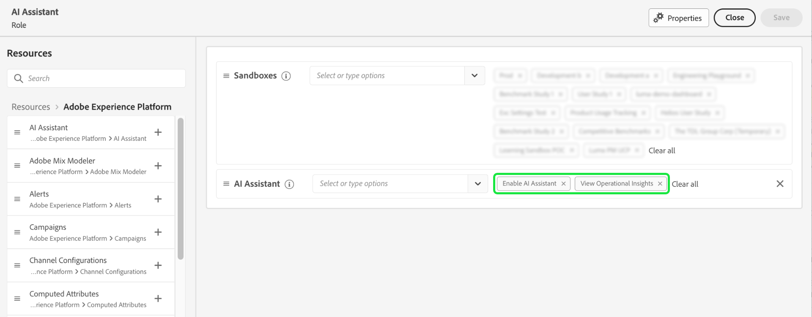

# Acceso al asistente de IA en Experience Platform

Puede acceder al asistente de IA en varias aplicaciones de Adobe Experience Cloud.

El acceso al asistente de IA se rige por los siguientes parámetros:

* **Acceda a la aplicación:** Puede acceder al asistente de IA en Adobe Experience Platform, Adobe Real-Time CDP, Adobe Journey Optimizer y [Customer Journey Analytics](https://experienceleague.adobe.com/en/docs/analytics-platform/using/ai-assistant).
* **Acceso contractual:** Su empresa debe aceptar determinadas [!DNL GenAI]Términos legales relacionados con el cliente antes de que su organización pueda utilizar AI Assistant. Póngase en contacto con el administrador de su organización o con el equipo de cuenta de Adobe si no puede acceder al asistente de IA.
* **Permisos:** Utilice el [IU de permisos](../access-control/abac/ui/permissions.md) para conceder o revocar el acceso al Asistente de IA de su organización. Para utilizar el asistente de IA, un usuario determinado debe pertenecer a una función que se proporcione con **Habilitar el asistente de IA** y **Ver perspectivas operativas** permisos.
   * Como administrador, puede agregar lo siguiente **Habilitar el asistente de IA** a una función determinada y añada un usuario a esa función para permitirle acceder al asistente de IA de su organización.
   * Como administrador, puede agregar lo siguiente **Ver perspectivas operativas** a una función determinada y añada un usuario a esa función, para permitirles utilizar las capacidades de perspectivas operativas del asistente de IA. Las perspectivas operativas están actualmente en fase beta.

Una vez que tenga los permisos necesarios, puede acceder al asistente de IA seleccionando el icono del asistente de IA en el encabezado superior de la aplicación que está utilizando.

## Pasos siguientes

Una vez que tenga acceso completo al asistente de IA, puede continuar utilizando la función durante los flujos de trabajo y leer el [Guía de IU del asistente de IA](./ui-guide.md) para obtener más información.