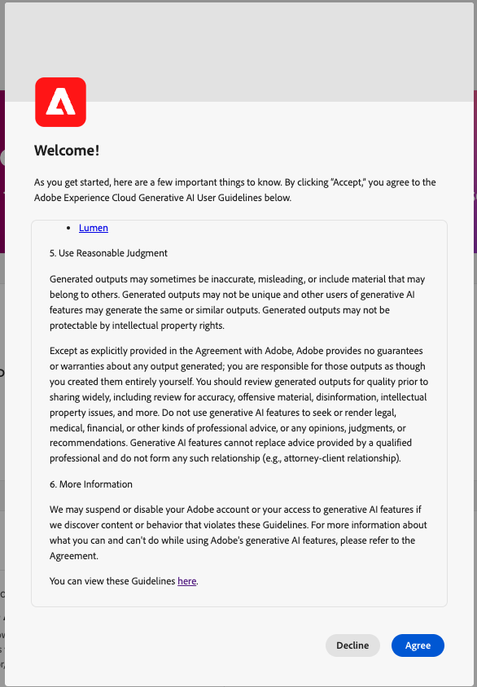

# Asistente de IA (heredado) en Adobe Experience Platform

>[!IMPORTANT]
>
>Este documento se aplica al asistente de IA (heredado). Para obtener información sobre el asistente de IA (próxima generación), lee la [guía de la interfaz de usuario del asistente de IA](https://experienceleague.adobe.com/en/docs/experience-cloud-ai/experience-cloud-ai/ai-assistant/ai-assistant-ui) en la documentación de [AI en Experience Cloud](https://experienceleague.adobe.com/es/docs/experience-cloud-ai/experience-cloud-ai/home).

Consulte la siguiente tabla para ver una comparación de AI Assistant (Legacy) y AI Assistant (Next-Gen):

| Área de funciones | Asistente de IA (heredado) | Asistente de IA (próxima generación) |
| --- | --- | --- |
| Experiencia del usuario | El asistente de IA (heredado) solo está disponible en un panel del carril derecho. | El asistente de IA (próxima generación) está disponible tanto en el panel derecho como en la experiencia de pantalla completa envolvente. |
| Ámbito de las capacidades | Puede utilizar el asistente de IA (heredado) para obtener conocimientos del producto y perspectivas operativas. | Puede utilizar el asistente de IA (próxima generación) para obtener conocimientos del producto, perspectivas operativas, así como habilidades agénticas avanzadas y ejecución de tareas de varios pasos. |
| Arquitectura de plataforma | El asistente de IA (heredado) no se crea en la pila de Agent Orchestrator. | El Asistente de IA (próxima generación) cuenta con la tecnología [Adobe Experience Platform Agent Orchestrator](https://experienceleague.adobe.com/es/docs/experience-cloud-ai/experience-cloud-ai/agents/agent-orchestrator), lo que permite la extensibilidad y la coordinación avanzada entre las distintas funcionalidades. |
| Cobertura de aplicación | El asistente de IA (heredado) es una implementación específica de la aplicación. | Puede utilizar el asistente de IA (próxima generación) para obtener una experiencia de asistente de IA unificada en todas las aplicaciones de Adobe Experience Cloud. |
| Modelo de acceso y permiso | Modelo de acceso con ámbito de aplicación alineado con los límites de cada producto. | Todos los usuarios tienen acceso al asistente de IA (próxima generación) y a los agentes de Experience Platform asociados. **Nota**: <ul><li>**Adobe Experience Manager**: el administrador debe concederle permiso para acceder al Asistente de IA (próxima generación) a través de [Adobe Admin Console](https://helpx.adobe.com/es/enterprise/using/admin-console.html).</li><li>**Customer Journey Analytics**: el administrador debe concederle permiso para acceder al Asistente de IA a través de [Control de acceso de Customer Journey Analytics](https://experienceleague.adobe.com/en/docs/analytics-platform/using/technotes/access-control?lang=en). Esto le permite hacer preguntas sobre el conocimiento del producto y las perspectivas de datos. |

El siguiente vídeo tiene como objetivo ayudarle a comprender el asistente de IA.

>[!VIDEO](https://video.tv.adobe.com/v/3429845?learn=on)

Lea este documento para obtener más información sobre el asistente de IA (heredado) en Adobe Experience Platform.

El asistente de IA (heredado) de Adobe Experience Platform es una experiencia conversacional que puede utilizar para acelerar los flujos de trabajo en las aplicaciones de Adobe. Puede utilizar el asistente de IA (heredado) para comprender mejor el conocimiento del producto, solucionar problemas o buscar a través de la información y encontrar perspectivas operativas. AI Assistant (heredado) es compatible con Experience Platform, Real-Time Customer Data Platform, Adobe Journey Optimizer y Customer Journey Analytics.

>[!IMPORTANT]
>
>Debe aceptar un [acuerdo de usuario](https://www.adobe.com/legal/licenses-terms/adobe-dx-gen-ai-user-guidelines.html) para poder usar el Asistente de IA (heredado). El contrato de usuario también contiene el contrato de versión beta pública. Esto es para que pueda utilizar funciones adicionales de asistente de IA (heredadas) a medida que se despliegan en una capacidad beta.

+++Seleccionar para ver la interfaz de acuerdo de usuario

+++

## Explicación del asistente de IA {#understanding-ai-assistant}

El asistente de IA (heredado) responde a las preguntas enviadas consultando una base de datos y luego traduciendo los datos de la base de datos a una respuesta legible en lenguaje natural.

Esta representación interna de datos subyacentes también se conoce como **[!DNL Knowledge Graph]**: una web completa de conceptos, datos y metadatos para una respuesta determinada.

[!DNL Knowledge Graph] consta de subgráficos a los que se hace referencia cada vez que se envían consultas:

* Perspectivas operativas del cliente.
* Perspectivas operativas del cliente en varias metatiendas.
* Documentación de Experience League.

Hay dos clases de preguntas que se deben tener en cuenta antes de consultar el Asistente de IA (heredado):

### Conocimiento del producto {#product-knowledge}

El conocimiento del producto hace referencia a conceptos y temas basados en la documentación de Experience League. Las preguntas sobre conocimientos del producto se pueden especificar en los siguientes subgrupos:

| Conocimiento del producto | Ejemplos |
| --- | --- |
| Aprendizaje puntual | <ul><li>¿Cuál es la diferencia entre una identidad y una clave principal o externa?</li><li>¿Qué es el Público similar?</li></ul> |
| Abrir detección | <ul><li>¿Cómo puedo exportar este conjunto de datos?</li><li>¿Existen esquemas para los clientes del sector sanitario?</li></ul> |
| Resolución de problemas | <ul><li>¿Por qué no puedo activar un esquema propiedad de Adobe para el perfil?</li><li>¿Por qué no puedo eliminar un segmento?</li></ul> |

{style="table-layout:auto"}

Vea el siguiente vídeo para obtener información adicional sobre los conocimientos del producto AI Assistant (Legacy):

>[!VIDEO](https://video.tv.adobe.com/v/3438032/?learn=on)

### Datos operativos {#operational-insights}

Las perspectivas operativas se refieren a respuestas que genera AI Assistant (Legacy) acerca de sus objetos de metadatos (atributos, audiencias, flujos de datos, conjuntos de datos, destinos, recorridos, esquemas y fuentes), incluidos recuentos, búsquedas y el impacto en el linaje. No observa ningún dato dentro de la zona protegida.

* ¿Cuántos conjuntos de datos tengo?
* ¿Cuántos atributos de esquema nunca se han utilizado?
* ¿Qué audiencias se han activado?

Puede hacer preguntas al asistente de IA (heredado) acerca de sus perspectivas operativas en los siguientes dominios:

| Dominio | Metadatos admitidos | Metadatos no admitidos |
| --- | --- | --- |
| Atributos | <ul><li>Búsqueda de nombre de atributo</li><li>Atributo: relación de esquema</li><li>Atributo: relación de conjunto de datos</li><li>Atributo: relación de audiencia</li><li>Atributo: relación de destino</li></ul> | <ul><li>Clase de atributo</li><li>Auditoría</li><li>Estado de obsolescencia</li><li>Etiquetas</li><li>Valor almacenado en atributos</li></ul> |
| Públicos | <ul><li>Recuento de público</li><li>Tipo de audiencia (flujo continuo o por lotes)</li><li>Fechas de creación/modificación</li><li>Estado de activación</li><li>Recuento de perfiles</li><li>Duplicar audiencias</li><li>Búsqueda de definición de audiencia</li><li>Audiencia: relación de audiencia</li><li>Audiencia: relación de atributos</li><li>Audiencia: relación entre conjuntos de datos</li><li>Audiencia: relación de destino</li><li>Búsqueda de nombres</li><li>Búsqueda de nombre e ID | <ul><li>Solapamientos de público</li><li>Activación del público</li><li>Audiencia: relaciones de campaña</li><li>Auditoría</li><li>Crear/modificar</li><li>Etiquetas</li><li>Tendencias de calificación de perfiles</li></ul> |
| Flujos de datos | <ul><li>Recuentos de flujo de datos</li><li>Estado de flujo de datos</li><li>Flujo de datos: relación de conjunto de datos</li><li>Flujo de datos: relación de origen</li></ul> | <ul><li>Creación/modificación</li><li>Relaciones entre flujo de datos y lotes</li><li>Ingesta de recuento de perfiles</li></ul> |
| Conjuntos de datos | <ul><li>Recuento de conjuntos de datos</li><li>Estado de habilitación de perfil</li><li>Fecha de creación/modificación</li><li>Conjunto de datos: relación de esquema</li><li>Conjunto de datos: relación de audiencia</li><li>Conjunto de datos: relación de atributos</li><li>Conjunto de datos: relación de flujo de datos</li><li>Tamaño del conjunto de datos</li><li>Número de filas</li><li>Búsqueda de nombres </li><li>Búsqueda de nombre e ID</li></ul> | <ul><li>Auditoría</li><li>Creado por</li><li>Conjunto de datos: relación por lotes</li><li>Creación/modificación de conjuntos de datos</li><li>Número de perfiles</li><li>Búsqueda de valores</li></ul> |
| Modelos de datos (composición de audiencia federada) | <ul><li>Recuentos del modelo de datos</li><li>Búsqueda de nombres</li><li>Modelo de datos y relación de esquema</li><li>Propiedades del vínculo</li><li>Estado</li><li>Fechas de creación y modificación</li><li>Relación entre el modelo de datos y el vínculo</li></ul> | |
| Destinos | <ul><li>Recuentos de destino configurados</li><li>Destino: relación de audiencia</li><li>Relación de atributo de destino</li></ul> | <ul><li>Configuración de cuenta</li><li>Información de credenciales de cuenta</li><li>Perfiles únicos activados</li></ul> |
| Bases de datos federadas (Composición de audiencia federada) | <ul><li>Recuento de bases de datos</li><li>Nombre de base</li><li>Tipo de base de datos</li><li>Fechas de creación/modificación</li><li>Estado</li></ul> | |
| Recorridos | <ul><li>Recuentos</li><li>Búsqueda de nombres</li><li>Búsqueda de nombre e ID</li><li>Estado del recorrido</li><li>Estado de activación (audiencia frente a eventos)</li><li>Fechas de creación/modificación</li><li>Frecuencia recurrente</li></ul> | <ul><li>Atributos: relaciones de recorrido</li><li>Auditoría</li><li>Creación/modificación</li><li>Creado por</li><li>Eventos</li><li>Recorrido: conjunto de datos</li><li>Recorrido - esquema</li><li>Ofertas</li><li>Tendencias de calificación de perfiles</li><li>Eventos de paso</li></ul> |
| Esquemas | <ul><li>Recuentos de esquemas</li><li>Fecha de creación/modificación</li><li>Esquema: relación de atributos</li><li>Esquema: relación del conjunto de datos</li><li>Esquema: relación de audiencia</li><li>Estado de habilitación de perfil</li><li>Búsqueda de nombres</li><li>Búsqueda de nombre e ID</li></ul> | <ul><li>Auditoría</li><li>Creación/modificación</li><li>Creado por</li><li>Grupos de campo</li><li>Identidades</li><li>Espacios de nombres de identidad</li><li>Etiquetas</li><li>Número de perfiles</li></ul> |
| Esquemas (Composición de audiencia federada) | <ul><li>Recuentos de esquemas</li><li>Búsqueda de nombre/etiqueta de esquema</li><li>Fechas de creación y modificación</li><li>Relación esquema-base de datos</li><li>Esquemas de tipo de audiencia</li></ul> | <ul><li>Relación esquema-composición</li><li>Propiedades del esquema</li></ul> |
| Fuentes | <ul><li>Recuentos de cuentas</li><li>Estado de cuenta</li><li>Flujos de datos activos/inactivos para cada cuenta</li><li>Conector de Source: relación de flujo de datos</li><li>cuenta de Source: relación de flujo de datos</li></ul> | <ul><li>Información de credenciales de cuenta</li><li>Configuración de cuenta</li><li>Métricas de ingesta de datos</li><li>Número de perfiles</li><li>Source: relaciones por lotes</li></ul> |

{style="table-layout:auto"}

Para las preguntas de información operativa, es posible que las respuestas no reflejen el estado actual de la interfaz de usuario. Los datos que respaldan estas preguntas se actualizan una vez cada 24 horas. Por ejemplo, los cambios que los usuarios realizan en Real-Time CDP durante el día se sincronizan con los almacenes de datos por la noche y, a continuación, están disponibles para que los usuarios formulen preguntas por la mañana. Deberá iniciar sesión en una zona protegida para consultar sobre datos específicos relacionados con los objetos.

Vea el siguiente vídeo para obtener información adicional sobre las perspectivas operativas del asistente de IA (heredado):

>[!VIDEO](https://video.tv.adobe.com/v/3444031?learn=on&enablevpops)

### Funcionalidad del ámbito {#feature-scope}

Actualmente, el ámbito del asistente de IA (heredado) es el siguiente:

* [Conocimiento del producto](./home.md#product-knowledge): el Asistente de IA (heredado) puede responder preguntas de conocimiento del producto para Experience Platform, Real-Time Customer Data Platform y Adobe Journey Optimizer. También puede profundizar en los temas de conocimiento del producto para Customer Journey Analytics, pero solo a través de la IU de Customer Journey Analytics.
* [Perspectivas operativas](./home.md#operational-insights): puede hacer preguntas al Asistente de IA (heredado) sobre perspectivas operativas en los siguientes objetos de datos: atributos, audiencias, flujos de datos, conjuntos de datos, destinos, recorridos, esquemas y fuentes.

## Próximos pasos

Ahora que tiene una comprensión general del asistente de IA (heredado), puede continuar y utilizar el asistente de IA (heredado) durante sus flujos de trabajo. Consulte la siguiente documentación para obtener más información:

* [Guía de IU del asistente de IA (heredada)](./ui-guide.md)
* [Acceso a funciones](./access.md)
* [Guía de preguntas](./questions.md)
* [Privacidad, seguridad y administración en el asistente de IA (heredado)](./privacy.md)
* [Preguntas frecuentes](./faq.md)
