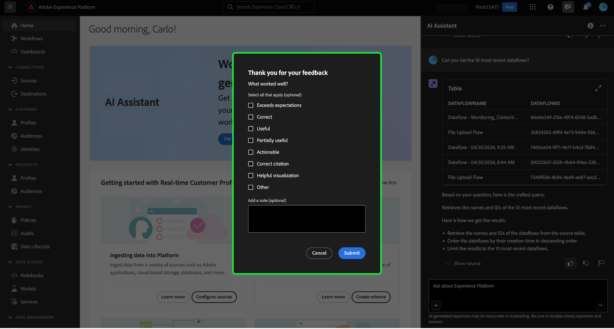

# Guía de IU del asistente de IA

Lea esta guía para aprender a utilizar el asistente de IA en la interfaz de usuario de Adobe Experience Platform.

## Acceso al Asistente de IA en la IU de Experience Platform

Para iniciar el Asistente de IA, seleccione el **[!UICONTROL icono del Asistente de IA]** en el encabezado superior de la interfaz de usuario de Experience Platform.

Aparecerá la interfaz del Asistente de IA, que le proporcionará inmediatamente información para empezar. Puede usar las opciones que se proporcionan en [!UICONTROL Ideas para empezar] a responder preguntas y comandos como:

* [!UICONTROL ¿Cuál de mis audiencias está activada?]
* [!UICONTROL ¿Qué es un esquema?]
* [!UICONTROL Dime algunos casos de uso comunes de Real-Time CDP]

## Guía de IU del asistente de IA

>[!NOTE]
>
>El siguiente flujo de trabajo es un ejemplo que utiliza el proceso de creación de esquemas de eventos de experiencia para ilustrar cómo puede utilizar el Asistente de IA al utilizar la interfaz de usuario de Experience Platform.

Considere un caso de uso en el que esté creando un **Esquema de comercio de dispositivos en evento**. Durante el proceso de creación del esquema del evento de experiencia, se encuentra con el campo `eventType`. &quot;En este punto, tiene la opción de salir del flujo de trabajo y consultar los [conceptos básicos de una composición de esquema](../xdm/schema/composition.md) documentación, o puede utilizar el Asistente de IA para recuperar respuestas a sus preguntas y encontrar recursos adicionales a través de los vínculos de documentación recomendados por el Asistente de IA&quot;.

Para empezar, escriba su pregunta en el cuadro de texto proporcionado. En el ejemplo siguiente, se proporciona el Asistente para IA con la pregunta: &quot;**¿Qué es el campo eventType en un esquema ExperienceEvent?**&quot;

A continuación, el asistente de IA consulta su base de conocimiento y calcula una respuesta. Después de unos momentos, el Asistente de IA devuelve una respuesta y sugerencias relacionadas que puede utilizar como preguntas de seguimiento.

Después de recibir una respuesta del Asistente de IA, puede seleccionar entre una serie de opciones para decidir cómo desea continuar.

### Funciones del asistente de IA {#features}

Esta sección describe las diferentes funciones del asistente de IA que puede utilizar durante los flujos de trabajo en Experience Platform.

### Ver objetos de datos operativos {#view-operational-data-objects}

Según la consulta, el asistente de IA proporciona información adicional perteneciente a los datos de la zona protegida. Para ver cómo se aplica la respuesta a su consulta a su zona protegida en particular, seleccione **[!UICONTROL En su zona protegida].**

Al ver datos pertenecientes a su zona protegida, el Asistente de IA puede proporcionar vínculos directos a páginas de interfaz de usuario específicas que muestran los datos consultados.

+++Seleccione para ver el ejemplo

En este ejemplo, el asistente de IA devuelve información adicional sobre los esquemas XDM existentes en la zona protegida, incluido su recuento total y los cinco campos más utilizados.

+++

### Ver citas {#view-citations}

Puede verificar las respuestas que le devuelve AI Assistant revisando las citas disponibles con cada respuesta de conocimiento del producto.

+++Seleccione esta opción para ver un ejemplo de cómo mostrar orígenes

Para ver las citas y validar la respuesta del asistente de inteligencia artificial, seleccione **[!UICONTROL Mostrar orígenes]**.

El asistente de IA actualiza la interfaz y le proporciona vínculos a documentación que corrobora la respuesta inicial. Además, cuando las citas están habilitadas, el Asistente de IA actualiza la respuesta para incluir notas al pie de página que indican las partes específicas de la respuesta que hacen referencia a la documentación proporcionada.

+++

### Datos operativos {#operational-insights}

Debe encontrarse en una zona protegida activa para que el asistente de IA responda suficientemente a una pregunta sobre sus perspectivas operativas.

+++Seleccione esta opción para ver un ejemplo de una pregunta de información operativa

En el ejemplo siguiente, se solicita al Asistente de IA la siguiente consulta: **&quot;Mostrar los flujos de datos creados con el origen de Amazon S3&quot;**.

A continuación, el asistente de IA responde con una tabla que enumera los flujos de datos y sus ID correspondientes. Seleccione el icono de descarga () para descargar la tabla como archivo CSV. Para ver toda la tabla, seleccione el icono de expansión ().

Aparece una vista expandida de la tabla, que le proporciona una lista más completa de flujos de datos basados en los parámetros de la consulta.

Cuando se le solicita una pregunta de perspectivas operativas, AI Assistant proporciona una explicación de cómo calculó la respuesta. En el ejemplo siguiente, el Asistente de IA describe los pasos que realizó para identificar los flujos de datos creados con el origen [!DNL Amazon S3].

También puede proporcionar filtros y modificaciones a las preguntas, y puede indicar al Asistente de inteligencia artificial que procese sus conclusiones en función de los filtros que incluya. Por ejemplo, puede pedir al Asistente de IA que le muestre una tendencia del recuento de definiciones de segmento en el orden de su fecha de creación, elimine definiciones de segmento con perfiles totales cero y utilice nombres de mes en lugar de enteros al mostrar los datos.

+++

### Verificar respuestas de perspectivas operativas {#verify-responses}

Puede verificar cada respuesta relacionada con las preguntas de información operativa mediante una consulta SQL que proporciona el Asistente de inteligencia artificial.

+++Selecciónelo para ver un ejemplo de verificación de las respuestas de perspectivas operativas

Después de recibir una respuesta para una pregunta de información operativa, seleccione **[!UICONTROL Mostrar orígenes]** y, a continuación, seleccione **[!UICONTROL Ver consulta de origen]**.

Cuando se consulta con una pregunta de información operativa, el Asistente de IA proporciona una consulta SQL que puede utilizar para verificar el proceso que llevó calcular su respuesta. Esta consulta de origen es solo para fines de verificación y no se admite en el servicio de consultas.

+++

### Usar autocompletar de entidad {#use-entity-auto-complete}

Puede utilizar la función de autocompletar para recibir una lista de los objetos de datos que existen en su zona protegida. Las recomendaciones de autocompletar están disponibles para los siguientes dominios: audiencias, esquemas, conjuntos de datos, recorridos, fuentes y destinos.

+++Seleccione esta opción para ver un ejemplo de autocompletado

Puede utilizar el completado automático incluyendo el símbolo más (**`+`**) en la consulta. Como alternativa, también puede seleccionar el signo más (**`+`**) situado en la parte inferior del cuadro de entrada de texto. Aparece una ventana con una lista de los objetos de datos recomendados de la zona protegida.

+++

### Uso de giro múltiple {#use-multi-turn}

Puede utilizar las capacidades de varias vueltas de AI Assistant para tener una conversación más natural durante su experiencia. El asistente de IA puede responder a las preguntas de seguimiento que se le formulen. ese contexto se puede inferir de una interacción anterior.

+++Seleccione esta opción para ver un ejemplo de varias vueltas

En el siguiente ejemplo, se solicita al asistente de IA primero el número total de flujos de datos y, a continuación, se le solicita que enumere los 10 flujos de datos más recientes.

+++

### Iniciar una nueva conversación

Puede cambiar los temas con el Asistente de IA restableciendo e iniciando una nueva conversación.

+++Seleccione esta opción para ver un ejemplo de cómo restablecer la conversación

Para restablecer, selecciona los puntos suspensivos (**`...`**) en la interfaz del Asistente de IA y, a continuación, selecciona **[!UICONTROL Iniciar nueva conversación]**. Esto informa al Asistente de IA de que tiene intención de cambiar los temas y puede resultar especialmente útil para solucionar problemas de consultas que dan error o hacen referencia a información incorrecta.

+++

### Uso de detectabilidad {#use-discoverability}

Puede utilizar la función de detección del asistente de IA para ver una lista de los temas generales, agrupados en entidades, que admite.

+++Seleccione esta opción para ver un ejemplo de la capacidad de detección

Para ver la detección, seleccione el icono de la bombilla en el encabezado superior de la interfaz del asistente de IA.

A continuación, seleccione una categoría y, a continuación, seleccione una solicitud de la lista proporcionada. Puede utilizar esta función para tener una mejor idea de los tipos de preguntas que AI Assistant puede responder. También puedes actualizar las indicaciones preexistentes con detalles específicos que pertenecen a tu zona protegida usando texto libre o [autocompletar](#use-auto-complete).

+++

### Usar pregunta autocompletada {#use-question-autocomplete}

Puede utilizar la función de autocompletar preguntas del asistente de IA para seleccionar una pregunta de una lista de recomendaciones de este asistente.

+++Seleccione esta opción para ver un ejemplo de pregunta autocompletada

Para ver el panel de preguntas sugeridas, escriba al menos siete (7) caracteres en el cuadro de entrada. A continuación, seleccione la pregunta que le interesa en el menú que aparece.

Es posible que tenga que actualizar los marcadores de posición en algunos casos en los que una pregunta sugerida implique perspectivas operativas. Por ejemplo, es posible que tenga que agregar el nombre específico de un conjunto de datos o una audiencia si la sugerencia del asistente de IA incluye marcadores de posición.

Los marcadores de posición se resaltan en azul. Seleccione el marcador de posición para empezar a actualizar su valor. Para obtener mejores resultados en los marcadores de posición numéricos, asegúrese de utilizar dígitos en lugar de texto. También puede utilizar la función de autocompletar entidad para actualizar los valores de marcador de posición. No puede enviar una pregunta con marcadores de posición sin rellenar.

**NOTA**: las sugerencias están habilitadas de manera predeterminada. Seleccione la opción **[!UICONTROL Sugerir ideas]** para deshabilitar la característica.

+++

### Usar sugerencias relacionadas {#use-related-suggestions}

Puede utilizar la sección de sugerencias relacionadas de cada respuesta del asistente de IA para continuar con la conversación.

+++Seleccione esta opción para ver un ejemplo de sugerencias relacionadas

Las sugerencias relacionadas se devuelven con cada respuesta del asistente de IA. Para continuar con la conversación, seleccione cualquiera de las sugerencias de la sección sugerencias relacionadas.

De forma similar a los marcadores de posición en el autocompletado de pregunta, deberá actualizar los marcadores de posición que se incluyen en las sugerencias relacionadas antes de poder enviar la consulta.

+++

## Proporcionar comentarios {#feedback}

Puede proporcionar comentarios sobre su experiencia con el asistente de IA mediante las opciones que se proporcionan con la respuesta.

Para proporcionar comentarios, seleccione los pulgares hacia arriba, hacia abajo o un indicador después de recibir una respuesta del asistente de IA y, a continuación, introduzca sus comentarios en el cuadro de texto proporcionado.

+++Seleccione para ver más ejemplos

>[!BEGINTABS]

>[!TAB Pulgares arriba]

Seleccione el icono de miniaturas hacia arriba para proporcionar comentarios sobre lo que ha salido bien con su experiencia con el asistente de IA.

>[!TAB Pulgares hacia abajo]

Seleccione el icono de pulgares hacia abajo para proporcionar comentarios sobre lo que se puede mejorar en función de su experiencia con el asistente de IA. Durante este paso, también puede proporcionar comentarios específicos sobre la experiencia. Los comentarios proporcionados en los comentarios se revisan diariamente.

>[!TAB Indicador]

Seleccione el icono de indicador para proporcionar más informes sobre su experiencia con el asistente de IA.

>[!ENDTABS]

+++
