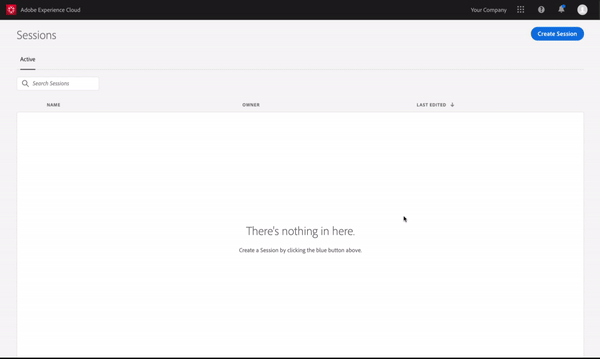

# Uso de Adobe Experience Platform Assurance

Este tutorial explica cómo utilizar Adobe Experience Platform Assurance. Para obtener instrucciones sobre cómo instalar e implementar la extensión de Adobe Experience Platform Assurance, lea el tutorial sobre [implementación de la extensión de Assurance](./implement-assurance.md).

## Crear sesiones

Después de iniciar sesión en [Interfaz de usuario de Assurance](https://experience.adobe.com/assurance), puede seleccionar **[!UICONTROL Crear sesión]** para empezar a crear una sesión.

La variable **[!UICONTROL Crear nueva sesión]** se abre. Revise las instrucciones dadas y siga seleccionando **[!UICONTROL Inicio]**.

Ahora puede introducir un nombre para identificar la sesión y, a continuación, proporcionar un **[!UICONTROL Dirección URL base]** (URL de vinculación profunda para la aplicación). Después de proporcionar estos detalles, seleccione **[!UICONTROL Siguiente]**.

>[!INFO]
>
>La URL base es la definición raíz que se utiliza para iniciar la aplicación desde una URL. Se genera una dirección URL de sesión mediante la cual puede iniciar la sesión de seguridad. Un valor de ejemplo puede tener el siguiente aspecto: `myapp://default` En el **[!UICONTROL Dirección URL base]** , escriba la definición de vínculo profundo base de la aplicación.

## Conectarse a una sesión

Después de crear una sesión, asegúrese de que ve la variable **[!UICONTROL Crear nueva sesión]** ahora le muestra un vínculo, un código QR y un PIN.

Si aparece este cuadro de diálogo, puede utilizar la aplicación de cámara del dispositivo para analizar el código QR y abrir la aplicación, o bien copiar el vínculo y abrirlo en la aplicación. Cuando la aplicación se inicie, debería ver superpuesta la pantalla de entrada del PIN. Escriba el PIN del paso anterior y pulse **[!UICONTROL Connect]**.

Puede comprobar que la aplicación está conectada a Assurance cuando el icono de Adobe Experience Platform (Adobe rojo &quot;A&quot;) se muestra en la aplicación.

## Exportación de una sesión

Para exportar una sesión de Assurance, en la página de detalles de las sesiones de la aplicación, seleccione **[!UICONTROL Exportar a JSON]** en una sesión:

La opción de exportación respeta los resultados del filtro de búsqueda y solo exporta los eventos mostrados en la vista de evento. Por ejemplo, si busca eventos de &quot;seguimiento&quot; y luego selecciona **[!UICONTROL Exportar a JSON]**, solo se exportan los resultados del evento &quot;track&quot; .
