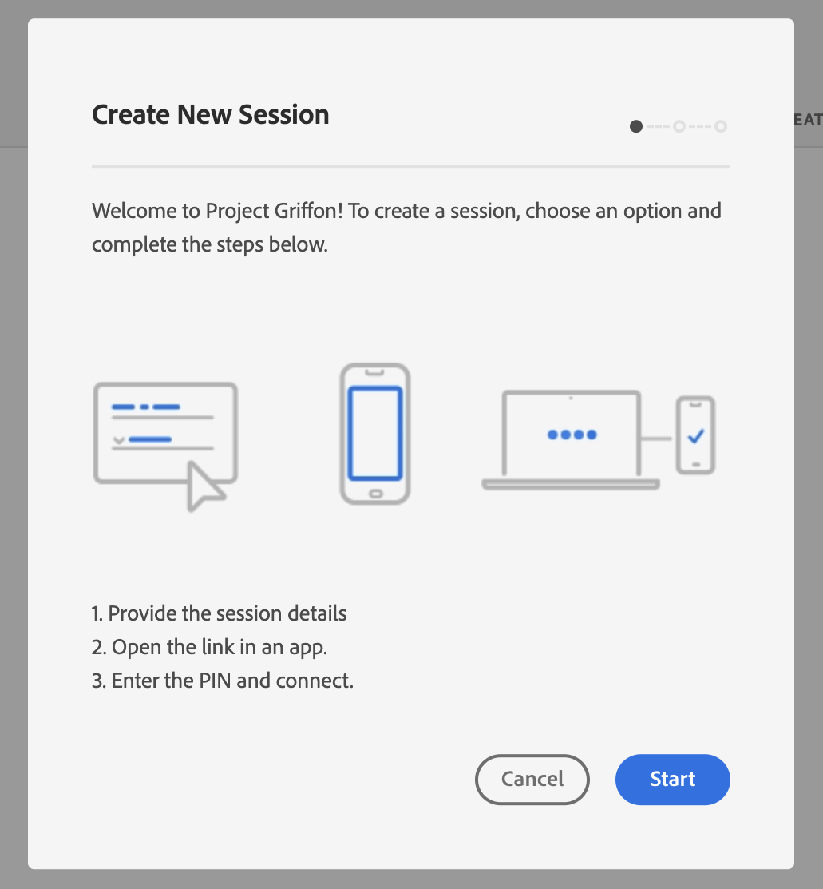

# Uso de Adobe Experience Platform Assurance

En este tutorial se explica cómo utilizar Adobe Experience Platform Assurance. Para obtener instrucciones sobre cómo instalar e implementar la extensión de Adobe Experience Platform Assurance, lea el tutorial sobre la [implementación de la extensión Assurance](./implement-assurance.md).

## Creación de sesiones

Después de iniciar sesión en la [IU de Assurance](https://experience.adobe.com/assurance), puede seleccionar **[!UICONTROL Crear sesión]** para empezar a crear una sesión.

Aparece el cuadro de diálogo **[!UICONTROL Crear nueva sesión]**. Revise las instrucciones dadas y proceda a seleccionar **[!UICONTROL Iniciar]**.

Ahora puede escribir un nombre para identificar la sesión y, a continuación, proporcionar una **[!UICONTROL URL básica]** (URL de vinculación profunda para la aplicación). Después de proporcionar estos detalles, seleccione **[!UICONTROL Siguiente]**.

>[!INFO]
>
>La URL base es la definición raíz utilizada para iniciar la aplicación desde una URL. Se genera una URL de sesión mediante la cual puede iniciar la sesión de Assurance. Un valor de ejemplo podría tener el siguiente aspecto: `myapp://default` en el campo **[!UICONTROL URL básica]**, escriba la definición de vínculo profundo base de su aplicación.

## Conexión a una sesión

Después de crear una sesión, asegúrese de ver que el cuadro de diálogo **[!UICONTROL Crear nueva sesión]** ahora le muestra un vínculo, un código QR y un PIN.

Si aparece este cuadro de diálogo, puede utilizar la aplicación de la cámara del dispositivo para escanear el código QR y abrir la aplicación, o bien copiar el vínculo y abrirlo en la aplicación. Cuando se inicie la aplicación, debería ver superpuesta la pantalla de introducción del PIN. Escriba el PIN del paso anterior y pulse **[!UICONTROL Conectar]**.

Puede comprobar que la aplicación está conectada a Assurance cuando se muestra el icono Adobe Experience Platform (Adobe rojo “A”) en la aplicación.

## Exportación de una sesión

Para exportar una sesión de Assurance, en la página de detalles de las sesiones de la aplicación, seleccione **[!UICONTROL Exportar a JSON]** en una sesión.

La opción de exportación respeta los resultados del filtro de búsqueda y solo exporta los eventos mostrados en la vista de eventos. Por ejemplo, si ha buscado eventos de “seguimiento” y, a continuación, selecciona **[!UICONTROL Exportar a JSON]**, solo se exportan los resultados del evento “seguimiento”.
