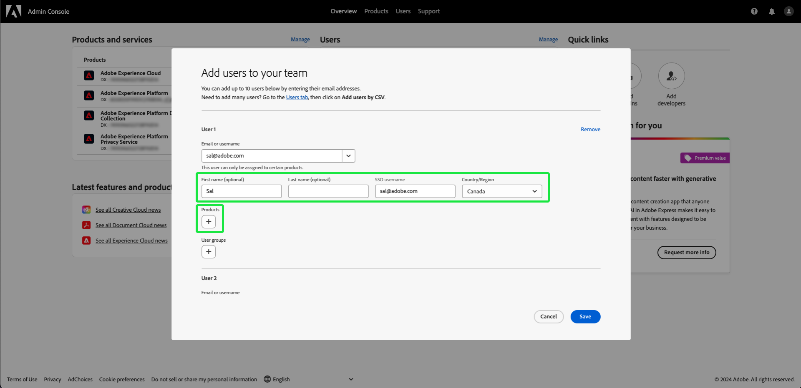
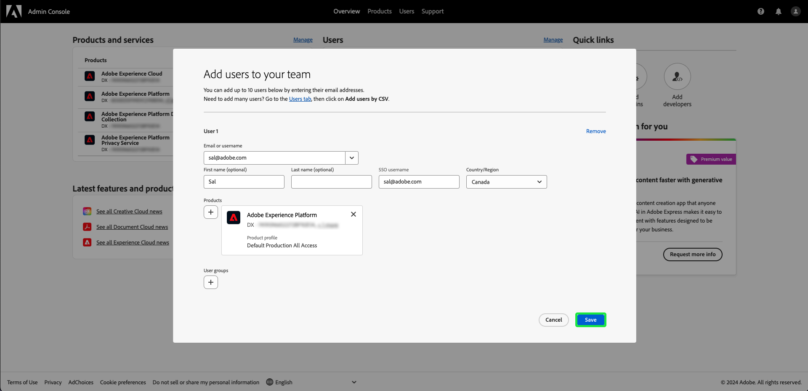

# Acceso de usuario

Dé a los usuarios acceso a [!UICONTROL Assurance] agregándolos a cualquier perfil de producto en Adobe Experience Platform al completar los siguientes pasos en [Adobe Admin Console](https://adminconsole.adobe.com/):

## Adición de usuarios a Adobe Experience Platform mediante un perfil de producto {#adding-product-profile}

Para agregar un usuario a un perfil de producto, inicia sesión en [Adobe Admin Console](https://adminconsole.adobe.com/). En la ficha **[!UICONTROL Información general]** de la interfaz de usuario del Admin Console, seleccione **[!UICONTROL Agregar usuarios]**.

Aparece el cuadro de diálogo **[!UICONTROL Añadir usuarios a su equipo]**. Escriba el correo electrónico o el nombre de usuario de la persona que desea agregar y, a continuación, seleccione **[!UICONTROL Agregar como nuevo usuario]**.

Aparecen dos cuadros de texto para escribir **[!UICONTROL Nombre]** y **[!UICONTROL Apellidos]** opcionales. El **[!UICONTROL nombre de usuario de SSO]** se rellena automáticamente, junto con el **[!UICONTROL País]** dentro del menú desplegable. Asegúrese de que ambas opciones sean correctas y realice los ajustes necesarios. Cuando todo esté correcto, seleccione **[!UICONTROL Productos]**.

Aparecerá el cuadro de diálogo **[!UICONTROL Seleccionar producto]**. Seleccione Adobe Experience Platform.

Aparecerá el cuadro de diálogo **[!UICONTROL Seleccionar perfiles de producto]**, con una lista de perfiles de producto. Seleccione cualquier perfil de producto y después seleccione **[!UICONTROL Aplicar]**. Puede añadir productos y perfiles de producto adicionales repitiendo estos pasos.

Compruebe que todo es correcto para el usuario. Desde aquí puede agregar usuarios adicionales o guardar los cambios seleccionando **[!UICONTROL Guardar]**.

