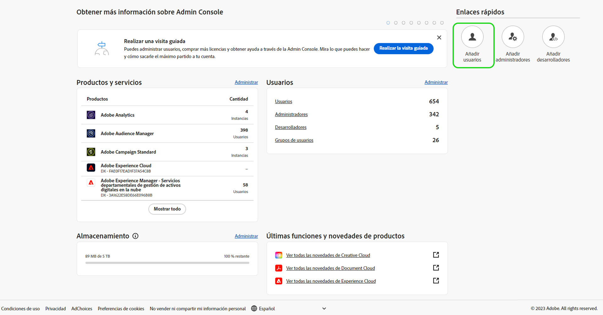
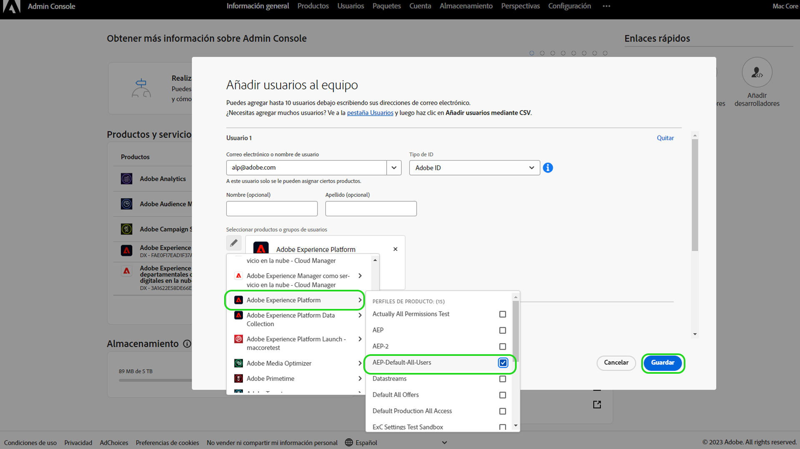

# Acceso de usuario

>[!WARNING]
>
>Tenga en cuenta que el acceso de usuario a Assurance está cambiando. Como Assurance deja la versión beta (Proyecto Griffon) para estar disponible de forma general (como Assurance) para todos los clientes de Adobe Experience Cloud, el acceso a Assurance se gestionará a través de [Admin Console](https://helpx.adobe.com/es/enterprise/using/admin-console.html).
>
>Si necesita ayuda, póngase en contacto con el administrador de Adobe Experience Cloud de su empresa.

Para recibir o mantener el acceso ininterrumpido a Assurance, asegúrese de completar los siguientes pasos en Admin Console:

## Adición de usuarios a Experience Platform mediante un perfil de producto

Para añadir un usuario a un perfil de producto, inicie sesión en Admin Console y seleccione **Agregar usuarios**.

Aparece el cuadro de diálogo **Añadir usuarios a su equipo**. En este cuadro de diálogo, puede introducir los detalles del usuario que desea agregar. Introduzca la dirección de correo electrónico, el nombre (opcional) y los apellidos (opcional) del usuario.

Seleccione el icono de lápiz para elegir los productos y los grupos de usuarios. Desde aquí, seleccione **Adobe Experience Platform**, después **AEP-Default-All-Users**, y a continuación **Guardar**.

