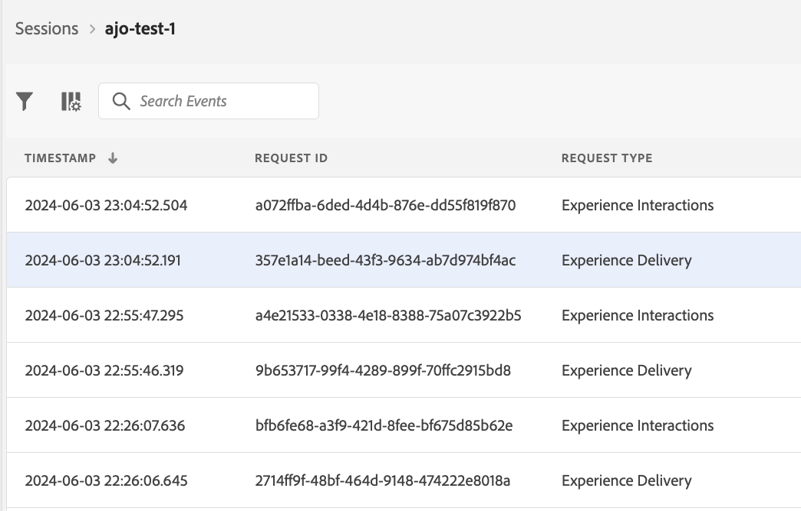

# Vista de Edge Delivery en Assurance

La vista de **[!UICONTROL Edge Delivery]** dentro de **[!UICONTROL Adobe Experience Platform Assurance]** ofrece la capacidad de inspeccionar y validar la entrega perimetral de mensajes de [!UICONTROL AJO Inbound] a sus aplicaciones web y móviles. Esta vista es especialmente útil para solucionar problemas con la entrega de [!UICONTROL AJO Inbound] campañas y recorridos móviles y web.

## Introducción

Antes de continuar, asegúrese de que tiene acceso a los siguientes servicios:

- El [IU de recopilación de datos de Adobe Experience Platform](https://experience.adobe.com/#/data-collection/)
- [Adobe Experience Platform Assurance](https://experience.adobe.com/assurance)

Para saber cómo instalar **[!UICONTROL Assurance]** en su aplicación, lea la [guía de implementación de Assurance](../tutorials/implement-assurance.md).

## Use Assurance con Edge Delivery

Una vez que abras una sesión de **[!UICONTROL Assurance]**, puedes agregar la vista de **[!UICONTROL Edge Delivery]** a **[!UICONTROL Assurance]**. En la parte inferior del panel izquierdo, selecciona **[!UICONTROL Configurar]** para agregar la vista de **[!UICONTROL Edge Delivery]** y **guardarla**.

Una vez agregado, seleccione la vista **[!UICONTROL Edge Delivery]** en la sección **[!UICONTROL Adobe Journey Optimizer]** para validar la entrega perimetral entrante.

## Lista de solicitudes

En el panel principal de la vista, se muestra la lista de solicitudes de entrega perimetral. Esta lista muestra todas las [!UICONTROL solicitudes de AJO de entrada] realizadas a Experience Edge y procesadas por el **[!UICONTROL servicio de entrega de entrada]**, incluidas las solicitudes para recuperar decisiones de personalización, así como las solicitudes de seguimiento de interacciones de propuestas de personalización (como mostrar, hacer clic, déclencheur o descartar).

Las solicitudes se ordenan por marca de tiempo, con las solicitudes más recientes en la parte superior. Además de la marca de tiempo, la lista también incluye una columna ID de solicitud, así como un Tipo de solicitud, que puede ser uno de los siguientes:

- **[!UICONTROL Envío de experiencias]**: una solicitud para recuperar decisiones de personalización
- **[!UICONTROL Interacciones de experiencia]**: una solicitud para rastrear interacciones de propuestas de personalización
- **[!UICONTROL Entrega de experiencias e interacciones]**: una solicitud para recuperar decisiones de personalización que también incluyen interacciones de propuestas de personalización
- **[!UICONTROL Vista previa de envío]**: una solicitud para recuperar las decisiones de personalización de Vista previa

Las solicitudes también se pueden filtrar introduciendo un término de búsqueda en la barra de búsqueda de la parte superior de la lista. Esto resulta útil a la hora de filtrar por valores específicos, como ID.

## Vistas de solicitud detalladas

Una vez seleccionada una solicitud en la vista principal, a la derecha se muestra información detallada sobre la solicitud seleccionada. Esta vista incluye las siguientes secciones:

### Resumen de solicitudes

Esta sección proporciona información general de alto nivel sobre la solicitud seleccionada, incluidos [!UICONTROL ID de organización], [!UICONTROL clúster de Edge], [!UICONTROL ID de solicitud] y [!UICONTROL tipo de solicitud], [!UICONTROL ID de espacio aislado], [!UICONTROL nombre de espacio aislado], [!UICONTROL ID de flujo de datos], así como la lista de superficies de solicitud en caso de [!UICONTROL solicitudes de envío de experiencia].

### Perfil

Esta sección proporciona información sobre los datos de perfil utilizados al procesar la solicitud, incluido el mapa de identidad, la pertenencia a segmentos y la configuración de consentimiento.\
La sección [!UICONTROL Perfil] es muy útil cuando se solucionan problemas como que la entrega no funciona como se esperaba debido a que falta o se retrasó la membresía del segmento o la configuración del consentimiento de exclusión.

### Actividades calificadas

En esta sección se proporciona una lista de las actividades cualificadas para la solicitud seleccionada, incluido el tipo de actividad, los ID, el área de nombres de identidad, las superficies, la programación y las audiencias. Encontrará información más detallada sobre la actividad en la [sección de seguimiento de ejecución sin procesar](#execution).

### Actividades no calificadas

Esta sección proporciona una lista de las actividades que se excluyeron de la calificación. Además del tipo de actividad, los ID, las áreas de nombres de identidad, las superficies, las programaciones y las audiencias, esta sección también incluye una lista de motivos por los que la actividad no estaba cualificada.

### Detalles del mensaje

Esta sección proporciona información detallada sobre los mensajes enviados para la solicitud seleccionada. Incluye ID de mensaje, fragmentos, directivas de decisión, parámetros [!UICONTROL Offer decisioning] y el contexto de selección de mensajes.

### Interacciones

Esta sección proporciona información detallada sobre las interacciones de las que se ha realizado un seguimiento en la solicitud seleccionada. Incluye el tipo de interacción (en `propositionEventType`), así como metadatos de propuesta asociados, como metadatos de actividad (en `scopeDetails.activity`) y token de evento de propuesta (en `scopeDetails.characteristics.eventToken`).

### Rastros sin procesar

Esta sección proporciona los seguimientos sin procesar de la solicitud seleccionada. Incluye el seguimiento completo de la solicitud, incluida la solicitud real tal como se recibió en **[!UICONTROL Servicio de entrega entrante]**, el seguimiento de la ejecución y el seguimiento de la respuesta. Esto resulta útil para la resolución de problemas avanzada, como que la entrega no funciona según lo esperado debido a la indisponibilidad del servicio de entrega, la falta de datos o datos incorrectos, o para comprender el flujo completo del procesamiento de solicitudes.

#### Solicitud

El seguimiento de la solicitud incluye la solicitud completa tal como la recibió el **[!UICONTROL servicio de entrega entrante]** **[!UICONTROL Konductor]** de subida. Incluye los encabezados de solicitud, el cuerpo y otros metadatos. Por ejemplo, la carga útil XDM de la solicitud se puede inspeccionar en el campo `event.body.xdm`.

#### Ejecución

El seguimiento de ejecución incluye el seguimiento completo de la solicitud tal como la procesó el **[!UICONTROL servicio de envío entrante]**. Muestra el contexto de ejecución, la calificación de la actividad, la selección del mensaje y otros pasos de procesamiento. Cualquier error o advertencia que se haya producido durante el procesamiento de la solicitud se puede encontrar en los campos `context.messages` y `context.exceptions`. Encontrará información detallada sobre la calificación de actividades en los campos `context.qualifiedActivitiesDetailed` y `context.unqualifiedActivitiesDetailed`.

#### Respuesta

El seguimiento de la respuesta incluye la respuesta completa, ya que **[!UICONTROL Servicio de entrega entrante]** la devolvió a **[!UICONTROL Konductor]**. Incluye los encabezados de respuesta, el cuerpo y otros metadatos. El cuerpo de respuesta completo se puede inspeccionar copiando el mensaje con el ID `1` en el portapapeles con el botón **[!UICONTROL Copiar valor]** y pegándolo en un visor JSON.

