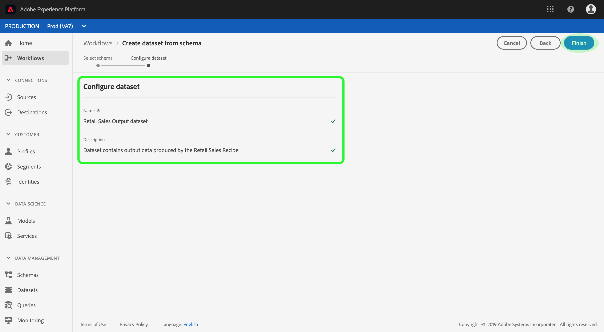
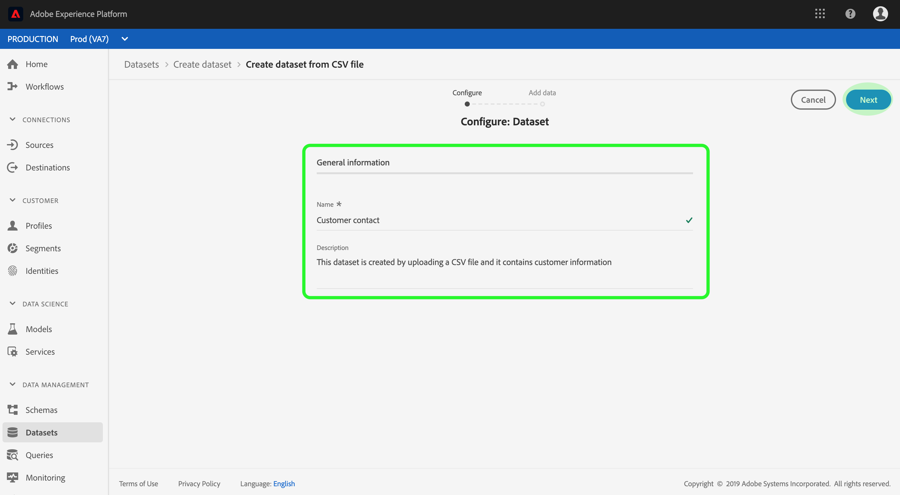

# Guía de la interfaz de usuario de conjuntos de datos

Esta guía del usuario proporciona instrucciones sobre cómo realizar acciones comunes al trabajar con conjuntos de datos en la interfaz de usuario de Adobe Experience Platform.

## Primeros pasos

Esta guía del usuario requiere una comprensión práctica de los siguientes componentes de Adobe Experience Platform:

* [Conjuntos](overview.md) de datos: La construcción de almacenamiento y administración para la persistencia de datos en  [!DNL Experience Platform].
* [[!DNL Experience Data Model (XDM) System]](../../xdm/home.md):: Marco normalizado por el cual se  [!DNL Experience Platform] organizan los datos de experiencia del cliente.
   * [Conceptos básicos de la composición](../../xdm/schema/composition.md) de esquemas: Obtenga información sobre los componentes básicos de los esquemas XDM, incluidos los principios clave y las prácticas recomendadas en la composición de esquemas.
   * [Editor](../../xdm/tutorials/create-schema-ui.md) de esquemas: Aprenda a crear sus propios esquemas XDM personalizados mediante la  [!DNL Schema Editor] interfaz de  [!DNL Platform] usuario.
* [[!DNL Real-time Customer Profile]](../../profile/home.md):: Proporciona un perfil de consumo unificado y en tiempo real basado en datos agregados de varias fuentes.
* [[!DNL Adobe Experience Platform Data Governance]](../../data-governance/home.md):: Garantizar el cumplimiento de las regulaciones, restricciones y políticas relativas al uso de los datos del cliente.

## datasets de vista

En la interfaz de usuario [!DNL Experience Platform], haga clic en **[!UICONTROL Conjuntos de datos]** en el panel de navegación izquierdo para abrir el panel **[!UICONTROL Conjuntos de datos]**. El panel lista todos los conjuntos de datos disponibles para su organización. Se muestran detalles de cada conjunto de datos de la lista, incluido su nombre, el esquema al que se adhiere el conjunto de datos y el estado de la ejecución de la ingestión más reciente.

Haga clic en el nombre de un conjunto de datos para acceder a su pantalla **[!UICONTROL actividad de conjunto de datos]** y ver los detalles del conjunto de datos seleccionado. La ficha actividad incluye un gráfico que visualiza la tasa de mensajes que se consumen, así como una lista de lotes exitosos y fallidos.

## Previsualización de un conjunto de datos

En la pantalla **[!UICONTROL actividad del conjunto de datos]**, haga clic en **[!UICONTROL Conjunto de datos de Previsualización]** cerca de la esquina superior derecha de la pantalla para previsualización de hasta 100 filas de datos. Si el conjunto de datos está vacío, el vínculo de previsualización se desactivará y en su lugar dirá que la previsualización no está disponible.

En la ventana previsualización, la vista jerárquica del esquema para el conjunto de datos se muestra a la derecha.

Para obtener métodos más sólidos para acceder a sus datos, [!DNL Experience Platform] proporciona servicios de flujo descendente como [!DNL Query Service] y [!DNL JupyterLab] para explorar y analizar los datos. Consulte los siguientes documentos para obtener más información:

* [Visión general del servicio de consulta](../../query-service/home.md)
* [Guía del usuario de JupyterLab](../../data-science-workspace/jupyterlab/overview.md)

## Crear un conjunto de datos {#create}

Para crear un nuevo conjunto de datos, haga clic en el inicio **[!UICONTROL Crear conjunto de datos]** en el panel **[!UICONTROL Datasets]**.

En la pantalla siguiente, se muestran las dos opciones siguientes para crear un nuevo conjunto de datos:

* [Crear conjunto de datos a partir de esquema](#schema)
* [Crear conjunto de datos a partir de un archivo CSV](#csv)

### Crear un conjunto de datos con un esquema existente {#schema}

En la pantalla **[!UICONTROL Crear conjunto de datos]**, haga clic en **[!UICONTROL Crear conjunto de datos a partir de esquema]** para crear un nuevo conjunto de datos vacío.

Aparece el paso **[!UICONTROL Seleccionar esquema]**. Explore la lista de esquemas y seleccione el esquema al que se adherirá el conjunto de datos antes de hacer clic en **[!UICONTROL Siguiente]**.

Aparece el paso **[!UICONTROL Configurar conjunto de datos]**. Proporcione el conjunto de datos con un nombre y una descripción opcional, luego haga clic en **[!UICONTROL Finalizar]** para crear el conjunto de datos.

### Crear un conjunto de datos con un archivo CSV {#csv}

Cuando se crea un conjunto de datos con un archivo CSV, se crea un esquema ad hoc para proporcionar al conjunto de datos una estructura que coincida con el archivo CSV proporcionado. En la pantalla **[!UICONTROL Crear conjunto de datos]**, haga clic en el cuadro que indica **[!UICONTROL Crear conjunto de datos a partir del archivo CSV]**.

Aparece el paso **[!UICONTROL Configurar]**. Proporcione el conjunto de datos con un nombre y una descripción opcional y, a continuación, haga clic en **[!UICONTROL Siguiente]**.

Aparece el paso **[!UICONTROL Añadir datos]**. Cargue el archivo CSV arrastrándolo y soltándolo en el centro de la pantalla o haga clic en **[!UICONTROL Examinar]** para explorar el directorio de archivos. El archivo puede tener un tamaño de hasta diez gigabytes. Una vez cargado el archivo CSV, haga clic en **[!UICONTROL Guardar]** para crear el conjunto de datos.

>[!NOTE]
>
>Los nombres de columna CSV deben tener inicios con caracteres alfanuméricos y solo pueden contener letras, números y subrayados.

## Habilitar un conjunto de datos para el Perfil del cliente en tiempo real

Cada conjunto de datos tiene la capacidad de enriquecer los perfiles de los clientes con sus datos ingestados. Para ello, el esquema al que se adhiere el conjunto de datos debe ser compatible para su uso en [!DNL Real-time Customer Profile]. Un esquema compatible cumple los siguientes requisitos:

* El esquema tiene al menos un atributo especificado como propiedad de identidad.
* El esquema tiene una propiedad de identidad definida como la identidad principal.

Para obtener más información sobre cómo habilitar un esquema para [!DNL Profile], consulte la [guía del usuario del Editor de Esquemas](../../xdm/tutorials/create-schema-ui.md).

Para habilitar un conjunto de datos para Perfil, acceda a su pantalla **[!UICONTROL actividad de conjunto de datos]** y haga clic en el conmutador **[!UICONTROL Perfil]** dentro de la columna **[!UICONTROL Propiedades]**. Una vez habilitados, los datos que se ingieren en el conjunto de datos también se utilizarán para rellenar los perfiles de los clientes.

>[!NOTE]
>
>Si un conjunto de datos ya contiene datos y luego se habilita para [!DNL Profile], [!DNL Profile] no consumirá automáticamente los datos existentes. Después de habilitar un conjunto de datos para [!DNL Profile], se recomienda volver a ingerir los datos existentes para que contribuyan a los perfiles de los clientes.

## Administrar y aplicar la administración de datos en un conjunto de datos

Las etiquetas de uso de datos le permiten categorizar conjuntos de datos y campos según las políticas de uso que se aplican a esos datos. Consulte la [información general sobre la administración de datos](../../data-governance/home.md) para obtener más información sobre las etiquetas o consulte la [guía del usuario de etiquetas de uso de datos](../../data-governance/labels/overview.md) para obtener instrucciones sobre cómo aplicar etiquetas a conjuntos de datos.

## Eliminar un conjunto de datos

Puede eliminar un conjunto de datos accediendo primero a su pantalla **[!UICONTROL actividad de conjunto de datos]**. A continuación, haga clic en **[!UICONTROL Eliminar conjunto de datos]** para eliminarlo.

>[!NOTE]
>
>Los conjuntos de datos creados y utilizados por aplicaciones y servicios de Adobe (como Adobe Analytics, Adobe Audience Manager o [!DNL Offer Decisioning]) no se pueden eliminar.

Aparece un cuadro de confirmación. Haga clic en **[!UICONTROL Eliminar]** para confirmar la eliminación del conjunto de datos.

## Eliminar un conjunto de datos habilitado para Perfil

Si se habilita un conjunto de datos para [!DNL Profile], al eliminar dicho conjunto de datos a través de la interfaz de usuario, éste se eliminará del Data Lake y del almacén de Perfiles dentro de la plataforma.

Puede eliminar un conjunto de datos del almacén [!DNL Profile] únicamente (dejando los datos en el lago de datos) mediante la API de Perfil del cliente en tiempo real. Para obtener más información, consulte la [guía de extremo de la API de trabajos del sistema de perfil](../../profile/api/profile-system-jobs.md).

## Monitoreo de la ingesta de datos

En la interfaz de usuario [!DNL Experience Platform], haga clic en **[!UICONTROL Monitoreo]** en el panel de navegación izquierdo. El panel **[!UICONTROL Monitoreo]** le permite vista de los estados de los datos de entrada desde la ingestión por lotes o por flujo continuo. Para realizar la vista de los estados de lotes individuales, haga clic en **[!UICONTROL Lote de extremo a extremo]** o **[!UICONTROL Flujo de extremo a extremo]**. Los paneles listas todas las ejecuciones de ingestión por lotes o de flujo continuo, incluidas las que se hayan realizado correctamente, hayan fallado o estén en curso. Cada listado proporciona detalles del lote, incluyendo el ID del lote, el nombre del conjunto de datos del destinatario y el número de registros ingestados. Si el conjunto de datos de destinatario está habilitado para [!DNL Profile], también se muestra el número de registros de identidad y perfil ingestados.

Puede hacer clic en un **[!UICONTROL Id. de lote]** individual para acceder al panel **[!UICONTROL Visión general de lote]** y ver los detalles del lote, incluidos los registros de errores en caso de que el lote no se ingeste.

Si desea eliminar el lote, puede hacerlo haciendo clic en **[!UICONTROL Eliminar lote]** encontrado cerca de la parte superior derecha del panel. Al hacerlo, también se eliminarán los registros del conjunto de datos al que se ingerió originalmente el lote.

## Pasos siguientes

Esta guía del usuario proporciona instrucciones para realizar acciones comunes al trabajar con conjuntos de datos en la interfaz de usuario [!DNL Experience Platform]. Para ver los pasos para realizar flujos de trabajo [!DNL Platform] comunes que involucran conjuntos de datos, consulte los siguientes tutoriales:

* [Creación de un conjunto de datos mediante API](create.md)
* [Datos del conjunto de datos de consulta mediante la API de acceso a datos](../../data-access/home.md)
* [Configurar un conjunto de datos para el Perfil de clientes en tiempo real y el servicio de identidad mediante API](../../profile/tutorials/dataset-configuration.md)