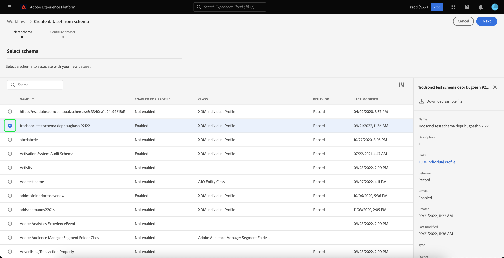

# Guía de IU de conjuntos de datos

Esta guía del usuario proporciona instrucciones sobre cómo realizar acciones comunes al trabajar con conjuntos de datos en la interfaz de usuario de Adobe Experience Platform.

## Introducción

Esta guía del usuario requiere una comprensión práctica de los siguientes componentes de Adobe Experience Platform:

* [Conjuntos de datos](overview.md): La construcción de almacenamiento y administración para la persistencia de datos en [!DNL Experience Platform].
* [[!DNL Experience Data Model (XDM) System]](../../xdm/home.md): El marco estandarizado mediante el cual [!DNL Experience Platform] organiza los datos de experiencia del cliente.
   * [Aspectos básicos de la composición de esquemas](../../xdm/schema/composition.md): obtenga información sobre los componentes básicos de los esquemas XDM, incluidos los principios clave y las prácticas recomendadas en la composición de esquemas.
   * [Editor de esquemas](../../xdm/tutorials/create-schema-ui.md): Aprenda a crear sus propios esquemas XDM personalizados con [!DNL Schema Editor] en la interfaz de usuario de [!DNL Platform].
* [[!DNL Real-Time Customer Profile]](../../profile/home.md): proporciona un perfil de consumidor unificado y en tiempo real basado en los datos agregados de varias fuentes.
* [[!DNL Adobe Experience Platform Data Governance]](../../data-governance/home.md): garantice el cumplimiento de las regulaciones, restricciones y políticas con respecto al uso de los datos del cliente.

## Ver conjuntos de datos {#view-datasets}

>[!CONTEXTUALHELP]
>id="platform_datasets_negative_numbers"
>title="Números negativos en la actividad del conjunto de datos"
>abstract="Los números negativos de los registros ingeridos implican que un usuario ha eliminado determinados lotes en un intervalo de tiempo seleccionado."
>text="Learn more in documentation"

>[!CONTEXTUALHELP]
>id="platform_datasets_browse_daysRemaining"
>title="Caducidad del conjunto de datos"
>abstract="Esta columna indica el número de días que le quedan al conjunto de datos de destinatario antes de que caduque automáticamente."

>[!CONTEXTUALHELP]
>id="platform_datasets_browse_datalakeretention"
>title="Retención de Datalake"
>abstract="Muestra la política de retención actual para cada conjunto de datos. Este valor se puede modificar en la configuración de retención de cada conjunto de datos. Solo puede establecer el tiempo de retención del conjunto de datos de ExperienceEvent."

>[!CONTEXTUALHELP]
>id="platform_datasets_browse_profileretention"
>title="Retención de perfiles"
>abstract="Muestra la política de retención actual para cada conjunto de datos. Este valor se puede modificar en la configuración de retención de cada conjunto de datos. Solo puede establecer el tiempo de retención de un conjunto de datos de ExperienceEvent."

>[!CONTEXTUALHELP]
>id="platform_datasets_datalakesettings_datasetretention"
>title="Retención de conjuntos de datos"
>abstract="La retención de Datalake establece reglas sobre cuánto tiempo se almacenan los datos y cuándo se deben eliminar en diferentes servicios. Esto garantiza el cumplimiento de las regulaciones, la administración de los costes de almacenamiento y el mantenimiento de la calidad de los datos."

En la interfaz de usuario [!DNL Experience Platform], seleccione **[!UICONTROL Conjuntos de datos]** en el panel de navegación izquierdo para abrir el panel **[!UICONTROL Conjuntos de datos]**. El panel enumera todos los conjuntos de datos disponibles para su organización. Se muestran los detalles de cada conjunto de datos enumerado, incluido su nombre, el esquema al que se adhiere el conjunto de datos y el estado de la ejecución de ingesta más reciente.

Seleccione el nombre de un conjunto de datos en la ficha [!UICONTROL Examinar] para acceder a su pantalla **[!UICONTROL Actividad del conjunto de datos]** y ver los detalles del conjunto de datos que seleccionó. La pestaña actividad incluye un gráfico que visualiza la tasa de consumo de los mensajes, así como una lista de lotes correctos y fallidos.

## Más acciones {#more-actions}

Puede [!UICONTROL Eliminar] o [!UICONTROL Habilitar un conjunto de datos para el perfil] desde la vista de detalles de [!UICONTROL Conjunto de datos]. Para ver las acciones disponibles, seleccione **[!UICONTROL ... Más]** en la parte superior derecha de la interfaz de usuario. Aparecerá el menú desplegable.

![Espacio de trabajo de conjuntos de datos con [!UICONTROL ... Se resaltó el menú desplegable Más].](../images/datasets/user-guide/more-actions.png)

Si selecciona **[!UICONTROL Habilitar un conjunto de datos para el perfil]**, aparecerá un cuadro de diálogo de confirmación. Seleccione **[!UICONTROL Habilitar]** para confirmar su elección.

>[!NOTE]
>
>Para habilitar un conjunto de datos para el perfil, el esquema al que se adhiere el conjunto de datos debe ser compatible para su uso en el perfil del cliente en tiempo real. Consulte la sección [Habilitar un conjunto de datos para el perfil](#enable-profile) para obtener más información.

Si selecciona **[!UICONTROL Eliminar]**, aparecerá el cuadro de diálogo de confirmación [!UICONTROL Eliminar conjunto de datos]. Seleccione **[!UICONTROL Eliminar]** para confirmar su elección.

>[!NOTE]
>
>No puede eliminar conjuntos de datos del sistema.

También puede eliminar un conjunto de datos o agregar uno para utilizarlo con el Perfil del cliente en tiempo real desde las acciones en línea que se encuentran en la pestaña [!UICONTROL Examinar]. Consulte la [sección de acciones en línea](#inline-actions) para obtener más información.

## Acciones de conjuntos de datos en línea {#inline-actions}

La IU de conjuntos de datos ahora ofrece colecciones de acciones en línea para cada conjunto de datos disponible. Seleccione los puntos suspensivos (...) de un conjunto de datos que desee administrar para ver las opciones disponibles en un menú emergente. Las acciones disponibles incluyen:

* [[!UICONTROL Previsualizar conjunto de datos]](#preview),
* [[!UICONTROL Administrar datos y etiquetas de acceso]](#manage-and-enforce-data-governance)
* [[!UICONTROL Habilitar perfil unificado]](#enable-profile)
* [[!UICONTROL Administrar etiquetas]](#manage-tags)
* [[!UICONTROL Mover a carpetas]](#move-to-folders)
* [[!UICONTROL Eliminar]](#delete).

Puede encontrar más información sobre estas acciones disponibles en sus secciones respectivas. Para aprender a administrar grandes cantidades de conjuntos de datos simultáneamente, consulte la sección [acciones masivas](#bulk-actions).

### Previsualización de un conjunto de datos {#preview}

Puede obtener una vista previa de los datos de ejemplo del conjunto de datos desde las opciones en línea de la pestaña [!UICONTROL Examinar] y también desde la vista [!UICONTROL Actividad del conjunto de datos]. En la ficha [!UICONTROL Examinar], seleccione los puntos suspensivos (...) junto al nombre del conjunto de datos que desee previsualizar. Aparecerá una lista de opciones de menú. A continuación, seleccione **[!UICONTROL Vista previa del conjunto de datos]** de la lista de opciones disponibles. Si el conjunto de datos está vacío, el vínculo de vista previa se desactivará y, en su lugar, indicará que la vista previa no está disponible.

Esto abre la ventana de vista previa, donde la vista jerárquica del esquema para el conjunto de datos se muestra a la derecha.

>[!NOTE]
>
>El diagrama de esquema de la parte izquierda de la vista solo muestra los campos que contienen datos. Los campos sin datos se ocultan automáticamente para optimizar la interfaz de usuario y centrarse en la información relevante.

En la pantalla **[!UICONTROL Actividad del conjunto de datos]**, seleccione **[!UICONTROL Previsualizar conjunto de datos]** cerca de la esquina superior derecha de la pantalla para obtener una vista previa de hasta 100 filas de datos.

Para obtener métodos más sólidos para tener acceso a los datos, [!DNL Experience Platform] proporciona servicios de flujo descendente como [!DNL Query Service] y [!DNL JupyterLab] para explorar y analizar datos. Consulte los siguientes documentos para obtener más información:

* [Introducción al servicio de consultas](../../query-service/home.md)
* [Guía del usuario de JupyterLab](../../data-science-workspace/jupyterlab/overview.md)

### Administración y aplicación del control de datos en un conjunto de datos {#manage-and-enforce-data-governance}

Puede administrar las etiquetas de control de datos de un conjunto de datos seleccionando las opciones en línea de la pestaña [!UICONTROL Examinar]. Seleccione los puntos suspensivos (...) junto al nombre del conjunto de datos que desea administrar, seguidos de **[!UICONTROL Administrar datos y etiquetas de acceso]** en el menú desplegable.

Las etiquetas de uso de datos, aplicadas en el nivel de esquema, le permiten categorizar conjuntos de datos y campos según las políticas de uso que se aplican a esos datos. Consulte la [Información general sobre control de datos](../../data-governance/home.md) para obtener más información sobre las etiquetas o consulte la [guía del usuario de etiquetas de uso de datos](../../data-governance/labels/overview.md) para obtener instrucciones sobre cómo aplicar etiquetas a esquemas para su propagación a conjuntos de datos.

## Habilitar un conjunto de datos para el perfil del cliente en tiempo real {#enable-profile}

Cada conjunto de datos tiene la capacidad de enriquecer los perfiles de los clientes con los datos introducidos. Para ello, el esquema al que se adhiere el conjunto de datos debe ser compatible para su uso en [!DNL Real-Time Customer Profile]. Un esquema compatible cumple los siguientes requisitos:

* El esquema tiene al menos un atributo especificado como propiedad de identidad.
* El esquema tiene una propiedad de identidad definida como la identidad principal.

Para obtener más información sobre cómo habilitar un esquema para [!DNL Profile], consulte la [guía del usuario del Editor de esquemas](../../xdm/tutorials/create-schema-ui.md).

Puede habilitar un conjunto de datos para el perfil desde las opciones en línea de la pestaña [!UICONTROL Examinar] y también desde la vista [!UICONTROL Actividad del conjunto de datos]. En la ficha [!UICONTROL Examinar] del área de trabajo [!UICONTROL Conjuntos de datos], seleccione los puntos suspensivos de un conjunto de datos que desee habilitar para el perfil. Aparecerá una lista de opciones de menú. A continuación, seleccione **[!UICONTROL Habilitar perfil unificado]** de la lista de opciones disponibles.

De forma alternativa, en la pantalla **[!UICONTROL Actividad del conjunto de datos]** del conjunto de datos, seleccione la opción **[!UICONTROL Perfil]** dentro de la columna **[!UICONTROL Propiedades]**. Una vez habilitados, los datos que se incorporen al conjunto de datos también se utilizarán para rellenar perfiles de clientes.

>[!NOTE]
>
>Si un conjunto de datos ya contiene datos y, a continuación, está habilitado para [!DNL Profile], [!DNL Profile] no consume automáticamente los datos existentes. Una vez habilitado un conjunto de datos para [!DNL Profile], se recomienda volver a ingerir los datos existentes para que contribuyan a los perfiles de los clientes.

Los conjuntos de datos que se han habilitado para el perfil también se pueden filtrar según este criterio. Consulte la sección sobre cómo [filtrar conjuntos de datos habilitados para perfiles](#filter-profile-enabled-datasets) para obtener más información.

### Administrar etiquetas de conjuntos de datos {#manage-tags}

Añada etiquetas personalizadas creadas para organizar conjuntos de datos y mejorar las capacidades de búsqueda, filtrado y ordenación. En la ficha [!UICONTROL Examinar] del área de trabajo [!UICONTROL Conjuntos de datos], seleccione los puntos suspensivos de un conjunto de datos que desee administrar, seguidos de **[!UICONTROL Administrar etiquetas]** en el menú desplegable.

Aparecerá el cuadro de diálogo [!UICONTROL Administrar etiquetas]. Escriba una breve descripción para crear una etiqueta personalizada o elija una etiqueta preexistente para etiquetar el conjunto de datos. Seleccione **[!UICONTROL Guardar]** para confirmar la configuración.

El cuadro de diálogo [!UICONTROL Administrar etiquetas] también puede quitar las etiquetas existentes de un conjunto de datos. Simplemente, selecciona la &quot;x&quot; junto a la etiqueta que deseas eliminar y selecciona **[!UICONTROL Guardar]**.

Una vez que se ha añadido una etiqueta a un conjunto de datos, los conjuntos de datos se pueden filtrar según la etiqueta correspondiente. Consulte la sección sobre cómo [filtrar conjuntos de datos por etiquetas](#enable-profile) para obtener más información.

Para obtener más información sobre cómo clasificar objetos de negocio para facilitar la detección y la categorización, consulte la guía sobre [administración de taxonomías de metadatos](../../administrative-tags/ui/managing-tags.md). Esta guía detalla cómo un usuario con los permisos adecuados puede crear etiquetas predefinidas, asignar categorías a las etiquetas y realizar todas las operaciones de CRUD relacionadas en etiquetas y categorías de etiquetas en la IU de Platform.

### Mover a carpetas {#move-to-folders}

Puede colocar conjuntos de datos en carpetas para administrar mejor los conjuntos de datos. Para mover un conjunto de datos a una carpeta, seleccione los puntos suspensivos (...) junto al nombre del conjunto de datos que desea administrar, seguido de **[!UICONTROL Mover a la carpeta]** del menú desplegable.

![Se ha resaltado el panel [!UICONTROL Conjuntos de datos] con los puntos suspensivos y [!UICONTROL Mover a la carpeta].](../images/datasets/user-guide/move-to-folder.png)

Aparecerá el cuadro de diálogo [!UICONTROL Mover] conjunto de datos a la carpeta. Seleccione la carpeta a la que desee mover la audiencia y, a continuación, seleccione **[!UICONTROL Mover]**. Una notificación emergente le informa de que el movimiento del conjunto de datos se ha realizado correctamente.

![Se ha resaltado el cuadro de diálogo [!UICONTROL Mover] conjunto de datos con [!UICONTROL Mover].](../images/datasets/user-guide/move-dialog.png)

>[!TIP]
>
>También puede crear carpetas directamente desde el cuadro de diálogo Mover conjunto de datos. Para crear una carpeta, seleccione el icono Crear carpeta () en la parte superior derecha del cuadro de diálogo.
>
>![Cuadro de diálogo [!UICONTROL Mover] conjunto de datos con el icono de crear carpeta resaltado.](/help/catalog/images/datasets/user-guide/create-folder.png)

Una vez que el conjunto de datos esté en una carpeta, puede elegir mostrar solo los conjuntos de datos que pertenecen a una carpeta específica. Para abrir la estructura de carpetas, seleccione el icono mostrar carpetas (). A continuación, seleccione la carpeta elegida para ver todos los conjuntos de datos asociados.

![Paneles de [!UICONTROL Conjuntos de datos] con la estructura de carpetas de conjuntos de datos mostrada, el icono de mostrar carpetas y una carpeta seleccionada resaltada.](../images/datasets/user-guide/folder-structure.png)

### Eliminar un conjunto de datos {#delete}

Puede eliminar un conjunto de datos de las acciones en línea del conjunto de datos en la pestaña [!UICONTROL Examinar] o en la parte superior derecha de la vista [!UICONTROL Actividad del conjunto de datos]. En la vista [!UICONTROL Examinar], seleccione los puntos suspensivos (...) junto al nombre del conjunto de datos que desee eliminar. Aparecerá una lista de opciones de menú. A continuación, seleccione **[!UICONTROL Eliminar]** en el menú desplegable.

Aparecerá un cuadro de diálogo de confirmación. Seleccione **[!UICONTROL Eliminar]** para confirmar.

También puede seleccionar **[!UICONTROL Eliminar conjunto de datos]** de la pantalla **[!UICONTROL Actividad del conjunto de datos]**.

>[!NOTE]
>
>No se pueden eliminar los conjuntos de datos creados y utilizados por aplicaciones y servicios de Adobe (como Adobe Analytics, Adobe Audience Manager o [!DNL Offer Decisioning]).

Aparecerá un cuadro de confirmación. Seleccione **[!UICONTROL Eliminar]** para confirmar la eliminación del conjunto de datos.

### Eliminar un conjunto de datos con perfil habilitado

Si un conjunto de datos está habilitado para Perfil, al eliminar ese conjunto de datos a través de la interfaz de usuario, se eliminará del lago de datos, el servicio de identidad y también cualquier dato de perfil asociado a ese conjunto de datos en el almacén de perfiles.

Puede eliminar los datos de perfil asociados a un conjunto de datos del almacén de [!DNL Profile] (dejando los datos en el lago de datos) mediante la API de perfil del cliente en tiempo real. Para obtener más información, consulte la [guía de extremo de API de trabajos del sistema de perfiles](../../profile/api/profile-system-jobs.md).

## Buscar y filtrar conjuntos de datos {#search-and-filter}

Para buscar o filtrar la lista de conjuntos de datos disponibles, seleccione el icono de filtro () en la parte superior izquierda del área de trabajo. Aparecerá un conjunto de opciones de filtro en el carril izquierdo. Existen varios métodos para filtrar los conjuntos de datos disponibles. Estos incluyen: [[!UICONTROL Mostrar conjuntos de datos del sistema]](#show-system-datasets), [[!UICONTROL Incluido en el perfil]](#filter-profile-enabled-datasets), [[!UICONTROL Etiquetas]](#filter-by-tag), [[!UICONTROL Fecha de creación]](#filter-by-creation-date), [[!UICONTROL Fecha de modificación], [!UICONTROL Creado por]](#filter-by-creation-date) y [[!UICONTROL Esquema]](#filter-by-schema).

La lista de filtros aplicados se muestra encima de los resultados filtrados.

### Mostrar conjuntos de datos del sistema {#show-system-datasets}

De forma predeterminada, solo se muestran los conjuntos de datos en los que ha introducido datos. Si desea ver los conjuntos de datos generados por el sistema, seleccione la casilla de verificación **[!UICONTROL Sí]** en la sección [!UICONTROL Mostrar conjuntos de datos del sistema]. Los conjuntos de datos generados por el sistema solo se utilizan para procesar otros componentes. Por ejemplo, el conjunto de datos de exportación de perfiles generado por el sistema se utiliza para procesar el panel de perfiles.

![Las opciones de filtro del área de trabajo Conjuntos de datos con la sección [!UICONTROL Mostrar conjuntos de datos del sistema] resaltada.](../images/datasets/user-guide/show-system-datasets.png)

### Filtrar conjuntos de datos habilitados para perfil {#filter-profile-enabled-datasets}

Los conjuntos de datos que se han habilitado para los datos de perfil se utilizan para rellenar perfiles de clientes después de introducir los datos. Consulte la sección sobre [habilitar conjuntos de datos para el perfil](#enable-profile) para obtener más información.

Para filtrar el conjunto de datos en función de si se han habilitado para el perfil, active la casilla de verificación [!UICONTROL Yes] en las opciones de filtro.

![Se resaltaron las opciones de filtro del área de trabajo Conjuntos de datos con la sección [!UICONTROL Incluido en el perfil].](../images/datasets/user-guide/included-in-profile.png)

### Filtrar conjuntos de datos por etiqueta {#filter-by-tag}

Escriba su nombre de etiqueta personalizado en la entrada [!UICONTROL Etiquetas] y, a continuación, seleccione su etiqueta de la lista de opciones disponibles para buscar y filtrar conjuntos de datos que correspondan a esa etiqueta.

![Las opciones de filtro del área de trabajo Conjuntos de datos con el icono de entrada y filtro [!UICONTROL Etiquetas] resaltado.](../images/datasets/user-guide/filter-tags.png)

### Filtrar conjuntos de datos por fecha de creación {#filter-by-creation-date}

Los conjuntos de datos se pueden filtrar por fecha de creación durante un período de tiempo personalizado. Esto se puede utilizar para excluir datos históricos o para generar perspectivas e informes de datos cronológicos específicos. Elija una [!UICONTROL fecha de inicio] y una [!UICONTROL fecha de finalización] seleccionando el icono de calendario para cada campo. Después de lo cual, solo los conjuntos de datos que se ajusten a ese criterio aparecerán en la pestaña Examinar.

### Filtrar conjuntos de datos por fecha de modificación {#filter-by-modified-date}

De forma similar al filtro para la fecha de creación, puede filtrar los conjuntos de datos en función de la fecha en la que se modificaron por última vez. En la sección [!UICONTROL Fecha de modificación], elija una [!UICONTROL fecha de inicio] y una [!UICONTROL fecha de finalización] seleccionando el icono de calendario para cada campo. Después de lo cual, solo los conjuntos de datos modificados durante ese período aparecerán en la pestaña Examinar.

### Filtrar por esquema {#filter-by-schema}

Puede filtrar conjuntos de datos en función del esquema que define su estructura. Seleccione el icono desplegable o introduzca el nombre del esquema en el campo de texto. Aparecerá una lista de posibles coincidencias. Seleccione el esquema adecuado de la lista.

## Acciones masivas {#bulk-actions}

Utilice acciones masivas para mejorar su eficacia operativa y realice varias acciones en numerosos conjuntos de datos simultáneamente. Puede ahorrar tiempo y mantener una estructura de datos organizada con acciones masivas como [Mover a la carpeta](#move-to-folders), [Editar etiquetas](#manage-tags) y [Eliminar](#delete) conjuntos de datos.

Para actuar en más de un conjunto de datos a la vez, seleccione conjuntos de datos individuales con la casilla de verificación en cada fila o seleccione una página completa con la casilla de verificación del encabezado de la columna. Una vez seleccionada, aparece la barra de acciones en masa.

Cuando se aplican acciones masivas a conjuntos de datos, se aplican las siguientes condiciones:

* Puede seleccionar conjuntos de datos de diferentes páginas de la interfaz de usuario.
* Si selecciona un filtro, se restablecerán los conjuntos de datos seleccionados.

## Ordenar conjuntos de datos por fecha de creación {#sort}

Los conjuntos de datos de la ficha [!UICONTROL Examinar] se pueden ordenar por fechas en orden ascendente o descendente. Seleccione los encabezados de columna [!UICONTROL Creado] o [!UICONTROL Última actualización] para alternar entre ascendente y descendente. Una vez seleccionada, la columna lo indica con una flecha hacia arriba o hacia abajo a un lado del encabezado de la columna.

## Crear un conjunto de datos {#create}

Para crear un nuevo conjunto de datos, comience seleccionando **[!UICONTROL Crear conjunto de datos]** en el panel **[!UICONTROL Conjuntos de datos]**.

En la siguiente pantalla, se le presentan las dos opciones siguientes para crear un nuevo conjunto de datos:

* [Crear conjunto de datos a partir de esquema](#schema)
* [Crear conjunto de datos a partir de archivo CSV](#csv)

### Crear un conjunto de datos con un esquema existente {#schema}

En la pantalla **[!UICONTROL Crear conjunto de datos]**, seleccione **[!UICONTROL Crear conjunto de datos a partir del esquema]** para crear un nuevo conjunto de datos vacío.

Aparecerá el paso **[!UICONTROL Seleccionar esquema]**. Examine la lista de esquemas y seleccione el esquema al que se adherirá el conjunto de datos antes de seleccionar **[!UICONTROL Siguiente]**.

Aparecerá el paso **[!UICONTROL Configurar conjunto de datos]**. Proporcione al conjunto de datos un nombre y una descripción opcional, luego seleccione **[!UICONTROL Finalizar]** para crear el conjunto de datos.

Se han insertado 

Los conjuntos de datos se pueden filtrar desde la lista de conjuntos de datos disponibles en la interfaz de usuario con el filtro de esquema. Consulte la sección sobre cómo [filtrar conjuntos de datos por esquema](#filter-by-schema) para obtener más información.

### Creación de un conjunto de datos con un archivo CSV {#csv}

Cuando se crea un conjunto de datos con un archivo CSV, se crea un esquema ad hoc para proporcionar al conjunto de datos una estructura que coincida con el archivo CSV proporcionado. En la pantalla **[!UICONTROL Crear conjunto de datos]**, seleccione **[!UICONTROL Crear conjunto de datos a partir del archivo CSV]**.

Aparecerá el paso **[!UICONTROL Configurar]**. Proporcione al conjunto de datos un nombre y una descripción opcional, y luego seleccione **[!UICONTROL Siguiente]**.

Se han insertado 

Aparecerá el paso **[!UICONTROL Agregar datos]**. Cargue el archivo CSV arrastrándolo y soltándolo en el centro de la pantalla, o seleccione **[!UICONTROL Examinar]** para explorar el directorio de archivos. El archivo puede tener un tamaño de hasta diez gigabytes. Una vez cargado el archivo CSV, seleccione **[!UICONTROL Guardar]** para crear el conjunto de datos.

>[!NOTE]
>
>Los nombres de las columnas CSV deben comenzar con caracteres alfanuméricos y solo pueden contener letras, números y guiones bajos.

## Monitorización de la ingesta de datos

En la interfaz de usuario [!DNL Experience Platform], seleccione **[!UICONTROL Supervisión]** en el panel de navegación izquierdo. El panel **[!UICONTROL Supervisión]** le permite ver los estados de los datos entrantes a partir de la ingesta por lotes o de flujo continuo. Para ver los estados de los lotes individuales, seleccione **[!UICONTROL Lote de extremo a extremo]** o **[!UICONTROL Transmisión de extremo a extremo]**. Los paneles enumeran todas las ejecuciones de ingesta por lotes o de flujo continuo, incluidas las que se realizan correctamente, las que fallaron o las que aún están en curso. Cada lista proporciona detalles del lote, incluido el ID de lote, el nombre del conjunto de datos de destinatario y el número de registros introducidos. Si el conjunto de datos de destino está habilitado para [!DNL Profile], también se mostrará el número de registros de perfil e identidad ingeridos.

Puede seleccionar un **[!UICONTROL ID de lote]** individual para acceder al panel **[!UICONTROL Información general del lote]** y ver los detalles del lote, incluidos los registros de errores en caso de que el lote no se pueda ingerir.

Se muestran 

Si desea eliminar el lote, seleccione **[!UICONTROL Eliminar lote]** cerca de la parte superior derecha del panel. Al eliminar un lote también se eliminan sus registros del conjunto de datos en el que se ingirió originalmente el lote.

>[!NOTE]
>
>Si los datos ingeridos se han habilitado para Perfil y se han procesado, al eliminar un lote no se eliminan esos datos del almacén de perfiles.

## Pasos siguientes

Esta guía del usuario proporciona instrucciones para realizar acciones comunes al trabajar con conjuntos de datos en la interfaz de usuario [!DNL Experience Platform]. Para ver los pasos sobre la realización de flujos de trabajo comunes de [!DNL Platform] que implican conjuntos de datos, consulte los siguientes tutoriales:

* [Creación de un conjunto de datos mediante API](create.md)
* [Consulta de datos de conjuntos de datos mediante la API de acceso a datos](../../data-access/home.md)
* [Configuración de un conjunto de datos para el perfil del cliente en tiempo real y el servicio de identidad mediante API](../../profile/tutorials/dataset-configuration.md)
