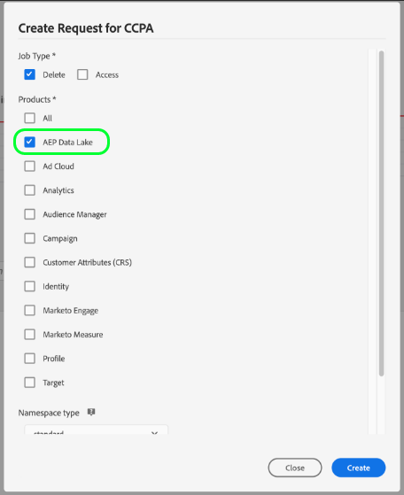

# Procesamiento de solicitudes de privacidad en el lago de datos

Adobe Experience Platform [!DNL Privacy Service] procesa las solicitudes de los clientes para acceder, excluirse de la venta o eliminar sus datos personales según lo establecido por las regulaciones de privacidad legales y organizativas.

Este documento cubre conceptos esenciales relacionados con el procesamiento de solicitudes de privacidad de datos de clientes almacenados en el lago de datos.

>[!NOTE]
>
>Esta guía solo explica cómo realizar solicitudes de privacidad para el lago de datos en Experience Platform. Si también planea realizar solicitudes de privacidad para el almacén de datos del perfil del cliente en tiempo real, consulte la guía de [procesamiento de solicitudes de privacidad para el perfil](../profile/privacy.md) además de este tutorial.
>
>Para ver los pasos necesarios para realizar solicitudes de privacidad para otras aplicaciones de Adobe Experience Cloud, consulte la [Documentación del Privacy Service](../privacy-service/experience-cloud-apps.md).

## Introducción

Se recomienda tener una comprensión práctica de lo siguiente [!DNL Experience Platform] servicios antes de leer esta guía:

* [[!DNL Privacy Service]](../privacy-service/home.md): administra las solicitudes de los clientes para acceder, desactivar la venta o eliminar sus datos personales en las aplicaciones de Adobe Experience Cloud.
* [[!DNL Catalog Service]](home.md): el sistema de registro para la ubicación y el linaje de datos dentro de [!DNL Experience Platform]. Proporciona una API que se puede utilizar para actualizar metadatos de conjuntos de datos.
* [[!DNL Experience Data Model (XDM) System]](../xdm/home.md): El marco estandarizado mediante el cual [!DNL Experience Platform] organiza los datos de experiencia del cliente.
* [[!DNL Identity Service]](../identity-service/home.md): resuelve el desafío fundamental que plantea la fragmentación de los datos de experiencia del cliente al unir identidades entre dispositivos y sistemas.

## Explicación de áreas de nombres de identidad {#namespaces}

Adobe Experience Platform [!DNL Identity Service] vincula los datos de identidad del cliente entre sistemas y dispositivos. [!DNL Identity Service] utiliza áreas de nombres de identidad para proporcionar contexto a los valores de identidad relacionándolos con su sistema de origen. Un área de nombres puede representar un concepto genérico como una dirección de correo electrónico (&quot;correo electrónico&quot;) o asociar la identidad a una aplicación específica, como un Adobe Advertising Cloud ID (&quot;AdCloud&quot;) o Adobe Target ID (&quot;TNTID&quot;).

[!DNL Identity Service] mantiene un almacén de áreas de nombres de identidad definidas globalmente (estándar) y definidas por el usuario (personalizadas). Las áreas de nombres estándar están disponibles para todas las organizaciones (por ejemplo, &quot;correo electrónico&quot; y &quot;ECID&quot;), mientras que su organización también puede crear áreas de nombres personalizadas para adaptarlas a sus necesidades particulares.

Para obtener más información sobre áreas de nombres de identidad en [!DNL Experience Platform], consulte la [información general del área de nombres de identidad](../identity-service/features/namespaces.md).

## Añadir datos de identidad a conjuntos de datos

Al crear solicitudes de privacidad para el lago de datos, se deben proporcionar valores de identidad válidos (y sus áreas de nombres asociadas) para cada cliente individual a fin de localizar sus datos y procesarlos en consecuencia. Por lo tanto, todos los conjuntos de datos sujetos a solicitudes de privacidad deben contener un descriptor de identidad en su esquema XDM asociado.

>[!NOTE]
>
>Actualmente, cualquier conjunto de datos basado en esquemas que no admiten metadatos de descriptor de identidad (como conjuntos de datos ad hoc) no se puede procesar en solicitudes de privacidad.

Esta sección muestra los pasos para agregar un descriptor de identidad al esquema XDM de un conjunto de datos existente. Si ya tiene un conjunto de datos con un descriptor de identidad, puede pasar al [sección siguiente](#nested-maps).

>[!IMPORTANT]
>
>Al decidir qué campos de esquema establecer como identidades, tenga en cuenta la variable [limitaciones del uso de campos de tipo mapa anidados](#nested-maps).

Existen dos métodos para agregar un descriptor de identidad a un esquema de conjunto de datos:

* [Uso de la IU](#identity-ui)
* [Uso de la API](#identity-api)

### Uso de la IU {#identity-ui}

En el [!DNL Experience Platform]interfaz de usuario, la **[!UICONTROL Esquemas]** El espacio de trabajo de permite editar los esquemas XDM existentes. Para añadir un descriptor de identidad a un esquema, seleccione el esquema de la lista y siga los pasos para [configuración de un campo de esquema como campo de identidad](../xdm/tutorials/create-schema-ui.md#identity-field) en el [!DNL Schema Editor] tutorial.

Una vez que haya establecido los campos adecuados dentro del esquema como campos de identidad, puede continuar con la siguiente sección sobre [envío de solicitudes de privacidad](#submit).

### Uso de la API {#identity-api}

>[!NOTE]
>
>En esta sección se supone que conoce el valor de ID de URI único del esquema XDM del conjunto de datos. Si no conoce este valor, puede recuperarlo utilizando el [!DNL Catalog Service] API. Después de leer el [introducción](./api/getting-started.md) de la guía para desarrolladores, siga los pasos descritos en para [listado](./api/list-objects.md) o [mirando hacia arriba](./api/look-up-object.md) [!DNL Catalog] para encontrar el conjunto de datos. El ID de esquema se encuentra en `schemaRef.id`
>
>En esta sección también se da por hecho que sabe cómo realizar llamadas a la API de Registro de esquemas. Para obtener información importante relacionada con el uso de la API, como saber su `{TENANT_ID}` y el concepto de contenedores, consulte la [introducción](../xdm/api/getting-started.md) de la guía de API.

Puede añadir un descriptor de identidad al esquema XDM de un conjunto de datos realizando una solicitud del POST al `/descriptors` punto final en la [!DNL Schema Registry] API.

**Formato de API**

```http
POST /descriptors
```

**Solicitud**

La siguiente solicitud define un descriptor de identidad en un campo &quot;dirección de correo electrónico&quot; en un esquema de ejemplo.

```shell
curl -X POST \
  https://platform.adobe.io/data/foundation/schemaregistry/tenant/descriptors \
  -H 'Authorization: Bearer {ACCESS_TOKEN}' \
  -H 'x-api-key: {API_KEY}' \
  -H 'x-gw-ims-org-id: {ORG_ID}' \
  -H 'x-sandbox-name: {SANDBOX_NAME}' \
  -H 'Content-Type: application/json' \
  -d '
      {
        "@type": "xdm:descriptorIdentity",
        "xdm:sourceSchema": "https://ns.adobe.com/{TENANT_ID}/schemas/fbc52b243d04b5d4f41eaa72a8ba58be",
        "xdm:sourceVersion": 1,
        "xdm:sourceProperty": "/personalEmail/address",
        "xdm:namespace": "Email",
        "xdm:property": "xdm:code",
        "xdm:isPrimary": false
      }'
```

| Propiedad | Descripción |
| --- | --- |
| `@type` | El tipo de descriptor que se está creando. Para los descriptores de identidad, el valor debe ser &quot;xdm:descriptorIdentity&quot;. |
| `xdm:sourceSchema` | ID de URI único del esquema XDM del conjunto de datos. |
| `xdm:sourceVersion` | La versión del esquema XDM especificada en `xdm:sourceSchema`. |
| `xdm:sourceProperty` | Ruta al campo de esquema al que se aplica el descriptor. |
| `xdm:namespace` | Uno de los [áreas de nombres de identidad estándar](../privacy-service/api/appendix.md#standard-namespaces) reconocido por [!DNL Privacy Service]o un área de nombres personalizada definida por su organización. |
| `xdm:property` | &quot;xdm:id&quot; o &quot;xdm:code&quot;, según el área de nombres que se utilice en `xdm:namespace`. |
| `xdm:isPrimary` | Un valor booleano opcional. Cuando es True, esto indica que el campo es una identidad principal. Los esquemas solo pueden contener una identidad principal. Si no se incluye, el valor predeterminado es false. |

**Respuesta**

Una respuesta correcta devuelve el estado HTTP 201 (Creado) y los detalles del descriptor recién creado.

```json
{
  "@type": "xdm:descriptorIdentity",
  "xdm:sourceSchema": "https://ns.adobe.com/{TENANT_ID}/schemas/fbc52b243d04b5d4f41eaa72a8ba58be",
  "xdm:sourceVersion": 1,
  "xdm:sourceProperty": "/personalEmail/address",
  "xdm:namespace": "Email",
  "xdm:property": "xdm:code",
  "xdm:isPrimary": false,
  "meta:containerId": "tenant",
  "@id": "f3a1dfa38a4871cf4442a33074c1f9406a593407"
}
```

## Envío de solicitudes {#submit}

>[!NOTE]
>
>Esta sección explica cómo dar formato a las solicitudes de privacidad para el lago de datos. Se recomienda encarecidamente que revise la [[!DNL Privacy Service] IU](../privacy-service/ui/overview.md) o [[!DNL Privacy Service] API](../privacy-service/api/getting-started.md) documentación para ver los pasos completos sobre cómo enviar un trabajo de privacidad, incluido cómo dar formato correctamente a los datos de identidad de usuario enviados en las cargas útiles de solicitud.

En la siguiente sección se describe cómo realizar solicitudes de privacidad para el lago de datos mediante [!DNL Privacy Service] IU o API.

>[!IMPORTANT]
>
>No se puede garantizar la cantidad de tiempo que puede tardar una solicitud de privacidad en completarse. Si se producen cambios dentro del lago de datos mientras se sigue procesando una solicitud, no se puede garantizar si se procesan o no esos registros.

### Uso de la IU

Al crear solicitudes de trabajo en la interfaz de usuario, asegúrese de seleccionar **[!UICONTROL Lago de datos de AEP]** bajo **[!UICONTROL Productos]** para procesar los trabajos de los datos almacenados en el lago de datos.



### Uso de la API

Al crear solicitudes de trabajo en la API, cualquier `userIDs` que se proporcionan deben utilizar un específico `namespace` y `type` según el almacén de datos al que se apliquen. Los ID del lago de datos deben utilizar `unregistered` para sus `type` y un valor `namespace` que coincida con uno de los [etiquetas de privacidad](#privacy-labels) que se han añadido a conjuntos de datos aplicables.

Además, la variable `include` La matriz de la carga útil de la solicitud debe incluir los valores de producto de los diferentes almacenes de datos a los que se realiza la solicitud. Al realizar solicitudes al lago de datos, la matriz debe incluir el valor `aepDataLake`.

La siguiente solicitud crea un nuevo trabajo de privacidad para el lago de datos, utilizando el no registrado `email_label` namespace. También incluye el valor de producto para el lago de datos en `include` matriz:

```shell
curl -X POST \
  https://platform.adobe.io/data/core/privacy/jobs \
  -H 'Authorization: Bearer {ACCESS_TOKEN}' \
  -H 'x-api-key: {API_KEY}' \
  -H 'x-gw-ims-org-id: {ORG_ID}' \
  -H 'Content-Type: application/json' \
  -d '{
    "companyContexts": [
      {
        "namespace": "imsOrgID",
        "value": "{ORG_ID}"
      }
    ],
    "users": [
      {
        "key": "user12345",
        "action": ["access","delete"],
        "userIDs": [
          {
            "namespace": "email_label",
            "value": "ajones@acme.com",
            "type": "unregistered"
          },
          {
            "namespace": "email_label",
            "value": "jdoe@example.com",
            "type": "unregistered"
          }
        ]
      }
    ],
    "include": ["aepDataLake"],
    "expandIds": false,
    "priority": "normal",
    "regulation": "ccpa"
}'
```

>[!IMPORTANT]
>
>Platform procesa las solicitudes de privacidad en todas las aplicaciones [zonas protegidas](../sandboxes/home.md) pertenece a su organización. Como resultado, cualquier `x-sandbox-name` el sistema ignora el encabezado incluido en la solicitud.

## Eliminar procesamiento de solicitudes

Cuándo [!DNL Experience Platform] recibe una solicitud de eliminación de [!DNL Privacy Service], [!DNL Platform] envía confirmación a [!DNL Privacy Service] que la solicitud se ha recibido y que los datos afectados se han marcado para su eliminación. A continuación, los registros se eliminan del lago de datos en un plazo de siete días. Durante ese periodo de siete días, los datos se eliminan en blanco y, por lo tanto, ningún usuario puede acceder a ellos [!DNL Platform] servicio.

Si también incluye `ProfileService` o `identity` en la solicitud de privacidad, los datos asociados se gestionan de forma independiente. Consulte la sección sobre [eliminar el procesamiento de solicitudes del perfil](../profile/privacy.md#delete) para obtener más información.

## Pasos siguientes

Al leer este documento, se le han introducido los conceptos importantes relacionados con el procesamiento de solicitudes de privacidad para el lago de datos. Se recomienda continuar leyendo la documentación proporcionada a través de esta guía para profundizar en la comprensión de cómo administrar los datos de identidad y crear trabajos de privacidad.

Consulte el documento sobre [procesamiento de solicitudes de privacidad para el Perfil del cliente en tiempo real](../profile/privacy.md) para ver los pasos en el procesamiento de solicitudes de privacidad para [!DNL Profile] tienda.

## Apéndice

La siguiente sección contiene información adicional para procesar solicitudes de privacidad en el lago de datos.

### Etiquetado de campos de tipo de mapa anidados {#nested-maps}

Es importante tener en cuenta que hay dos tipos de campos de tipo de mapa anidados que no admiten el etiquetado de privacidad:

* Campo de tipo mapa dentro de un campo de tipo matriz
* Campo de tipo de mapa dentro de otro campo de tipo de mapa

El procesamiento de trabajos de privacidad de cualquiera de los dos ejemplos anteriores finalmente fallará. Por este motivo, se recomienda evitar el uso de campos de tipo mapa anidados para almacenar datos privados del cliente. Los ID de consumidor relevantes deben almacenarse como un tipo de datos no asignado dentro de `identityMap` (un campo de tipo mapa) para conjuntos de datos basados en registros, o la variable `endUserID` para conjuntos de datos basados en series temporales.
