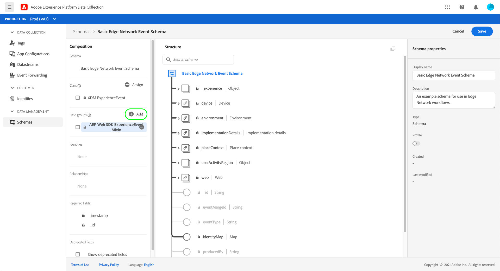
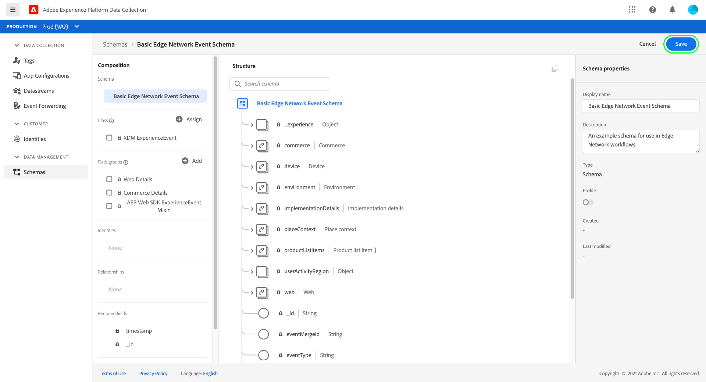
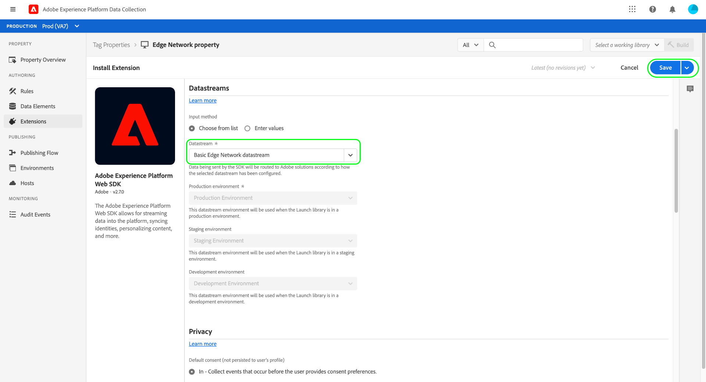
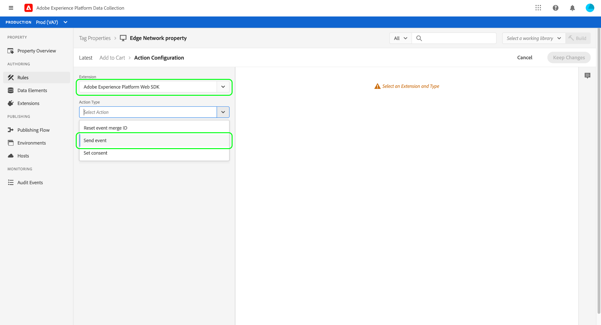
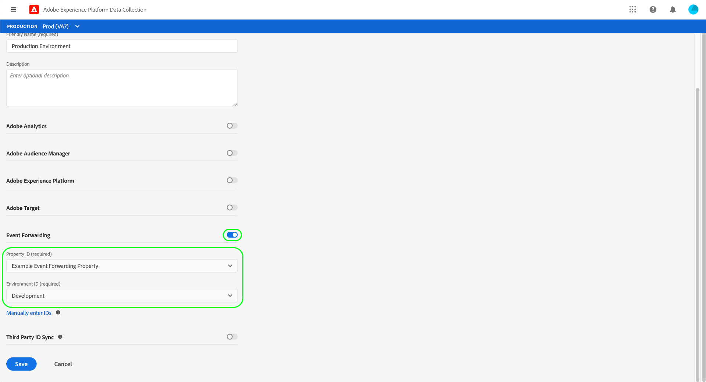

# Información general sobre la recopilación de datos de extremo a extremo

Adobe Experience Platform recopila y transfiere sus datos a otros productos de Adobe y destinos de terceros. Para enviar datos de evento de su aplicación a Experience Platform Edge Network, es importante comprender estas tecnologías principales y cómo configurarlas para que entreguen los datos a los destinos que necesite, cuando lo necesite.

Esta guía proporciona un tutorial de alto nivel sobre cómo enviar un evento a través de la red perimetral mediante las funciones de recopilación de datos de Platform. En concreto, el tutorial recorre los pasos de instalación y configuración de la extensión de etiqueta del SDK web de Adobe Experience Platform dentro de la IU de recopilación de datos (anteriormente, Adobe Experience Platform Launch).

>[!NOTE]
>
>También puede optar por instalar y configurar el SDK manualmente si no desea utilizar etiquetas, pero los pasos que lo rodean deben completarse como se describe a continuación.
>
>Todos los pasos relacionados con la IU de recopilación de datos también se pueden realizar en la IU de Experience Platform.

## Requisitos previos

Este tutorial utiliza la IU de recopilación de datos para crear un esquema, configurar un flujo de datos e instalar el SDK web. Para realizar estas acciones en la interfaz de usuario, se debe otorgar acceso al menos a una propiedad web junto con lo siguiente [derechos de propiedad](../tags/ui/administration/user-permissions.md#property-rights):

* Desarrollo
* Administración de extensiones

Consulte la guía de [administración de permisos para la recopilación de datos](./permissions.md) para obtener información sobre cómo conceder acceso a propiedades y derechos de propiedad.

Para utilizar los distintos productos de recopilación de datos mencionados en esta guía, también debe tener acceso a los flujos de datos y la capacidad de crear y administrar esquemas. Si necesita acceder a alguna de estas funciones, póngase en contacto con el equipo de su cuenta de Adobe para que le ayude a obtener el acceso necesario. Tenga en cuenta que si no ha adquirido Adobe Experience Platform, Adobe le proporcionará el acceso necesario para utilizar el SDK sin coste adicional.

Si ya tiene acceso a Platform, debe asegurarse de que dispone de todos los [permissions](../access-control/home.md#permissions) en las siguientes categorías habilitadas:

* Modelado de datos
* Identidades

Consulte la [Introducción a IU de control de acceso](../access-control/ui/overview.md) para obtener información sobre cómo conceder permisos para las capacidades de Platform a los usuarios.

## Resumen del proceso

El proceso de configuración de la recopilación de datos para su sitio web se puede resumir de la siguiente manera:

1. [Creación de un esquema](#schema) para determinar cómo se estructurarán los datos al enviarlos a la red perimetral.
1. [Creación de una secuencia de datos](#datastream) para configurar a qué destinos desea enviar los datos.
1. [Instalación y configuración del SDK web](#sdk) para enviar datos al conjunto de datos cuando se producen determinados eventos en el sitio web.

Una vez que pueda enviar datos a la red perimetral, también puede [configuración del reenvío de eventos](#event-forwarding) si su organización dispone de una licencia para ello.

## Creación de un esquema {#schema}

[Modelo de datos de experiencia (XDM)](../xdm/home.md) es una especificación de código abierto que proporciona estructuras y definiciones comunes para datos en forma de esquemas. En otras palabras, XDM es una forma de estructurar y dar formato a los datos de una manera que pueda ser procesada por la red de Edge y otras aplicaciones de Adobe Experience Cloud.

El primer paso para configurar las operaciones de recopilación de datos es crear un esquema XDM para representar los datos. En un paso posterior de este tutorial, asignará los datos que desee enviar a la estructura de este esquema.

>[!NOTE]
>
>Los esquemas XDM son muy personalizables. En lugar de ser excesivamente prescriptivos, los pasos descritos a continuación se centran específicamente en los requisitos de esquema para el SDK web. Fuera de estos parámetros, puede definir la estructura restante de los datos como desee.

En la interfaz de usuario, seleccione **[!UICONTROL Esquemas]** en el panel de navegación izquierdo. Desde aquí puede ver una lista de los esquemas creados anteriormente que pertenecen a su organización. Para continuar, seleccione **[!UICONTROL Crear esquema]**, luego seleccione **[!UICONTROL ExperienceEvent de XDM]** en el menú desplegable.


Aparece un cuadro de diálogo que le solicita que empiece a agregar grupos de campos al esquema. Para enviar eventos mediante el SDK web, debe agregar el grupo de campos **[!UICONTROL Mezcla de ExperienceEvent del SDK web de AEP]**. Este grupo de campos contiene definiciones de atributos de datos que la biblioteca del SDK web recopila automáticamente.

Utilice la barra de búsqueda para reducir la lista y facilitar la búsqueda de este grupo de campos. Una vez encontrado, selecciónelo en la lista antes de seleccionar **[!UICONTROL Adición de grupos de campos]**.


Aparece el lienzo del esquema, que muestra una estructura de árbol del esquema XDM que incluye los campos proporcionados por el grupo de campos del SDK web.


Seleccione el campo raíz del árbol que desea abrir **[!UICONTROL Propiedades del esquema]** en el carril derecho, donde puede proporcionar un nombre y una descripción opcional para el esquema.


Si desea agregar más campos al esquema, puede hacerlo seleccionando **[!UICONTROL Añadir]** en el **[!UICONTROL Grupos de campos]** en el carril izquierdo.



>[!NOTE]
>
>Consulte la guía de [adición de grupos de campos](../xdm/ui/resources/schemas.md#add-field-groups) en la documentación de XDM para ver los pasos detallados sobre cómo buscar diferentes grupos de campos para adaptarlos a sus casos de uso.
>
>La práctica recomendada es agregar solo campos para los datos que planea enviar a través de la red de Edge. Una vez añadidos campos a un esquema y guardado, solo se pueden realizar cambios adicionales en el esquema a partir de entonces. Consulte la sección en la [reglas de evolución de esquema](../xdm/schema/composition.md#evolution) para obtener más información.

Una vez añadidos los campos que necesita, seleccione **[!UICONTROL Guardar]** para guardar el esquema.



## Crear un flujo de datos {#datastream}

Un conjunto de datos es una configuración que indica a la red perimetral a dónde desea que se envíen los datos. En concreto, un conjunto de datos especifica a qué productos de Experience Cloud desea enviar los datos, y cómo desea que se gestionen y almacenen los datos en cada producto.

>[!NOTE]
>
>Si desea utilizar [reenvío de eventos](../tags/ui/event-forwarding/overview.md) (suponiendo que su organización tenga licencia para la funcionalidad), debe habilitarla para un conjunto de datos de la misma manera que habilita los productos de Adobe. Los detalles de este proceso se tratan en un [sección posterior](#event-forwarding).

Seleccionar **[!UICONTROL Datastreams]** en el panel de navegación izquierdo. Desde aquí, puede seleccionar un conjunto de datos existente de la lista para editarlo, o puede crear una nueva configuración seleccionando **[!UICONTROL Nueva secuencia de datos]**.


Los requisitos de configuración de un conjunto de datos dependen de los productos y las capacidades a los que esté enviando datos. Para obtener información detallada sobre las opciones de configuración de cada producto, consulte la [información general sobre flujos de datos](../datastreams/overview.md).

## Instalación y configuración del SDK web {#install}

Una vez que haya creado un esquema y una secuencia de datos, el siguiente paso es instalar y configurar el SDK web de Platform para que comience a enviar datos a la red perimetral.

>[!NOTE]
>
>Esta sección utiliza la IU de recopilación de datos para configurar la extensión de etiqueta del SDK web, pero también puede instalarla y configurarla con código sin procesar en su lugar. Consulte las siguientes guías para obtener más información:
>
>* [Instalación del SDK](/help/web-sdk/install/overview.md)
>* [Configuración del SDK](/help/web-sdk/commands/configure/overview.md)
>
>Tenga en cuenta también que, aunque solo desee utilizar el reenvío de eventos, debe instalar y configurar el SDK tal y como se describe antes de configurar el reenvío de eventos en una [etapa posterior](#event-forwarding).

El proceso puede resumirse de la siguiente manera:

1. [Instalación del SDK web de Adobe Experience Platform en una propiedad de etiqueta](#install-sdk) para obtener acceso a sus capacidades.
1. [Creación de un elemento de datos de objeto XDM](#data-element) para asignar variables en el sitio web a la estructura del esquema XDM creado anteriormente.
1. [Creación de una regla](#rule) para indicar al SDK cuándo debe enviar datos a la red perimetral.
1. [Crear e instalar una biblioteca](#library) para implementar la regla en el sitio web.

### Instalación del SDK en una propiedad de etiqueta {#install-sdk}

Seleccionar **[!UICONTROL Etiquetas]** en el panel de navegación izquierdo para mostrar una lista de propiedades de etiquetas. Puede elegir una propiedad existente para editarla si lo desea o puede seleccionar **[!UICONTROL Nueva propiedad]** en su lugar.


Si está creando una nueva propiedad, proporcione un nombre descriptivo y establezca el [!UICONTROL Plataforma] hasta **[!UICONTROL Web]**. Proporcione el dominio completo para la propiedad web y, a continuación, seleccione **[!UICONTROL Guardar]**.


Aparecerá la página de información general de la propiedad. Desde aquí, seleccione **[!UICONTROL Extensiones]** en el panel de navegación izquierdo, seleccione **[!UICONTROL Catálogo]**. Busque la lista del SDK web de Platform (opcionalmente, utilizando la barra de búsqueda para reducir los resultados) y seleccione **[!UICONTROL Instalar]**.


Aparecerá la página de configuración del SDK. La mayoría de los valores necesarios se rellenan automáticamente con valores predeterminados que puede elegir cambiar si lo desea.


Sin embargo, antes de instalar el SDK, debe seleccionar un conjunto de datos para que sepa a dónde enviar los datos. En **[!UICONTROL Datastreams]**, utilice el menú desplegable para seleccionar el conjunto de datos que configuró en una [paso anterior](#datastream). Una vez definido el conjunto de datos, seleccione **[!UICONTROL Guardar]** para finalizar la instalación del SDK en la propiedad.



### Creación de un elemento de datos XDM {#data-element}

Para que el SDK envíe datos a la red perimetral, esos datos deben asignarse al esquema XDM creado en una [paso anterior](#schema). Esta asignación se realiza mediante el uso de un elemento de datos.

En la interfaz de usuario, seleccione **[!UICONTROL Elementos de datos]**, luego seleccione **[!UICONTROL Crear nuevo elemento de datos]**.


En la pantalla siguiente, seleccione **[!UICONTROL SDK web de Adobe Experience Platform]** en el [!UICONTROL Extensión] y, a continuación, seleccione **[!UICONTROL Objeto XDM]** para el tipo de elemento de datos.


Aparecerá el cuadro de diálogo de configuración para el tipo de objeto XDM. El cuadro de diálogo selecciona automáticamente el entorno limitado de Platform y desde aquí puede ver todos los esquemas que se han creado en ese entorno limitado. Seleccione el esquema XDM creado anteriormente en la lista.


Aparecerá la estructura del esquema. Todos los campos con un asterisco (**\***) indicar campos que se rellenarán automáticamente cuando se activen eventos. Para todos los demás campos, puede explorar la estructura del esquema y rellenar el resto de los datos.


>[!NOTE]
>
>La captura de pantalla anterior muestra cómo asignar una variable accesible globalmente desde el lado del cliente del sitio web (`cartAbandonsTotal`) a un campo XDM haciendo referencia a su nombre en la variable [!UICONTROL Valor] campo, rodeado de símbolos de porcentaje (`%`).
>
>También puede utilizar otros elementos de datos creados anteriormente para rellenar estos campos. Consulte la referencia de en [elementos de datos](../tags/ui/managing-resources/data-elements.md) en la documentación de etiquetas para obtener más información.

Cuando haya terminado de asignar los datos al esquema, proporcione un nombre para el elemento de datos antes de seleccionar **[!UICONTROL Guardar]**.


### Crear una regla

Después de guardar el elemento de datos, el siguiente paso es crear una regla que lo envíe a la red perimetral cada vez que se produzca un evento determinado en el sitio web (como cuando un cliente agrega un producto al carro de compras).

Puede configurar reglas para prácticamente cualquier evento que se pueda producir en el sitio web. Por ejemplo, esta sección muestra cómo crear una regla que entrará en déclencheur cuando un cliente envíe un formulario. El siguiente HTML representa una página web sencilla con un formulario &quot;Agregar al carro de compras&quot;, que será el tema de la regla:

```html
<!DOCTYPE html>
<html>
<body>

  <form id="add-to-cart-form">
    <label for="item">Product:</label><br>
    <input type="text" id="item" name="item"><br>
    <label for="amount">Amount:</label><br>
    <input type="number" id="amount" name="amount" value="1"><br><br>
    <input type="submit" value="Add to Cart">
  </form> 

</body>
</html>
```

En la IU de recopilación de datos, seleccione **[!UICONTROL Reglas]** en el panel de navegación izquierdo, seleccione **[!UICONTROL Crear nueva regla]**.


En la pantalla siguiente, proporcione un nombre para la regla. A partir de aquí, el siguiente paso es determinar el evento de la regla (es decir, cuándo se activará la regla). Seleccionar **[!UICONTROL Añadir]** bajo [!UICONTROL Eventos].


Aparecerá la página de configuración del evento. Para configurar un evento, primero debe seleccionar el tipo de evento. Las extensiones proporcionan los tipos de eventos. Para configurar un evento de &quot;envío de formulario&quot;, por ejemplo, seleccione la **[!UICONTROL Núcleo]** extensión y, a continuación, seleccione la **[!UICONTROL Enviar]** tipo de evento en **[!UICONTROL Form]** categoría.

>[!NOTE]
>
>Para obtener más información sobre los distintos tipos de eventos que proporcionan las extensiones web de Adobe, incluido cómo configurarlos, consulte la [referencia de extensiones de Adobe](../tags/extensions/client/overview.md) en la documentación de etiquetas.

El evento de envío de formularios le permite utilizar un [Selector de CSS](https://www.w3schools.com/css/css_selectors.asp) para hacer referencia a un elemento específico en el que la regla se debe activar. En el siguiente ejemplo, la variable ID `add-to-cart-form` se utiliza para que esta regla solo se active para el formulario &quot;Agregar al carro de compras&quot;. Seleccionar **[!UICONTROL Conservar cambios]** para añadir el evento a la regla.


La página de configuración de regla vuelve a aparecer y muestra que se ha añadido el evento. Puede reducir la &quot;[!UICONTROL If]&quot; añadiendo más condiciones a la regla.

De lo contrario, el siguiente paso es añadir una acción para que la regla se ejecute cuando se active. Seleccionar **[!UICONTROL Añadir]** bajo **[!UICONTROL Acciones]** para continuar.


Aparecerá la página de configuración de la acción. Para obtener la regla para enviar datos a Edge Network, seleccione **[!UICONTROL SDK web de Adobe Experience Platform]** para la extensión de, y **[!UICONTROL Enviar evento]** para el tipo de acción.



La pantalla se actualiza para mostrar opciones adicionales para configurar la acción de envío de eventos. En **[!UICONTROL Tipo]**, puede proporcionar un valor de tipo personalizado para rellenar el `eventType` Campo XDM. En **[!UICONTROL Datos XDM]**, proporcione el nombre del tipo de datos XDM que creó anteriormente (rodeado de símbolos de porcentaje) o seleccione el icono de la base de datos () para seleccionarlo de una lista. Estos son los datos que se envían finalmente a la red perimetral.

Seleccionar **[!UICONTROL Conservar cambios]** cuando termine.


Cuando haya terminado de configurar la regla, seleccione **[!UICONTROL Guardar]** para finalizar el proceso.


### Crear e instalar una biblioteca {#library}

Una vez configurada la regla, está listo para agregarla a una biblioteca de etiquetas, compilarla en un entorno e instalarla en el sitio web.

>[!NOTE]
>
>Si todavía no ha configurado un entorno en la IU de recopilación de datos, debe hacerlo antes de poder crear una compilación. Consulte la sección sobre [configuración de un entorno para una propiedad web](../tags/ui/publishing/environments.md#web-configuration) en la documentación de etiquetas para obtener más información.

Para obtener información sobre cómo crear una biblioteca, añadir extensiones y reglas a la biblioteca y crear esa biblioteca en un entorno, consulte la guía de [administración de bibliotecas](../tags/ui/publishing/libraries.md) en la documentación de etiquetas. Cuando cree la biblioteca, asegúrese de incluir la extensión del SDK web de Platform y las reglas de recopilación de datos creadas anteriormente.

Una vez creada la biblioteca y asignada su compilación a un entorno, puede instalar ese entorno en el lado del cliente del sitio web. Consulte la sección sobre [instalación de entornos](../tags/ui/publishing/environments.md#installation) para obtener más información.

Una vez instalado el entorno en el sitio web, puede hacer lo siguiente [prueba de la implementación](../tags/ui/publishing/embed-code-testing.md) usando el Adobe Experience Platform Debugger.

## Configurar el reenvío de eventos (opcional) {#event-forwarding}

>[!NOTE]
>
>El reenvío de eventos solo está disponible para organizaciones con licencia para él.

Una vez configurado el SDK para enviar datos a la red perimetral, puede configurar el reenvío de eventos para indicar a la red perimetral dónde desea que se entreguen esos datos.

Para utilizar el reenvío de eventos, primero debe crear una propiedad de reenvío de eventos. Seleccionar **[!UICONTROL Reenvío de eventos]** en la navegación izquierda, seleccione **[!UICONTROL Nueva propiedad]**. Proporcione un nombre para la propiedad antes de seleccionar **[!UICONTROL Guardar]**.

Una vez creada una propiedad de reenvío de eventos, el siguiente paso es crear una regla que determine a dónde se deben enviar los datos. Las reglas para las propiedades del reenvío de eventos se construyen de forma muy similar a las propiedades de etiquetas, con la excepción de que no se pueden especificar eventos (ya que el reenvío de eventos solo trata los eventos que recibe directamente del conjunto de datos). Para la acción de la regla, puede utilizar una de las extensiones de reenvío de eventos disponibles o utilizar código personalizado para entregar el evento.


Similar a antes, una vez configurada la regla, debe agregarla a una biblioteca y crear esa biblioteca en un entorno.

Una vez completada la generación, el paso final es actualizar la secuencia de datos que desee [configurado previamente](#datastream) y habilite el reenvío de eventos. Para empezar, vaya a **[!UICONTROL Datastreams]** y seleccione la secuencia de datos en cuestión en la lista. Desde aquí, habilite la opción para el reenvío de eventos y proporcione los nombres de la propiedad y el entorno que acaba de configurar.



## Pasos siguientes

Esta guía proporciona información general de alto nivel sobre cómo enviar datos a la red perimetral mediante el SDK web de Platform. Consulte la documentación relacionada con esta guía para obtener más información sobre los distintos componentes y servicios implicados.
