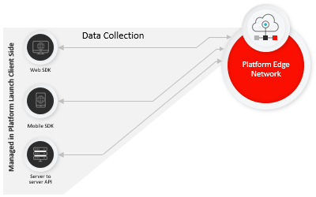
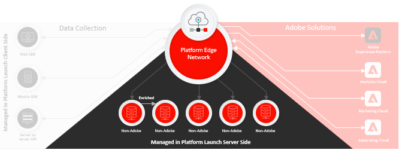

# Información general sobre la recopilación de datos

Adobe Experience Platform proporciona un conjunto de tecnologías que le permiten recopilar datos de experiencia del cliente de fuentes del lado del cliente y enviarlos a la red perimetral de Adobe Experience Platform, donde se pueden enriquecer, transformar y distribuir a destinos de Adobe o que no sean de Adobe en segundos.

La recopilación de datos es compatible con las siguientes fuentes del lado del cliente:

* Aplicaciones basadas en la Web
* Aplicaciones móviles nativas
* Aplicaciones OTT

Las tecnologías de recopilación de datos proporcionadas por el Experience Platform se centran en la capacidad de detección y accesibilidad de los conjuntos de datos ingestados. Estas tecnologías comprenden lo siguiente:

* [Adobe Experience Platform Edge Network](https://experienceleague.adobe.com/docs/web-sdk-learn/tutorials/introduction-to-web-sdk-and-edge-network.html)
* [Adobe Experience Platform Launch](https://adobe.com/go/launch_help_en)
* [SDK web de Adobe Experience Platform](../edge/home.md)
* [Modelo de datos de experiencia (XDM)](../xdm/home.md)

## Implementaciones más simples, rendimiento más rápido del lado del cliente

Los SDK web y móviles de Adobe Experience Platform contraen y comprimen todas las bibliotecas de productos de Adobe en un único kit de desarrollo para plataformas web o móviles. La compresión de estas bibliotecas acelera la recopilación de datos y consolida las operaciones en un único flujo desde dispositivos del lado del cliente a Adobe Experience Platform Edge Network.

## Proceso de conmutación para implementar la tecnología de Adobe

Platform Edge Network es una red global de servidores distribuidos, rápidos y confiables que pueden recibir y procesar datos a una escala tremenda. Con Platform launch, puede configurar [configuraciones de Edge](../edge/fundamentals/edge-configuration.md) para productos como Adobe Target, Adobe Audience Manager y Adobe Analytics, que le permiten activar estos productos en el servidor sin cambiar el código del lado del cliente.

## Transformar, enriquecer y enviar datos de forma rápida y segura

[Adobe Experience Platform Launch Server ](https://experienceleague.adobe.com/docs/launch/using/server-side-info/server-side-overview.html) Sidecan puede aprovechar cualquier flujo de datos de Platform. Puede transformar, enriquecer y enviar datos a cualquier destino que no sea de Adobe con una latencia extrema y baja sin agregar código de terceros al dispositivo cliente, lo que permite una recopilación y distribución de datos más rápidas y seguras.

