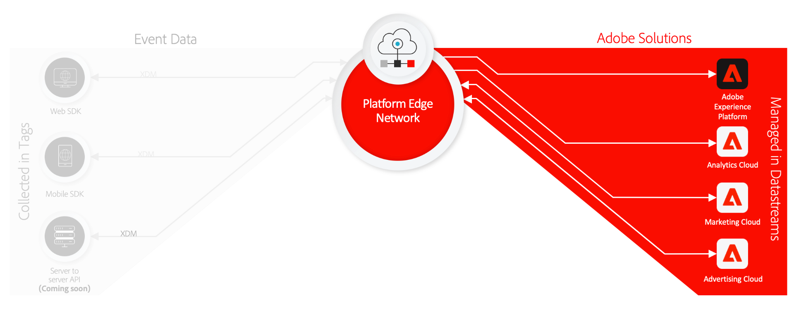

# Información general sobre la recopilación de datos

Adobe Experience Platform proporciona un conjunto de tecnologías que le permiten recopilar datos de experiencia del cliente de fuentes del lado del cliente y enviarlos a la red perimetral de Adobe Experience Platform, donde se pueden enriquecer, transformar y distribuir a destinos de Adobe o que no sean de Adobe en segundos.

La recopilación de datos es compatible con las siguientes fuentes del lado del cliente:

* Aplicaciones basadas en la Web
* Aplicaciones móviles nativas
* Aplicaciones OTT

La recopilación de datos se centra en la capacidad de detección y accesibilidad de los conjuntos de datos ingestados, y abarca lo siguiente:

* [Adobe Experience Platform Edge Network](https://experienceleague.adobe.com/docs/web-sdk-learn/tutorials/introduction-to-web-sdk-and-edge-network.html)
* [Etiquetas](../tags/home.md)
* [Corrientes de datos](../edge/datastreams/overview.md)
* [Reenvío de eventos](../tags/ui/event-forwarding/overview.md)
* [SDK web de Adobe Experience Platform](../edge/home.md)
* [SDK móvil de Adobe Experience Platform](https://aep-sdks.gitbook.io/docs/)
* [Adobe Experience Platform Debugger](https://chrome.google.com/webstore/detail/adobe-experience-platform/bfnnokhpnncpkdmbokanobigaccjkpob?hl=en)
* [Modelo de datos de experiencia (XDM)](../xdm/home.md)
* [Servicio de ID de Adobe Experience Platform](../identity-service/home.md)

Esta guía proporciona una introducción de alto nivel a la recopilación de datos y cómo funciona para enviar datos a productos de Adobe Experience Cloud y aplicaciones que no son de Adobe a través de Platform Edge Network.

## Etiquetas, SDK web y SDK móvil

El SDK web de Platform y el SDK de Platform Mobile contraen y comprimen todas las bibliotecas de productos de Adobe en un único kit de desarrollo para plataformas web y móviles, respectivamente. Se pueden implementar utilizando código sin procesar o utilizando [etiquetas](../tags/home.md) a través de la interfaz de usuario de recopilación de datos o la interfaz de usuario de Adobe Experience Platform.

La compresión de estas bibliotecas acelera la recopilación de datos y consolida las operaciones en un único flujo desde dispositivos del lado del cliente a Platform Edge Network.

## Red perimetral de plataforma y conjuntos de datos {#edge}

Platform Edge Network es una red global de servidores distribuidos, rápidos y confiables que pueden recibir y procesar datos a una escala tremenda. Con las etiquetas, puede configurar [datastreams](../edge/datastreams/overview.md) para productos como Adobe Target, Adobe Audience Manager y Adobe Analytics, que permiten activar estos productos en el servidor sin cambiar el código del lado del cliente.

Además, los conjuntos de datos de se integran con varias funciones de Platform que ayudan a garantizar que cualquier dato confidencial que envía se gestione adecuadamente con respecto a las políticas organizativas y las normativas legales. Consulte la sección sobre [gestión de datos confidenciales](../edge/datastreams/overview.md#sensitive) en la documentación de datastreams para obtener más información.

>[!NOTE]
>
>Para obtener una introducción de alto nivel a la red perimetral de plataforma, consulte lo siguiente [recorrido interactivo del producto](https://adobe-ideacloud.forgedx.com/adobe-adobe-edge-collection/adobe-experience-edge/public/mx?SUID=hgb1a48ICSCpbM6MzBYHbxnsh9DgjUy1).

## Reenvío de eventos

[Reenvío de eventos](../tags/ui/event-forwarding/overview.md) puede aprovechar cualquier conjunto de datos del Experience Platform, lo que le permite transformar, enriquecer y enviar datos a cualquier destino que no sea de Adobe con latencia extrema baja y sin añadir ningún código de terceros al dispositivo cliente.

>[!NOTE]
>
>El reenvío de eventos es una función de pago que solo se incluye como parte de la oferta Conexiones de Real-time Customer Data Platform.

## Pasos siguientes

Este documento proporciona información general de alto nivel sobre cómo funciona la recopilación de datos para automatizar el proceso de envío de los datos de experiencia del cliente recopilados a productos de Adobe y destinos de terceros.

Para obtener más información sobre el flujo de trabajo general implicado en el envío de datos de evento a través de la red perimetral, consulte [información general integral](./e2e.md).
