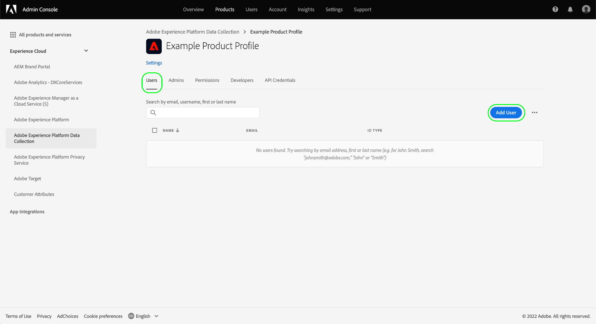

# Administración de permisos para la recopilación de datos en el Experience Platform

[Recopilación de datos en Adobe Experience Platform](./home.md) está compuesto por varias tecnologías diferentes que trabajan juntas para recopilar y transferir sus datos. El acceso a estas tecnologías se controla mediante permisos granulares basados en roles en Adobe Admin Console.

Esta guía le muestra cómo administrar los permisos para las funciones de recopilación de datos.

## Primeros pasos

Para configurar el control de acceso para la recopilación de datos, debe tener privilegios de administrador para una organización que tenga una integración de producto con la recopilación de datos de Adobe Experience Platform. La función mínima que puede conceder o retirar permisos es un administrador de perfiles de producto. Otras funciones de administrador que pueden administrar permisos son los administradores de productos (pueden administrar todos los perfiles de un producto) y los administradores de sistemas (sin restricciones). Consulte el artículo sobre [funciones administrativas](https://helpx.adobe.com/enterprise/using/admin-roles.html) en la guía de administración de Adobe Enterprise para obtener más información.

En esta guía se da por hecho que está familiarizado con conceptos básicos de Admin Console como perfiles de producto y cómo conceden permisos de producto a usuarios y grupos individuales. Para obtener más información, consulte la [Guía del usuario del Admin Console](https://helpx.adobe.com/es/enterprise/using/admin-console.html).

## Permisos disponibles

Los permisos relevantes para la recopilación de datos se proporcionan a través de dos designaciones de productos en Admin Console: **Adobe Experience Platform** y **Recopilación de datos de Adobe Experience Platform**. Las secciones siguientes describen los permisos proporcionados en cada producto junto con descripciones de las funcionalidades específicas a las que conceden acceso.

### Permisos de Adobe Experience Platform

Los permisos en Adobe Experience Platform incluyen acceso a conjuntos de datos, identidades, esquemas y entornos limitados. Para ver los pasos sobre cómo configurar los permisos de Adobe Experience Platform, consulte la [guía del usuario de control de acceso](../access-control/ui/overview.md).

| Categoría | Permiso | Descripción |
| --- | --- | --- |
| Zonas protegidas | (N/A) | Según el [entornos limitados](../sandboxes/home.md) que se hayan creado en su organización, puede controlar el acceso a cada uno de ellos a través de esta categoría de permisos en Admin Console. |
| Modelado de datos | Administrar esquemas | Concede la capacidad de ver, crear y editar [Esquemas del Modelo de datos de experiencia (XDM)](../xdm/home.md). |
| Modelado de datos | Esquemas de vistas | Otorga acceso de solo lectura a esquemas. |
| Administración de identidades | Administrar áreas de nombres de identidad | Concede la capacidad de ver, crear y editar [áreas de nombres de identidad](../identity-service/namespaces.md). |
| Administración de identidades | Ver espacios de nombres de identidad | Concede acceso de solo lectura a áreas de nombres de identidad. |
| Recopilación de datos | Administrar almacenes de datos | Concede la capacidad de ver, crear y editar [datastreams](../edge/datastreams/overview.md). |
| Recopilación de datos | Ver almacenes de datos | Concede acceso de solo lectura a conjuntos de datos. |

{style=&quot;table-layout:auto&quot;}

<!-- (Feature not yet available?)
| Dashboards | Manage Custom Dashboards | |
| Dashboards | View Custom Dashboards | |
-->

### Permisos de recopilación de datos de Adobe Experience Platform

Los permisos en Recopilación de datos de Adobe Experience Platform controlan el acceso a las etiquetas y las funciones de reenvío de eventos, incluidas las propiedades, las extensiones y los entornos. Para ver los pasos sobre cómo configurar los permisos de recopilación de datos de Adobe Experience Platform, consulte la [sección inferior](#manage).

| Categoría | Permiso | Descripción |
| --- | --- | --- |
| Plataformas | Web | Otorga acceso a [propiedades web](../tags/ui/administration/companies-and-properties.md) cuando se combina con otros derechos de propiedad. |
| Plataformas | Dispositivo móvil | Otorga acceso a [propiedades móviles](../tags/ui/administration/companies-and-properties.md) cuando se combina con otros derechos de propiedad. |
| Propiedades | (N/D) | Según las propiedades creadas en su organización, puede controlar el acceso a cada una de ellas a través de esta categoría de permisos en Admin Console.  Los derechos de propiedad asignados de un usuario solo se aplican a las propiedades a las que se les ha otorgado acceso a través de esta categoría de permisos. |
| Derechos de propiedad | Aprobar | Concede la capacidad de aprobar una compilación de biblioteca como parte del [flujo de publicación](../tags/ui/publishing/publishing-flow.md). |
| Derechos de propiedad | Desarrollo | Concede la capacidad de desarrollar una compilación de biblioteca como parte del [flujo de publicación](../tags/ui/publishing/publishing-flow.md). |
| Derechos de propiedad | Editar propiedad | Concede la capacidad de editar la configuración básica de las propiedades a las que tiene acceso un usuario. |
| Derechos de propiedad | Administrar entornos | Concede la capacidad de administrar la variable [entornos](../tags/ui/publishing/environments.md) para las propiedades a las que tiene acceso un usuario. |
| Derechos de propiedad | Administrar extensiones | Concede la capacidad de administrar la variable [extensiones](../tags/ui/managing-resources/extensions/overview.md) para las propiedades a las que tiene acceso un usuario. |
| Derechos de propiedad | Publicar | Concede la capacidad de publicar una compilación de biblioteca como parte del [flujo de publicación](../tags/ui/publishing/publishing-flow.md). |
| Derechos de compañía | Desarrollo de extensiones | Concede la capacidad de crear y modificar paquetes de extensión que son propiedad de su organización, incluidas versiones privadas y solicitudes de lanzamiento público. |
| Derechos de compañía | Administrar extensiones | Este permiso solo es aplicable si dispone de una licencia para Adobe Journey Optimizer u otra solución que conceda acceso a la mensajería push y en la aplicación móvil. Esto le permite administrar las aplicaciones de las que Adobe Experience Cloud conoce, así como las credenciales push necesarias para comunicarse con el servicio Firebase Cloud Messaging y el servicio de notificaciones push de Apple. |

{style=&quot;table-layout:auto&quot;}

>[!NOTE]
>
>Para obtener más información sobre cómo afectan estos permisos a las capacidades de las etiquetas, incluidas las estrategias de administración de escenarios comunes, consulte la documentación sobre etiquetas en [permisos de usuario](../tags/ui/administration/user-permissions.md).

## Administración de permisos {#manage}

Como se describe en la sección anterior, los permisos para la recopilación de datos se administran mediante dos designaciones de productos en Admin Console: **Adobe Experience Platform** y **Recopilación de datos de Adobe Experience Platform**.

Para administrar estos permisos, inicie sesión en [Admin Console](https://adminconsole.adobe.com/) y seleccione **[!UICONTROL Productos]** desde la barra de navegación superior. Desde aquí, seleccione la tarjeta de producto para los permisos que desea configurar. Consulte las subsecciones siguientes para ver los pasos sobre cómo administrar los permisos relevantes en cada producto en el Admin Console:

* [Permisos de Adobe Experience Platform](#manage-platform)
* [Permisos de recopilación de datos de Adobe Experience Platform](#manage-collection)

### Administrar permisos en Adobe Experience Platform {#manage-platform}

En el **[!UICONTROL Productos]** ver en Admin Console, seleccione **[!UICONTROL Recopilación de datos de Adobe Experience Platform]**. Seleccione el perfil de producto para el que desea editar los permisos y, a continuación, vaya a la **[!UICONTROL Permisos]** pestaña .

Para acceder a las funciones de recopilación de datos, debe habilitar todos los permisos en la variable **[!UICONTROL Sandboxes]**, **[!UICONTROL Modelado de datos]**, **[!UICONTROL Identity Management]** y **[!UICONTROL Recopilación de datos]** categorías.

Consulte la [guía de interfaz de usuario de control de acceso](../access-control/ui/overview.md) para obtener instrucciones detalladas sobre la administración de permisos de Platform.

>[!NOTE]
>
>Según los SKU de producto a los que tenga acceso su organización, es posible que no tenga a su disposición todos los permisos de la plataforma.

### Administrar permisos en la recopilación de datos de Adobe Experience Platform {#manage-collection}

En el **[!UICONTROL Productos]** ver en Admin Console, seleccione **[!UICONTROL Recopilación de datos de Adobe Experience Platform]**.

#### Seleccionar o crear un perfil de producto

La siguiente pantalla muestra una lista de perfiles de producto disponibles para la recopilación de datos en su organización. El perfil predeterminado es **[!DNL Default Data Collection All Access]**. Si lo desea, puede editar el perfil de producto predeterminado o seleccionar **[!UICONTROL Nuevo perfil]** para crear uno. Si tiene varias funciones o grupos de usuarios en su organización que requieren diferentes niveles de acceso, debe crear un perfil de producto independiente para cada uno de ellos.

Después de seleccionar o crear un perfil de producto, puede usar la variable **[!UICONTROL Editar]** iconos para comenzar [editar permisos](#edit-permissions) para el perfil o seleccione la **[!UICONTROL Usuarios]** pestaña para empezar [asignación de usuarios](#assign-users) al perfil.

#### Editar permisos para el perfil del producto {#edit-permissions}

Al editar permisos para un perfil, los permisos disponibles se enumeran en la columna izquierda, mientras que los que se incluyen en el perfil se enumeran en la columna derecha. Seleccione los permisos enumerados para moverlos entre cualquiera de las columnas.

Los permisos se organizan en categorías. Para cambiar entre categorías, seleccione la categoría que desee en el panel de navegación izquierdo.

Select **[!UICONTROL Guardar]** una vez que haya terminado de configurar los permisos.

La vista de perfil del producto vuelve a aparecer con los permisos añadidos reflejados.

#### Asignación de usuarios al perfil de producto {#assign-users}

Para asignar usuarios al perfil de producto (y otorgarles los permisos configurados del perfil), seleccione la opción **[!UICONTROL Usuarios]** , seguido de **[!UICONTROL Agregar usuario]**.

Para obtener más información sobre la administración de usuarios para un perfil de producto, consulte la [documentación del Admin Console](https://helpx.adobe.com/enterprise/using/manage-product-profiles.html).

## Pasos siguientes

Esta guía abarcaba los permisos disponibles para la interfaz de usuario de recopilación de datos y cómo administrarlos a través de Admin Console. Para obtener más información sobre la administración de permisos para otras funciones de Adobe Experience Platform, consulte la [documentación de control de acceso](../access-control/home.md).
