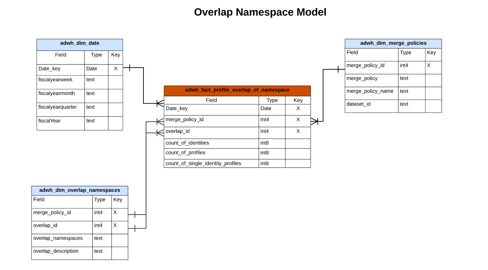

# Modelo de datos de Real-time Customer Data Platform Insights

La función Modelo de datos de perspectivas de Real-time Customer Data Platform expone los modelos de datos y SQL que alimentan las perspectivas para varios widgets de perfil, destino y segmentación. Puede personalizar estas plantillas de consulta SQL para crear informes de Real-Time CDP para los casos de uso de indicadores clave de rendimiento (KPI) y marketing. Estas perspectivas pueden utilizarse como widgets personalizados para los paneles definidos por el usuario. Consulte la documentación de perspectivas de informes de almacén acelerado de consultas para obtener más información [Obtenga información sobre cómo crear un modelo de datos de perspectivas de informes a través del servicio de consultas para utilizarlo con datos de almacenamiento acelerados y paneles definidos por el usuario](../query-service/data-distiller/query-accelerated-store/reporting-insights-data-model.md).

## Requisitos previos

Esta guía requiere una comprensión práctica de la [función de paneles definidos por el usuario](./user-defined-dashboards.md). Lea la documentación antes de continuar con esta guía.

## Informes de perspectivas y casos de uso de Real-Time CDP

Los informes de Real-Time CDP proporcionan perspectivas sobre los datos de perfil y su relación con las audiencias y los destinos. Se desarrollaron varios modelos de esquema de estrella para responder a una variedad de casos de uso de marketing comunes y cada modelo de datos puede admitir varios casos de uso.

>[!IMPORTANT]
>
>Los datos utilizados para los informes de Real-Time CDP son precisos para una política de combinación elegida y a partir de la instantánea diaria más reciente.

### Modelo de perfil {#profile-model}

El modelo de perfil se compone de tres conjuntos de datos:

- `adwh_dim_date`
- `adwh_fact_profile`
- `adwh_dim_merge_policies`

La siguiente imagen contiene los campos de datos relevantes en cada conjunto de datos.


#### El caso de uso de recuento de perfiles

La lógica utilizada para el widget de recuento de perfiles devuelve el número total de perfiles combinados dentro del Almacenamiento de perfiles en el momento en que se tomó la instantánea. Consulte la [[!UICONTROL Recuento de perfiles] documentación del widget](./guides/profiles.md#profile-count) para obtener más información.

El SQL que genera el [!UICONTROL Recuento de perfiles] El widget se ve en la sección contraíble a continuación.

+++Consulta SQL

```sql
SELECT adwh_dim_merge_policies.merge_policy_name,
  sum(adwh_fact_profile.count_of_profiles) CNT
FROM qsaccel.profile_agg.adwh_fact_profile
LEFT OUTER JOIN qsaccel.profile_agg.adwh_dim_merge_policies ON adwh_dim_merge_policies.merge_policy_id=adwh_fact_profile.merge_policy_id
WHERE adwh_fact_profile.date_key='${lastProcessDate}'
AND adwh_fact_profile.merge_policy_id=${mergePolicyId}
GROUP BY adwh_dim_merge_policies.merge_policy_name;
```

+++

#### Caso de uso de perfiles de identidad única

La lógica utilizada para la variable [!UICONTROL Perfiles de identidad únicos] Este widget proporciona un recuento de los perfiles de su organización que solo tienen un tipo de ID que crea su identidad. Consulte la[[!UICONTROL Perfiles de identidad únicos] documentación del widget](./guides/profiles.md#single-identity-profiles) para obtener más información.

El SQL que genera el [!UICONTROL Perfiles de identidad únicos] El widget se ve en la sección contraíble a continuación.

+++Consulta SQL

```sql
SELECT adwh_dim_merge_policies.merge_policy_name,
  sum(adwh_fact_profile.count_of_Single_Identity_profiles) CNT
FROM QSAccel.profile_agg.adwh_fact_profile
LEFT OUTER JOIN QSAccel.profile_agg.adwh_dim_merge_policies ON adwh_dim_merge_policies.merge_policy_id=adwh_fact_profile.merge_policy_id
WHERE adwh_fact_profile.date_key='${lastProcessDate}'
  AND adwh_fact_profile.merge_policy_id =${mergePolicyId}
GROUP BY adwh_dim_merge_policies.merge_policy_name;
```

+++

### Modelo de área de nombres {#namespace-model}

El modelo de área de nombres consta de los siguientes conjuntos de datos:

- `adwh_dim_date`
- `adwh_fact_profile_by_namespace`
- `adwh_dim_merge_policies`
- `adwh_dim_namespaces`

La siguiente imagen contiene los campos de datos relevantes en cada conjunto de datos.


#### Perfiles por caso de uso de identidad

El [!UICONTROL Perfiles por identidad] Este widget muestra el desglose de identidades en todos los perfiles combinados del Almacenamiento de perfiles. Consulte la [[!UICONTROL Perfiles por identidad] documentación del widget](./guides/profiles.md#profiles-by-identity) para obtener más información.

El SQL que genera el [!UICONTROL Perfiles por identidad] El widget se ve en la sección contraíble a continuación.

+++Consulta SQL

```sql
SELECT adwh_dim_namespaces.namespace_description,
    sum(adwh_fact_profile_by_namespace.count_of_profiles) count_of_profiles
FROM qsaccel.profile_agg.adwh_fact_profile_by_namespace
JOIN qsaccel.profile_agg.adwh_dim_namespaces ON adwh_fact_profile_by_namespace.namespace_id = adwh_dim_namespaces.namespace_id
AND adwh_fact_profile_by_namespace.merge_policy_id = adwh_dim_namespaces.merge_policy_id
WHERE adwh_fact_profile_by_namespace.merge_policy_id =${mergePolicyId}
AND adwh_fact_profile_by_namespace.date_key = '${lastProcessDate}'
GROUP BY adwh_fact_profile_by_namespace.date_key,
        adwh_fact_profile_by_namespace.merge_policy_id,
        adwh_dim_namespaces.namespace_description
ORDER BY count_of_profiles DESC
LIMIT 5;
```

+++

#### Perfiles de identidad únicos por caso de uso de identidad

La lógica utilizada para la variable [!UICONTROL Perfiles de identidad únicos por identidad] widget ilustra el número total de perfiles que se identifican con un solo identificador único. Consulte la [Documentación de perfiles de identidad única por widget de identidad](./guides/profiles.md#single-identity-profiles-by-identity) para obtener más información.

El SQL que genera el [!UICONTROL Perfiles de identidad únicos por identidad] El widget se ve en la sección contraíble a continuación.

+++Consulta SQL

```sql
SELECT
  adwh_dim_namespaces.namespace_description,
  sum(adwh_fact_profile_by_namespace.count_of_Single_Identity_profiles) count_of_Single_Identity_profiles
FROM
  qsaccel.profile_agg.adwh_fact_profile_by_namespace
  LEFT OUTER JOIN
    qsaccel.profile_agg.adwh_dim_namespaces
    ON adwh_fact_profile_by_namespace.namespace_id = adwh_dim_namespaces.namespace_id
AND adwh_fact_profile_by_namespace.merge_policy_id = adwh_dim_namespaces.merge_policy_id
WHERE
  adwh_fact_profile_by_namespace.merge_policy_id=${mergePolicyId}
  AND adwh_fact_profile_by_namespace.date_key='${lastProcessDate}'
GROUP BY
  adwh_fact_profile_by_namespace.date_key,
  adwh_fact_profile_by_namespace.merge_policy_id,
  adwh_dim_namespaces.namespace_description;
```

+++

### Modelo de audiencia {#audience-model}

El modelo de audiencia consta de los siguientes conjuntos de datos:

- `adwh_dim_date`
- `adwh_fact_profile_by_segment`
- `adwh_dim_merge_policies`
- `adwh_dim_segments`
- `adwh_dim_br_segment_destinations`
- `adwh_dim_destination`
- `adwh_dim_destination_platform`

La siguiente imagen contiene los campos de datos relevantes en cada conjunto de datos.


#### Caso de uso de tamaño de audiencia

La lógica utilizada para la variable [!UICONTROL Tamaño de audiencia] widget devuelve el número total de perfiles combinados dentro de la audiencia seleccionada en el momento de la instantánea más reciente. Consulte la [[!UICONTROL Tamaño de audiencia] documentación del widget](./guides/audiences.md#audience-size) para obtener más información.

El SQL que genera el [!UICONTROL Tamaño de audiencia] El widget se ve en la sección contraíble a continuación.

+++Consulta SQL

```sql
SELECT adwh_fact_profile_by_segment.date_key,
       adwh_dim_merge_policies.merge_policy_name,
       adwh_dim_segments.segment,
       adwh_dim_segments.segment_name,
       sum(adwh_fact_profile_by_segment.count_of_profiles)count_of_profiles
FROM qsaccel.profile_agg.adwh_fact_profile_by_segment
LEFT OUTER JOIN qsaccel.profile_agg.adwh_dim_segments ON adwh_fact_profile_by_segment.segment_id = adwh_dim_segments.segment_id
LEFT OUTER JOIN qsaccel.profile_agg.adwh_dim_merge_policies ON adwh_fact_profile_by_segment.merge_policy_id=adwh_dim_merge_policies.merge_policy_id
WHERE adwh_fact_profile_by_segment.date_key ='${lastProcessDate}'
  AND adwh_fact_profile_by_segment.merge_policy_id=${mergePolicyId}
GROUP BY adwh_fact_profile_by_segment.date_key,
         adwh_dim_merge_policies.merge_policy_name,
         adwh_dim_segments.segment,
         adwh_dim_segments.segment_name
ORDER BY count_of_profiles DESC
LIMIT 20;
```

+++

#### Caso de uso de tendencia de cambio de tamaño de audiencia

La lógica utilizada para la variable [!UICONTROL Tendencia de cambio de tamaño de audiencia] El widget proporciona una ilustración de un gráfico de líneas de la diferencia en el número total de perfiles aptos para una audiencia determinada entre las instantáneas diarias más recientes. Consulte la [[!UICONTROL Tendencia de cambio de tamaño de audiencia] documentación del widget](./guides/audiences.md#audience-size-change-trend) para obtener más información.

El SQL que genera el [!UICONTROL Tendencia de cambio de tamaño de audiencia] El widget se ve en la sección contraíble a continuación.

+++Consulta SQL

```sql
SELECT DISTINCT cast(adwh_dim_segments.create_date AS Date) Date_key, adwh_dim_merge_policies.merge_policy_name,
  count(DISTINCT adwh_dim_segments.segment_id)Segments_Added
FROM qsaccel.profile_agg.adwh_fact_profile_by_segment
JOIN qsaccel.profile_agg.adwh_dim_segments ON adwh_fact_profile_by_segment.segment_id = adwh_dim_segments.segment_id
JOIN qsaccel.profile_agg.adwh_dim_merge_policies ON adwh_fact_profile_by_segment.merge_policy_id=adwh_dim_merge_policies.merge_policy_id
WHERE Cast(adwh_dim_segments.create_date AS date) >= dateadd(DAY, - ${dayRange}, '${lastProcessDate}')
AND adwh_fact_profile_by_segment.merge_policy_id=${mergePolicyId}
GROUP BY cast(adwh_dim_segments.create_date AS date), adwh_dim_merge_policies.merge_policy_name ;
```

+++

#### Caso de uso de destinos más utilizados

La lógica utilizada en la variable [!UICONTROL Destinos más utilizados] widget enumera los destinos más utilizados de su organización según el número de audiencias asignadas a ellos. Esta clasificación proporciona una perspectiva de los destinos que se están utilizando, pero también muestra potencialmente aquellos que pueden estar infrautilizados. Consulte la documentación de la [[!UICONTROL Destinos más utilizados] widget](./guides/destinations.md#most-used-destinations) para obtener más información.

El SQL que genera el [!UICONTROL Destinos más utilizados] El widget se ve en la sección contraíble a continuación.

+++Consulta SQL

```sql
SELECT
   adwh_dim_destination.destination_name, adwh_dim_destination.destination_id,
   count( distinct adwh_dim_br_segment_destinations.segment_id ) segment_count
FROM
   qsaccel.profile_agg.adwh_dim_destination
   join qsaccel.profile_agg.adwh_dim_br_segment_destinations
 ON
   adwh_dim_destination.destination_id = adwh_dim_br_segment_destinations.destination_id
 WHERE
   adwh_dim_destination.destination_name is not null
 group by
   adwh_dim_destination.destination_name,
   adwh_dim_destination.destination_id
   order by segment_count desc limit 5;
```

+++

#### Caso de uso de audiencias activadas recientemente

La lógica del [!UICONTROL Audiencias activadas recientemente] widget proporciona una lista de las audiencias asignadas más recientemente a un destino. Esta lista proporciona una instantánea de los públicos y destinos que se utilizan activamente en el sistema y puede ayudar a solucionar cualquier asignación errónea. Consulte la [[!UICONTROL Audiencias activadas recientemente] documentación del widget](./guides/destinations.md#recently-activated-audiences) para obtener más información.

El SQL que genera el [!UICONTROL Audiencias activadas recientemente] El widget se ve en la sección contraíble a continuación.

+++Consulta SQL

```sql
SELECT segment_name, segment, destination_name, a.create_time create_time
FROM qsaccel.profile_agg.adwh_dim_br_segment_destinations a
INNER JOIN qsaccel.profile_agg.adwh_dim_segments b ON a.segment_id = b.segment_id
INNER JOIN qsaccel.profile_agg.adwh_dim_destination c ON a.destination_id = c.destination_id
ORDER BY create_time desc, segment LIMIT 5;
```

+++

### Modelo Área de nombres-audiencia

El modelo de espacio de nombres-audiencia consta de los siguientes conjuntos de datos:

- `adwh_dim_date`
- `adwh_dim_namespaces`
- `adwh_fact_profile_by_segment_and_namespace`
- `adwh_dim_merge_policies`
- `adwh_dim_segments`
- `adwh_dim_br_segment_destinations`
- `adwh_dim_destination`
- `adwh_dim_destination_platform`

La siguiente imagen contiene los campos de datos relevantes en cada conjunto de datos.


#### Perfiles por identidad para un caso de uso de audiencia

La lógica utilizada en la variable [!UICONTROL Perfiles por identidad] El widget proporciona un desglose de identidades en todos los perfiles combinados del Almacenamiento de perfiles para una audiencia determinada. Consulte la [[!UICONTROL Perfiles por identidad] documentación del widget](./guides/audiences.md#profiles-by-identity) para obtener más información.

El SQL que genera el [!UICONTROL Perfiles por identidad] El widget se ve en la sección contraíble a continuación.

+++Consulta SQL

```sql
SELECT adwh_dim_namespaces.namespace_description,
  sum( adwh_fact_profile_by_segment_and_namespace.count_of_profiles) count_of_profiles
FROM qsaccel.profile_agg.adwh_fact_profile_by_segment_and_namespace
LEFT OUTER JOIN qsaccel.profile_agg.adwh_dim_namespaces
ON adwh_fact_profile_by_segment_and_namespace.namespace_id = adwh_dim_namespaces.namespace_id
AND adwh_fact_profile_by_segment_and_namespace.merge_policy_id = adwh_dim_namespaces.merge_policy_id
WHERE adwh_fact_profile_by_segment_and_namespace.segment_id = {segment_id}
AND adwh_fact_profile_by_segment_and_namespace.merge_policy_id = {merge_policy_id}
AND adwh_fact_profile_by_segment_and_namespace.date_key = '{date}'
GROUP BY adwh_dim_namespaces.namespace_description;
```

+++

### Superponer modelo de área de nombres

El modelo de área de nombres de superposición consta de los siguientes conjuntos de datos:

- `adwh_dim_date`
- `adwh_dim_overlap_namespaces`
- `adwh_fact_profile_overlap_of_namespace`
- `adwh_dim_merge_policies`

La siguiente imagen contiene los campos de datos relevantes en cada conjunto de datos.



#### Caso de uso de superposición de identidad (perfiles)

La lógica utilizada en la variable [!UICONTROL Superposición de identidad] widget muestra la superposición de perfiles en su **Almacenamiento de perfiles** que contienen las dos identidades seleccionadas. Para obtener más información, consulte la [[!UICONTROL Superposición de identidad] sección de widget de [!UICONTROL Perfiles] documentación del panel](./guides/profiles.md#identity-overlap).

El SQL que genera el [!UICONTROL Superposición de identidad] El widget se ve en la sección contraíble a continuación.

+++Consulta SQL

```sql
SELECT Sum(overlap_col1) overlap_col1,
       Sum(overlap_col2) overlap_col2,
       coalesce(Sum(overlap_count), 0) overlap_count
  FROM
    (SELECT 0 overlap_col1,
            0 overlap_col2,
            Sum(count_of_profiles) overlap_count
     FROM qsaccel.profile_agg.adwh_fact_profile_overlap_of_namespace
     WHERE adwh_fact_profile_overlap_of_namespace.merge_policy_id = ${mergePolicyId}
       AND adwh_fact_profile_overlap_of_namespace.date_key = '${lastProcessDate}'
       AND adwh_fact_profile_overlap_of_namespace.overlap_id IN
         (SELECT adwh_dim_overlap_namespaces.overlap_id
          FROM qsaccel.profile_agg.adwh_dim_overlap_namespaces
          WHERE adwh_dim_overlap_namespaces.merge_policy_id=${mergePolicyId}
            AND adwh_dim_overlap_namespaces.overlap_namespaces IN ('${namespace1}',
                                                                   '${namespace2}')
          GROUP BY adwh_dim_overlap_namespaces.overlap_id
          HAVING Count(*) > 1)
     UNION ALL SELECT count_of_profiles overlap_col1,
                      0 overlap_col2,
                      0 overlap_count
     FROM qsaccel.profile_agg.adwh_fact_profile_by_namespace
     JOIN qsaccel.profile_agg.adwh_dim_namespaces ON
     adwh_fact_profile_by_namespace.namespace_id = adwh_dim_namespaces.namespace_id
     AND adwh_fact_profile_by_namespace.merge_policy_id = adwh_dim_namespaces.merge_policy_id
     WHERE adwh_fact_profile_by_namespace.merge_policy_id = ${mergePolicyId}
       AND adwh_fact_profile_by_namespace.date_key = '${lastProcessDate}'
       AND adwh_dim_namespaces.namespace_description = '${namespace1}'
     UNION ALL SELECT 0 overlap_col1,
                      count_of_profiles overlap_col2,
                      0 Overlap_count
     FROM qsaccel.profile_agg.adwh_fact_profile_by_namespace
     JOIN qsaccel.profile_agg.adwh_dim_namespaces ON
     adwh_fact_profile_by_namespace.namespace_id = adwh_dim_namespaces.namespace_id
     AND adwh_fact_profile_by_namespace.merge_policy_id = adwh_dim_namespaces.merge_policy_id
     WHERE adwh_fact_profile_by_namespace.merge_policy_id = ${mergePolicyId}
       AND adwh_fact_profile_by_namespace.date_key = '${lastProcessDate}'
       AND adwh_dim_namespaces.namespace_description = '${namespace2}' ) a;
```

+++

### Superponer área de nombres por modelo de audiencia

El área de nombres de superposición por modelo de audiencia consta de los siguientes conjuntos de datos:

- `adwh_dim_date`
- `adwh_dim_overlap_namespaces`
- `adwh_fact_profile_overlap_of_namespace_by_segment`
- `adwh_dim_merge_policies`
- `adwh_dim_segments`
- `adwh_dim_br_segment_destinations`
- `adwh_dim_destination`
- `adwh_dim_destination_platform`

La siguiente imagen contiene los campos de datos relevantes en cada conjunto de datos.


#### Caso de uso de superposición de identidad (audiencias)

La lógica utilizada en la variable [!UICONTROL Audiencias] tablero [!UICONTROL Superposición de identidad] widget ilustra la superposición de perfiles que contienen las dos identidades seleccionadas para una audiencia particular. Para obtener más información, consulte la [[!UICONTROL Superposición de identidad] sección de widget de [!UICONTROL Audiencias] documentación del panel](./guides/audiences.md#identity-overlap).

El SQL que genera el [!UICONTROL Superposición de identidad] El widget se ve en la sección contraíble a continuación.

+++Consulta SQL

```sql
SELECT
   Sum(overlap_col1) overlap_col1,
   Sum( overlap_col2) overlap_col2,
   Sum(overlap_count) Overlap_count
FROM
   (
      SELECT
         0 overlap_col1,
         0 overlap_col2,
         Sum(count_of_profiles) Overlap_count
      FROM
         qsaccel.profile_agg.adwh_fact_profile_overlap_of_namespace_by_segment
      WHERE
         adwh_fact_profile_overlap_of_namespace_by_segment.segment_id = $ {segmentId}
         and adwh_fact_profile_overlap_of_namespace_by_segment.merge_policy_id =$ {mergePolicyId}
         and adwh_fact_profile_overlap_of_namespace_by_segment.date_key = '${lastProcessDate}'
         and adwh_fact_profile_overlap_of_namespace_by_segment.overlap_id IN
         (
            SELECT
               adwh_dim_overlap_namespaces.overlap_id
            FROM
               qsaccel.profile_agg.adwh_dim_overlap_namespaces
            WHERE
               adwh_dim_overlap_namespaces.merge_policy_id =$ {mergePolicyId}
               AND adwh_dim_overlap_namespaces.overlap_namespaces IN
               (
                  '${namespace1}',
                  '${namespace2}'
               )
            GROUP BY
               adwh_dim_overlap_namespaces.overlap_id
            HAVING
               Count(*) > 1
         )
      UNION ALL
      SELECT
         count_of_profiles overlap_col1,
         0 overlap_col2,
         0 Overlap_count
      FROM
         qsaccel.profile_agg.adwh_fact_profile_by_segment_and_namespace
         LEFT OUTER JOIN
            qsaccel.profile_agg.adwh_dim_namespaces
            ON adwh_fact_profile_by_segment_and_namespace.namespace_id = adwh_dim_namespaces.namespace_id
            and adwh_fact_profile_by_segment_and_namespace.merge_policy_id = adwh_dim_namespaces.merge_policy_id
      WHERE
         adwh_dim_namespaces.namespace_description = '${namespace1}'
         and adwh_fact_profile_by_segment_and_namespace.segment_id = $ {segmentId}
         and adwh_fact_profile_by_segment_and_namespace.merge_policy_id =$ {mergePolicyId}
         and adwh_fact_profile_by_segment_and_namespace.date_key = '${lastProcessDate}'
      UNION ALL
      SELECT
         0 overlap_col1,
         count_of_profiles overlap_col2,
         0 Overlap_count
      FROM
         qsaccel.profile_agg.adwh_fact_profile_by_segment_and_namespace
         LEFT OUTER JOIN
            qsaccel.profile_agg.adwh_dim_namespaces
            ON adwh_fact_profile_by_segment_and_namespace.namespace_id = adwh_dim_namespaces.namespace_id
            and adwh_fact_profile_by_segment_and_namespace.merge_policy_id = adwh_dim_namespaces.merge_policy_id
      WHERE
         adwh_dim_namespaces.namespace_description = '${namespace2}'
         and adwh_fact_profile_by_segment_and_namespace.segment_id = $ {segmentId}
         and adwh_fact_profile_by_segment_and_namespace.merge_policy_id =$ {mergePolicyId}
         and adwh_fact_profile_by_segment_and_namespace.date_key = '${lastProcessDate}'
   )
   a;
```

+++
