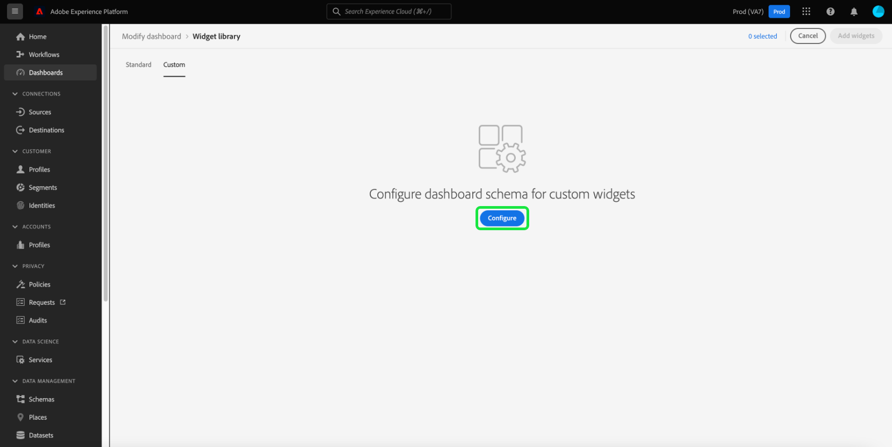

# Editar esquema para crear widgets personalizados

Para crear utilidades personalizadas para paneles de Adobe Experience Platform, primero debe identificar los atributos de perfil del cliente en tiempo real en los que se basarán las utilidades.

Esta guía proporciona instrucciones paso a paso para editar el esquema de su organización seleccionando atributos para crear widgets de tablero personalizados.

Una vez seleccionados los atributos y configurado el esquema, puede continuar con los pasos para [creación de widgets personalizados para los tableros](custom-widgets.md).

>[!NOTE]
>
>Se debe conceder a los usuarios el permiso &quot;Administrar tableros estándar&quot; para poder editar el esquema. Para ver los pasos sobre la concesión de permisos de acceso para los paneles, consulte la [guía de permisos del panel](../permissions.md).

## Biblioteca de utilidades {#widget-library}

Esta guía requiere acceso al [!UICONTROL Biblioteca de utilidades] en Experience Platform. Para obtener más información sobre la biblioteca de widgets y cómo acceder a ella dentro de la interfaz de usuario, comience por leer la [información general de la biblioteca de utilidades](widget-library.md).

## Editar esquema

Dentro de la biblioteca de utilidades, la variable **[!UICONTROL Personalizado]** le permite crear utilidades y compartirlas con otros usuarios de su organización para personalizar el aspecto de sus tableros.

Para poder crear utilidades personalizadas, se deben seleccionar los atributos de Perfil del cliente en tiempo real para garantizar que los datos se incluyan como parte de la instantánea diaria.

>[!IMPORTANT]
>
>Su organización puede seleccionar un máximo de 20 atributos.

Si su organización no ha seleccionado ningún atributo de perfil, comience por seleccionar **[!UICONTROL Configurar]** en el centro de la pantalla.

Cuando se haya creado al menos un atributo personalizado, seleccione **[!UICONTROL Edición del esquema]** para ver los atributos seleccionados y agregar más.

## Seleccionar un atributo

Para seleccionar un atributo en la variable **[!UICONTROL Seleccionar campo de esquema de unión]** , vaya al atributo en el esquema de unión (o utilice search) y seleccione la casilla situada junto al atributo . Al seleccionar la casilla de verificación, también se agrega el atributo a la variable **[!UICONTROL Atributos seleccionados]** en el lado derecho del cuadro de diálogo.

>[!NOTE]
>
>Para que un atributo esté visible para su selección, debe ser uno de los siguientes: Cadena, Fecha, Fecha-Hora, Booleano, Corto, Largo, Entero o Byte. Los tipos de datos Mapa y Doble no son compatibles y aparecen atenuados para que no se puedan seleccionar.

Después de elegir los atributos que desea añadir, seleccione **[!UICONTROL Guardar]** para guardar los atributos y volver a la pestaña widgets personalizados .

>[!WARNING]
>Los atributos recién seleccionados estarán disponibles después de la siguiente instantánea diaria cuando se actualicen los datos.

## Pasos siguientes

Después de leer esta guía, puede navegar a la biblioteca de utilidades y seleccionar los atributos del perfil del cliente en tiempo real para configurar el esquema. Con los atributos de perfil seleccionados, puede empezar [creación de widgets personalizados para los tableros](custom-widgets.md).
