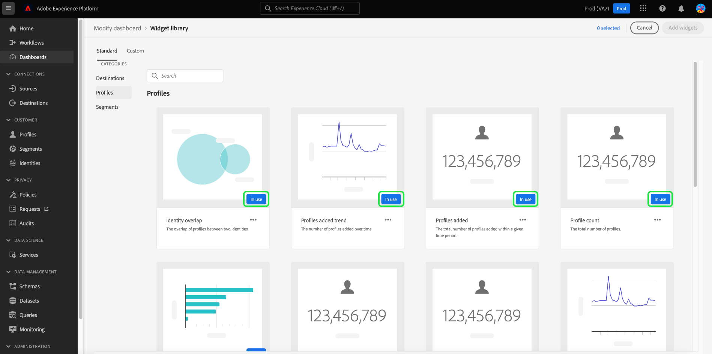

# Resumen de biblioteca de widgets

En la interfaz de usuario de Adobe Experience Platform, puede ver los datos de su organización e interactuar con ellos mediante varios paneles. También puede actualizar ciertos paneles si agrega widgets a la vista de panel.

Esta guía proporciona instrucciones paso a paso para obtener acceso a la [!UICONTROL biblioteca de widgets] en Experience Platform, donde puede seleccionar widgets estándar y crear widgets personalizados para personalizar la información que se muestra en los paneles.

>[!NOTE]
>
>Las actualizaciones realizadas en los paneles se realizan por organización y por zona protegida.

Para obtener información sobre cómo modificar la ubicación y el tamaño de los widgets que ya se muestran en los paneles, consulte [modificar guía de paneles](modify.md).

## Acceso a la biblioteca de widgets {#access}

Desde cualquier tablero (por ejemplo, el de perfiles), seleccione **[!UICONTROL Agregar widget]** para navegar directamente a la biblioteca de widgets, donde podrá [agregar widgets](#add-widgets) al tablero.

Seleccione **[!UICONTROL Modificar tablero]** para mover, cambiar el tamaño o quitar widgets del tablero. Desde esta pantalla también puede seleccionar **[!UICONTROL Biblioteca de widgets]** para examinar y [agregar widgets](#add-widgets). Para obtener información sobre cómo editar el tamaño y el diseño de los widgets, consulte la [Documentación sobre modificación de tableros](./modify.md).

Seleccione **[!UICONTROL Biblioteca de widgets]** para abrir la biblioteca de widgets y ver todas las métricas estándar disponibles o empezar a crear widgets personalizados.

## Añadir widgets {#add-widgets}

En la [!UICONTROL biblioteca de widgets], seleccione cualquier widget de la lista de widgets estándar o personalizados disponibles. Una marca de verificación en la esquina del widget indica su selección.

### Etiqueta en uso {#in-use-label}

Los widgets que ya se agregaron a un tablero tienen una etiqueta [!UICONTROL En uso] adjunta cuando se ven en la biblioteca de widgets. Esta etiqueta resalta los widgets que ya se han añadido al panel para evitar duplicaciones. Aunque, todavía puede añadir el mismo widget más de una vez si lo desea.

Una vez que haya seleccionado todos los widgets necesarios, seleccione **[!UICONTROL Agregar widgets]** para confirmar su elección y agregar los widgets a su panel.

## Widgets estándar y personalizados {#standard-and-custom}

La biblioteca [!UICONTROL Widget] contiene dos fichas:

* **[!UICONTROL Estándar]:** La ficha estándar contiene widgets proporcionados por el Adobe. Puede actualizar los paneles mediante cualquiera de estas métricas estándar. Para obtener más información sobre cómo agregar widgets estándar al panel, consulte la guía de [uso de widgets estándar en los paneles](standard-widgets.md).
* **[!UICONTROL Personalizado]:** La ficha personalizada le permite crear y compartir widgets dentro de su organización. Para ver los pasos completos para crear sus propios widgets, consulte la [guía de widgets personalizados para paneles](custom-widgets.md).

## Pasos siguientes

Después de leer este documento, ahora puede acceder a la biblioteca de widgets en la interfaz de usuario de Experience Platform. Para modificar el tamaño y la ubicación de los widgets que aparecen en el panel, consulte la [guía de paneles de modificación](modify.md).
