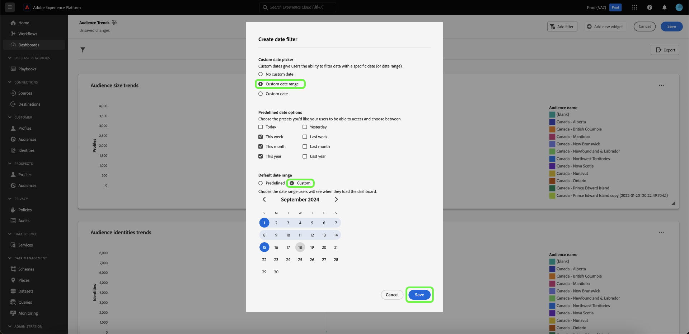

# Creación de un filtro de fecha {#create-date-filter}

Para filtrar las perspectivas por fecha, debe agregar parámetros a las consultas SQL que puedan aceptar restricciones de fecha. Esto se realiza como parte del flujo de trabajo de creación de perspectivas del modo query pro. Consulte la [documentación del modo query pro](#query-pro-mode) para obtener información sobre cómo introducir SQL para sus datos.

Los parámetros de consulta permiten trabajar con datos dinámicos, ya que actúan como marcadores de posición para los valores que agrega en el momento de la ejecución. Estos valores de marcador de posición se pueden actualizar a través de la interfaz de usuario y permiten que usuarios menos técnicos actualicen las perspectivas en función de intervalos de fechas.

Si no está familiarizado con los parámetros de consulta, consulte la documentación para obtener [instrucciones sobre cómo implementar consultas parametrizadas](../../../../query-service/ui/parameterized-queries.md).

## Aplicar un filtro de fecha a un panel {#apply-date-filter}

Para aplicar un filtro de fecha, seleccione **[!UICONTROL Agregar filtro]** y, a continuación, **[!UICONTROL Filtro de fecha]** en el menú desplegable de la vista de panel.


Se le presentarán las siguientes opciones de filtrado de fechas.

| Filtro | Descripción |
| --- | --- |
| Sin fechas personalizadas | Seleccione una o más fechas personalizadas de varios valores preestablecidos. |
| Intervalo de fechas personalizado | Seleccione una o más fechas personalizadas de varios valores preestablecidos o especifique un intervalo de fechas personalizado. |
| Fecha personalizada | Seleccione entre los valores preestablecidos o especifique la fecha de inicio del panel. |


### Crear un filtro de fecha no personalizado

Para aplicar un filtro de fecha predefinido, seleccione **[!UICONTROL Sin fecha personalizada]** y, a continuación, seleccione las opciones de fecha predefinidas que desee incluir. Finalmente, use el menú desplegable para seleccionar el intervalo de fechas predeterminado y luego seleccione **[!UICONTROL Guardar]**.


Volverá al panel, que muestra el intervalo de fechas predeterminado seleccionado anteriormente. Utilice el menú desplegable para seleccionar otro intervalo de fecha preestablecido.


### Crear un filtro de intervalo de fechas personalizado

Para aplicar un filtro de intervalo de fechas personalizado, seleccione **[!UICONTROL Intervalo de fechas personalizado]** y, a continuación, las opciones de fechas predefinidas que desee incluir. Finalmente, seleccione **[!UICONTROL Personalizado]** para establecer el intervalo de fechas predeterminado. Use el calendario para especificar un intervalo de fechas y luego seleccione **[!UICONTROL Guardar]**.

>[!NOTE]
>
>No es necesario seleccionar opciones de fecha predefinidas.



Volverá al tablero, que muestra el intervalo de datos personalizados especificado anteriormente. Utilice el menú desplegable para seleccionar otro intervalo de fecha preestablecido.


### Creación de un filtro de fecha personalizado

Para aplicar un filtro de fecha personalizado, seleccione **[!UICONTROL Fecha personalizada]** y las opciones de fecha predefinidas que desee incluir. Finalmente, selecciona **[!UICONTROL Personalizado]** y luego usa el calendario para seleccionar una fecha de inicio. Finalmente, seleccione **[!UICONTROL Guardar]**.

>[!NOTE]
>
>No es necesario seleccionar opciones de fecha predefinidas.


Volverá al tablero, que muestra los datos personalizados especificados anteriormente. Utilice el menú desplegable para seleccionar otra fecha.


## Eliminación de un filtro de fecha {#delete-date-filter}

Para quitar el filtro de fecha, seleccione el icono Eliminar filtro ().


## Edite el SQL para incluir parámetros de consulta de fecha {#include-date-parameters}

A continuación, asegúrese de que SQL incluya parámetros de consulta para permitir un intervalo de fechas. Si todavía no ha incorporado parámetros de consulta en el SQL, edite las perspectivas para incluir estos parámetros. Consulte la documentación para obtener instrucciones sobre cómo [editar una perspectiva](../overview.md#edit).

>[!TIP]
>
>Se recomienda agregar los parámetros `$START_DATE` y `$END_DATE` a la instrucción SQL en cada uno de los gráficos para los que desea habilitar los filtros de fecha.

>[!NOTE]
>
>Los filtros de fecha no admiten restricciones temporales. El filtro solo se aplica a intervalos de fechas. Esto significa que si tiene varios informes en un periodo de 24 horas, no puede distinguir entre distintas horas dentro del mismo día. Por este motivo, se recomienda convertir el componente de tiempo como una fecha.

Si el modelo de datos o las tablas que está analizando tienen un componente de tiempo, puede agrupar los datos por fecha y, a continuación, aplicar estos filtros de fecha.

La instrucción SQL de ejemplo siguiente muestra cómo incorporar `$START_DATE` y `$END_DATE` parámetros y utiliza `cast` para enmarcar el componente de tiempo como una fecha.

```sql
SELECT Sum(personalization_consent_count) AS Personalization,
       Sum(datacollection_consent_count)  AS Datacollection,
       Sum(datasharing_consent_count)     AS Datasharing
FROM   fact_daily_consent_aggregates f
       INNER JOIN dim_consent_valued
               ON f.consent_value_id = d.consent_value_id
WHERE  f.date BETWEEN Upper(Coalesce(Cast('$START_DATE' AS date), '')) AND Upper
                      (
                             Coalesce(Cast('$END_DATE' AS date), ''))
       AND ( ( Upper(Coalesce($consent_value_filter, '')) IN ( '', 'NULL' ) )
              OR ( f.consent_value_id IN ( $consent_value_filter ) ) )
LIMIT  0; 
```

La captura de pantalla siguiente resalta las restricciones de fecha incorporadas en la instrucción SQL y los pares de valor clave de parámetro de consulta.

>[!NOTE]
>
>Al maquetar la instrucción en modo query pro, debe proporcionar valores de ejemplo para cada parámetro para ejecutar la instrucción SQL y crear el gráfico. Los valores de ejemplo que proporcione al maquetar la instrucción se sustituirán por los valores reales que seleccione para el filtro de fecha (o global) durante la ejecución.

![Cuadro de diálogo [!UICONTROL Introducir SQL] con los parámetros de fecha resaltados en el SQL.](../../../images/sql-insights/sql-date-parameters.png)

## Habilitar parámetros de fecha en cada perspectiva {#enable-date-parameters}

Una vez que haya incorporado los parámetros adecuados al SQL de sus perspectivas, las variables `Start_date` y `End_date` ya están disponibles como alternadores en el compositor de widgets. Consulte la [sección de población de widgets del modo query pro](#populate-widget) para obtener información sobre cómo editar una perspectiva.

En el compositor de widgets, seleccione las alternancias para habilitar los parámetros `Start_date` y `End_date`.


A continuación, seleccione los parámetros de consulta adecuados en los menús desplegables.


Finalmente, selecciona **[!UICONTROL Guardar y cerrar]** para regresar a tu panel. Los filtros de fecha ahora están habilitados para todas las perspectivas que tienen parámetros de fecha de inicio y finalización.
