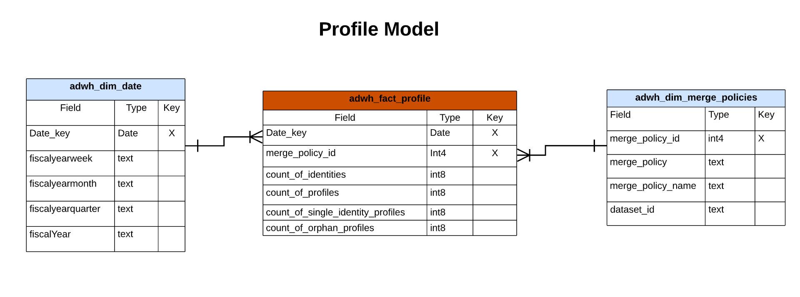

# B2C Edition del modelo de datos de Real-Time Customer Data Platform Insights

El modelo de datos de Real-Time Customer Data Platform Insights para [B2C Edition](../../rtcdp/overview.md#rtcdp-b2c) expone los modelos de datos y SQL que alimentan las perspectivas para varios widgets de perfil, destino y segmentación. Puede personalizar estas plantillas de consulta SQL para crear informes de Real-Time CDP para los casos de uso de indicadores clave de rendimiento (KPI) y marketing. Estas perspectivas pueden utilizarse como widgets personalizados para los paneles definidos por el usuario. Consulte la documentación de perspectivas de informes de almacén acelerado de consultas para aprender [a crear un modelo de datos de perspectivas de informes a través del servicio de consultas para utilizarlo con datos de almacén acelerados y paneles definidos por el usuario](../../query-service/data-distiller/sql-insights/reporting-insights-data-model.md).

>[!NOTE]
>
>El término &quot;segmento&quot; se ha actualizado a &quot;audiencia&quot; en todos los sistemas Adobe Experience Platform. Algunas referencias a segmentos permanecen en uso para rutas de archivos y convenciones de nomenclatura de conjuntos de datos.

## Requisitos previos

Esta guía requiere una comprensión práctica de la [función de paneles definida por el usuario](../standard-dashboards.md). Lea la documentación antes de continuar con esta guía.

## Informes y casos de uso de Real-Time CDP insight

Los informes de Real-Time CDP proporcionan perspectivas sobre los datos de perfil y su relación con las audiencias y los destinos. Se desarrollaron varios modelos de esquema de estrella para responder a una variedad de casos de uso de marketing comunes y cada modelo de datos puede admitir varios casos de uso.

>[!IMPORTANT]
>
>Los datos utilizados para los informes de Real-Time CDP son precisos para una política de combinación elegida y a partir de la instantánea diaria más reciente.

### Modelo de perfil {#profile-model}

El modelo de perfil se compone de tres conjuntos de datos:

- `adwh_dim_date`
- `adwh_fact_profile`
- `adwh_dim_merge_policies`

La siguiente imagen contiene los campos de datos relevantes en cada conjunto de datos.



#### El caso de uso de recuento de perfiles {#profile-count}

La lógica utilizada para el widget [!UICONTROL Profile count] devuelve el número total de perfiles combinados dentro del almacén de perfiles en el momento en que se tomó la instantánea. Consulte la documentación del widget [[!UICONTROL Profile count]](../guides/profiles.md#profile-count) para obtener más información.

El SQL que genera el widget [!UICONTROL Profile count] se ve en la sección contraíble a continuación.

+++Consulta SQL

```sql
SELECT qsaccel.profile_agg.adwh_dim_merge_policies.merge_policy_name,
       sum(qsaccel.profile_agg.adwh_fact_profile.count_of_profiles) CNT
  FROM qsaccel.profile_agg.adwh_fact_profile
  LEFT OUTER JOIN qsaccel.profile_agg.adwh_dim_merge_policies ON qsaccel.profile_agg.adwh_dim_merge_policies.merge_policy_id=adwh_fact_profile.merge_policy_id
  WHERE qsaccel.profile_agg.adwh_fact_profile.date_key='2024-01-10'
    AND qsaccel.profile_agg.adwh_fact_profile.merge_policy_id = 2027892989
  GROUP BY qsaccel.profile_agg.adwh_dim_merge_policies.merge_policy_name;
```

+++

#### Caso de uso de perfiles de identidad única {#single-identity-profiles}

La lógica utilizada para el widget [!UICONTROL Single identity profiles] proporciona un recuento de los perfiles de su organización que solo tienen un tipo de ID que crea su identidad. Consulte la documentación del widget [[!UICONTROL Single identity profiles]](../guides/profiles.md#single-identity-profiles) para obtener más información.

El SQL que genera el widget [!UICONTROL Single identity profiles] se ve en la sección contraíble a continuación.

+++Consulta SQL

```sql
SELECT qsaccel.profile_agg.adwh_dim_merge_policies.merge_policy_name,
       sum(qsaccel.profile_agg.adwh_fact_profile.count_of_Single_Identity_profiles) CNT
  FROM qsaccel.profile_agg.adwh_fact_profile
  LEFT OUTER JOIN qsaccel.profile_agg.adwh_dim_merge_policies ON qsaccel.profile_agg.adwh_dim_merge_policies.merge_policy_id=adwh_fact_profile.merge_policy_id
  WHERE qsaccel.profile_agg.adwh_fact_profile.date_key='2024-01-10'
    AND qsaccel.profile_agg.adwh_fact_profile.merge_policy_id = 2027892989
  GROUP BY qsaccel.profile_agg.adwh_dim_merge_policies.merge_policy_name;
```

+++

### Modelo de área de nombres {#namespace-model}

El modelo de área de nombres consta de los siguientes conjuntos de datos:

- `adwh_dim_date`
- `adwh_fact_profile_by_namespace`
- `adwh_dim_merge_policies`
- `adwh_dim_namespaces`

La siguiente imagen contiene los campos de datos relevantes en cada conjunto de datos.


#### Perfiles por caso de uso de identidad {#profiles-by-identity}

El widget [!UICONTROL Profiles by identity] muestra el desglose de identidades en todos los perfiles combinados del almacén de perfiles. Consulte la documentación del widget [[!UICONTROL Profiles by identity]](../guides/profiles.md#profiles-by-identity) para obtener más información.

El SQL que genera el widget [!UICONTROL Profiles by identity] se ve en la sección contraíble a continuación.

+++Consulta SQL

```sql
SELECT qsaccel.profile_agg.adwh_dim_namespaces.namespace_description,
        sum(qsaccel.profile_agg.adwh_fact_profile_by_namespace_trendlines.count_of_profiles) count_of_profiles
  FROM qsaccel.profile_agg.adwh_fact_profile_by_namespace_trendlines
  LEFT OUTER JOIN qsaccel.profile_agg.adwh_dim_namespaces ON qsaccel.profile_agg.adwh_fact_profile_by_namespace_trendlines.namespace_id = qsaccel.profile_agg.adwh_dim_namespaces.namespace_id
  AND qsaccel.profile_agg.adwh_fact_profile_by_namespace_trendlines.merge_policy_id = qsaccel.profile_agg.adwh_dim_namespaces.merge_policy_id
  WHERE qsaccel.profile_agg.adwh_fact_profile_by_namespace_trendlines.merge_policy_id = 2027892989
    AND qsaccel.profile_agg.adwh_fact_profile_by_namespace_trendlines.date_key = '2024-01-10'
  GROUP BY qsaccel.profile_agg.adwh_fact_profile_by_namespace_trendlines.date_key,
          qsaccel.profile_agg.adwh_fact_profile_by_namespace_trendlines.merge_policy_id,
          qsaccel.profile_agg.adwh_dim_namespaces.namespace_description
  ORDER BY count_of_profiles DESC;
```

+++

#### Perfiles de identidad únicos por caso de uso de identidad {#single-identity-profiles-by-identity}

La lógica utilizada para el widget [!UICONTROL Single identity profiles by identity] ilustra el número total de perfiles que se identifican con un solo identificador único. Consulte la [documentación del widget de identidad &#x200B;](../guides/profiles.md#single-identity-profiles-by-identity) para obtener más información.

El SQL que genera el widget [!UICONTROL Single identity profiles by identity] se ve en la sección contraíble a continuación.

+++Consulta SQL

```sql
SELECT qsaccel.profile_agg.adwh_dim_namespaces.namespace_description,
        sum(qsaccel.profile_agg.adwh_fact_profile_by_namespace_trendlines.count_of_Single_Identity_profiles) count_of_Single_Identity_profiles
  FROM qsaccel.profile_agg.adwh_fact_profile_by_namespace_trendlines
  LEFT OUTER JOIN qsaccel.profile_agg.adwh_dim_namespaces ON qsaccel.profile_agg.adwh_fact_profile_by_namespace_trendlines.namespace_id = qsaccel.profile_agg.adwh_dim_namespaces.namespace_id
  AND qsaccel.profile_agg.adwh_fact_profile_by_namespace_trendlines.merge_policy_id = qsaccel.profile_agg.adwh_dim_namespaces.merge_policy_id
  WHERE qsaccel.profile_agg.adwh_fact_profile_by_namespace_trendlines.merge_policy_id = 2027892989
    AND qsaccel.profile_agg.adwh_fact_profile_by_namespace_trendlines.date_key = '2024-01-10'
  GROUP BY qsaccel.profile_agg.adwh_fact_profile_by_namespace_trendlines.date_key,
          qsaccel.profile_agg.adwh_fact_profile_by_namespace_trendlines.merge_policy_id,
          qsaccel.profile_agg.adwh_dim_namespaces.namespace_description;
```

+++

### Modelo de audiencia {#audience-model}

El modelo de audiencia consta de los siguientes conjuntos de datos:

- `adwh_dim_date`
- `adwh_fact_profile_by_segment`
- `adwh_dim_merge_policies`
- `adwh_dim_segments`
- `adwh_dim_br_segment_destinations`
- `adwh_dim_destination`
- `adwh_dim_destination_platform`

La siguiente imagen contiene los campos de datos relevantes en cada conjunto de datos.


#### Caso de uso de tamaño de audiencia {#audience-size}

La lógica utilizada para el widget [!UICONTROL Audience size] devuelve el número total de perfiles combinados dentro de la audiencia seleccionada en el momento de la instantánea más reciente. Consulte la documentación del widget [[!UICONTROL Audience size]](../guides/audiences.md#audience-size) para obtener más información.

El SQL que genera el widget [!UICONTROL Audience size] se ve en la sección contraíble a continuación.

+++Consulta SQL

```sql
SELECT
  sum(
    qsaccel.profile_agg.adwh_fact_profile_by_segment_trendlines.count_of_profiles
  ) count_of_profiles
FROM
  qsaccel.profile_agg.adwh_fact_profile_by_segment_trendlines
  LEFT OUTER JOIN qsaccel.profile_agg.adwh_dim_segments ON qsaccel.profile_agg.adwh_fact_profile_by_segment_trendlines.segment_id = qsaccel.profile_agg.adwh_dim_segments.segment_id
WHERE
  qsaccel.profile_agg.adwh_fact_profile_by_segment_trendlines.segment_id = -1323307941
  AND qsaccel.profile_agg.adwh_fact_profile_by_segment_trendlines.merge_policy_id = 1914917902
  AND qsaccel.profile_agg.adwh_fact_profile_by_segment_trendlines.date_key = '2024-01-12';
```

+++

#### Caso de uso de tendencia de cambio de tamaño de audiencia {#audience-size-change-trend}

La lógica utilizada para el widget [!UICONTROL Audience size change trend] proporciona una ilustración de gráfico de líneas de la diferencia en el número total de perfiles aptos para una audiencia determinada entre las instantáneas diarias más recientes. Consulte la documentación del widget [[!UICONTROL Audience size change trend]](../guides/audiences.md#audience-size-change-trend) para obtener más información.

El SQL que genera el widget [!UICONTROL Audience size change trend] se ve en la sección contraíble a continuación.

+++Consulta SQL

```sql
SELECT date_key,
      Profiles_added
  FROM
    (SELECT rn_num,
            date_key,
            (count_of_profiles-lag(count_of_profiles, 1, 0) over(
                                                                ORDER BY date_key))Profiles_added
    FROM
      (SELECT date_key,
              sum(x.count_of_profiles)count_of_profiles,
              row_number() OVER (
                                  ORDER BY date_key) rn_num
        FROM qsaccel.profile_agg.adwh_fact_profile_by_segment_trendlines x
        INNER JOIN
          (SELECT MAX(process_date) last_process_date,
                  merge_policy_id
          FROM qsaccel.profile_agg.adwh_lkup_process_delta_log
          WHERE process_name = 'FACT_TABLES_PROCESSING'
            AND process_status = 'SUCCESSFUL'
          GROUP BY merge_policy_id) y ON x.merge_policy_id = y.merge_policy_id
        WHERE segment_id = 1333234510
          AND x.date_key >= dateadd(DAY, -30 -1, y.last_process_date)
        GROUP BY x.date_key) a)b
  WHERE rn_num > 1;
```

+++

#### Caso de uso de destinos más utilizados {#most-used-destinations}

La lógica utilizada en el widget [!UICONTROL Most used destinations] enumera los destinos más utilizados de su organización según el número de audiencias asignadas a ellos. Esta clasificación proporciona a insight los destinos que se están utilizando, pero también muestra potencialmente los que pueden estar infrautilizados. Consulte la documentación del widget [[!UICONTROL Most used destinations]](../guides/destinations.md#most-used-destinations) para obtener más información.

El SQL que genera el widget [!UICONTROL Most used destinations] se ve en la sección contraíble a continuación.

+++Consulta SQL

```sql
SELECT qsaccel.profile_agg.adwh_dim_destination.destination_name,
       qsaccel.profile_agg.adwh_dim_destination.destination_id,
       qsaccel.profile_agg.adwh_dim_destination.destination,
       count(DISTINCT qsaccel.profile_agg.adwh_dim_br_segment_destinations.segment_id) segment_count
  FROM qsaccel.profile_agg.adwh_dim_destination
  JOIN qsaccel.profile_agg.adwh_dim_br_segment_destinations ON qsaccel.profile_agg.adwh_dim_destination.destination_id = qsaccel.profile_agg.adwh_dim_br_segment_destinations.destination_id
  WHERE qsaccel.profile_agg.adwh_dim_destination.destination_name IS NOT NULL
  GROUP BY qsaccel.profile_agg.adwh_dim_destination.destination_name,
           qsaccel.profile_agg.adwh_dim_destination.destination,
           qsaccel.profile_agg.adwh_dim_destination.destination_id
  ORDER BY segment_count DESC
  LIMIT 20;
```

+++

#### Caso de uso de audiencias activadas recientemente {#recently-activated-audiences}

La lógica del widget [!UICONTROL Recently activated audiences] proporciona una lista de las audiencias asignadas más recientemente a un destino. Esta lista proporciona una instantánea de las audiencias y los destinos que se utilizan de forma activa en el sistema y puede ayudar a solucionar cualquier asignación errónea. Consulte la documentación del widget [[!UICONTROL Recently activated audiences]](../guides/destinations.md#recently-activated-audiences) para obtener más información.

El SQL que genera el widget [!UICONTROL Recently activated audiences] se ve en la sección contraíble a continuación.

+++Consulta SQL

```sql
SELECT
  segment_name,
  segment,
  destination_name,
  a.create_time create_time
FROM
  qsaccel.profile_agg.adwh_dim_br_segment_destinations a
  INNER JOIN qsaccel.profile_agg.adwh_dim_segments b ON a.segment_id = b.segment_id
  INNER JOIN qsaccel.profile_agg.adwh_dim_destination c ON a.destination_id = c.destination_id
ORDER BY
  create_time DESC,
  segment
LIMIT
  20;
```

+++

### Modelo Área de nombres-audiencia {#namespace-audience-model}

El modelo de espacio de nombres-audiencia consta de los siguientes conjuntos de datos:

- `adwh_dim_date`
- `adwh_dim_namespaces`
- `adwh_fact_profile_by_segment_and_namespace`
- `adwh_dim_merge_policies`
- `adwh_dim_segments`
- `adwh_dim_br_segment_destinations`
- `adwh_dim_destination`
- `adwh_dim_destination_platform`

La siguiente imagen contiene los campos de datos relevantes en cada conjunto de datos.


#### Perfiles por identidad para un caso de uso de audiencia {#audience-profiles-by-identity}

La lógica utilizada en el widget [!UICONTROL Profiles by identity] proporciona un desglose de identidades en todos los perfiles combinados del almacén de perfiles para una audiencia determinada. Consulte la documentación del widget [[!UICONTROL Profiles by identity]](../guides/audiences.md#profiles-by-identity) para obtener más información.

El SQL que genera el widget [!UICONTROL Profiles by identity] se ve en la sección contraíble a continuación.

+++Consulta SQL

```sql
SELECT qsaccel.profile_agg.adwh_dim_namespaces.namespace_description,
        sum(qsaccel.profile_agg.adwh_fact_profile_by_segment_and_namespace_trendlines.count_of_profiles) count_of_profiles
  FROM qsaccel.profile_agg.adwh_fact_profile_by_segment_and_namespace_trendlines
  LEFT OUTER JOIN qsaccel.profile_agg.adwh_dim_namespaces ON qsaccel.profile_agg.adwh_fact_profile_by_segment_and_namespace_trendlines.namespace_id = qsaccel.profile_agg.adwh_dim_namespaces.namespace_id
  AND qsaccel.profile_agg.adwh_fact_profile_by_segment_and_namespace_trendlines.merge_policy_id = qsaccel.profile_agg.adwh_dim_namespaces.merge_policy_id
  WHERE qsaccel.profile_agg.adwh_fact_profile_by_segment_and_namespace_trendlines.segment_id = 1333234510
    AND qsaccel.profile_agg.adwh_fact_profile_by_segment_and_namespace_trendlines.merge_policy_id = 1709997014
    AND qsaccel.profile_agg.adwh_fact_profile_by_segment_and_namespace_trendlines.date_key = '2024-01-10'
  GROUP BY qsaccel.profile_agg.adwh_dim_namespaces.namespace_description
  ORDER BY count_of_profiles DESC;
```

+++

### Superponer modelo de área de nombres

El modelo de área de nombres de superposición consta de los siguientes conjuntos de datos:

- `adwh_dim_date`
- `adwh_dim_overlap_namespaces`
- `adwh_fact_profile_overlap_of_namespace`
- `adwh_dim_merge_policies`

La siguiente imagen contiene los campos de datos relevantes en cada conjunto de datos.


#### Caso de uso de superposición de identidad (perfiles) {#profiles-identity-overlap}

La lógica usada en el widget [!UICONTROL Identity overlap] muestra la superposición de perfiles en tu **almacén de perfiles** que contienen las dos identidades seleccionadas. Para obtener más información, consulte la sección del widget [[!UICONTROL Identity overlap] de la documentación del panel [!UICONTROL Profiles]](../guides/profiles.md#identity-overlap).

El SQL que genera el widget [!UICONTROL Identity overlap] se ve en la sección contraíble a continuación.

+++Consulta SQL

```sql
SELECT Sum(overlap_col1) overlap_col1,
        Sum(overlap_col2) overlap_col2,
        coalesce(Sum(overlap_count), 0) overlap_count
  FROM
    (SELECT 0 overlap_col1,
            0 overlap_col2,
            Sum(count_of_profiles) overlap_count
    FROM qsaccel.profile_agg.adwh_fact_profile_overlap_of_namespace
    WHERE qsaccel.profile_agg.adwh_fact_profile_overlap_of_namespace.merge_policy_id = 2027892989
      AND qsaccel.profile_agg.adwh_fact_profile_overlap_of_namespace.date_key = '2024-01-10'
      AND qsaccel.profile_agg.adwh_fact_profile_overlap_of_namespace.overlap_id IN
        (SELECT a.overlap_id
          FROM
            (SELECT qsaccel.profile_agg.adwh_dim_overlap_namespaces.overlap_id overlap_id,
                    count(*) cnt_num
            FROM qsaccel.profile_agg.adwh_dim_overlap_namespaces
            WHERE qsaccel.profile_agg.adwh_dim_overlap_namespaces.merge_policy_id = 2027892989
              AND qsaccel.profile_agg.adwh_dim_overlap_namespaces.overlap_namespaces in ('avid',
                                                                                          'crmid')
            GROUP BY qsaccel.profile_agg.adwh_dim_overlap_namespaces.overlap_id)a
          WHERE a.cnt_num>1 )
    UNION ALL SELECT count_of_profiles overlap_col1,
                      0 overlap_col2,
                      0 overlap_count
    FROM qsaccel.profile_agg.adwh_fact_profile_by_namespace_trendlines
    JOIN qsaccel.profile_agg.adwh_dim_namespaces ON qsaccel.profile_agg.adwh_fact_profile_by_namespace_trendlines.namespace_id = qsaccel.profile_agg.adwh_dim_namespaces.namespace_id
    AND qsaccel.profile_agg.adwh_fact_profile_by_namespace_trendlines.merge_policy_id = qsaccel.profile_agg.adwh_dim_namespaces.merge_policy_id
    WHERE qsaccel.profile_agg.adwh_fact_profile_by_namespace_trendlines.merge_policy_id = 2027892989
      AND qsaccel.profile_agg.adwh_fact_profile_by_namespace_trendlines.date_key = '2024-01-10'
      AND qsaccel.profile_agg.adwh_dim_namespaces.namespace_description = 'avid'
    UNION ALL SELECT 0 overlap_col1,
                      count_of_profiles overlap_col2,
                      0 Overlap_count
    FROM qsaccel.profile_agg.adwh_fact_profile_by_namespace_trendlines
    JOIN qsaccel.profile_agg.adwh_dim_namespaces ON qsaccel.profile_agg.adwh_fact_profile_by_namespace_trendlines.namespace_id = qsaccel.profile_agg.adwh_dim_namespaces.namespace_id
    AND qsaccel.profile_agg.adwh_fact_profile_by_namespace_trendlines.merge_policy_id = qsaccel.profile_agg.adwh_dim_namespaces.merge_policy_id
    WHERE qsaccel.profile_agg.adwh_fact_profile_by_namespace_trendlines.merge_policy_id = 2027892989
      AND qsaccel.profile_agg.adwh_fact_profile_by_namespace_trendlines.date_key = '2024-01-10'
      AND qsaccel.profile_agg.adwh_dim_namespaces.namespace_description = 'crmid' )a;
```

+++

### Superponer área de nombres por modelo de audiencia {#overlap-namespace-by-audience-model}

El área de nombres de superposición por modelo de audiencia consta de los siguientes conjuntos de datos:

- `adwh_dim_date`
- `adwh_dim_overlap_namespaces`
- `adwh_fact_profile_overlap_of_namespace_by_segment`
- `adwh_dim_merge_policies`
- `adwh_dim_segments`
- `adwh_dim_br_segment_destinations`
- `adwh_dim_destination`
- `adwh_dim_destination_platform`

La siguiente imagen contiene los campos de datos relevantes en cada conjunto de datos.


#### Caso de uso de superposición de identidad (audiencias) {#audiences-identity-overlap}

La lógica utilizada en el widget [!UICONTROL Audiences] del tablero [!UICONTROL Identity overlap] ilustra la superposición de perfiles que contienen las dos identidades seleccionadas para una audiencia en particular. Para obtener más información, consulte la sección del widget [[!UICONTROL Identity overlap] de la documentación del panel [!UICONTROL Audiences]](../guides/audiences.md#identity-overlap).

El SQL que genera el widget [!UICONTROL Identity overlap] se ve en la sección contraíble a continuación.

+++Consulta SQL

```sql
SELECT Sum(overlap_col1) overlap_col1,
        Sum(overlap_col2) overlap_col2,
        Sum(overlap_count) Overlap_count
  FROM
    (SELECT 0 overlap_col1,
            0 overlap_col2,
            Sum(count_of_profiles) Overlap_count
    FROM qsaccel.profile_agg.adwh_fact_profile_overlap_of_namespace_by_segment
    WHERE qsaccel.profile_agg.adwh_fact_profile_overlap_of_namespace_by_segment.segment_id = 1333234510
      AND qsaccel.profile_agg.adwh_fact_profile_overlap_of_namespace_by_segment.merge_policy_id = 1709997014
      AND qsaccel.profile_agg.adwh_fact_profile_overlap_of_namespace_by_segment.date_key = '2024-01-10'
      AND qsaccel.profile_agg.adwh_fact_profile_overlap_of_namespace_by_segment.overlap_id IN
        (SELECT a.overlap_id
          FROM
            (SELECT qsaccel.profile_agg.adwh_dim_overlap_namespaces.overlap_id overlap_id,
                    count(*) cnt_num
            FROM qsaccel.profile_agg.adwh_dim_overlap_namespaces
            WHERE qsaccel.profile_agg.adwh_dim_overlap_namespaces.merge_policy_id = 1709997014
              AND qsaccel.profile_agg.adwh_dim_overlap_namespaces.overlap_namespaces in ('crmid',
                                                                                          'email')
            GROUP BY qsaccel.profile_agg.adwh_dim_overlap_namespaces.overlap_id)a
          WHERE a.cnt_num>1 )
    UNION ALL SELECT count_of_profiles overlap_col1,
                      0 overlap_col2,
                      0 Overlap_count
    FROM qsaccel.profile_agg.adwh_fact_profile_by_segment_and_namespace_trendlines
    LEFT OUTER JOIN qsaccel.profile_agg.adwh_dim_namespaces ON qsaccel.profile_agg.adwh_fact_profile_by_segment_and_namespace_trendlines.namespace_id = qsaccel.profile_agg.adwh_dim_namespaces.namespace_id
    AND qsaccel.profile_agg.adwh_fact_profile_by_segment_and_namespace_trendlines.merge_policy_id = qsaccel.profile_agg.adwh_dim_namespaces.merge_policy_id
    WHERE qsaccel.profile_agg.adwh_dim_namespaces.namespace_description = 'crmid'
      AND qsaccel.profile_agg.adwh_fact_profile_by_segment_and_namespace_trendlines.segment_id = 1333234510
      AND qsaccel.profile_agg.adwh_fact_profile_by_segment_and_namespace_trendlines.merge_policy_id = 1709997014
      AND qsaccel.profile_agg.adwh_fact_profile_by_segment_and_namespace_trendlines.date_key = '2024-01-10'
    UNION ALL SELECT 0 overlap_col1,
                      count_of_profiles overlap_col2,
                      0 Overlap_count
    FROM qsaccel.profile_agg.adwh_fact_profile_by_segment_and_namespace_trendlines
    LEFT OUTER JOIN qsaccel.profile_agg.adwh_dim_namespaces ON qsaccel.profile_agg.adwh_fact_profile_by_segment_and_namespace_trendlines.namespace_id = qsaccel.profile_agg.adwh_dim_namespaces.namespace_id
    AND qsaccel.profile_agg.adwh_fact_profile_by_segment_and_namespace_trendlines.merge_policy_id = qsaccel.profile_agg.adwh_dim_namespaces.merge_policy_id
    WHERE qsaccel.profile_agg.adwh_dim_namespaces.namespace_description = 'email'
      AND qsaccel.profile_agg.adwh_fact_profile_by_segment_and_namespace_trendlines.segment_id = 1333234510
      AND qsaccel.profile_agg.adwh_fact_profile_by_segment_and_namespace_trendlines.merge_policy_id = 1709997014
      AND qsaccel.profile_agg.adwh_fact_profile_by_segment_and_namespace_trendlines.date_key = '2024-01-10' ) a;
```

+++

<!-- Commented out as Anil wanted to add something but did not provide information yet:
### Overlap Namespace-Audience model {#overlap-namespace-audience-model}

The overlap namespace-audience model is comprised of the following datasets: 

- `adwh_fact_profile_overlap_by_namespace_and_segment`
- `adwh_dim_date`
- `adwh_dim_namespace`
- `adwh_dim_overlap_namespaces`
- `adwh_dim_merge_policies`
- `adwh_dim_segments`
- `adwh_dim_br_segment_destinations`
- `adwh_dim_destination`
- `adwh_dim_destination_platform`

 -->

<!-- What insights are gathered from this particular data model? -->

<!-- Commented out as Anil wanted to add something but did not provide information yet:
### AI model {#ai-model}

The AI model is comprised of the following datasets: 

- `adwh_fact_profile_ai_models`
- `adwh_dim_date`
- `adwh_dim_merge_policies`
- `adwh_dim_ai_models`

 -->

<!-- What insights are gathered from this particular data model? -->

