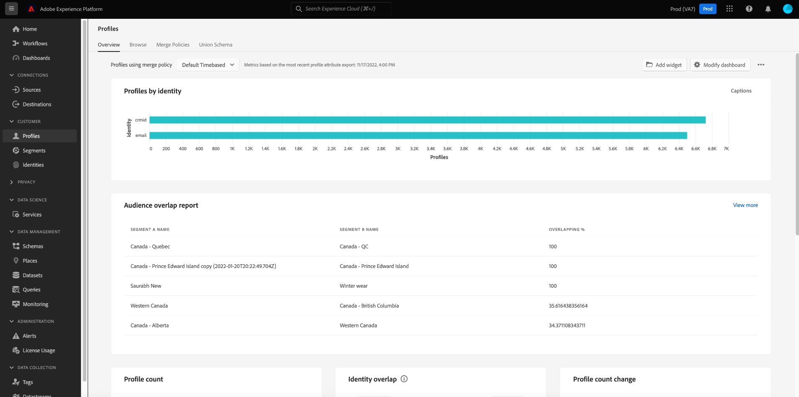

# Descargar tableros en PDF

Los paneles de Adobe Experience Platform se pueden descargar en PDF desde la interfaz de usuario de Experience Platform para facilitar el uso compartido de la información con los miembros de la organización.

Este documento proporciona un resumen de cómo descargar tableros mediante la interfaz de usuario de Experience Platform y guardar el tablero en PDF mediante el menú de impresión predeterminado del explorador.

>[!WARNING]
>
>Los datos contenidos en sus paneles pueden incluir información de identificación personal (PII) sobre sus clientes o datos confidenciales relacionados con su organización. Cualquier dato de tablero guardado en PDF debe gestionarse correctamente según las directrices de privacidad de datos de su organización.

## Descargar tablero

Para comenzar a descargar un panel, vaya al panel que desee descargar (por ejemplo, el panel [!UICONTROL Perfiles]) y, a continuación, seleccione el menú de más opciones (**`...`**) en la esquina superior derecha del panel. A continuación, seleccione **[!UICONTROL Descargar]**.

## Previsualizar PDF

Después de seleccionar **[!UICONTROL Descargar]**, se abre el menú de impresión predeterminado del explorador. En este ejemplo, se muestra el menú de impresión de Google Chrome.

El menú Imprimir permite obtener una vista previa de la PDF que se guardará. PDF es una representación real de los widgets de panel tal como aparecen en la interfaz de usuario de Experience Platform y el tamaño de PDF se ajusta automáticamente para mostrar todos los widgets de panel visibles actualmente en una sola página.

PDF incluye un encabezado generado automáticamente que contiene el logotipo de Experience Platform, el nombre del panel, su nombre, y la fecha y hora en que se descargó el panel. Esta información es de solo lectura y no se puede editar en PDF.

## Guardar como PDF

Después de obtener una vista previa de PDF, selecciona **Guardar** para elegir la ubicación en la que deseas guardar tu PDF.

>[!NOTE]
>
>Si es necesario, puede usar el menú desplegable **Destino** para seleccionar **Guardar como PDF** si esa opción no está seleccionada automáticamente.

## Personalizar PDF de tablero

El PDF que se genera coincide con el panel que puede ver en la interfaz de usuario e incluye solo los widgets que están visibles actualmente en el panel. Algunos paneles se pueden personalizar para cambiar el tamaño y la ubicación de los widgets o para agregar y quitar widgets de la vista. Al personalizar el aspecto del tablero en la interfaz de usuario de Experience Platform, también se cambia el aspecto de PDF que se genera.

Por ejemplo, puede modificar el aspecto del panel de perfiles para incluir varios widgets de ancho completo apilados encima de tres widgets estándar.

Si selecciona descargar el panel actualizado, se obtiene una nueva vista previa de PDF que coincide con el aspecto del panel de perfiles personalizado. También ajusta automáticamente el tamaño de la PDF para asegurarse de que todos los widgets visibles se incluyen en una PDF de una página.

Para obtener más información acerca de cómo personalizar paneles, comience por leer la [descripción general de la personalización de paneles](customize/overview.md).

## Pasos siguientes

Ahora que ha descargado el tablero y lo ha guardado como PDF, puede repetir estos pasos para descargar tableros adicionales o compartir PDF con miembros de su organización.
