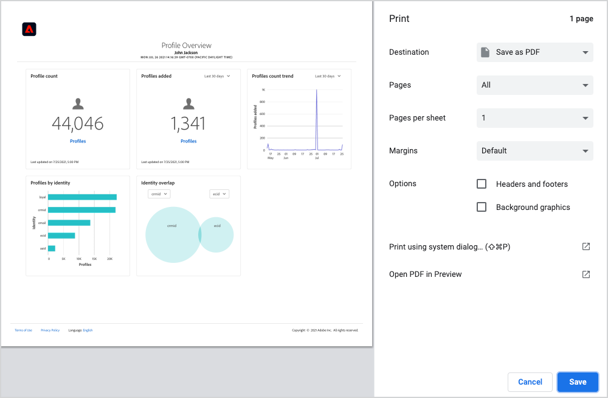

# Descargar tableros en PDF

Los tableros de Adobe Experience Platform se pueden descargar a PDF desde la interfaz de usuario de Platform para facilitar el intercambio de información con los miembros de su organización.

Este documento proporciona un resumen de cómo descargar tableros mediante la IU de Platform y guardar el tablero en PDF mediante el menú de impresión predeterminado del explorador.

>[!WARNING]
>
>Los datos contenidos en los paneles pueden incluir información de identificación personal (PII) sobre sus clientes o datos confidenciales relacionados con su organización. Los datos de tablero guardados en PDF se deben gestionar adecuadamente de acuerdo con las directrices de privacidad de datos de su organización.

## Descargar tablero

Para empezar a descargar un tablero, vaya al tablero que desea descargar (por ejemplo, el tablero [!UICONTROL Profiles]) y, a continuación, seleccione el menú más opciones (**`...`**) en la esquina superior derecha del tablero. A continuación, seleccione **[!UICONTROL Descargar]**.

## Vista previa del PDF

Después de seleccionar **[!UICONTROL Descargar]**, se abre el menú de impresión predeterminado del explorador. En este ejemplo, se muestra el menú de impresión de Google Chrome.

El menú de impresión le permite obtener una vista previa del PDF que se guardará. El PDF es una verdadera representación de los widgets de tablero tal como aparecen en la interfaz de usuario de Platform y el tamaño del PDF se ajusta automáticamente para mostrar todos los widgets de tablero visibles actualmente en una sola página.

El PDF incluye un encabezado generado automáticamente que contiene el logotipo del Experience Platform, el nombre del tablero, su nombre y la fecha y hora en que se descargó el tablero. Esta información es de solo lectura y no se puede editar en el PDF.

## Guardar como PDF

Después de obtener una vista previa del PDF, seleccione **Guardar** para elegir la ubicación en la que desea guardar el PDF.

>[!NOTE]
>
>Si es necesario, puede utilizar la lista desplegable **Destination** para seleccionar **Guardar como PDF** si esa opción no está seleccionada automáticamente.

## Personalización de archivos PDF de tablero

El PDF que se genera coincide con el tablero que puede ver en la interfaz de usuario e incluye solo las utilidades que están visibles actualmente en el tablero. Algunos tableros se pueden personalizar para cambiar el tamaño y la ubicación de las utilidades o para agregar y quitar utilidades de la vista. Al personalizar el aspecto del tablero en la interfaz de usuario de Platform, también se cambia el aspecto del PDF que se genera.

Por ejemplo, puede modificar el aspecto del tablero de perfiles para incluir varias utilidades de ancho completo apiladas por encima de tres utilidades estándar.

Al seleccionar para descargar el tablero actualizado, se obtiene una nueva vista previa de PDF que coincide con el aspecto del tablero de perfiles personalizado. También ajusta automáticamente el tamaño del PDF para garantizar que todos los widgets visibles se incluyen en un PDF de una página.

Para obtener más información sobre la personalización de tableros, comience leyendo el [resumen de personalización del tablero](customize/overview.md).

## Pasos siguientes

Ahora que ha descargado el tablero y lo ha guardado como PDF, puede repetir estos pasos para descargar tableros adicionales o compartir el PDF con miembros de su organización.