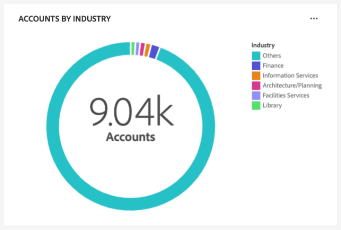
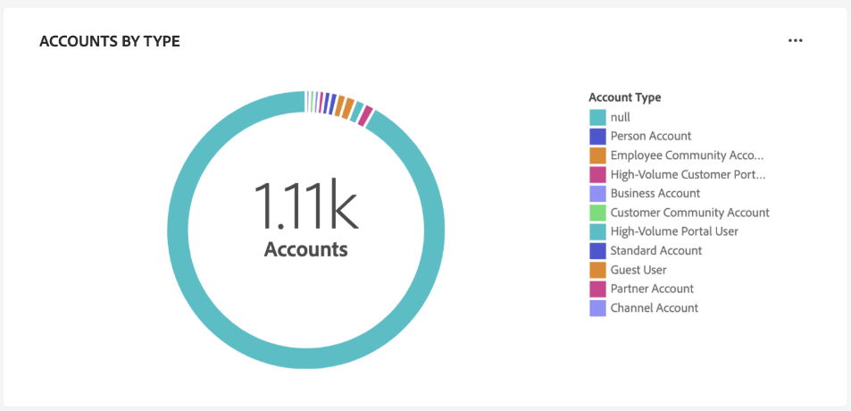
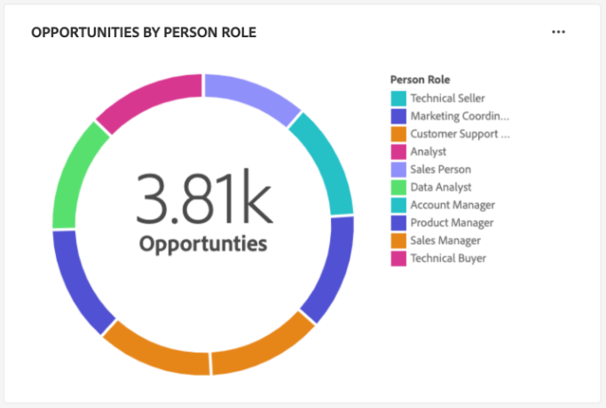
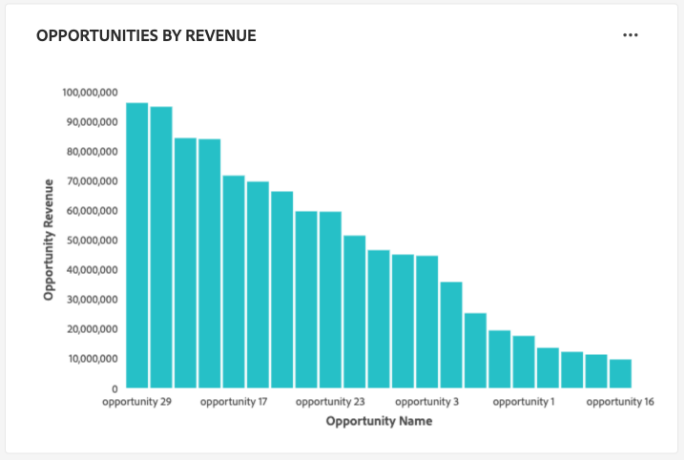
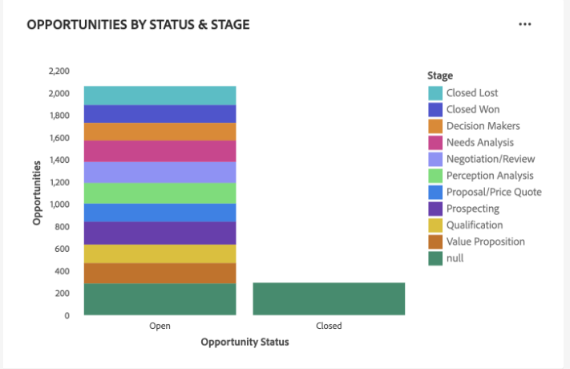
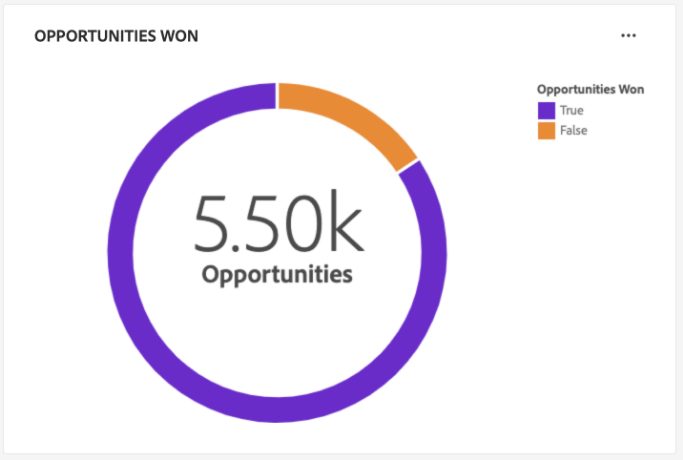
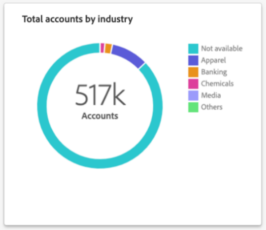

# [!UICONTROL Perfiles de cuenta] tablero

La interfaz de usuario (IU) de Adobe Experience Platform proporciona un tablero a través del cual puede ver información importante acerca de los perfiles de la cuenta, tal como se capturan durante una instantánea diaria. Esta guía describe cómo acceder a y trabajar con [!UICONTROL Perfiles de cuenta] en la interfaz de usuario de y proporciona más información sobre las visualizaciones que se muestran en el panel.

Este documento proporciona información general sobre las funciones de la [!UICONTROL Perfiles de cuenta] y detalla las perspectivas estándar disponibles. Consulte la [[!UICONTROL Perfiles de cuenta] Guía de IU](../../rtcdp/accounts/account-profile-ui-guide.md) para obtener información detallada sobre sus funciones disponibles.

## Introducción

Debe tener derecho a [Adobe Real-time Customer Data Platform B2B Edition](../../rtcdp/b2b-overview.md) para acceder a B2B [!UICONTROL Perfiles de cuenta] panel.

## Datos de perfiles de cuenta {#data}

El [!UICONTROL Perfiles de cuenta] el tablero muestra una instantánea de la información de su cuenta unificada. Esta información de cuenta proviene de varias fuentes en sus canales de marketing y en los diversos sistemas que su organización utiliza actualmente para almacenar la información de la cuenta del cliente.

Los datos de perfil de la instantánea muestran los datos exactamente como aparecen en el momento específico en el que se tomó la instantánea. En otras palabras, la instantánea no es una aproximación o una muestra de los datos y la variable [!UICONTROL Perfiles de cuenta] el tablero no se actualiza en tiempo real.

>[!NOTE]
>
>Los cambios o actualizaciones realizados en los datos desde que se tomó la instantánea no se reflejarán en el tablero hasta que se tome la siguiente instantánea.

## Explore la [!UICONTROL Perfiles de cuenta] tablero {#explore}

Para ir a [!UICONTROL Perfiles de cuenta] en la IU de Platform, seleccione **[!UICONTROL Perfiles]** bajo [!UICONTROL Cuentas] en el panel de navegación izquierdo.

Desde el [!UICONTROL Perfiles de cuenta] panel, puede realizar una de las siguientes acciones [examine los perfiles de cuenta introducidos en su organización](#browse-account-profiles), o [vea la totalidad de los datos de perfil de la cuenta de un vistazo mediante widgets](#standard-widgets).

### Filtro de fecha {#date-filter}

El [!UICONTROL Información general] está compuesta por widgets que proporcionan métricas de solo lectura para transmitir información importante sobre los perfiles de la cuenta. Seleccione el icono de calendario o las fechas para cambiar el filtro de fecha global de los widgets.

>[!IMPORTANT]
>
>El intervalo de fechas que seleccione en el calendario desplegable afecta a todas las perspectivas, excepto a los dos widgets de puntuación predictivos ([distribución](#predictive-scoring-distribution) y [principales factores influyentes](#predictive-scoring-top-influential-factors)).

### Configurar el servicio de coincidencia de cliente potencial con cuenta {#lead-to-account-matching-service}

Seleccionar **[!UICONTROL Configuración]** para configurar el servicio de coincidencia de cliente potencial con cuenta desde el [!UICONTROL Configuración de cuenta] diálogo. Para obtener información detallada sobre cómo configurar la coincidencia de cliente potencial con cuenta, consulte la [Guía de IU](../../rtcdp/accounts/account-profile-ui-guide.md#configure-lead-to-account-matching). Para obtener más información sobre la coincidencia de clientes potenciales con cuentas, consulte la [coincidencia de clientes potenciales con cuentas en la documentación de Real-Time CDP B2B](../../rtcdp/b2b-ai-ml-services/lead-to-account-matching.md).

## Examinar perfiles de cuenta {#browse-account-profiles}

Desde el [!UICONTROL Examinar] , puede buscar y ver los perfiles de cuenta de solo lectura introducidos en su organización. Utilice un ID de cuenta de un origen empresarial conectado o introduzca directamente los detalles de origen. Desde esta área de trabajo, puede ver información importante que pertenece al perfil de la cuenta, como, por ejemplo, su nombre, sector, ingresos y audiencia.

Seleccione el [!UICONTROL ID de perfil] de los resultados mostrados en la [!UICONTROL Examinar] para abrir el [!UICONTROL Detalles] para el perfil de cuenta.

La información de perfil de cuenta mostrada en la [!UICONTROL Detalles] se ha combinado desde varios fragmentos de perfil para formar una sola vista de la cuenta individual. Consulte la documentación sobre [exploración de perfiles de cuenta en Adobe Real-time Customer Data Platform](../../rtcdp/accounts/account-profile-ui-guide.md#browse-account-profiles) para obtener más información acerca de las funcionalidades de visualización de perfiles de cuenta en la IU de Platform.

## Widgets estándar {#standard-widgets}

Adobe proporciona widgets estándar que puede utilizar para visualizar diferentes métricas relacionadas con los perfiles de la cuenta.

Para obtener más información sobre cada uno de los widgets estándar disponibles, seleccione el nombre de un widget en la siguiente lista:

* [Perfiles de cuenta añadidos](#account-profiles-added)
* [Cuentas por sector](#accounts-by-industry)
* [Cuentas por tipo](#accounts-by-type)
* [Oportunidades añadidas](#opportunities-added)
* [Oportunidades por función de persona](#opportunities-by-person-role)
* [Oportunidades por ingresos](#opportunities-by-revenue)
* [Oportunidades por estado y etapa](#opportunities-by-status-&-stage)
* [Oportunidades ganadas](#opportunities-won)
* [Distribución de puntuación predictiva](#predictive-scoring-distribution)
* [Factores más influyentes de la puntuación predictiva](#predictive-scoring-top-influential-factors)
* [Cuentas totales por sector](#total-accounts-by-industry)

### Perfiles de cuenta añadidos {#account-profiles-added}

El [!UICONTROL Perfiles de cuenta añadidos] El widget utiliza un gráfico de líneas para mostrar el número de perfiles de cuenta agregados cada día durante un período de tiempo. Utilice el filtro de fecha global situado en la parte superior del panel para determinar el periodo de análisis. Si no se proporciona ningún filtro de fecha, el comportamiento predeterminado enumera los perfiles de cuenta agregados para el año anterior a hoy. Los resultados se pueden utilizar para deducir una tendencia en el número de perfiles de cuenta añadidos.

### Cuentas por sector {#accounts-by-industry}

El [!UICONTROL Cuentas por sector] widget muestra el número total de cuentas en una sola métrica dentro de un gráfico circular. El gráfico de anillo ilustra la composición relativa de las diferentes industrias que componen este total. Una clave codificada por colores proporciona un desglose de todas las industrias incluidas. Los recuentos individuales de cada sector se muestran en un cuadro de diálogo cuando el cursor se pasa por encima de la sección correspondiente del gráfico circular.

### Cuentas por tipo {#accounts-by-type}

El [!UICONTROL Cuentas por tipo] widget muestra el número total de cuentas en una sola métrica dentro de un gráfico circular. El gráfico de anillo ilustra la composición relativa de los distintos tipos de cuenta que componen este total. Una clave con códigos de color proporciona un desglose de todos los tipos de cuenta incluidos. Los recuentos individuales de cada tipo de cuenta se muestran en un cuadro de diálogo cuando el cursor se pasa por encima de la sección correspondiente del gráfico circular.

### Oportunidades añadidas {#opportunities-added}

El [!UICONTROL Oportunidades añadidas] El widget utiliza un gráfico de líneas para mostrar el número de oportunidades agregadas cada día durante un período de tiempo. Utilice el filtro de fecha global situado en la parte superior del panel para determinar el periodo de análisis. Si no se proporciona ningún filtro de fecha, el comportamiento predeterminado enumera las oportunidades agregadas para el año anterior a hoy. Los resultados se pueden utilizar para deducir una tendencia en el número de oportunidades agregadas.

<!-- Link to date filter documentation from Annamalai -->

### Oportunidades por función de persona {#opportunities-by-person-role}

El [!UICONTROL Oportunidades por función de persona] widget muestra el número total de sus oportunidades en una sola métrica dentro de un gráfico circular. El gráfico de anillo ilustra la composición relativa de las funciones que componen este número total de oportunidades. Una clave codificada por colores proporciona un desglose de todas las funciones incluidas. Los recuentos individuales de cada rol se muestran en un cuadro de diálogo cuando el cursor se pasa por encima de la sección correspondiente del gráfico de anillo.

>[!NOTE]
>
>El [!UICONTROL No se han encontrado datos] o [!UICONTROL No se puede cargar] Se produce un error cuando la tabla de puente &quot;Opportunity-Person&quot; no se utiliza en el esquema. Si su perspectiva muestra uno de estos errores, compruebe el esquema de unión y asegúrese de que el grupo de campos Oportunidad-Persona esté introduciendo datos.

### Oportunidades por ingresos {#opportunities-by-revenue}

El [!UICONTROL Oportunidades por ingresos] El widget utiliza un gráfico de barras para ilustrar la cantidad total estimada de ingresos generados por las oportunidades. El widget admite hasta seis oportunidades.

Para ver un cuadro de diálogo que contiene el total de ingresos específico de una oportunidad, utilice el cursor para pasar el ratón sobre barras individuales.

### Oportunidades por estado y etapa {#opportunities-by-status-&-stage}

Este widget utiliza un gráfico de barras para ilustrar la cantidad de oportunidades que están abiertas o cerradas en todas las etapas del canal de marketing/ventas. El widget utiliza colores para diferenciar el escenario de las oportunidades. Una clave codificada por colores indica las etapas disponibles para las oportunidades.

### Oportunidades ganadas {#opportunities-won}

El [!UICONTROL Oportunidades ganadas] widget muestra el número total de oportunidades que se han finalizado correctamente en una sola métrica dentro de un gráfico circular. El gráfico de anillo ilustra la composición relativa de las oportunidades que se ganan o no. Una clave codificada por colores distingue entre oportunidades ganadas y no ganadas. Los recuentos individuales de cada rol se muestran en un cuadro de diálogo cuando el cursor se pasa por encima de la sección correspondiente del gráfico de anillo.

### Distribución de puntuación predictiva {#predictive-scoring-distribution}

El [!UICONTROL Distribución de puntuación predictiva] Este widget muestra la distribución de puntuación de todos los perfiles de cuenta para ayudarle a comprender el estado de su canal de ventas de un vistazo. Los datos de puntuación se transmiten mediante un gráfico circular y un gráfico de columnas.

El gráfico de anillo ilustra la proporción de los perfiles totales de la cuenta en cada uno de los bloques de compra alta, media y baja. La clave proporciona más detalles sobre las secciones con códigos de color, incluidos los intervalos del bloque de puntuación y el número de perfiles de cuenta en ese intervalo.

El gráfico de columnas proporciona un desglose de puntuación más granular. Cada columna muestra el número de perfiles de cuenta en cada uno de los 20 bloques de incremento de cinco puntos.

El menú desplegable dentro del widget permite seleccionar el modelo de puntuación de la cuenta.

>[!NOTE]
>
>Los filtros de intervalo de fechas globales no se aplican a las perspectivas de puntuación predictiva. Los widgets de puntuación predictiva analizan los datos en función del modelo de puntuación de cuenta seleccionado en la lista desplegable.

### Factores más influyentes de la puntuación predictiva {#predictive-scoring-top-influential-factors}

El [!UICONTROL Factores más influyentes de la puntuación predictiva] Este widget le ayuda a comprender los factores más significativos que impulsan las puntuaciones de cada bloque de tendencia.

Este widget muestra los principales factores influyentes para cada uno de los bloques de alta, media y baja tendencia. Una barra para cada factor influyente indica el porcentaje de los perfiles de cuenta en ese bloque de tendencia que contiene el factor influyente específico.

El menú desplegable dentro del widget permite seleccionar el modelo de puntuación de la cuenta.

>[!NOTE]
>
>Los filtros de intervalo de fechas globales no se aplican a las perspectivas de puntuación predictiva. Los widgets de puntuación predictiva analizan los datos en función del modelo de puntuación de cuenta seleccionado en la lista desplegable.

### Cuentas totales por sector {#total-accounts-by-industry}

Este widget muestra el número total de cuentas en una sola métrica y utiliza un gráfico de anillo para ilustrar los tamaños proporcionales de los recuentos de las industrias que conforman el número total. La clave proporciona información de codificación de color para las diferentes industrias que conforman el gráfico circular.

Los recuentos individuales de las diferentes industrias se muestran en un cuadro de diálogo cuando el cursor se pasa por encima de la sección correspondiente del gráfico circular.

## Pasos siguientes

Si sigue este documento, debería saber cómo localizar el [!UICONTROL Perfiles de cuenta] y también comprenda las métricas mostradas en los widgets disponibles. Para obtener más información sobre cómo trabajar con perfiles de cuenta como parte de los datos B2B en la IU de Experience Platform, consulte la [resumen de perfiles de cuenta](../../rtcdp/accounts/account-profile-overview.md) para Adobe Real-Time CDP, edición B2B.
