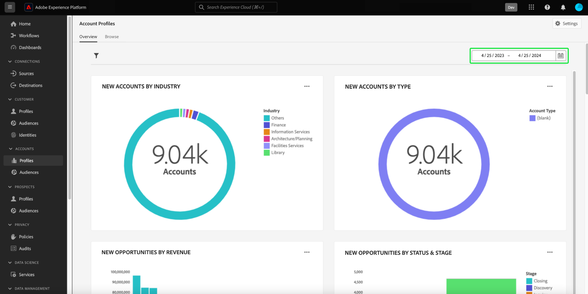

# Panel de perfiles de cuenta

La interfaz de usuario (IU) de Adobe Experience Platform proporciona un tablero a través del cual puede ver información importante acerca de los perfiles de la cuenta, tal como se capturan durante una instantánea diaria. Esta guía describe cómo acceder y trabajar con el panel [!UICONTROL Account Profiles] en la interfaz de usuario y proporciona más información sobre las visualizaciones mostradas en el panel.

This document provides an overview of the features within the [!UICONTROL Account Profiles] dashboard and details the available standard insights. See the [[!UICONTROL Account Profiles] UI guide](../../rtcdp/accounts/account-profile-ui-guide.md) for comprehensive details on its available features.

## Introducción

Debe tener derecho a [Adobe Real-Time Customer Data Platform B2B edition](../../rtcdp/b2b-overview.md) para acceder al panel B2B [!UICONTROL Account Profiles].

## Datos de perfiles de cuenta {#data}

El panel [!UICONTROL Account Profiles] muestra una instantánea de la información de la cuenta unificada. Esta información de cuenta proviene de varias fuentes en sus canales de marketing y en los diversos sistemas que su organización utiliza actualmente para almacenar la información de la cuenta del cliente.

Los datos de perfil de la instantánea muestran los datos exactamente como aparecen en el momento específico en el que se tomó la instantánea. En otras palabras, la instantánea no es una aproximación o una muestra de los datos y el panel [!UICONTROL Account Profiles] no se actualiza en tiempo real.

>[!NOTE]
>
>Los cambios o actualizaciones realizados en los datos desde que se tomó la instantánea no se reflejarán en el tablero hasta que se tome la siguiente instantánea.

## Explorar el tablero [!UICONTROL Account Profiles] {#explore}

Para navegar al panel [!UICONTROL Account Profiles] dentro de la interfaz de usuario de Experience Platform, seleccione **[!UICONTROL Profiles]** bajo [!UICONTROL Accounts] en el panel de navegación izquierdo.

Desde el panel [!UICONTROL Account Profiles], puede [examinar los perfiles de cuenta introducidos en su organización](#browse-account-profiles) o [ver la totalidad de los datos del perfil de la cuenta de un vistazo mediante widgets](#standard-widgets).

### Filtro de fecha {#date-filter}

La pestaña [!UICONTROL Overview] está compuesta por widgets que proporcionan métricas de solo lectura para transmitir información importante sobre los perfiles de la cuenta. Seleccione el icono de calendario o las fechas para cambiar el filtro de fecha global de los widgets.

>[!IMPORTANT]
>
>El intervalo de fechas que seleccione en el calendario desplegable afecta a todas las perspectivas, excepto a los dos widgets de puntuación predictivos ([distribución](#predictive-scoring-distribution) y [factores más influyentes](#predictive-scoring-top-influential-factors)).

### Configurar el servicio de coincidencia de cliente potencial con cuenta {#lead-to-account-matching-service}

Seleccione **[!UICONTROL Settings]** para configurar el servicio de coincidencia de cliente potencial con cuenta desde el cuadro de diálogo [!UICONTROL Account settings]. Para obtener información detallada sobre cómo configurar la coincidencia de cliente potencial con cuenta, consulte la [guía de la interfaz de usuario](../../rtcdp/accounts/account-profile-ui-guide.md#configure-lead-to-account-matching). Para obtener más información sobre la coincidencia de cliente potencial con cuenta, consulte [coincidencia de cliente potencial con cuenta en la documentación de Real-Time CDP B2B](../../rtcdp/b2b-ai-ml-services/lead-to-account-matching.md).

## Examinar perfiles de cuenta {#browse-account-profiles}

Desde la pestaña [!UICONTROL Browse], puede buscar y ver los perfiles de cuenta de solo lectura introducidos en su organización. Utilice un ID de cuenta de un origen empresarial conectado o introduzca directamente los detalles de origen. Desde esta área de trabajo, puede ver información importante que pertenece al perfil de la cuenta, como, por ejemplo, su nombre, sector, ingresos y audiencia.

Seleccione [!UICONTROL Profile ID] de los resultados mostrados en la ficha [!UICONTROL Browse] para abrir la ficha [!UICONTROL Details] para el perfil de cuenta.

La información del perfil de cuenta que se muestra en la ficha [!UICONTROL Details] se ha combinado a partir de varios fragmentos de perfil para formar una sola vista de la cuenta individual. Consulte la documentación sobre [examinar perfiles de cuenta en Adobe Real-Time Customer Data Platform](../../rtcdp/accounts/account-profile-ui-guide.md#browse-account-profiles) para obtener más información sobre las funciones de visualización de perfiles de cuenta en la interfaz de usuario de Experience Platform.

## Widgets estándar {#standard-widgets}

>[!CONTEXTUALHELP]
>id="platform_dashboards_accountprofiles_customersperaccountoverview"
>title="Información general sobre clientes por cuenta"
>abstract="Este widget de obtención de detalles proporciona perspectivas sobre la estructura de los datos B2B. Ayuda a identificar cuántos perfiles de cuenta no tienen perfiles de cliente vinculados o tienen uno o más perfiles de cliente asociados a ellos.<ul><li>Clientes directos: son perfiles de clientes vinculados directamente a una cuenta a través de la ruta `personComponents`.</li><li>Clientes indirectos: son perfiles de clientes vinculados a una cuenta a través de la ruta `Account-Person`.</li></ul>"

Adobe proporciona widgets estándar que puede utilizar para visualizar diferentes métricas relacionadas con los perfiles de la cuenta.

>[!IMPORTANT]
>
>Si no proporciona un filtro de fecha, el comportamiento predeterminado de las perspectivas analiza los datos agregados desde el año anterior hasta hoy.

To learn more about each of the available standard widgets, select the name of a widget from the following list:

* [Perfiles de cuenta añadidos](#account-profiles-added)
* [Información general sobre clientes por cuenta](#customers-per-account-overview)
   * [Opportunities per account overview](#opportunities-per-account-overview)
   * [Detalles de oportunidades por cuenta](#opportunities-per-account-detail)
   * [Detalles de clientes por cuenta](#customers-per-account-detail)
* [Nuevas cuentas por sector](#accounts-by-industry)
* [Nuevas cuentas por tipo](#accounts-by-type)
* [Nuevas oportunidades por función de persona](#opportunities-by-person-role)
* [Nuevas oportunidades por ingresos](#opportunities-by-revenue)
* [New opportunities by status &amp; stage](#opportunities-by-status-&-stage)
* [New opportunities won](#opportunities-won)
* [Oportunidades añadidas](#opportunities-added)
* [Distribución de puntuación predictiva](#predictive-scoring-distribution)
* [Factores más influyentes de la puntuación predictiva](#predictive-scoring-top-influential-factors)

### Perfiles de cuenta añadidos {#account-profiles-added}

El widget [!UICONTROL Account profiles added] utiliza un gráfico de líneas para mostrar el número de perfiles de cuenta agregados cada día durante un período de tiempo. Utilice el filtro de fecha global situado en la parte superior del panel para determinar el periodo de análisis. Si no se proporciona ningún filtro de fecha, el comportamiento predeterminado enumera los perfiles de cuenta agregados para el año anterior a hoy. Los resultados se pueden utilizar para deducir una tendencia en el número de perfiles de cuenta añadidos.

### Información general sobre clientes por cuenta {#customers-per-account-overview}

>[!NOTE]
>
>El insight [!UICONTROL Customers per account overview] y sus gráficos de obtención de detalles ([!UICONTROL Customers per account detail], [!UICONTROL Opportunities per account overview], [!UICONTROL Opportunities per account detail]) no se ven afectados por ningún filtro de fecha global que pueda haber establecido.

El gráfico [!UICONTROL Customers per account overview] proporciona un resumen de las cuentas en función de sus tipos de clientes. Muestra una tabla de cuatro filas que clasifica las cuentas como clientes directos o indirectos, o como aquellas sin ellos. Proporciona el número total de cuentas para cada categoría. El gráfico ayuda a identificar la distribución de cuentas que tienen clientes directos frente a indirectos.

Los clientes directos son perfiles de clientes que están vinculados directamente a una cuenta a través de la ruta `personComponents`. Esta relación es más directa e implica una conexión directa y explícita entre el cliente y la cuenta.

Los clientes indirectos son perfiles de clientes vinculados a una cuenta a través de la ruta `Account-Person`. This relationship is less straightforward and involves an intermediate entity or a more complex connection between the customer and the account, typically through other accounts or relationships.

Para obtener información más detallada, seleccione el elemento de elipse (**...**) en el gráfico [!UICONTROL Customers per account overview] y elija **[!UICONTROL Drill through]** en el menú desplegable.

Aparecerá la vista de obtención de detalles. A continuación, explore los gráficos de obtención de detalles disponibles para comprender mejor la estructura de los datos B2B. Puede utilizar estos gráficos de obtención de detalles para identificar cuántos perfiles de cuenta no tienen perfiles de cliente vinculados o tienen uno o más perfiles de cliente asociados a ellos. También puede utilizarlas para identificar cuántos clientes directos o indirectos están asociados a sus cuentas.

* [[!UICONTROL Customers per account detail]](#customers-per-account-detail)
* [[!UICONTROL Accounts per opportunity overview]](#accounts-per-opportunity-overview)
* [[!UICONTROL Opportunities per account detail]](#accounts-per-opportunity-detail)

### [!UICONTROL Navigate between dashboard views] {#dashboard-view-navigation}

Para cambiar entre la obtención de detalles y el panel Perfiles de cuenta, seleccione el icono de carpeta () seguido de la vista correcta en el menú desplegable.

Para obtener más información sobre la obtención de detalles en la interfaz de usuario de Experience Platform, consulte la [Guía de obtención de detalles](../sql-insights-query-pro-mode/drill-through.md).

#### [!UICONTROL Customers per account detail] {#customers-per-account-detail}

El gráfico [!UICONTROL Customers per account detail] proporciona detalles más granulares sobre el número de cuentas asociadas con diferentes tipos de clientes. Muestra una tabla de tres columnas que detalla el número de cuentas por tipo de cliente (directo o indirecto) y el rango de clientes asociados a ellas. Este gráfico le ayuda a comprender cómo se distribuyen los clientes entre diferentes categorías de clientes y el número total de cuentas asociadas a cada una.

#### [!UICONTROL Opportunities per account overview] {#opportunities-per-account-overview}

El gráfico [!UICONTROL Opportunities per account overview] presenta un resumen de las cuentas que tienen o no oportunidades. Esta tabla de dos filas ayuda a determinar rápidamente el número de cuentas asociadas a las oportunidades, lo que proporciona una instantánea de la participación de las oportunidades en todas las cuentas.

#### [!UICONTROL Opportunities per account detail] {#opportunities-per-account-detail}

El gráfico [!UICONTROL Opportunities per account detail] ofrece un desglose más detallado de las cuentas en función de la cantidad de oportunidades que tengan. La tabla muestra el número de cuentas agrupadas por intervalos de recuento de oportunidades, como 1-10 oportunidades o más de 100 oportunidades. Este gráfico le ayuda a identificar cómo se distribuyen las cuentas según la cantidad de oportunidades que administran.

### Nuevas cuentas por sector {#accounts-by-industry}

El widget [!UICONTROL New accounts by industry] muestra el número total de cuentas en una sola métrica dentro de un gráfico de anillo. El gráfico de anillo ilustra la composición relativa de las diferentes industrias que componen este total. Una clave codificada por colores proporciona un desglose de todas las industrias incluidas. Los recuentos individuales de cada sector se muestran en un cuadro de diálogo cuando el cursor se pasa por encima de la sección correspondiente del gráfico circular.

### Nuevas cuentas por tipo {#accounts-by-type}

El widget [!UICONTROL New accounts by type] muestra el número total de cuentas en una sola métrica dentro de un gráfico de anillo. El gráfico de anillo ilustra la composición relativa de los distintos tipos de cuenta que componen este total. Una clave con códigos de color proporciona un desglose de todos los tipos de cuenta incluidos. Los recuentos individuales de cada tipo de cuenta se muestran en un cuadro de diálogo cuando el cursor se pasa por encima de la sección correspondiente del gráfico circular.

### New opportunities by person role {#opportunities-by-person-role}

The [!UICONTROL New opportunities by person role] widget displays the total number of your opportunities in a single metric inside a donut chart. The donut chart illustrates the relative makeup of roles that comprise this total number of opportunities. A color-coded key provides a breakdown of all the included roles. Individual counts for each role are displayed in a dialog when the cursor hovers over the respective section of the donut chart.

>[!NOTE]
>
>The [!UICONTROL No data found] or [!UICONTROL Unable to load] error is caused when the &#39;Opportunity-Person&#39; bridge-table is not used in your schema. If your insight displays one of these errors, check your union schema and ensure that the &#39;Opportunity-Person&#39; field group is ingesting data.

### Nuevas oportunidades por ingresos {#opportunities-by-revenue}

El widget [!UICONTROL New opportunities by revenue] utiliza un gráfico de barras para ilustrar la cantidad total estimada de ingresos generados por sus oportunidades. El widget admite hasta seis oportunidades.

Para ver un cuadro de diálogo que contiene el total de ingresos específico de una oportunidad, utilice el cursor para pasar el ratón sobre barras individuales.

### Nuevas oportunidades por estado y etapa {#opportunities-by-status-&-stage}

Este widget utiliza un gráfico de barras para ilustrar la cantidad de oportunidades que están abiertas o cerradas en todas las etapas del funnel de marketing/ventas. El widget utiliza colores para diferenciar el escenario de las oportunidades. Una clave codificada por colores indica las etapas disponibles para las oportunidades.

### Nuevas oportunidades ganadas {#opportunities-won}

El widget [!UICONTROL New opportunities won] muestra el número total de oportunidades que se finalizaron correctamente en una sola métrica dentro de un gráfico circular. The donut chart illustrates the relative makeup of opportunities that are either won or not. A color-coded key distinguishes between won and not-won opportunities. Individual counts for each role are displayed in a dialog when the cursor hovers over the respective section of the donut chart.

### Oportunidades añadidas {#opportunities-added}

The [!UICONTROL Opportunities added] widget uses a line graph to display the number of opportunities added each day over a period of time. Use the global date filter located at the top of your dashboard to determine the period of analysis. If no date filter is provided, the default behavior lists the opportunities added for the year prior to today. Los resultados se pueden utilizar para deducir una tendencia en el número de oportunidades agregadas.

<!-- Link to date filter documentation from Annamalai -->

### Distribución de puntuación predictiva {#predictive-scoring-distribution}

The [!UICONTROL Predictive scoring distribution] widget shows the score distribution of all account profiles to help you understand the health of your sales pipeline at a glance. Los datos de puntuación se transmiten mediante un gráfico circular y un gráfico de columnas.

The donut chart illustrates the proportion of your total account profiles in each of the high, medium, and low propensity to buy buckets. The key provides more details on the color-coded sections including the scoring bucket ranges and the number of account profiles in that range.

El gráfico de columnas proporciona un desglose de puntuación más granular. Cada columna muestra el número de perfiles de cuenta en cada uno de los 20 bloques de incremento de cinco puntos.

El menú desplegable dentro del widget permite seleccionar el modelo de puntuación de la cuenta.

>[!NOTE]
>
>Los filtros de intervalo de fechas globales no se aplican a las perspectivas de puntuación predictiva. Los widgets de puntuación predictiva analizan los datos en función del modelo de puntuación de cuenta seleccionado en la lista desplegable.

### Factores más influyentes de la puntuación predictiva {#predictive-scoring-top-influential-factors}

El widget [!UICONTROL Predictive scoring top influential factors] le ayuda a comprender los factores más significativos que impulsan las puntuaciones para cada bloque de tendencia.

Este widget muestra los principales factores influyentes para cada uno de los bloques de alta, media y baja tendencia. Una barra para cada factor influyente indica el porcentaje de los perfiles de cuenta en ese bloque de tendencia que contiene el factor influyente específico.

El menú desplegable dentro del widget permite seleccionar el modelo de puntuación de la cuenta.

>[!NOTE]
>
>Los filtros de intervalo de fechas globales no se aplican a las perspectivas de puntuación predictiva. Los widgets de puntuación predictiva analizan los datos en función del modelo de puntuación de cuenta seleccionado en la lista desplegable.

## Error de no se pueden cargar los datos {#errors}

Si un widget muestra *[!UICONTROL Unable to load. Try again.]*, esto se debe a que no hay datos disponibles para la entidad B2B. Por ejemplo, el widget que se muestra debajo de [!UICONTROL New opportunities by person role], muestra el mensaje &quot;[!UICONTROL Unable to load. Try again.]&quot;, ya que esta zona protegida no tiene datos de oportunidades disponibles.

Para resolver el problema, debe ingerir datos de entidad B2B, como datos de *persona de la oportunidad*, en la zona protegida. Después de 48 horas, los datos se reflejan en los widgets.

## Próximos pasos

Al seguir este documento, debería saber cómo localizar el panel [!UICONTROL Account Profiles] y también comprender las métricas que se muestran en los widgets disponibles. Para obtener más información sobre cómo trabajar con perfiles de cuenta como parte de los datos B2B en la interfaz de usuario de Experience Platform, consulte [descripción general de los perfiles de cuenta](../../rtcdp/accounts/account-profile-overview.md) para Adobe Real-Time CDP, B2B edition.
