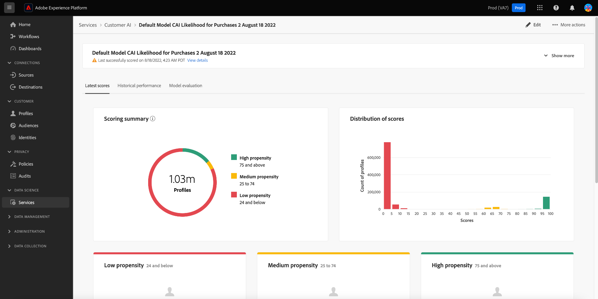

# Widgets de inteligencia artificial aplicada al cliente del panel Audiencias {#customer-ai-audiences-widgets}

La AI del cliente se utiliza para generar puntuaciones de tendencia personalizadas, como la generación y la conversión de perfiles individuales a escala. La inteligencia artificial aplicada al cliente lo hace analizando los datos de evento de experiencia del consumidor existentes para predecir **puntuaciones de tendencia de pérdida o conversión**. Estos modelos de tendencia de los clientes de alta precisión permiten una segmentación y una segmentación más exactas. El [distribución de puntuaciones](#customer-ai-distribution-of-scores) y [resumen de puntuación](#customer-ai-scoring-summary) las perspectivas demuestran la división en su audiencia. Resaltan qué perfiles son los de tendencia alta/baja/media y cómo se distribuyen en los recuentos de perfiles.

<!-- 
THe links when required
* [[!UICONTROL Customer AI scoring summary]](#customer-ai-scoring-summary)
* [[!UICONTROL Customer AI distribution of scores]](#customer-ai-distribution-of-scores) 
-->

## [!UICONTROL Distribución de puntuaciones de Customer AI] {#customer-ai-distribution-of-scores}

>[!CONTEXTUALHELP]
>id="platform_dashboards_audiences_distributionOfScores"
>title="Distribución de las puntuaciones"
>abstract="Este widget visualiza la distribución del número total de perfiles por sus puntuaciones de tendencia en incrementos de cinco por ciento. La distribución del recuento de perfiles viene determinada por el modelo de inteligencia artificial y las políticas de combinación seleccionadas. Puede cambiar el modelo de inteligencia artificial desde el menú desplegable debajo del título del widget."

El [!UICONTROL Distribución de puntuaciones de Customer AI] widget categoriza el número total de perfiles según sus puntuaciones de tendencia. La distribución del recuento de perfiles viene determinada por el modelo de IA y la política de combinación seleccionada y, a continuación, se visualiza en incrementos de cinco por ciento que indican su tendencia. El recuento de perfiles se proporciona a lo largo del eje Y y las puntuaciones de tendencia se proporcionan a lo largo del eje X.

>[!NOTE]
>
>Si la visualización es una puntuación de tendencia de conversión, las puntuaciones más altas se muestran en verde y las más bajas en rojo. Si predice una tendencia a la pérdida invertida, las puntuaciones más altas están en rojo y las más bajas en verde. El cubo mediano permanece amarillo independientemente del tipo de tendencia que elija.

El modelo de IA que determina las puntuaciones de tendencia se elige del selector desplegable debajo del título del widget. La lista desplegable contiene una lista de todos los modelos de inteligencia artificial aplicada al cliente configurados. Seleccione el modelo de IA adecuado para el análisis en la lista de modelos disponibles. Si no hay ningún modelo de inteligencia artificial aplicada al cliente disponible, un mensaje dentro del widget le indica que configure al menos un modelo de inteligencia artificial aplicada al cliente y proporciona un hipervínculo a la página de configuración del modelo de inteligencia artificial aplicada al cliente. Consulte la documentación para obtener instrucciones sobre [Cómo configurar una instancia de Customer AI](../../intelligent-services/customer-ai/user-guide/configure.md).

>[!NOTE]
>
>Seleccione el menú desplegable situado inmediatamente debajo de la pestaña Información general para cambiar la política de combinación que determina qué perfiles se incluyen en el análisis. Consulte la sección sobre [políticas de combinación](#merge-policies) para obtener una descripción breve, o la [resumen de políticas de combinación](../../profile/merge-policies/overview.md) para obtener más información.

Para navegar a la página de perspectivas detalladas del modelo de inteligencia artificial aplicada al cliente seleccionado, seleccione **[!UICONTROL Ver detalles del modelo]**.

![El tablero Audiencias del Experience Platform con la variable [!UICONTROL Distribución de puntuaciones de Customer AI] widget y [!UICONTROL Ver detalles del modelo] resaltado.](../images/segments/customer-ai-distribution-of-scores.png)

Aparecerá la página de información detallada del modelo.

Puede encontrar más información sobre la inteligencia artificial aplicada al cliente en la [guía de IU de discover insights](../../intelligent-services/customer-ai/user-guide/discover-insights.md).

## [!UICONTROL Resumen de puntuación de Customer AI] {#customer-ai-scoring-summary}

>[!CONTEXTUALHELP]
>id="platform_dashboards_audiences_scoringSummary"
>title="Resumen de las puntuaciones"
>abstract="Este widget muestra el número total de perfiles puntuados y los clasifica en bloques que contienen una tendencia alta, media y baja. El gráfico de anillo ilustra la composición proporcional de los perfiles totales en las tendencias alta, media y baja."

Este widget muestra el número total de perfiles marcados y los clasifica en bloques que contienen alta, media y baja tendencia como verde, amarillo y rojo respectivamente. Se utiliza un gráfico de anillo para ilustrar la composición proporcional de los perfiles totales entre tendencias altas, medias y bajas como el verde, el amarillo y el rojo, respectivamente. Un perfil cumple los requisitos para una alta tendencia a más de 75 años, una tendencia media entre 25 y 74 años y una baja tendencia a menos de 24 años. Una leyenda indica el código de color y los umbrales de tendencia. Los recuentos de perfiles para las tendencias alta, media y baja se muestran en un cuadro de diálogo cuando el cursor se pasa por encima de la sección correspondiente del gráfico circular.

>[!NOTE]
>
>Si la visualización es una puntuación de tendencia de conversión, las puntuaciones más altas se muestran en verde y las más bajas en rojo. Si predice una tendencia a la pérdida invertida, las puntuaciones más altas están en rojo y las más bajas en verde. El cubo mediano permanece amarillo independientemente del tipo de tendencia que elija.

El menú desplegable debajo del título del widget proporciona una lista de todos los modelos de inteligencia artificial aplicada al cliente configurados. Seleccione el modelo de IA adecuado para el análisis en la lista de modelos disponibles. Si no hay ningún modelo de inteligencia artificial aplicada al cliente disponible, un mensaje dentro del widget le indica que configure al menos un modelo de inteligencia artificial aplicada al cliente y proporciona un hipervínculo a la página de configuración del modelo de inteligencia artificial aplicada al cliente. Consulte la documentación sobre [Cómo configurar una instancia de Customer AI](../../intelligent-services/customer-ai/user-guide/configure.md) para obtener instrucciones detalladas.

>[!NOTE]
>
>El número total de perfiles calculados depende de la política de combinación elegida. Para cambiar la política de combinación utilizada, seleccione el menú desplegable situado inmediatamente debajo de la pestaña de información general. Consulte la sección sobre [políticas de combinación](#merge-policies) para obtener una descripción breve, o la [resumen de políticas de combinación](../../profile/merge-policies/overview.md) para obtener más información.

Seleccionar **[!UICONTROL Ver detalles del modelo]** para navegar a la página de perspectivas detalladas del modelo de inteligencia artificial aplicada al cliente seleccionado. Puede encontrar más información sobre la inteligencia artificial aplicada al cliente en la [guía de IU de discover insights](../../intelligent-services/customer-ai/user-guide/discover-insights.md).
