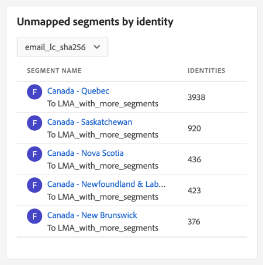

# [!UICONTROL Destinos] tablero

La interfaz de usuario (IU) de Adobe Experience Platform proporciona un tablero en el que puede ver información importante sobre los destinos activos de su organización, tal como se captura durante una instantánea diaria. Esta guía describe cómo acceder y trabajar con el panel de destinos en la interfaz de usuario y proporciona más información sobre las métricas que se muestran en el panel.

Para obtener una descripción general de los destinos, así como un catálogo de todos los destinos disponibles en Experience Platform, visite [documentación de destinos](../../destinations/home.md).

## [!UICONTROL Destinos] datos de tablero {#destinations-dashboard-data}

La variable [!UICONTROL Destinos] tablero muestra una instantánea de los destinos que su organización ha habilitado en Experience Platform. Los datos de la instantánea muestran los datos exactamente como aparecen en el momento concreto en que se tomó la instantánea. En otras palabras, la instantánea no es una aproximación o muestra de los datos y el panel de destinos no se actualiza en tiempo real.

>[!NOTE]
>
>Los cambios o actualizaciones realizados en los datos desde que se tomó la instantánea no se reflejarán en el panel hasta que se tome la siguiente instantánea.

## Exploración del panel de destinos

Para ir al panel de destinos dentro de la interfaz de usuario de Platform, seleccione **[!UICONTROL Destinos]** en el carril izquierdo, seleccione la opción **[!UICONTROL Información general]** para mostrar el tablero.

La fecha y la hora de la instantánea más reciente se muestran en la parte superior del [!UICONTROL Información general] junto al menú desplegable de destino. Todos los datos del widget son precisos a partir de esa fecha y hora. La marca de tiempo de la instantánea se proporciona en UTC; no está en la zona horaria del usuario u organización individual.

>[!NOTE]
>
>Si su organización es nueva en Experience Platform y aún no tiene destinos activos, la variable [!UICONTROL Destinos] tablero y [!UICONTROL Información general] no están visibles. En su lugar, seleccione [!UICONTROL Destinos] en la navegación izquierda, se muestra la variable [!UICONTROL Catálogo] pestaña . Para obtener más información sobre [!UICONTROL Catálogo] , consulte [[!UICONTROL Destinos] guía del espacio de trabajo](../../destinations/ui/destinations-workspace.md).

### Modificación del panel de destinos

Puede modificar el aspecto del panel de destinos seleccionando **[!UICONTROL Modificar tablero]**. Esto le permite mover, agregar y quitar widgets del tablero, así como acceder al **[!UICONTROL Biblioteca de utilidades]** para explorar las utilidades disponibles y crear utilidades personalizadas para su organización.

Consulte la [modificación de tableros](../customize/modify.md) y [Información general de la biblioteca de utilidades](../customize/widget-library.md) documentación para obtener más información.

## Widgets estándar {#standard-widgets}

Adobe proporciona varios widgets estándar que puede utilizar para visualizar distintas métricas relacionadas con los destinos y evaluar la integridad de los segmentos disponibles para el análisis de datos. También puede crear utilidades personalizadas para compartirlas con su organización mediante la [!UICONTROL Biblioteca de utilidades]. Para obtener más información sobre la creación de widgets personalizados, lea la [Información general de la biblioteca de utilidades](../customize/widget-library.md).

Para obtener más información sobre cada uno de los widgets estándar disponibles, seleccione el nombre de un widget en la siguiente lista:

* [[!UICONTROL Destinos más utilizados]](#most-used-destinations)
* [[!UICONTROL Destinos creados recientemente]](#recently-created-destinations)
* [[!UICONTROL Segmentos activados recientemente]](#recently-activated-segments)
* [[!UICONTROL Segmentos activados recientemente por destino]](#recently-activated-segments-by-destination)
* [[!UICONTROL Tendencia del tamaño de la audiencia]](#audience-size-trend)
* [[!UICONTROL Segmentos no asignados por identidad]](#unmapped-segments-by-identity)
* [[!UICONTROL Segmentos asignados por identidad]](#mapped-segments-by-identity)
* [[!UICONTROL Audiencias comunes]](#common-audiences)
* [[!UICONTROL Audiencias asignadas]](#mapped-audiences)
* [[!UICONTROL Estado de la audiencia asignada]](#mapped-audience-health)
* [[!UICONTROL Recuento de destinos]](#destinations-count)
* [[!UICONTROL Estado del destino]](#destination-status)
* [[!UICONTROL Destinos activos por plataforma de destino]](#active-destinations-by-destination-platform)
* [[!UICONTROL Audiencias activadas en todos los destinos]](#activated-audiences-across-all-destinations)
* [[!UICONTROL Audiencias activadas]](#activated-audiences)

### [!UICONTROL Destinos más utilizados] {#most-used-destinations}

>[!CONTEXTUALHELP]
>id="platform_dashboards_destinations_mostuseddestinations"
>title="Destinos más utilizados"
>abstract="Esta utilidad muestra los destinos más activos de su organización según el número de segmentos asignados. Estos números son precisos en el momento de la última instantánea. Esta clasificación proporciona una perspectiva sobre los destinos que se utilizan más actualmente, al tiempo que resalta los que pueden estar infrautilizados."

La variable **[!UICONTROL Destinos más utilizados]** muestra los principales destinos de su organización según el número de segmentos asignados, a partir de la última instantánea. Esta clasificación proporciona una perspectiva sobre los destinos que se utilizan, al tiempo que muestra los que pueden estar infrautilizados.

Por ejemplo, si configuró un destino ayer pero no le ha asignado ningún segmento, podría ver que el destino está infrautilizado.

El número de segmentos asignados que se muestra en la columna de recuento de segmentos es preciso a partir de la última instantánea diaria. La asignación de un nuevo segmento al destino no actualizará el recuento hasta que se tome la siguiente instantánea.

Al seleccionar el nombre de un destino en la lista que se muestra en el widget, se accederá a los detalles de destino vinculados desde el **[!UICONTROL Examinar]** pestaña . También puede seleccionar **[!UICONTROL Ver todo]** para navegar hasta el **[!UICONTROL Examinar]** y, a continuación, seleccione el nombre de un destino para ver sus detalles.

### [!UICONTROL Destinos creados recientemente] {#recently-created-destinations}

>[!CONTEXTUALHELP]
>id="platform_dashboards_destinations_recentlycreateddestinations"
>title="Destinos creados recientemente"
>abstract="Este widget muestra una lista de los destinos configurados más recientemente dentro de su organización."

La variable **[!UICONTROL Destinos creados recientemente]** permite ver una lista de los destinos configurados más recientemente en su organización.

La fecha creada mostrada es precisa para la última instantánea diaria. En otras palabras, si crea un nuevo destino, no aparecerá en la lista hasta que se haya tomado la siguiente instantánea.

Al seleccionar el nombre de un destino en la lista que se muestra en el widget, se accederá a los detalles de destino vinculados desde el **[!UICONTROL Examinar]** pestaña . También puede seleccionar **[!UICONTROL Ver todo]** para navegar hasta el **[!UICONTROL Examinar]** y, a continuación, seleccione el nombre de un destino para ver sus detalles.

Para obtener más información sobre cómo configurar tipos de destinos específicos, visite [documentación de destinos](../../destinations/home.md).

### [!UICONTROL Segmentos activados recientemente] {#recently-activated-segments}

>[!CONTEXTUALHELP]
>id="platform_dashboards_destinations_recentlyactivatedsegments"
>title="Segmentos activados recientemente"
>abstract="Esta utilidad proporciona una lista de los segmentos que se han asignado más recientemente a un destino. Esta lista proporciona una instantánea de los segmentos y destinos que se utilizan activamente en el sistema y puede ayudar a solucionar cualquier asignación errónea."

La variable **[!UICONTROL Segmentos activados recientemente]** proporciona una lista de los segmentos que se han asignado más recientemente a un destino. Esta lista proporciona una instantánea de los segmentos y destinos que se utilizan activamente en el sistema y puede ayudar a solucionar cualquier asignación errónea.

La fecha actualizada que se muestra muestra muestra la última vez que se activó el segmento en el destino y es precisa para la última instantánea diaria. En otras palabras, si activa un segmento en el destino, la fecha de actualización no cambiará hasta que se tome la siguiente instantánea.

Si selecciona el nombre de un segmento en la lista que se muestra en la utilidad, obtendrá los detalles del segmento. También puede seleccionar **[!UICONTROL Ver todo]** para ir a la pestaña de exploración del segmento y, a continuación, seleccione el nombre de un segmento para ver sus detalles.

Para obtener más información sobre cómo trabajar con segmentos en el Experience Platform, comience por leer la [Información general del servicio de segmentación](../../segmentation/home.md).

### [!UICONTROL Segmentos activados recientemente por destino] {#recently-activated-segments-by-destination}

>[!CONTEXTUALHELP]
>id="platform_dashboards_destinations_recentlyactivatedsegmentsbydestination"
>title="Segmentos activados recientemente por destino"
>abstract="Esta utilidad muestra los cinco segmentos activados más recientemente en orden descendente según el destino elegido en la lista desplegable Información general ."

La variable **[!UICONTROL Segmentos activados recientemente por destino]** muestra los cinco segmentos activados más recientemente en orden descendente según el destino elegido en la lista desplegable Información general . Es similar a la variable [!UICONTROL Segmentos activados recientemente] , pero los datos mostrados **only** se aplica al destino seleccionado.

Esta utilidad contiene dos métricas: el nombre del segmento y la fecha en la que se activó por última vez el segmento en el destino. Los datos mostrados son correctos a partir de la última instantánea diaria.

Puede ver los detalles de un segmento seleccionando el nombre de un segmento en la lista mostrada.

### [!UICONTROL Tendencia del tamaño de la audiencia] {#audience-size-trend}

>[!CONTEXTUALHELP]
>id="platform_dashboards_destinations_audiencesizetrend"
>title="Tendencia del tamaño de la audiencia"
>abstract="Esta utilidad ilustra el número de perfiles contenidos en el segmento que se envían diariamente a la cuenta de destino. El primer menú desplegable ajusta el período de tiempo de la tendencia de audiencia. El segundo menú desplegable de utilidades selecciona el segmento para su análisis. El destino se elige en la lista desplegable Información general ."

La variable **[!UICONTROL Tendencia del tamaño de la audiencia]** La utilidad representa la relación del recuento de perfiles durante un período de tiempo para un segmento que se ha asignado a esa cuenta de destino. La utilidad utiliza un gráfico de líneas para ilustrar el número de perfiles contenidos en el segmento que se envían diariamente a la cuenta de destino.

Se puede ajustar un período de tiempo para la tendencia de audiencia en los últimos 30 días, 90 días o 12 meses mediante el primer menú desplegable.

El segundo menú desplegable enumera todos los segmentos disponibles que se pueden enviar a la cuenta de destino elegida en la parte superior del panel.

La variable **[!UICONTROL Tendencia del tamaño de la audiencia]** La utilidad proporciona un [!UICONTROL Subtítulos] en la parte superior derecha del widget. Select **[!UICONTROL Subtítulos]** para abrir el cuadro de diálogo rótulos automáticos. Un modelo de aprendizaje automático genera automáticamente subtítulos para describir las tendencias clave y los eventos importantes analizando los datos de gráficos y segmentos.

### [!UICONTROL Segmentos no asignados por identidad] {#unmapped-segments-by-identity}

>[!CONTEXTUALHELP]
>id="platform_dashboards_destinations_unmappedsegmentsbyidentity"
>title="Segmentos no asignados por identidad"
>abstract="Esta utilidad enumera las cinco principales **sin asignar** los segmentos clasificados por identidad descendente cuentan para un destino e identidad determinados. Los ID de filtro enumerados en la lista desplegable de utilidades cambian según la cuenta de destino seleccionada en la parte superior de la página de información general."

La variable **[!UICONTROL Segmentos no asignados por identidad]** La utilidad enumera las cinco principales **sin asignar** los segmentos clasificados por identidad descendente cuentan para un destino e identidad determinados. Destaca los segmentos que son los más beneficiosos de asignar a la cuenta de destino elegida en función del ID elegido.

La lista desplegable ID de destino filtra los segmentos disponibles. Los ID de filtro enumerados en la lista desplegable cambian según la cuenta de destino seleccionada en la parte superior de la página de información general.

La columna identidades cuenta el número de ID de origen dentro del segmento que podrían asignarse al ID elegido en la lista desplegable ID de la utilidad.

### [!UICONTROL Segmentos asignados por identidad] {#mapped-segments-by-identity}

>[!CONTEXTUALHELP]
>id="platform_dashboards_destinations_mappedsegmentsbyidentity"
>title="Segmentos asignados por identidad"
>abstract="Esta utilidad proporciona una lista de los cinco principales **asignado** segmentos. La lista se ordena de mayor a menor según el número de ID de origen contenidos en los segmentos. El ID de destino que se va a contar se selecciona en el menú desplegable situado debajo del título del widget. Los ID de destino disponibles en la lista desplegable de la utilidad dependen del destino elegido en la parte superior del panel de información general."

Esta utilidad proporciona una lista de los cinco principales **asignado** segmentos. La lista se ordena de mayor a menor según el número de ID de origen contenidos en los segmentos. El ID de destino que se va a contar se selecciona en el menú desplegable situado debajo del título del widget. Los ID de destino disponibles en la lista desplegable del widget cambiarán según el filtro de cuenta de destino elegido en la parte superior del panel de información general.

La variable **[!UICONTROL Segmentos asignados por identidad]** La utilidad resalta de un vistazo la probabilidad de segmentar correctamente las oportunidades de perfil para una campaña dentro del destino elegido. Una campaña de objetivo eficaz no depende del número de perfiles enviados al destino, sino del número de ID de origen que es probable que se comparen con los ID de destino para proporcionar datos útiles y procesables.

### Audiencias comunes {#common-audiences}

>[!CONTEXTUALHELP]
>id="platform_dashboards_destinations_commonaudiences"
>title="Audiencias comunes"
>abstract="Esta utilidad proporciona una lista de los cinco segmentos principales activados en la cuenta de destino elegida en la parte superior de la página y el destino seleccionado en la lista desplegable de la utilidad. La lista de segmentos se ordena según la fecha de activación. El segmento activado más recientemente se muestra en la parte superior."

La variable **[!UICONTROL Audiencias comunes]** proporciona una lista de los cinco segmentos principales activados en la cuenta de destino elegida en la parte superior de la página y el destino seleccionado en la lista desplegable de la utilidad. La lista de segmentos se ordena según la fecha de activación. El segmento activado más recientemente se muestra en la parte superior.

La variable [!UICONTROL TAMAÑO DE LA AUDIENCIA] proporciona el recuento total de perfiles de cada segmento enumerado.

### Audiencias asignadas {#mapped-audiences}

La variable [!UICONTROL Audiencias asignadas] muestra el número total de audiencias asignadas que se pueden activar en el destino seleccionado en la parte superior de la página.

Select **[!UICONTROL Segmentos]** para navegar al panel Segmentos [!UICONTROL Examinar] pestaña . Este espacio de trabajo muestra una lista de todas las definiciones de segmentos para su organización.

### Estado de la audiencia asignada {#mapped-audience-health}

>[!CONTEXTUALHELP]
>id="platform_dashboards_destinations_mappedaudiencehealth"
>title="Estado de la audiencia asignada"
>abstract="Esta utilidad proporciona una lista de hasta 20 segmentos asignados cuyos recuentos totales de perfiles se desvían por un factor de al menos una desviación estándar del tamaño de audiencia medio de 30 días asignado a ese destino. Proporciona una métrica calculada para la dispersión de los tamaños de audiencia de la media a lo largo de los últimos 30 días. Los tamaños de audiencia se ordenan de mayor a menor."

El widget proporciona una lista de hasta 20 segmentos asignados cuyos recuentos totales de perfiles, desde la última instantánea diaria, se desvían por un factor de al menos una desviación estándar del tamaño de audiencia medio asignado a ese destino de 30 días.

En resumen, proporciona una métrica calculada para la dispersión de los tamaños de audiencia de la media a lo largo de los últimos 30 días. Compara si el tamaño de audiencia de hoy está fuera de la desviación estándar histórica que se ha visto en los datos en los últimos 30 días.

Todos los tamaños de audiencia del sistema se ordenan de un tamaño de audiencia alto a bajo, como se indica en la sección [!UICONTROL TAMAÑO MÁS RECIENTE] para abrir el Navegador.

Si el recuento de perfiles asignado a un segmento no es una desviación estándar del tamaño de perfil asignado promedio durante los últimos 30 días, esto indica una anomalía en el sistema y debe investigarse.

Si un segmento dentro de la variable [!UICONTROL Estado de la audiencia asignada] se está desviando por un amplio margen, debe consultar el gráfico de tendencias del tamaño de audiencia y localizar el segmento anómalo. La tendencia puede proporcionar más información sobre el estado de su segmento.

### [!UICONTROL Recuento de destinos] {#destinations-count}

>[!CONTEXTUALHELP]
>id="platform_dashboards_destinations_destinationscount"
>title="Recuento de destinos"
>abstract="Esta utilidad proporciona el número total de extremos disponibles en los que se puede activar y enviar una audiencia dentro del sistema. Este número incluye destinos tanto activos como inactivos."

La variable [!UICONTROL Recuento de destinos] proporciona el número total de extremos disponibles en los que se puede activar y enviar una audiencia dentro del sistema. Este número incluye destinos tanto activos como inactivos.

Debajo del recuento total, seleccione **[!UICONTROL Destinos]** para desplazarse a la pestaña de exploración destinos . Esta página enumera todos los destinos con los que ha establecido una conexión hasta la fecha.

### [!UICONTROL Estado del destino] {#destination-status}

La variable [!UICONTROL Estado del destino] muestra el número total de destinos habilitados como una única métrica y utiliza un gráfico circular para ilustrar la diferencia proporcional entre los destinos habilitados y deshabilitados.

Los recuentos individuales de los destinos habilitados o deshabilitados se muestran en un cuadro de diálogo cuando el cursor se sitúa sobre la sección correspondiente del gráfico circular.

### [!UICONTROL Destinos activos por plataforma de destino] {#active-destinations-by-destination-platform}

El widget proporciona una tabla de dos columnas para mostrar una lista de plataformas de destino activas y el número total de destinos activos para cada plataforma de destino. La lista de plataformas de destino está ordenada de mayor a menor.

### [!UICONTROL Audiencias activadas en todos los destinos] {#activated-audiences-across-all-destinations}

La variable [!UICONTROL Audiencias activadas en todos los destinos] proporciona el número total de audiencias activadas en todos los destinos de una única métrica. Este número es preciso para la instantánea más reciente.

Select **[!UICONTROL Audiencias]** para navegar a los destinos [!UICONTROL Examinar] pestaña . Esta página proporciona una lista de todos los destinos habilitados y una variedad de métricas relevantes. Consulte la documentación para [más información sobre [!UICONTROL Examinar] ficha](../../destinations/ui/destinations-workspace.md#browse).

### [!UICONTROL Audiencias activadas] {#activated-audiences}

Esta utilidad proporciona una única métrica para el número total de audiencias activadas en un destino.

Select **[!UICONTROL Audiencias]** para navegar a la página de detalles del panel de destinos. La variable [!UICONTROL Datos de activación] muestra una lista de segmentos que se han asignado al destino, incluida la fecha de inicio y la fecha de finalización (si corresponde), así como otra información relevante para la exportación de datos, como el tipo de exportación, la programación y la frecuencia. Para ver los detalles de un segmento en particular, seleccione su nombre en la lista.

Esta utilidad le ayuda a comprender el valor de los destinos en función del número de audiencias activadas de un vistazo. También facilita el acceso a información más detallada para su análisis posterior.

## Pasos siguientes

Al seguir este documento, debería poder localizar el panel de destinos y comprender las métricas que se muestran en los widgets disponibles. Para obtener más información sobre cómo trabajar con los destinos en Experience Platform, consulte la [documentación de destinos](../../destinations/home.md).
