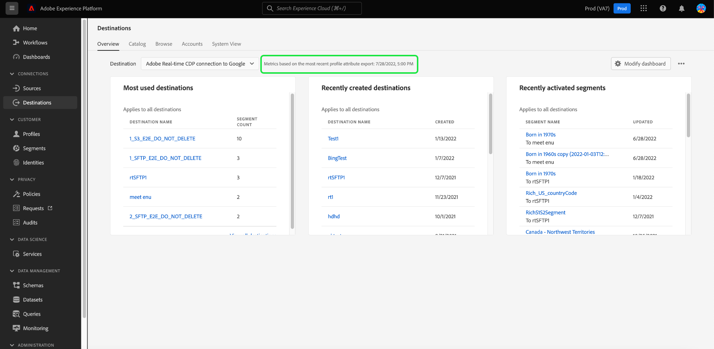

# Panel [!UICONTROL Destinos]

La interfaz de usuario (IU) de Adobe Experience Platform proporciona un panel a través del cual puede ver información importante acerca de los destinos activos de su organización, tal como se capturan durante una instantánea diaria. Esta guía describe cómo acceder al panel de destinos de la interfaz de usuario y trabajar con él, y proporciona más información sobre las métricas que se muestran en el panel.

Para obtener una descripción general de los destinos, así como un catálogo de todos los destinos disponibles en Experience Platform, visite la [documentación de destinos](../../destinations/home.md).

## [!UICONTROL Destinos] datos de panel {#destinations-dashboard-data}

El panel Destinos muestra una instantánea de los destinos que su organización ha activado en Experience Platform. Los datos de la instantánea muestran los datos exactamente como aparecen en el momento específico en el que se tomó. En otras palabras, la instantánea no es una aproximación o una muestra de los datos y el panel de destinos no se actualiza en tiempo real.

>[!NOTE]
>
>Los cambios o actualizaciones realizados en los datos desde que se tomó la instantánea no se reflejarán en el tablero hasta que se tome la siguiente instantánea.

## Explorar el panel [!UICONTROL Destinos] {#explore}

Para ir al panel de destinos en la interfaz de usuario de Experience Platform, selecciona **[!UICONTROL Destinos]** en el carril izquierdo y, a continuación, selecciona la pestaña **[!UICONTROL Información general]** para mostrar el panel.

La fecha y la hora de la instantánea más reciente se muestran en la parte superior de [!UICONTROL Información general] junto al menú desplegable de destino. Todos los datos del widget son precisos a partir de esa fecha y hora. La marca de tiempo de la instantánea se proporciona en formato UTC; no se encuentra en la zona horaria del usuario u organización individual.

>[!NOTE]
>
>Si su organización es nueva en Experience Platform y aún no tiene destinos activos, el panel Destinos y la pestaña [!UICONTROL Información general] no serán visibles. En su lugar, al seleccionar [!UICONTROL Destinos] en el panel de navegación izquierdo, se muestra la ficha [!UICONTROL Catálogo]. Para obtener más información sobre la ficha [!UICONTROL Catálogo], consulte la guía del área de trabajo [[!UICONTROL Destinos]](../../destinations/ui/destinations-workspace.md).

### Modificar el panel [!UICONTROL Destinos] {#modify}

Seleccione **[!UICONTROL Modificar tablero]** para cambiar el aspecto del tablero de destinos. Los cambios en el tablero se realizan por usuario y no en toda la organización. Puede mover, añadir, cambiar el tamaño y eliminar widgets del tablero, y acceder a la biblioteca de widgets para personalizar el tablero. Desde la biblioteca de widgets, puede explorar los widgets disponibles y crear widgets personalizados para su organización.

Consulte la documentación de [modificación de paneles](../customize/modify.md) y [descripción general de la biblioteca de widgets](../customize/widget-library.md) para obtener más información.

### Añadir widgets {#add-widget}

Seleccione **[!UICONTROL Agregar widget]** para navegar a la biblioteca de widgets y ver una lista de los widgets disponibles para agregar al tablero.

Desde la biblioteca de widgets, puede examinar la selección de widgets de audiencia estándar y personalizados. Para obtener información sobre cómo agregar widgets, consulte la documentación de la biblioteca de widgets sobre cómo [agregar un widget](../customize/widget-library.md#add-widgets).

### Ver SQL {#view-sql}

Puede ver el SQL que genera las perspectivas visualizadas en su panel con un conmutador en el espacio de trabajo [!UICONTROL Información general]. Puede inspirarse en el SQL de sus perspectivas existentes para crear nuevas consultas que deriven perspectivas únicas de los datos de Experience Platform en función de sus necesidades comerciales. Para obtener más información acerca de esta característica, consulte la [Guía de la interfaz de usuario de SQL de vista](../view-sql.md).

## Widgets predeterminados {#default-widgets}

Se proporciona una carga de widget predeterminada para todas las instancias nuevas de Adobe Experience Platform que resalta las perspectivas disponibles más recientes de sus datos. Los siguientes widgets están preconfigurados en la vista de segmentos desde el principio. A continuación, se encuentran todos los detalles sobre el propósito y la función de los widgets.

* [[!UICONTROL Destinos más utilizados]](#most-used-destinations)
* [[!UICONTROL Destinos creados recientemente]](#recently-created-destinations)
* [[!UICONTROL Segmentos activados recientemente]](#recently-activated-segments)

>[!NOTE]
>
>El 26 de julio de 2023, los paneles de [!UICONTROL Perfiles], [!UICONTROL Audiencias] y [!UICONTROL Destinos] de Información general se restablecieron a una nueva carga de widget predeterminada para todos los usuarios que no modificaron sus vistas en los seis meses anteriores.
>Consulte la documentación en las secciones de widgets predeterminados de [Perfiles](./profiles.md#default-widgets) y [Audiencias](./audiences.md#default-widgets) para obtener detalles sobre qué widgets se incluyen como parte de las cargas de widgets predeterminados. Puede seguir personalizando los widgets del tablero como antes.

## Widgets estándar {#standard-widgets}

Adobe proporciona varios widgets estándar que puede utilizar para visualizar diferentes métricas relacionadas con sus destinos y evaluar la integridad de las audiencias disponibles para el análisis de datos. También puede crear widgets personalizados para compartirlos con su organización mediante la [!UICONTROL biblioteca de widgets]. Para obtener más información sobre cómo crear widgets personalizados, empieza por leer la [descripción general de la biblioteca de widgets](../customize/widget-library.md).

### Requisitos previos {#prerequisites}

Antes de continuar con las descripciones de los widgets estándar, asegúrese de estar familiarizado con las definiciones de los siguientes términos clave utilizados en la documentación:

* **Definición del segmento:** Una definición de segmento es un **conjunto de reglas** que se usa para describir características clave o el comportamiento de una audiencia de destino. Estas reglas incluyen datos de atributos y eventos que clasifican los perfiles como parte de una audiencia.
* **Público**: conjunto de personas, cuentas, hogares u otras entidades que comparten características y comportamientos comunes.
* **Asignado / Asignación**: la asignación de datos es el proceso de asignación de campos de datos de origen a campos de destino relacionados en un destino.
* **Identidad**: una identidad es un identificador que representa exclusivamente a un cliente individual, como un ID de cookie, ID de dispositivo o ID de correo electrónico.
* **Activar**: Activar es la acción realizada por un usuario para asignar una audiencia o perfiles a un destino como Oracle Eloqua, Google o Salesforce Marketing Cloud.

Para obtener más información sobre cada uno de los widgets estándar disponibles, seleccione el nombre de un widget en la siguiente lista:

* [[!UICONTROL Destinos más utilizados]](#most-used-destinations)
* [[!UICONTROL Destinos creados recientemente]](#recently-created-destinations)
* [[!UICONTROL Públicos activados recientemente]](#recently-activated-audiences)
* [[!UICONTROL Públicos activados recientemente por destino]](#recently-activated-audiences-by-destination)
* [[!UICONTROL Tendencia de tamaño de público]](#audience-size-trend)
* [[!UICONTROL Públicos no asignados por identidad]](#unmapped-audiences-by-identity)
* [[!UICONTROL Públicos asignados por identidad]](#mapped-audiences-by-identity)
* [[!UICONTROL Audiencias comunes]](#common-audiences)
* [[!UICONTROL Audiencias asignadas]](#mapped-audiences)
* [[!UICONTROL Estado de audiencia asignado]](#mapped-audience-health)
* [[!UICONTROL Recuento de destinos]](#destinations-count)
* [[!UICONTROL Estado del destino]](#destination-status)
* [[!UICONTROL Destinos activos por plataforma de destino]](#active-destinations-by-destination-platform)
* [[!UICONTROL Audiencias activadas en todos los destinos]](#activated-audiences-across-all-destinations)
* [[!UICONTROL Audiencias activadas]](#activated-audiences)

### [!UICONTROL Destinos más utilizados] {#most-used-destinations}

>[!CONTEXTUALHELP]
>id="platform_dashboards_destinations_mostuseddestinations"
>title="Destinos más utilizados"
>abstract="Este widget muestra los destinos más activos de su organización según el número de públicos asignados. Estos números son precisos en el momento de la última instantánea. Esta clasificación proporciona una perspectiva sobre los destinos que se utilizan más actualmente, al tiempo que resalta los que pueden estar infrautilizados."

El widget **[!UICONTROL destinos más utilizados]** muestra los destinos principales de su organización según el número de audiencias asignadas, a partir de la última instantánea. Esta clasificación proporciona a insight los destinos que se están utilizando, pero también muestra potencialmente los que pueden estar infrautilizados.

Por ejemplo, si configuró un destino ayer pero no le ha asignado ninguna audiencia, podrá ver que el destino está actualmente infrautilizado.

El número de audiencias asignadas que se muestra en la columna [!UICONTROL Recuento de audiencias] es preciso en la última instantánea diaria. La asignación de una nueva audiencia al destino no actualiza el recuento hasta que se produce la siguiente instantánea.

Seleccione el nombre de un destino en la lista que aparece en el widget para navegar hasta los detalles de destino de ese destino en particular. También puede seleccionar **[!UICONTROL Ver todo]** para ir a la ficha **[!UICONTROL Examinar]** y, a continuación, seleccionar el nombre de un destino para ver sus detalles.

### [!UICONTROL Destinos creados recientemente] {#recently-created-destinations}

>[!CONTEXTUALHELP]
>id="platform_dashboards_destinations_recentlycreateddestinations"
>title="Destinos creados recientemente"
>abstract="Este widget muestra una lista de los destinos configurados más recientemente dentro de su organización."

El widget **[!UICONTROL Destinos creados recientemente]** le permite ver una lista de los destinos configurados más recientemente en su organización.

La fecha de creación que se muestra es la exacta de la última instantánea diaria. En otras palabras, si crea un nuevo destino, no aparecerá en la lista hasta que se tome la siguiente instantánea.

Si selecciona el nombre de un destino en la lista que aparece en el widget, accederá a los detalles del destino tal como se relacionan desde la pestaña **[!UICONTROL Examinar]**. También puede seleccionar **[!UICONTROL Ver todo]** para ir a la ficha **[!UICONTROL Examinar]** y, a continuación, seleccionar el nombre de un destino para ver sus detalles.

Para obtener más información acerca de cómo configurar tipos específicos de destinos, visite la [documentación de destinos](../../destinations/home.md).

### [!UICONTROL Públicos activados recientemente] {#recently-activated-audiences}

>[!CONTEXTUALHELP]
>id="platform_dashboards_destinations_recentlyactivatedsegments"
>title="Públicos activados recientemente"
>abstract="Este widget proporciona una lista de los públicos que se han asignado más recientemente a un destino. Esta lista proporciona una instantánea de los públicos y destinos que se utilizan activamente en el sistema y puede ayudar a solucionar cualquier asignación errónea."

El widget **[!UICONTROL Audiencias activadas recientemente]** proporciona una lista de las audiencias asignadas más recientemente a un destino. Esta lista proporciona una instantánea de los públicos y destinos que se utilizan activamente en el sistema y puede ayudar a solucionar cualquier asignación errónea.

La fecha [!UICONTROL Actualizada] mostrada muestra la última vez que la audiencia se activó en el destino y es precisa para la última instantánea diaria. En otras palabras, si activa una audiencia en el destino, la fecha de actualización no cambia hasta que se tome la siguiente instantánea.

Al seleccionar el nombre de una audiencia en la lista que se muestra en el widget, se accede a los detalles de la audiencia. También puede seleccionar **[!UICONTROL Ver todo]** para navegar hasta la ficha [!UICONTROL Audiencias] [!UICONTROL Examinar] y, a continuación, seleccionar el nombre de una audiencia para ver sus detalles.

Para obtener más información sobre cómo trabajar con audiencias en Experience Platform, consulte [Resumen del servicio de segmentación](../../segmentation/home.md).

### [!UICONTROL Públicos activados recientemente por destino] {#recently-activated-audiences-by-destination}

>[!CONTEXTUALHELP]
>id="platform_dashboards_destinations_recentlyactivatedsegmentsbydestination"
>title="Públicos activados recientemente por destino"
>abstract="Este widget muestra los cinco públicos activados más recientemente en orden de bajada según el destino elegido en el menú desplegable Información general."

El widget **[!UICONTROL Audiencias activadas recientemente por destino]** muestra las cinco audiencias activadas más recientemente en orden descendente según el destino elegido en la lista desplegable de Información general. Es similar al widget de [!UICONTROL audiencias activadas recientemente], pero los datos mostrados **solo** se aplican al destino seleccionado.

Este widget contiene dos métricas: el nombre de las audiencias y la fecha en que se activaron por última vez en el destino. Los datos mostrados son correctos desde la última instantánea diaria.

Para ver los detalles de una audiencia, seleccione el nombre de la audiencia en la lista que se muestra.

Consulte la sección de requisitos previos para las [definiciones de términos utilizados](#prerequisites) en esta descripción.

### [!UICONTROL Tendencia de tamaño de público] {#audience-size-trend}

>[!CONTEXTUALHELP]
>id="platform_dashboards_destinations_audiencesizetrend"
>title="Tendencia de tamaño de audiencia"
>abstract="Este widget ilustra la cantidad de perfiles contenidos en el público que se envía diariamente a la cuenta de destino. El primer menú desplegable ajusta el período de tiempo de la tendencia de público. El segundo menú desplegable del widget selecciona el público para su análisis. El destino se elige en el menú desplegable Información general."

El widget **[!UICONTROL Tendencia de tamaño de audiencia]** muestra la relación del recuento de perfiles durante un período de tiempo para una audiencia que se ha asignado a esa cuenta de destino. El widget utiliza un gráfico de líneas para ilustrar el número de perfiles contenidos en la audiencia que se envían diariamente a la cuenta de destino.

Se puede ajustar un periodo de tiempo para la tendencia de la audiencia en los últimos 30 días, 90 días o 12 meses mediante el primer menú desplegable.

El segundo menú desplegable enumera todas las audiencias disponibles que se pueden enviar a la cuenta de destino elegida en la parte superior del panel.

El widget **[!UICONTROL Tendencia de tamaño de audiencia]** proporciona un botón [!UICONTROL Subtítulos] en la parte superior derecha del widget. Seleccione **[!UICONTROL Subtítulos]** para abrir el cuadro de diálogo de subtítulos automáticos. Un modelo de aprendizaje automático genera automáticamente subtítulos para describir las tendencias clave y los eventos importantes mediante el análisis del gráfico y los datos de audiencia.

### [!UICONTROL Públicos no asignados por identidad] {#unmapped-audiences-by-identity}

>[!CONTEXTUALHELP]
>id="platform_dashboards_destinations_unmappedsegmentsbyidentity"
>title="Públicos no asignados por identidad"
>abstract="Este widget enumera los cinco públicos principales **sin asignar** clasificados por recuento descendente de identidad para un destino e identidad determinados. Los ID de filtro enumerados en el menú desplegable del widget cambian según la cuenta de destino seleccionada en la parte superior de la página de información general."

El widget **[!UICONTROL Audiencias sin asignar por identidad]** enumera las cinco audiencias **sin asignar** principales clasificadas por recuento de identidad descendente para un destino e identidad determinados. Resalta las audiencias que son más beneficiosas para asignar a la cuenta de destino elegida en función del ID elegido.

El menú desplegable de ID de destino filtra las audiencias disponibles. Los ID de filtro enumerados en la lista desplegable cambian según la cuenta de destino seleccionada en la parte superior de la página de información general.

La columna de identidades cuenta el número de ID de origen dentro de la audiencia que podrían asignarse al ID elegido en la lista desplegable ID del widget.

Consulte la sección de requisitos previos para las [definiciones de términos utilizados](#prerequisites) en esta descripción.

### [!UICONTROL Públicos asignados por identidad] {#mapped-audiences-by-identity}

>[!CONTEXTUALHELP]
>id="platform_dashboards_destinations_mappedsegmentsbyidentity"
>title="Públicos asignados por identidad"
>abstract="Este widget proporciona una lista de los cinco públicos principales **asignados**. La lista se ordena de mayor a menor según el número de ID de origen que contienen los públicos. El ID de destino que se va a contar se selecciona en el menú desplegable situado debajo del título del widget. Los ID de destino disponibles en el menú desplegable del widget dependen del destino elegido en la parte superior del panel de información general."

Este widget proporciona una lista de los cinco públicos principales **asignados**. La lista se ordena de mayor a menor según el número de ID de origen que contienen los públicos. El ID de destino que se va a contar se selecciona en el menú desplegable situado debajo del título del widget. Los ID de destino disponibles en la lista desplegable del widget cambiarán según el filtro de cuenta de destino elegido en la parte superior del panel de información general.

El widget **[!UICONTROL Audiencias asignadas por identidad]** resalta de un vistazo la probabilidad de segmentar correctamente las oportunidades de perfil para una campaña dentro del destino elegido. Una campaña objetivo eficaz no depende del número de perfiles enviados al destino, sino del número de ID de origen que es probable que coincidan con los ID de destino para proporcionar datos útiles y procesables.

### Audiencias comunes {#common-audiences}

>[!CONTEXTUALHELP]
>id="platform_dashboards_destinations_commonaudiences"
>title="Audiencias comunes"
>abstract="Este widget proporciona una lista de los cinco públicos principales activados en la cuenta de destino elegida en la parte superior de la página y el destino seleccionado en el menú desplegable del widget. La lista de públicos se ordena según la fecha de activación. El público activado más recientemente se muestra en la parte superior."

El widget de **[!UICONTROL audiencias comunes]** proporciona una lista de las cinco audiencias principales activadas en la cuenta de destino elegida en la parte superior de la página y el destino seleccionado en la lista desplegable del widget. La lista de públicos se ordena según la fecha de activación. El público activado más recientemente se muestra en la parte superior.

La columna [!UICONTROL TAMAÑO DE AUDIENCIA] proporciona el recuento total de perfiles de cada audiencia enumerada.

### Públicos asignados {#mapped-audiences}

El widget de [!UICONTROL audiencias asignadas] muestra la cantidad total de audiencias asignadas que se pueden activar en el destino seleccionado en la parte superior de la página.

Seleccione **[!UICONTROL Audiencias]** para navegar a la pestaña [!UICONTROL Examinar] del panel Audiencias. Este espacio de trabajo muestra una lista de todas las definiciones de segmentos de su organización.

### Estado de público asignado {#mapped-audience-health}

>[!CONTEXTUALHELP]
>id="platform_dashboards_destinations_mappedaudiencehealth"
>title="Estado de público asignado"
>abstract="Este widget proporciona una lista de hasta 20 públicos asignados cuyos recuentos totales de perfiles se desvían por un factor de al menos una desviación estándar del tamaño de público medio de 30 días asignado a ese destino. Proporciona una métrica calculada para la dispersión de los tamaños de audiencia de la media durante los últimos 30 días. Los tamaños de audiencia se ordenan de mayor a menor."

El widget proporciona una lista de hasta 20 audiencias asignadas cuyo recuento total de perfiles, a partir de la última instantánea diaria, se desvía por un factor de al menos una desviación estándar del tamaño medio de audiencia asignado a ese destino a los 30 días.

En resumen, proporciona una métrica calculada para la dispersión de los tamaños de audiencia desde la media de los últimos 30 días. Compara si el tamaño de la audiencia actual está fuera de la desviación estándar histórica vista en los datos de los últimos 30 días.

Todos los tamaños de audiencia del sistema se ordenan de alto a bajo, tal como se indica en la columna [!UICONTROL ÚLTIMO TAMAÑO].

Si el recuento de perfiles de audiencia asignados está fuera de una desviación estándar del tamaño promedio de perfil asignado en los últimos 30 días, esto indica una anomalía en el sistema y debe investigarse.

Si una audiencia dentro del widget [!UICONTROL Estado de la audiencia asignada] se desvía por un amplio margen, debe consultar el gráfico de tendencias de tamaño de audiencia y localizar la audiencia anómala. La tendencia puede proporcionar más insight sobre el estado de su audiencia.

>[!NOTE]
>
>El tamaño predeterminado del widget de estado de audiencia asignado puede obstruir la información de la tabla. Modifique el tamaño del widget para mejorar la legibilidad de los nombres de audiencia y títulos de columna asignados. Consulte la documentación de modificación de paneles para obtener instrucciones sobre [cómo cambiar el tamaño de un widget](../customize/modify.md).

### [!UICONTROL Recuento de destinos] {#destinations-count}

>[!CONTEXTUALHELP]
>id="platform_dashboards_destinations_destinationscount"
>title="Recuento de destinos"
>abstract="Este widget proporciona el número total de puntos finales disponibles en los que se puede activar y enviar una audiencia dentro del sistema. Este número incluye destinos tanto activos como inactivos."

El widget [!UICONTROL Recuento de destinos] proporciona el número total de extremos disponibles en los que se puede activar y enviar una audiencia dentro del sistema. Este número incluye destinos tanto activos como inactivos.

Debajo del recuento total, seleccione **[!UICONTROL Destinos]** para ir a la pestaña de exploración de destinos. Esta página lista todos los destinos con los que ha establecido una conexión hasta la fecha.

### [!UICONTROL Estado del destino] {#destination-status}

El widget [!UICONTROL Estado del destino] muestra el número total de destinos habilitados como una sola métrica y usa un gráfico de anillo para ilustrar la diferencia proporcional entre los destinos habilitados y deshabilitados.

Los recuentos individuales de los destinos habilitados o deshabilitados se muestran en un cuadro de diálogo cuando el cursor se pasa por encima de la sección correspondiente del gráfico circular.

### [!UICONTROL Destinos activos por plataforma de destino] {#active-destinations-by-destination-platform}

El widget proporciona una tabla de dos columnas para mostrar una lista de las plataformas de destino activas y la cantidad total de destinos activos para cada plataforma de destino. La lista de plataformas de destino se ordena de alta a baja.

### [!UICONTROL Audiencias activadas en todos los destinos] {#activated-audiences-across-all-destinations}

El widget [!UICONTROL Audiencias activadas en todos los destinos] proporciona el número total de audiencias activadas en todos los destinos en una sola métrica. Este número corresponde a la instantánea más reciente.

Seleccione **[!UICONTROL Audiencias]** para ir a la ficha [!UICONTROL Examinar] de destinos. Esta página proporciona una lista de todos los destinos habilitados y una variedad de métricas relevantes. Consulte la documentación para obtener más información sobre la ficha [[!UICONTROL Examinar]](../../destinations/ui/destinations-workspace.md#browse).

Consulte la sección de requisitos previos para las [definiciones de términos utilizados](#prerequisites) en esta descripción.

### [!UICONTROL Audiencias activadas] {#activated-audiences}

Este widget proporciona una sola métrica para el número total de audiencias activadas en un destino.

Seleccione **[!UICONTROL Audiencias]** para navegar a la página de detalles del panel de destinos. La pestaña [!UICONTROL Datos de activación] muestra una lista de audiencias que se han asignado al destino, incluidas su fecha de inicio y finalización (si corresponde), y otra información relevante para la exportación de datos, como el tipo de exportación, la programación y la frecuencia. Para ver los detalles de una audiencia en particular, seleccione su nombre en la columna [!UICONTROL Nombre de audiencia].

Este widget le ayuda a comprender el valor de sus destinos en función del número de audiencias activadas de un vistazo. También facilita el acceso a información más detallada para un análisis más detallado.

Consulte la sección de requisitos previos para las [definiciones de términos utilizados](#prerequisites) en esta descripción.

## Pasos siguientes

Al seguir este documento, ahora debería poder localizar el panel de destinos y comprender las métricas mostradas en los widgets disponibles. Para obtener más información sobre cómo trabajar con destinos en Experience Platform, consulte la [documentación de destinos](../../destinations/home.md).
