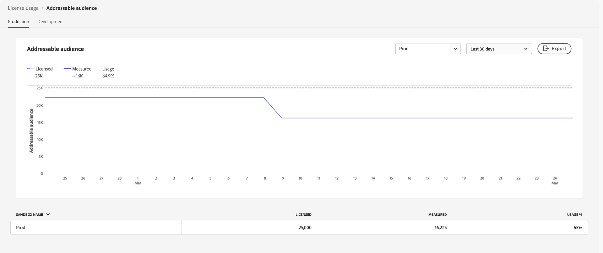

# Panel de uso de licencias {#license-usage-dashboard}

>[!CONTEXTUALHELP]
>id="testy-mctestface"
>title="Cuadro de diálogo de prueba que no debería estar visible"
>abstract="El objeto {name} se está viendo en {date}."

>[!CONTEXTUALHELP]
>id="platform_dashboards_licenseusage_core"
>title="Tabla de productos principales"
>abstract="Los productos principales enumerados en la tabla tienen sus propias métricas, seguimiento de uso y vistas de obtención de detalles a nivel de zona protegida. Estos productos principales proporcionan las métricas clave para el seguimiento y todos los complementos se incluyen en estas métricas."

>[!CONTEXTUALHELP]
>id="platform_dashboards_licenseusage_addons"
>title="Tabla de complementos"
>abstract="La tabla de complementos enumera los productos cuyas cantidades de licencias se combinan con las métricas admitidas por los productos principales. Estos complementos no tienen métricas independientes, pero mejoran el seguimiento de uso de los productos principales con los que están asociados."

>[!CONTEXTUALHELP]
>id="platform_dashboards_licenseUsage"
>title="Panel de uso de licencias"
>abstract="El panel de uso de licencias ofrece datos de los productos de Adobe Experience Platform que ha adquirido. La información general del panel muestra las métricas principales de sus productos, incluido el uso de cada una de las métricas principales y el importe de la licencia contratada. El espacio de trabajo de detalles muestra un desglose de las métricas de cada producto dentro de zonas protegidas específicas."
>additional-url="https://experienceleague.adobe.com/docs/experience-platform/data-lifecycle/ui/dataset-expiration.html?lang=es" text="Caducidades de conjuntos de datos automatizados"
>additional-url="https://experienceleague.adobe.com/docs/experience-platform/profile/pseudonymous-profiles.html?lang=es" text="Caducidad de los datos de perfiles seudónimos"

>[!CONTEXTUALHELP]
>id="platform_licenseusage"
>title="Panel de uso de licencias"
>abstract="El panel de uso de licencias ofrece datos de los productos de Adobe Experience Platform que ha adquirido. La información general del panel muestra las métricas principales de sus productos, incluido el uso de cada una de las métricas principales y el importe de la licencia contratada. El espacio de trabajo de detalles muestra un desglose de las métricas de cada producto dentro de zonas protegidas específicas."
>additional-url="https://experienceleague.adobe.com/docs/experience-platform/data-lifecycle/ui/dataset-expiration.html?lang=es" text="Caducidades de conjuntos de datos automatizados"
>additional-url="https://experienceleague.adobe.com/docs/experience-platform/profile/pseudonymous-profiles.html?lang=es" text="Caducidad de los datos de perfiles seudónimos"

>[!CONTEXTUALHELP]
>id="platform_dashboards_licenseusage_predictedusage_computehours"
>title="Horas calculadas previstas"
>abstract="Las horas calculadas miden el tiempo que los motores del Servicio de consultas invierten en leer, procesar y escribir datos cuando se ejecutan consultas por lotes. Su uso podría alcanzar la cantidad autorizada. Para evaluar o reducir el uso, vaya a Consultas > Registro para revisar el historial de consultas. Si no tiene permiso para acceder al espacio de trabajo Consultas, póngase en contacto con su administrador."
>additional-url="https://experience.adobe.com/#/platform/query/log.html?lang=es" text="Espacio de trabajo Registro de consultas"

>[!CONTEXTUALHELP]
>id="platform_dashboards_licenseusage_predictedusage_addressableaudience"
>title="Público destinatario previsto"
>abstract="El público destinatario es el conjunto de perfiles de personas en el perfil del cliente en tiempo real que su organización tiene derecho a captar. Esta métrica incluye perfiles directamente identificables y seudónimos. Su uso podría alcanzar la cantidad autorizada. Para reducir el uso, configure las caducidades de los datos del conjunto de datos o del perfil seudónimo."
>additional-url="https://experienceleague.adobe.com/docs/experience-platform/profile/event-expirations.html?lang=es" text="Caducidades de eventos de experiencia"
>additional-url="https://experienceleague.adobe.com/docs/experience-platform/profile/pseudonymous-profiles.html?lang=es" text="Caducidad de los datos de perfiles seudónimos"

>[!CONTEXTUALHELP]
>id="platform_dashboards_licenseusage_predictedusage_engageableprofiles"
>title="Perfiles atractivos previstos"
>abstract="Los perfiles atractivos son perfiles de personas en el perfil del cliente en tiempo real que su organización ha intentado captar mediante Journey Optimizer en los 12 últimos meses. Su uso podría alcanzar la cantidad autorizada. Para reducir el uso, configure las caducidades de los datos del conjunto de datos o del perfil seudónimo."
>additional-url="https://experienceleague.adobe.com/docs/experience-platform/profile/event-expirations.html?lang=es" text="Caducidades de eventos de experiencia"
>additional-url="https://experienceleague.adobe.com/docs/experience-platform/profile/pseudonymous-profiles.html?lang=es" text="Caducidad de los datos de perfiles seudónimos"

>[!CONTEXTUALHELP]
>id="platform_dashboards_licenseusage_predictedusage_businesspersonprofile"
>title="Perfil del empresario previsto"
>abstract="Los perfiles de empresarios son registros del perfil del cliente en tiempo real que representan a personas en un contexto B2B. Su uso podría alcanzar la cantidad autorizada. Para reducir el uso, configure las caducidades de los datos del conjunto de datos o del perfil seudónimo."
>additional-url="https://experienceleague.adobe.com/docs/experience-platform/profile/event-expirations.html?lang=es" text="Caducidades de eventos de experiencia"
>additional-url="https://experienceleague.adobe.com/docs/experience-platform/profile/pseudonymous-profiles.html?lang=es" text="Caducidad de los datos de perfiles seudónimos"

>[!CONTEXTUALHELP]
>id="platform_dashboards_licenseusage_predictedusage_corehours"
>title="Horario principal previsto"
>abstract="El horario principal representa el tiempo de procesamiento consumido en los servicios de Experience Platform. Su uso podría alcanzar la cantidad autorizada. Para reducir el uso, configure las caducidades de los datos del conjunto de datos o del perfil seudónimo."
>additional-url="https://experienceleague.adobe.com/docs/experience-platform/profile/event-expirations.html?lang=es" text="Caducidades de eventos de experiencia"
>additional-url="https://experienceleague.adobe.com/docs/experience-platform/profile/pseudonymous-profiles.html?lang=es" text="Caducidad de los datos de perfiles seudónimos"

>[!CONTEXTUALHELP]
>id="platform_dashboards_licenseusage_predictedusage_totaldatavolume"
>title="Volumen total de datos previsto"
>abstract="El volumen total de datos es la cantidad de datos disponibles en el perfil del cliente en tiempo real para su uso en flujos de trabajo de participación y personalización. Su uso podría alcanzar la cantidad autorizada. Para reducir el uso, configure las caducidades de los datos del conjunto de datos o del perfil seudónimo."
>additional-url="https://experienceleague.adobe.com/docs/experience-platform/profile/event-expirations.html?lang=es" text="Caducidades de eventos de experiencia"
>additional-url="https://experienceleague.adobe.com/docs/experience-platform/profile/pseudonymous-profiles.html?lang=es" text="Caducidad de los datos de perfiles seudónimos"

>[!CONTEXTUALHELP]
>id="platform_dashboards_licenseusage_predictedusage_cjaRowsAvailable"
>title="Filas de CJA previstas disponibles"
>abstract="Las filas de CJA disponibles hacen referencia a las filas medias diarias de datos disponibles para su análisis en Customer Journey Analytics. Su uso podría alcanzar la cantidad autorizada. Para reducir el uso, configure las caducidades de los datos del conjunto de datos o del perfil seudónimo."
>additional-url="https://experienceleague.adobe.com/docs/experience-platform/profile/event-expirations.html?lang=es" text="Caducidades de eventos de experiencia"
>additional-url="https://experienceleague.adobe.com/docs/experience-platform/profile/pseudonymous-profiles.html?lang=es" text="Caducidad de los datos de perfiles seudónimos"

>[!CONTEXTUALHELP]
>id="platform_dashboards_licenseusage_exceededusage_addressableaudience"
>title="Público destinatario previsto"
>abstract="El público destinatario es el conjunto de perfiles de personas en el perfil del cliente en tiempo real que su organización tiene derecho a captar. Esto incluye perfiles directamente identificables y seudónimos. Su uso podría alcanzar la cantidad autorizada. Para reducir el uso, configure las caducidades de los datos del conjunto de datos o del perfil seudónimo."
>additional-url="https://experienceleague.adobe.com/docs/experience-platform/profile/event-expirations.html?lang=es" text="Caducidades de eventos de experiencia"
>additional-url="https://experienceleague.adobe.com/docs/experience-platform/profile/pseudonymous-profiles.html?lang=es" text="Caducidad de los datos de perfiles seudónimos"

>[!CONTEXTUALHELP]
>id="platform_dashboards_licenseusage_exceededusage_engageableprofiles"
>title="Perfiles atractivos previstos"
>abstract="Los perfiles atractivos son perfiles de personas en el perfil del cliente en tiempo real que su organización ha intentado captar mediante Journey Optimizer en los 12 últimos meses. Su uso ha excedido la cantidad autorizada. Para reducir el uso, configure las caducidades de los datos del conjunto de datos o del perfil seudónimo."
>additional-url="https://experienceleague.adobe.com/docs/experience-platform/profile/event-expirations.html?lang=es" text="Caducidades de eventos de experiencia"
>additional-url="https://experienceleague.adobe.com/docs/experience-platform/profile/pseudonymous-profiles.html?lang=es" text="Caducidad de los datos de perfiles seudónimos"

>[!CONTEXTUALHELP]
>id="platform_dashboards_licenseusage_exceededusage_businesspersonprofile"
>title="Perfil del empresario previsto"
>abstract="Los perfiles de empresarios son registros del perfil del cliente en tiempo real que representan a personas en un contexto B2B. Su uso ha excedido la cantidad autorizada. Para reducir el uso, configure las caducidades de los datos del conjunto de datos o del perfil seudónimo."
>additional-url="https://experienceleague.adobe.com/docs/experience-platform/profile/event-expirations.html?lang=es" text="Caducidades de eventos de experiencia"
>additional-url="https://experienceleague.adobe.com/docs/experience-platform/profile/pseudonymous-profiles.html?lang=es" text="Caducidad de los datos de perfiles seudónimos"

>[!CONTEXTUALHELP]
>id="platform_dashboards_licenseusage_exceededusage_corehours"
>title="Horario principal previsto"
>abstract="El horario principal representa el tiempo de procesamiento consumido en los servicios de Experience Platform. Su uso ha excedido la cantidad autorizada. Para reducir el uso, configure las caducidades de los datos del conjunto de datos o del perfil seudónimo."
>additional-url="https://experienceleague.adobe.com/docs/experience-platform/profile/event-expirations.html?lang=es" text="Caducidades de eventos de experiencia"
>additional-url="https://experienceleague.adobe.com/docs/experience-platform/profile/pseudonymous-profiles.html?lang=es" text="Caducidad de los datos de perfiles seudónimos"

>[!CONTEXTUALHELP]
>id="platform_dashboards_licenseusage_exceededusage_totaldatavolume"
>title="Volumen total de datos previsto"
>abstract="El volumen total de datos es la cantidad de datos disponibles en el perfil del cliente en tiempo real para su uso en flujos de trabajo de participación y personalización. Su uso ha excedido la cantidad autorizada. Para reducir el uso, configure las caducidades de los datos del conjunto de datos o del perfil seudónimo."
>additional-url="https://experienceleague.adobe.com/docs/experience-platform/profile/event-expirations.html?lang=es" text="Caducidades de eventos de experiencia"
>additional-url="https://experienceleague.adobe.com/docs/experience-platform/profile/pseudonymous-profiles.html?lang=es" text="Caducidad de los datos de perfiles seudónimos"

>[!CONTEXTUALHELP]
>id="platform_dashboards_licenseusage_exceededusage_cjaRowsAvailable"
>title="Filas de CJA previstas disponibles"
>abstract="Las filas de CJA disponibles hacen referencia a las filas medias diarias de datos disponibles para su análisis en Customer Journey Analytics. Su uso ha excedido la cantidad autorizada. Para reducir el uso, configure las caducidades de los datos del conjunto de datos o del perfil seudónimo."
>additional-url="https://experienceleague.adobe.com/docs/experience-platform/profile/event-expirations.html?lang=es" text="Caducidades de eventos de experiencia"
>additional-url="https://experienceleague.adobe.com/docs/experience-platform/profile/pseudonymous-profiles.html?lang=es" text="Caducidad de los datos de perfiles seudónimos"

Puede ver información importante sobre el uso de licencias de su organización en el panel de control de Adobe Experience Platform [!UICONTROL Uso de licencias]. La información que se muestra aquí se captura durante una captura diaria de la instancia de Experience Platform.

Los informes de uso de licencias proporcionan un alto grado de granularidad. La mayoría de las métricas se comparten en varios productos y reflejan el uso agregado en todos los productos que las utilizan, no los totales por producto. El tablero proporciona un uso consolidado de estas métricas en todos los entornos limitados de producción o desarrollo, así como la métrica de uso de un entorno limitado específico. Las siguientes aplicaciones de Experience Platform se pueden rastrear con métricas de uso: Real-Time Customer Data Platform, Adobe Journey Optimizer y Customer Journey Analytics.

Esta guía describe cómo acceder y trabajar con el tablero de uso de licencias en la interfaz de usuario y proporciona más información sobre las visualizaciones que se muestran en el tablero.

Para obtener una descripción general de la interfaz de usuario de Experience Platform, consulte la [guía de la interfaz de usuario de Experience Platform](../../landing/ui-guide.md).

## [!UICONTROL Uso de licencias] datos de tablero

El tablero [!UICONTROL Uso de licencias] muestra una lista de todos los productos de Experience Platform que ha comprado y los complementos de dichos productos. Desde este panel, puede encontrar una instantánea de los datos relacionados con las licencias de su organización para Experience Platform en cualquier zona protegida asociada.

Los datos de este tablero se muestran exactamente como aparecían en el momento específico en el que se tomó la instantánea. No es una aproximación ni una muestra, pero el panel no se actualiza en tiempo real.

>[!NOTE]
>
>La mayoría de las métricas del tablero se actualizan a diario, según una instantánea de la instancia de Experience Platform. [!UICONTROL Filas de CJA disponibles] son una excepción y se actualizan mensualmente. Las métricas etiquetadas con &quot;paquetes&quot;, como [!UICONTROL Paquetes de usuarios de Adhoc Query Service], [!UICONTROL No de paquetes de la riqueza de perfiles] y [!UICONTROL No de paquetes de segmentación de streaming], reflejan los derechos de licencia para ofertas de complementos y no rastrean el uso en curso. Los cambios realizados después de la instantánea no serán visibles hasta que se tome la siguiente instantánea.

## Exploración del tablero de uso de licencias {#explore}

Para navegar al panel de uso de licencias dentro de la interfaz de usuario de Experience Platform, seleccione **[!UICONTROL Uso de licencias]** en el carril izquierdo. El tablero contiene dos fichas: **[!UICONTROL Métricas]** y **[!UICONTROL Productos]**.

>[!NOTE]
>
>El panel de uso de licencias no está habilitado de forma predeterminada. Los usuarios deben tener permiso para &quot;Ver tablero de uso de licencias&quot; para ver el tablero. Para ver los pasos sobre la concesión de permisos de acceso, consulte la [guía de permisos de tablero](../permissions.md).

## Pestaña [!UICONTROL Métricas] {#metrics-tab}

La pestaña **[!UICONTROL Métricas]** proporciona una vista centralizada de todas las métricas de uso de licencias de su organización. Debido a que la mayoría de las métricas se comparten entre productos, no hay un desglose por producto independiente para estas métricas.

La tabla de métricas incluye las siguientes columnas:

| Nombre de columna | Descripción |
|---|---|
| **[!UICONTROL Nombre de métrica]** | Nombre de la métrica de uso de licencias. Cada entrada incluye un icono de información (`ⓘ`) que muestra una descripción y una lista de productos asociados. |
| **[!UICONTROL Con licencia]** | El número de unidades que puede utilizar su organización, tal como se define en el contrato. Esta métrica tiene el mismo valor que **Cantidad de licencia** en la ficha Productos. |
| **[!UICONTROL Medido]** | Cantidad de la métrica que su organización utiliza actualmente. |
| **[!UICONTROL Uso %]** | Porcentaje del valor de la licencia que está en uso actualmente. |
| **[!UICONTROL Uso previsto %]** | El rango previsto de uso de métricas en las próximas 6 semanas. |

Utilice la opción de zona protegida **[!UICONTROL Production]** o **[!UICONTROL Development]** para filtrar las métricas que se muestran en las zonas protegidas.

>[!NOTE]
>
>Los informes de consumo son acumulativos por tipo de zona protegida. Al seleccionar [!UICONTROL Producción] o [!UICONTROL Desarrollo], se muestra el uso combinado en todas las zonas protegidas de ese tipo.

>[!WARNING]
>
>El permiso para ver el tablero de uso de licencias debe especificarse en el nivel de zona protegida. Añada permisos a cada zona protegida individual para verlos dentro del panel. Esta limitación se solucionará en una versión futura. Mientras tanto, está disponible la siguiente solución:
>
>1. Cree un perfil de producto en Adobe Admin Console.
>2. En Permiso en la categoría Zona protegida, agregue todas las zonas protegidas que desee ver en el panel de uso de licencias.
>3. En la categoría Permiso del tablero de usuarios, agregue el permiso &quot;Ver tablero de uso de licencias&quot;.

### Ver detalles de métricas {#view-metric-details}

Para ver los detalles de uso de una métrica específica, seleccione un nombre de métrica en la lista. Aparece una vista detallada de la métrica, que incluye:

- Un gráfico de líneas histórico que muestra el uso a lo largo del tiempo
- Una comparación de valores medidos y con licencia
- Uso por zona protegida individual
- Un selector de zona protegida para filtrar datos
- Una opción de exportación para la descarga de CSV

Esta visualización le permite realizar un seguimiento de las tendencias, comprender cómo contribuye cada zona protegida al uso general y exportar los datos para su análisis sin conexión.

Cada gráfico incluye menús desplegables para filtrar los datos. Utilice el menú desplegable de intervalo de fechas para ajustar el período retrospectivo (predeterminado: últimos 30 días) o utilice el menú desplegable de zona protegida para ver el uso de una zona protegida de producción o desarrollo específica.

También puede seleccionar una **[!UICONTROL fecha personalizada]** para elegir el período de tiempo que se muestra.

### Exportación de CSV {#export-metric-usage-data}

Puede exportar los datos de uso históricos de la métrica y la zona protegida seleccionadas como archivo CSV directamente desde la vista de detalles de métrica. Seleccione el icono **[!UICONTROL Exportar]** para descargar los datos del gráfico en formato tabular. El CSV exportado facilita el análisis de tendencias sin conexión o el uso compartido de perspectivas entre equipos.

## Ficha [!UICONTROL Productos] {#products-tab}

La ficha **[!UICONTROL Productos]** presenta los datos de uso de licencias agrupados por los productos comprados y los complementos asociados. La ficha [!UICONTROL Productos] contiene dos tablas:

- **[!UICONTROL Tabla de productos principales]**: Esta tabla enumera los principales productos de Adobe Experience Platform con licencia de su organización. Cada producto enumera su métrica principal, seguimiento de uso y uso predicho.
- **[!UICONTROL Tabla de complementos]**: Enumera elementos adicionales cuyas cantidades de licencias contribuyen a las métricas de productos principales. Los complementos no tienen métricas independientes, pero mejoran el seguimiento de uso de los productos principales con los que están asociados.

| Nombre de columna | Descripción |
|---|---|
| **[!UICONTROL Producto]** | La solución de Adobe con licencia de su organización. |
| **[!UICONTROL Métrica principal]** | La métrica principal utilizada para el seguimiento dentro de ese producto. |
| **[!UICONTROL Importe de licencia]** | El valor contratado para la cantidad máxima de la métrica principal. |
| **[!UICONTROL Uso]** | Cantidad de la métrica principal utilizada. |
| **[!UICONTROL Uso %]** | El porcentaje de la métrica principal utilizado según la cantidad de licencia. |
| **[!UICONTROL Uso Predicho]** | El porcentaje de uso previsto de la métrica principal. |

>[!NOTE]
>
>El [!UICONTROL Importe de licencia] para complementos está incluido en el importe total de licencia del producto principal. Los complementos no se rastrean por separado, pero mejoran las capacidades de sus productos asociados. Por ejemplo, si compra un paquete de cinco zonas protegidas como complemento, la cantidad se agrega a la del producto base. La tabla de complementos muestra un [!UICONTROL Importe de licencia] específico del complemento, pero el uso real se rastrea a través del producto base.

### Uso previsto {#predicted-usage}

>[!CONTEXTUALHELP]
>id="platform_dashboards_licenseUsage_prediction"
>title="Uso previsto"
>abstract="Las predicciones se basan en el uso durante los últimos 6 a 7 meses y se generan semanalmente todos los viernes. Tenga en cuenta que las predicciones del uso de licencias son aproximaciones basadas en el uso anterior. Usted es responsable de comprender el uso real de su organización y de garantizar que el uso no vaya más allá del ámbito de la licencia de su organización con Adobe. Para reducir el uso, puede configurar la caducidad de los datos del conjunto de datos o del perfil seudónimo para las zonas protegidas y los conjuntos de datos."
>additional-url="https://experienceleague.adobe.com/docs/experience-platform/data-lifecycle/ui/dataset-expiration.html?lang=es" text="Caducidades de conjuntos de datos automatizados"
>additional-url="https://experienceleague.adobe.com/docs/experience-platform/profile/pseudonymous-profiles.html?lang=es" text="Caducidad de los datos de perfiles seudónimos"

>[!CONTEXTUALHELP]
>id="platform_licenseusage_prediction"
>title="Uso previsto"
>abstract="Las predicciones se basan en el uso durante los últimos 6 a 7 meses y se generan el 15 de cada mes. Tenga en cuenta que las predicciones del uso de licencias son aproximaciones basadas en el uso anterior. Usted es responsable de comprender el uso real de su organización y de garantizar que el uso no vaya más allá del ámbito de la licencia de su organización con Adobe. Para reducir el uso, puede configurar la caducidad de los datos del conjunto de datos o del perfil seudónimo para las zonas protegidas y los conjuntos de datos."
>additional-url="https://experienceleague.adobe.com/docs/experience-platform/data-lifecycle/ui/dataset-expiration.html?lang=es" text="Caducidades de conjuntos de datos automatizados"
>additional-url="https://experienceleague.adobe.com/docs/experience-platform/profile/pseudonymous-profiles.html?lang=es" text="Caducidad de los datos de perfiles seudónimos"

Administre y optimice de forma proactiva sus recursos de licencias con predicciones de uso precisas y actualizadas. La columna [!UICONTROL Uso predicho] pronostica el uso futuro de licencias en el nivel de zona protegida en todas las zonas protegidas de producción y desarrollo para todos los productos comprados. Las predicciones ahora se actualizan semanalmente, proporcionando un pronóstico de seis semanas basado en los datos de uso más recientes. Cada predicción incluye un límite inferior y otro superior para admitir una planificación informada.

>[!IMPORTANT]
>
>Las predicciones se actualizan semanalmente todos los viernes. La fecha de actualización se incluye en un icono de información () sobre el título de columna.

Vea un resumen del uso de derechos de un producto desde la ficha [!UICONTROL Producto] en la tabla [!UICONTROL Productos principales].

![Se ha resaltado la ficha [!UICONTROL Uso de licencias] [!UICONTROL Producto] con un producto y la columna de uso previsto.](../images/license-usage/product-predicted-usage.png)

>[!NOTE]
>
>Tenga en cuenta que las predicciones del uso de licencias son aproximaciones basadas en el uso anterior. Usted es responsable de comprender el uso real de su organización y de garantizar que el uso no vaya más allá del ámbito de la licencia de su organización con Adobe.

El porcentaje de uso previsto se determina de la siguiente manera:

- Si los límites inferior y superior son significativamente diferentes, se muestran como un rango (por ejemplo, 32 % - 35 %).
- Si los límites inferior y superior son casi idénticos y no son cero, se muestran como un valor aproximado (por ejemplo, ~34%).
- Si los límites inferior y superior son casi idénticos y cero, se muestran exactamente como 0%.

>[!NOTE]
>
>&quot;Casi idéntico&quot; en este contexto significa que los valores son estadísticamente significativos para dos decimales (por ejemplo, un límite inferior de 0,342 y un límite superior de 0,344 se redondean al 34 %).

La función de uso previsto admite las siguientes métricas:

- [!UICONTROL Audiencia a la que se puede dirigir]
- [!UICONTROL Perfiles de personas de negocios]
- [!UICONTROL Calcular horas]
- [!UICONTROL Número de filas de la audiencia del Recorrido del cliente]
- [!UICONTROL Perfiles atractivos]
- [!UICONTROL Volumen total de datos]

## Métricas disponibles {#available-metrics}

>[!IMPORTANT]
>
>A partir del 20 de agosto, los clientes con derechos para &#39;[!UICONTROL Average Profile Richness]&#39; y &#39;[!UICONTROL Total Storage]&#39; vieron &#39;[!UICONTROL Total Data Volume]&#39; en el Tablero de uso de licencias. No se han realizado cambios en los derechos de los clientes, solo una simplificación de las métricas de seguimiento. [!UICONTROL Volumen total de datos] representa los datos disponibles en el Perfil del cliente en tiempo real para los flujos de trabajo de participación y personalización. Esta métrica simplificada mejoró la administración y la medición del uso del Perfil del cliente en tiempo real. Se recomienda a los clientes que se pongan en contacto con su representante de Adobe para obtener más aclaraciones sobre este cambio.

El panel de uso de licencias informa sobre varias métricas únicas que se aplican a varios productos de la organización. Las métricas disponibles son:

| Métrica | Descripción |
|---|---|
| [!UICONTROL Tamaño Audience Activation] | El tamaño total de los perfiles activados en cualquier destino basado en archivos en un año. Nota: Esto no incluye los perfiles enviados a través de destinos de streaming. |
| [!UICONTROL Audiencia a la que se puede dirigir] | El conjunto de perfiles de personas en el Perfil del cliente en tiempo real al que puede acceder su organización, incluidos los perfiles directamente identificables y seudónimos. Estos perfiles pueden contener atributos, comportamientos y datos de abono a segmentos. Los volúmenes de perfil se calculan mediante el Identity Graph determinístico predeterminado de Adobe Experience Platform y se consideran una función compartida. |
| [!UICONTROL Paquetes de usuarios de servicio de consultas ad hoc] | Un complemento para aumentar el derecho de usuarios del servicio de consultas simultáneas autorizados en cinco usuarios del servicio de consultas simultáneos adicionales y una consulta ad hoc adicional por paquete que se ejecuta simultáneamente. Es posible que haya varios paquetes de usuarios de consultas ad hoc adicionales con licencia. |
| [!UICONTROL Promedio de riqueza de perfiles] | **Obsoleto**: la suma de todos los datos de producción almacenados en el servicio de perfil de concentrador en cualquier momento, dividida por cinco veces el número de perfiles de personas de negocios autorizados. [!UICONTROL Promedio de riqueza de perfiles] es una característica compartida. |
| [!UICONTROL Filas CJA disponibles] | Promedio diario de filas de datos disponibles para su análisis en Customer Journey Analytics. |
| [!UICONTROL Atributos calculados] | Datos de comportamiento de perfil agregados basados en eventos de experiencia que se convierten en un atributo de perfil y que se pueden incluir en un perfil de persona. |
| [!UICONTROL Audiencia del consumidor] | El número de perfiles de persona identificados como &quot;Audiencia del consumidor&quot; en el pedido de ventas. |
| [!UICONTROL Tamaño de exportación de datos] | Cantidad de datos enviados a través de activaciones de conjuntos de datos en un año. |
| [!UICONTROL Exportaciones de datos] | Tamaño total de los conjuntos de datos que se pueden exportar a cualquier solución que no sea de Adobe (directa o indirectamente) en un año. |
| [!UICONTROL Almacenamiento de lago de datos] | Cantidad utilizada del almacén de datos analíticos en Adobe Experience Platform. |
| [!UICONTROL Audiencia atractiva] | Grupo de perfiles de personas en el Perfil del cliente en tiempo real que ha intentado relacionar en los últimos 12 meses mediante las funciones de creación, toma de decisiones, envío, experimentación u orquestación de Journey Optimizer. |
| [!UICONTROL Audiencias de similitud] | Una audiencia de similitud de consumidor es una audiencia generada mediante el modelado de una audiencia de consumidor existente para identificar perfiles de persona con atributos o comportamientos similares. |
| [!UICONTROL Número de modelos AMM] | Recuento del modelo de aprendizaje automático (integrado en Adobe Mix Modeler) utilizado para medir o predecir un resultado específico en función de las inversiones. |
| [!UICONTROL Número de zonas protegidas] | Recuento de separaciones lógicas dentro de la instancia de cualquier servicio Adobe On-demand Service que acceda a los datos y operaciones de aislamiento de Adobe Experience Platform. |
| [!UICONTROL Número de paquetes de riqueza de perfiles] | Aumento en su volumen total de datos autorizado de 25 KB por perfil para cada paquete de riqueza del perfil adicional. |
| [!UICONTROL Horas de cálculo del servicio de consultas] | Medida de la cantidad de tiempo que los motores del servicio de consultas tardan en leer, procesar y escribir los datos en el lago de datos cuando se ejecuta una consulta por lotes. |
| [!UICONTROL Nº de paquetes de segmentación de transmisión] | Los paquetes actualizan la pertenencia al segmento de un perfil de persona cuando los nuevos datos entran en el servicio de segmentación a través de un flujo de streaming. La pertenencia al segmento se evalúa en función de los atributos del perfil de la persona actual y el valor del evento actual, sin tener en cuenta el comportamiento histórico. La segmentación de streaming es una función compartida. |
| [!UICONTROL Volumen total de datos] | Cantidad total de datos disponibles para que el perfil del cliente en tiempo real los utilice en los flujos de trabajo de participación. El volumen total de datos se calcula mediante la fórmula siguiente: **Volumen total de datos = Audiencia a la que se puede dirigir × Riqueza promedio de perfiles**. Esta métrica refleja los datos almacenados solamente en el almacén de perfiles y excluye el almacenamiento del lago de datos. Proporciona una vista más enfocada de los datos relevantes para la participación basada en perfiles. Consulte las [preguntas más frecuentes acerca del volumen total de datos](../../landing/license-usage-and-guardrails/total-data-volume.md) para obtener más información. |
| [!UICONTROL Volumen total de salida de datos] | El volumen anual acumulado de datos exportados de Adobe Experience Platform a almacenes de datos de terceros. |

<!-- |  [!UICONTROL Sandbox No of Packs] |  A logical separation within your instance of any Adobe On-demand Service that accesses Adobe Experience Platform isolating data and operations | -->

>[!TIP]
>
>Puede comprobar los derechos de licencia en su pedido de ventas para calcular métricas como la &quot;Asignación de almacenamiento&quot;. Por ejemplo,<ul><li>Asignación de Almacenamiento = El número de &quot;perfiles autorizados&quot; en su contrato X La riqueza promedio de perfiles</li></ul>

La disponibilidad de estas métricas y la definición específica de cada una de ellas varían según la licencia que haya adquirido su organización. Para obtener definiciones detalladas de cada métrica, consulte la documentación de descripción del producto correspondiente:

| Licencia | Descripción del producto |
| --- | --- |
| <ul><li>ADOBE EXPERIENCE PLATFORM:OD LITE</li><li>ADOBE EXPERIENCE PLATFORM:ESTÁNDAR OD</li><li>ADOBE EXPERIENCE PLATFORM:PESADO OD</li></ul> | [Adobe Experience Platform](https://helpx.adobe.com/es/legal/product-descriptions/adobe-experience-platform.html) |
| <ul><li>ADOBE EXPERIENCE PLATFORM:OD</li></ul> | [Experience Platform, servicios de aplicaciones y servicios inteligentes](https://helpx.adobe.com/es/legal/product-descriptions/exp-platform-app-svcs.html) |
| <ul><li>RT PLATAFORMA DE DATOS DEL CLIENTE:OD</li><li>RT PLATAFORMA DE DATOS DEL CLIENTE:OD PRFL A 10M</li><li>RT PLATAFORMA DE DATOS DEL CLIENTE:OD PRFL A 50M</li></ul> | [Adobe Real-Time Customer Data Platform](https://helpx.adobe.com/es/legal/product-descriptions/real-time-customer-data-platform.html?lang=es) |
| <ul><li>AEP:ACTIVACIÓN OD</li><li>AEP:ACTIVACIÓN OD PRFL A 10M</li><li>AEP: PERFIL DE ACTIVACIÓN OD DE HASTA 50 M</li></ul> | [Activación de Adobe Experience Platform](https://helpx.adobe.com/es/legal/product-descriptions/adobe-experience-platform0.html) |
| <ul><li>AEP:INTELIGENCIA OD</li></ul> | [Adobe Experience Platform Intelligence](https://helpx.adobe.com/es/legal/product-descriptions/adobe-experience-platform-intelligence---product-description.html) |
| <ul><li>JOURNEY OPTIMIZER SELECT:OD</li><li>JOURNEY OPTIMIZER PRIME:OD</li><li>JOURNEY OPTIMIZER ULTIMATE:OD</li><li>DESACTIVAR AJO PRIME STARTER:OD</li><li>DESACTIVAR AJO ULTIMATE STARTER:OD</li><li>DESACTIVAR Real-Time CDP:ORQUESTACIÓN DE PERFILES OD</li></ul> | [Adobe Journey Optimizer](https://helpx.adobe.com/es/legal/product-descriptions/adobe-journey-optimizer.html) |

>[!WARNING]
>
>El tablero de uso de licencias solo informa de la licencia más reciente aprovisionada para su organización. Si la licencia más reciente aprovisionada para su organización no aparece en la tabla anterior, es posible que el panel de uso de licencias no se muestre correctamente. La compatibilidad con licencias adicionales y múltiples licencias en una sola organización está planificada para una versión futura.

## Pasos siguientes

Después de leer este documento, puede localizar el panel de uso de licencias y ver las métricas de uso de cada producto comprado, de todas las zonas protegidas de producción o desarrollo y de una zona protegida específica. Puede encontrar más información sobre las métricas disponibles para su organización, en función de las licencias que haya adquirido su organización.

Para obtener más información acerca de otras características disponibles en la interfaz de usuario de Experience Platform, consulte la [guía de la interfaz de usuario de Experience Platform](../../landing/ui-guide.md).
