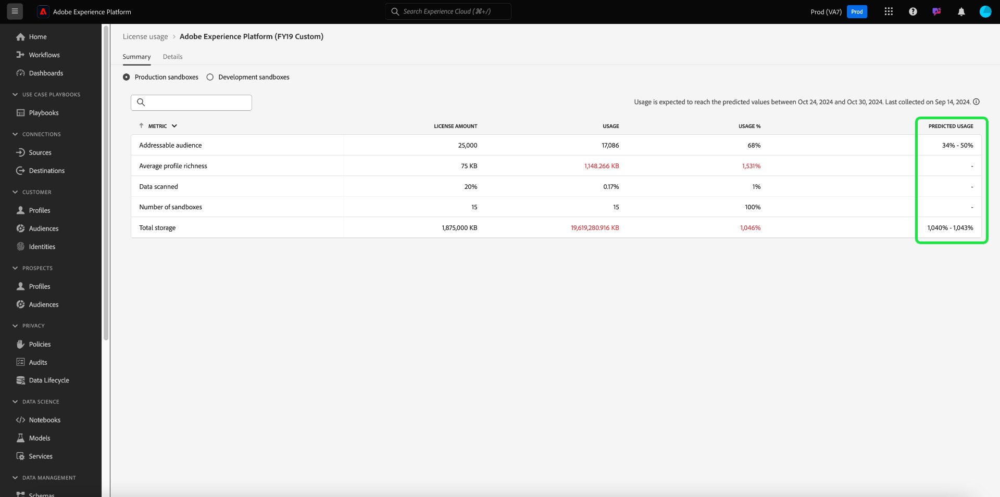

# Panel de uso de licencias {#license-usage-dashboard}

>[!CONTEXTUALHELP]
>id="platform_dashboards_licenseUsage"
>title="Panel de uso de licencias"
>abstract="El panel de uso de licencias ofrece datos de los productos de Adobe Experience Platform que ha adquirido. La información general del panel muestra las métricas principales de sus productos, incluido el uso de cada una de las métricas principales y el importe de la licencia contratada. El espacio de trabajo de detalles muestra un desglose de las métricas de cada producto dentro de zonas protegidas específicas."
>additional-url="https://experienceleague.adobe.com/en/docs/experience-platform/data-lifecycle/ui/dataset-expiration" text="Caducidades automatizadas de conjuntos de datos"
>additional-url="https://experienceleague.adobe.com/en/docs/experience-platform/profile/pseudonymous-profiles" text="Caducidad de datos de perfiles seudónimos"

>[!CONTEXTUALHELP]
>id="platform_licenseusage"
>title="Panel de uso de licencias"
>abstract="El panel de uso de licencias ofrece datos de los productos de Adobe Experience Platform que ha adquirido. La información general del panel muestra las métricas principales de sus productos, incluido el uso de cada una de las métricas principales y el importe de la licencia contratada. El espacio de trabajo de detalles muestra un desglose de las métricas de cada producto dentro de zonas protegidas específicas."
>additional-url="https://experienceleague.adobe.com/en/docs/experience-platform/data-lifecycle/ui/dataset-expiration" text="Caducidades automatizadas de conjuntos de datos"
>additional-url="https://experienceleague.adobe.com/en/docs/experience-platform/profile/pseudonymous-profiles" text="Caducidad de datos de perfiles seudónimos"

Puede ver información importante sobre el uso de licencias de su organización en el panel de control de Adobe Experience Platform [!UICONTROL Uso de licencias]. La información que se muestra aquí se captura durante una captura diaria de la instancia de Platform.

Los informes de uso de licencias proporcionan un alto grado de granularidad sobre las métricas de uso de licencias. El panel proporciona métricas de uso para cada producto comprado, el uso consolidado de métricas en todas las zonas protegidas de producción o desarrollo y la métrica de uso de una zona protegida específica. Las siguientes aplicaciones de Experience Platform se pueden rastrear con métricas de uso: Real-time Customer Data Platform, Adobe Journey Optimizer y Customer Journey Analytics.

Esta guía describe cómo acceder y trabajar con el tablero de uso de licencias en la interfaz de usuario y proporciona más información sobre las visualizaciones que se muestran en el tablero.

Para obtener una descripción general de la interfaz de usuario de Platform, consulte la [guía de la interfaz de usuario del Experience Platform](../../landing/ui-guide.md).

## [!UICONTROL Uso de licencias] datos de tablero

El panel [!UICONTROL Uso de licencias] muestra una lista de todos los productos de Experience Platform que ha adquirido. Desde esta lista, puede encontrar una instantánea de los datos relacionados con las licencias de su organización para Experience Platform en cualquier zona protegida asociada.

Los datos de este tablero se muestran exactamente como aparecen en el momento específico en el que se tomó la instantánea. En otras palabras, la instantánea no es una aproximación o una muestra de los datos y el panel no se actualiza en tiempo real.

>[!NOTE]
>
>Los cambios o actualizaciones realizados en los datos desde que se tomó la instantánea no se reflejarán en el tablero hasta que se tome la siguiente instantánea.

## Exploración del tablero de uso de licencias {#explore}

Para navegar al panel de uso de licencias dentro de la interfaz de usuario de Platform, seleccione **[!UICONTROL Uso de licencias]** en el carril izquierdo. Se abre la pestaña [!UICONTROL Información general], que muestra una lista de los productos disponibles.

>[!NOTE]
>
>El panel de uso de licencias no está habilitado de forma predeterminada. Los usuarios deben tener permiso para &quot;Ver tablero de uso de licencias&quot; para poder ver el tablero. Para obtener los pasos sobre la concesión de permisos de acceso para ver el tablero de uso de licencias, consulte la [guía de permisos de tablero](../permissions.md).

## [!UICONTROL Ficha Información general] {#overview-tab}

Este tablero muestra todos sus productos de Adobe Experience Platform con licencia, incluidos los complementos, en formato de tabla. La tabla proporciona información clave sobre el uso de la licencia en todos los perfiles disponibles.

| Nombre de columna | Descripción |
|---|---|
| **[!UICONTROL Producto]** | La solución de Adobe con licencia de su organización. |
| **[!UICONTROL Métrica principal]** | La métrica principal utilizada para rastrear en para ese producto. |
| **[!UICONTROL Importe de licencia]** | El valor contratado para la cantidad máxima de la métrica principal según lo acordado en el contrato de licencia del producto. |
| **[!UICONTROL Uso]** | Cantidad de la métrica principal utilizada. Este valor proporciona el uso total de esa métrica en todas las zonas protegidas, ya sea de producción o desarrollo. |
| **[!UICONTROL Uso %]** | El porcentaje de la métrica principal utilizado según la cantidad de licencia. |
| **[!UICONTROL Uso de predicción]** | (**Beta**) El porcentaje de uso previsto de la métrica principal según la cantidad de licencia. |

>[!NOTE]
>
>Las adiciones al [!UICONTROL Importe de licencia] como resultado de los complementos se agregan sobre el [!UICONTROL Importe de licencia] para los productos base como Real-time Customer Data Platform, Adobe Journey Optimizer y Customer Journey Analytics. El uso de esa cantidad con licencia (después de los complementos) se rastrea a través de los productos base. Por ejemplo, si compra un paquete de cinco zonas protegidas, la cantidad de cinco se agrega a la del producto base. En este caso, el complemento muestra un [!UICONTROL Importe de licencia] de uno, y el uso de ese complemento está &quot;en blanco&quot;, ya que el uso se rastrea a través del producto base.

La tabla indica la métrica principal de cada producto, ya que cada producto puede realizar el seguimiento de numerosas métricas.

### [!BADGE Beta]{type=Informative} predijo el uso {#predicted-usage}

>[!CONTEXTUALHELP]
>id="platform_dashboards_licenseUsage_prediction"
>title="Uso previsto"
abstract="Las predicciones se basan en el uso durante los últimos 6 a 7 meses y se generan el 15 de cada mes. Tenga en cuenta que las predicciones del uso de licencias son aproximaciones basadas en el uso anterior. Usted es responsable de comprender el uso real de su organización y de garantizar que el uso no vaya más allá del ámbito de la licencia de su organización con Adobe. Para reducir el uso, puede configurar las caducidades de los datos de perfil de conjuntos de datos o seudónimos para los entornos limitados y los conjuntos de datos."
additional-url="https://experienceleague.adobe.com/en/docs/experience-platform/data-lifecycle/ui/dataset-expiration" text="Caducidades automatizadas de conjuntos de datos"
additional-url="https://experienceleague.adobe.com/en/docs/experience-platform/profile/pseudonymous-profiles" text="Caducidad de datos de perfiles seudónimos"

[!CONTEXTUALHELP]
id="platform_licenseusage_prediction"
title="Uso previsto"
abstract="Las predicciones se basan en el uso durante los últimos 6 a 7 meses y se generan el 15 de cada mes. Tenga en cuenta que las predicciones del uso de licencias son aproximaciones basadas en el uso anterior. Usted es responsable de comprender el uso real de su organización y de garantizar que el uso no vaya más allá del ámbito de la licencia de su organización con Adobe. Para reducir el uso, puede configurar las caducidades de los datos de perfil de conjuntos de datos o seudónimos para los entornos limitados y los conjuntos de datos."
additional-url="https://experienceleague.adobe.com/en/docs/experience-platform/data-lifecycle/ui/dataset-expiration" text="Caducidades automatizadas de conjuntos de datos"
additional-url="https://experienceleague.adobe.com/en/docs/experience-platform/profile/pseudonymous-profiles" text="Caducidad de datos de perfiles seudónimos"

>[!AVAILABILITY]
>
La funcionalidad para predecir el uso futuro de las licencias está actualmente en versión beta. La documentación y las funcionalidades están sujetas a cambios.

Administre y optimice de forma proactiva sus recursos de licencias en función de predicciones de uso reveladoras. La columna [!UICONTROL Uso predicho] predice con precisión el uso futuro de licencias en el nivel de zona protegida, en todas las zonas protegidas de producción y desarrollo, para todos los productos que haya comprado. Esta capacidad de alerta proporciona una previsión del uso de licencias para seis semanas en el futuro, en función de su uso hasta el 15 de este mes natural. Las predicciones se proporcionan con un límite inferior y otro superior.

>[!IMPORTANT]
>
Las predicciones se actualizan mensualmente. La fecha de actualización se incluye en un icono de información () sobre el título de columna.

Para ver un resumen del uso de derechos de productos, selecciona un producto de la lista [!UICONTROL Información general].

![El [!UICONTROL uso de licencias] [!UICONTROL Información general] con un producto y la columna de uso previsto resaltada.](../images/license-usage/product-predicted-usage.png)

Aparecerá la pestaña Resumen. Puede usar las predicciones detalladas disponibles en las fichas [!UICONTROL Resumen] y [!UICONTROL Detalles] para garantizar una toma de decisiones informada y un uso eficiente de la licencia.

>[!NOTE]
>
Tenga en cuenta que las predicciones del uso de licencias son aproximaciones basadas en el uso anterior. Usted es responsable de comprender el uso real de su organización y de garantizar que el uso no vaya más allá del ámbito de la licencia de su organización con Adobe.

El porcentaje de uso previsto se determina de la siguiente manera:

- Si los límites inferior y superior son significativamente diferentes, se muestran como un rango (por ejemplo, 32 % - 35 %).
- Si los límites inferior y superior son casi idénticos y no son cero, se muestran como un valor aproximado (por ejemplo, ~34%).
- Si los límites inferior y superior son casi idénticos y cero, se muestran exactamente como 0%.

>[!NOTE]
>
&quot;Casi idéntico&quot; en este contexto significa que los valores son estadísticamente significativos para dos decimales (por ejemplo, un límite inferior de 0,342 y un límite superior de 0,344 se redondean al 34 %).

La función de uso previsto admite las siguientes métricas:

- [!UICONTROL Audiencia a la que se puede dirigir]
- [!UICONTROL Promedio de riqueza de perfiles]
- [!UICONTROL Calcular horas]
- [!UICONTROL Número de filas de la audiencia del Recorrido del cliente]
- [!UICONTROL Almacenamiento total]

## Pestaña [!UICONTROL Resumen] {#summary-tab}

Para ver más métricas e información detallada sobre el uso de la licencia del producto, seleccione un nombre de producto de la lista. Aparece la vista [!UICONTROL Resumen] de ese producto. Todas las métricas disponibles se muestran en la ficha [!UICONTROL Resumen]. Las métricas disponibles dependen del producto con licencia. Esta vista proporciona **una vista consolidada de todas las métricas en todos los entornos limitados de producción o desarrollo**. El mismo nivel de análisis se proporciona para los entornos limitados de producción y desarrollo.

En la ficha Resumen, la tabla incluye la columna [!UICONTROL Métrica]. Estas descripciones legibles en lenguaje natural indican todas las métricas utilizadas para ese tipo of zona protegida.

### Seleccionar una zona protegida {#select-sandbox}

Para cambiar la vista entre los tipos de zona protegida de producción y desarrollo, haga lo siguiente: select [!UICONTROL zonas protegidas de producción] o [!UICONTROL zonas protegidas de desarrollo]. El tipo de zona protegida seleccionado is se indica mediante el botón de opción situado junto al nombre de la zona protegida.

Los informes de consumo para las zonas protegidas son acumulativos para todas las zonas protegidas del mismo tipo. In En otras palabras, al seleccionar [!UICONTROL Producción] o [!UICONTROL Desarrollo] se proporcionan informes de consumo para todas las zonas protegidas de producción o desarrollo, respectivamente.

>[!WARNING]
>
El permiso para ver el tablero de uso de licencias debe especificarse en el nivel de zona protegida. Añada permisos a cada zona protegida individual para verlos dentro del panel. Esta limitación se solucionará en una versión futura. Mientras tanto, está disponible la siguiente solución:
>
1. Cree un perfil de producto en Adobe Admin Console.
2. En Permiso en la categoría Zona protegida, agregue todas las zonas protegidas que desee ver en el panel de uso de licencias.
3. En la categoría Permiso del tablero de usuarios, agregue el permiso &quot;Ver tablero de uso de licencias&quot;.

## La ficha [!UICONTROL Detalles] {#details-tab}

Para ver **una métrica de uso en particular de una zona protegida específica**, vaya a la pestaña [!UICONTROL Detalles]. La pestaña [!UICONTROL Detalles] muestra todas las zonas protegidas disponibles en las zonas protegidas de producción o desarrollo.

Desde esta vista, puede seleccionar  junto al nombre de una zona protegida para ver la visualización de esa métrica. Se abrirá un cuadro de diálogo con una visualización para esa métrica.

### Visualizaciones {#visualizations}

Cada widget de visualización incluye los siguientes aspectos:

- Gráfico de líneas que registra el cambio de la métrica a lo largo del tiempo
- Una clave para el gráfico de líneas
- Nombre de la zona protegida
- Menú desplegable para ajustar el período de tiempo del gráfico de líneas

Los gráficos de líneas comparan los números de uso de su organización con el total disponible con las licencias de su organización y proporcionan un porcentaje del uso total.

El periodo retrospectivo de análisis se puede ajustar desde el menú desplegable. El valor predeterminado de los últimos 30 días

Para seleccionar un intervalo de fecha, puede utilizar la lista desplegable de intervalo de fecha para seleccionar el período de tiempo que se mostrará en el panel. Hay varias opciones disponibles, incluido el valor predeterminado de los últimos 30 días.

También puede seleccionar **[!UICONTROL Fecha personalizada]** para elegir el período de tiempo que se muestra.

## Métricas disponibles {#available-metrics}

El panel de uso de licencias informa sobre varias métricas únicas que se aplican a varios productos de la organización. Las métricas disponibles son:

| Métrica | Descripción |
|---|---|
| [!UICONTROL Tamaño de Audience Activation] | El tamaño total de los perfiles activados en cualquier destino basado en archivos en un año. Nota: Esto no incluye perfiles enviados a través de destinos de flujo continuo. |
| [!UICONTROL Audiencia a la que se puede dirigir] | La suma de los derechos de audiencia empresarial y de audiencia de consumidor. Una audiencia de consumidor se define como el número de perfiles de persona identificados como una &quot;Audiencia de consumidor&quot; en el pedido de ventas. Una audiencia empresarial se define como el número de perfiles de personas de negocios identificados como la &quot;Audiencia empresarial&quot; en el pedido de ventas. |
| [!UICONTROL Paquetes de usuarios de servicio de consultas ad hoc] | Un complemento para aumentar el derecho de los usuarios autorizados del servicio de consulta simultánea en cinco usuarios adicionales del servicio de consulta simultánea y una consulta ad hoc adicional que se ejecuta simultáneamente por paquete. Se pueden adquirir licencias para varios paquetes de usuarios de Ad Hoc Query adicionales. |
| [!UICONTROL Promedio de riqueza de perfiles] | La suma de todos los datos de producción almacenados en el servicio de perfil de concentrador en cualquier momento, dividida por cinco veces el número de perfiles autorizados de personas de negocios. [!UICONTROL Promedio de riqueza de perfiles] es una característica compartida. |
| [!UICONTROL Filas de CJA disponibles] | Las filas medias diarias de datos disponibles para su análisis dentro de Customer Journey Analytics. |
| [!UICONTROL Atributos calculados] | Recuento total de datos de comportamiento del perfil agregados. Los datos de comportamiento del perfil agregados se basan en eventos de experiencia que se convierten en un atributo de perfil y que pueden incluirse en un perfil de persona o un perfil de persona de negocios. |
| [!UICONTROL Audiencia del consumidor] | El número de perfiles de persona identificados como &quot;Audiencia del consumidor&quot; en el pedido de ventas. |
| [!UICONTROL Tamaño de exportación de datos] | Cantidad de datos enviados a través de activaciones de conjuntos de datos en un año. |
| [!UICONTROL Exportaciones de datos] | El tamaño total de los conjuntos de datos que se pueden exportar a cualquier solución que no sea de Adobe (directa o indirectamente) en un año. |
| [!UICONTROL Almacenamiento de lago de datos] | Cantidad utilizada del almacén de datos analíticos en Adobe Experience Platform. |
| [!UICONTROL Audiencia atractiva] | Esta métrica hace referencia a la audiencia de perfiles atractivos. Un perfil atractivo es un registro de información que representa a un individuo y se representa en el servicio de perfil. Estos registros son perfiles con los que ha intentado interactuar mediante las capacidades de creación, toma de decisiones, envío, experimentación u orquestación de Journey Optimizer durante los últimos 12 meses. |
| [!UICONTROL Audiencias de similitud] | Recuento de audiencias que se generan al modelar una audiencia de consumidor existente para identificar perfiles de persona similares a la audiencia de consumidor existente. |
| [!UICONTROL Número de modelos AMM] | Recuento del modelo de aprendizaje automático (Adobe Mix Modeler integrado) que se utiliza para medir o predecir un resultado especificado en función de sus inversiones. |
| [!UICONTROL Número de zonas protegidas] | Recuento de separaciones lógicas dentro de la instancia de cualquier servicio bajo demanda de Adobe que acceda a los datos y operaciones de aislamiento de Adobe Experience Platform. |
| [!UICONTROL Número de paquetes de riqueza de perfiles] | Un aumento en su riqueza de perfiles promedio autorizada de 25 KB por perfil para cada paquete de riqueza de perfiles adicional. |
| [!UICONTROL Horas de cálculo del servicio de consultas] | Una medida de la cantidad de tiempo que los motores de servicios de consulta tardan en leer, procesar y escribir datos en el lago de datos cuando se ejecuta una consulta por lotes. |
| [!UICONTROL Nº de paquetes de segmentación de transmisión] | Los paquetes actualizan el abono de segmentos de un perfil de persona a medida que los nuevos datos entran en el servicio de segmentación a través de un flujo de streaming. La pertenencia a segmentos se evalúa en función de los atributos de perfil de la persona actual y el valor del evento actual, sin tener en cuenta el comportamiento histórico. La segmentación por secuencias es una función compartida. |

<!-- |  [!UICONTROL Sandbox No of Packs] |  A logical separation within your instance of any Adobe On-demand Service that accesses Adobe Experience Platform isolating data and operations | -->

>[!TIP]
>
Puede comprobar los derechos de licencia en su pedido de ventas para calcular métricas como la &quot;asignación de almacenamiento&quot;. Por ejemplo,<ul><li>Asignación de Almacenamiento = El número de &quot;perfiles autorizados&quot; en su contrato X La riqueza promedio de perfiles</li></ul>

La disponibilidad de estas métricas y la definición específica de cada una de ellas varían según la licencia que haya adquirido su organización. Para obtener definiciones detalladas de cada métrica, consulte la documentación de descripción del producto correspondiente:

| Licencia | Descripción del producto |
|---|---|
| <ul><li>ADOBE EXPERIENCE PLATFORM:OD LITE</li><li>ADOBE EXPERIENCE PLATFORM:ESTÁNDAR OD</li><li>ADOBE EXPERIENCE PLATFORM:PESADO OD</li></ul> | [Adobe Experience Platform](https://helpx.adobe.com/legal/product-descriptions/adobe-experience-platform.html) |
| <ul><li>ADOBE EXPERIENCE PLATFORM:OD</li></ul> | [Experience Platform, servicios de aplicaciones y servicios inteligentes](https://helpx.adobe.com/legal/product-descriptions/exp-platform-app-svcs.html) |
| <ul><li>RT PLATAFORMA DE DATOS DEL CLIENTE:OD</li><li>RT PLATAFORMA DE DATOS DEL CLIENTE:OD PRFL A 10M</li><li>RT PLATAFORMA DE DATOS DEL CLIENTE:OD PRFL A 50M</li></ul> | [Adobe Real-time Customer Data Platform](https://helpx.adobe.com/legal/product-descriptions/real-time-customer-data-platform.html?lang=es) |
| <ul><li>AEP:ACTIVACIÓN DE OD</li><li>AEP:OD ACTIVATION PRFL A 10M</li><li>AEP: PERFIL DE ACTIVACIÓN DE OD DE HASTA 50 M</li></ul> | [Activación de Adobe Experience Platform](https://helpx.adobe.com/legal/product-descriptions/adobe-experience-platform0.html) |
| <ul><li>AEP:INTELIGENCIA OD</li></ul> | [Adobe Experience Platform Intelligence](https://helpx.adobe.com/legal/product-descriptions/adobe-experience-platform-intelligence---product-description.html) |
| <ul><li>JOURNEY OPTIMIZER SELECT:OD</li><li>JOURNEY OPTIMIZER PRIME:OD</li><li>JOURNEY OPTIMIZER ULTIMATE:OD</li><li>DESACTIVAR AJO PRIME STARTER:OD</li><li>DESACTIVAR AJO ULTIMATE STARTER:OD</li><li>DESACTIVAR Real-Time CDP:ORQUESTACIÓN DE PERFILES OD</li></ul> | [Adobe Journey Optimizer](https://helpx.adobe.com/es/legal/product-descriptions/adobe-journey-optimizer.html) |

>[!WARNING]
>
El tablero de uso de licencias solo informa de la licencia más reciente aprovisionada para su organización. Si la licencia más reciente aprovisionada para su organización no aparece en la tabla anterior, es posible que el panel de uso de licencias no se muestre correctamente. La compatibilidad con licencias adicionales y múltiples licencias en una sola organización está planificada para una versión futura.

## Pasos siguientes

Después de leer este documento, puede localizar el panel de uso de licencias y ver las métricas de uso de cada producto comprado, de todas las zonas protegidas de producción o desarrollo y de una zona protegida específica. Puede encontrar más información sobre las métricas disponibles para su organización, en función de las licencias que haya adquirido su organización.

Para obtener más información acerca de otras características disponibles en la interfaz de usuario de Experience Platform, consulte la [guía de la interfaz de usuario de Platform](../../landing/ui-guide.md).
