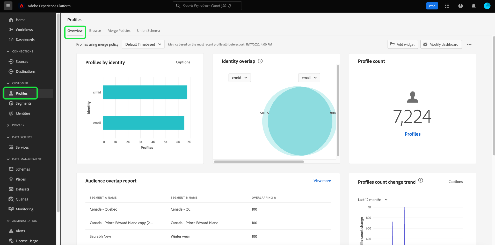
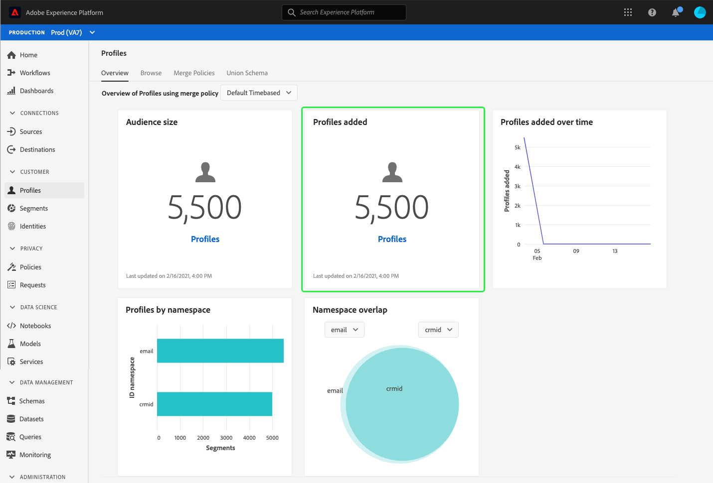

# panel (Beta) [!UICONTROL Perfiles]

>[!IMPORTANT]
>
>La funcionalidad de panel descrita en este documento está actualmente en fase beta y no está disponible para todos los usuarios. La documentación y las funciones están sujetas a cambios.

La interfaz de usuario (UI) de Adobe Experience Platform proporciona un panel mediante el cual puede realizar vistas de información importante sobre los datos [!DNL Real-time Customer Profile], tal como se captura durante una instantánea diaria. Esta guía describe cómo acceder y trabajar con el panel [!UICONTROL Perfiles] en la interfaz de usuario y proporciona información sobre las métricas que se muestran en el panel.

Para obtener información general sobre todas las funciones de Perfil de la interfaz de usuario del Experience Platform, visite la [Guía de la interfaz de usuario de Perfil del cliente en tiempo real](../../profile/ui/user-guide.md).

## Datos de panel de perfil

El panel [!UICONTROL Perfiles] muestra una instantánea de los datos de atributos (registros) que su organización tiene dentro del almacén de Perfiles en Experience Platform. La instantánea no incluye datos de eventos (series temporales).

Los datos de atributo de la instantánea muestran los datos exactamente como aparecen en el momento concreto en que se realizó la instantánea. En otras palabras, la instantánea no es una aproximación o muestra de los datos y el panel de Perfil no se actualiza en tiempo real.

>[!NOTE]
>
>Los cambios o actualizaciones realizados en los datos desde que se realizó la instantánea no se reflejarán en el panel hasta que se realice la siguiente instantánea.

## Explorar el panel [!UICONTROL Perfiles]

Para desplazarse al panel [!UICONTROL Perfiles] dentro de la interfaz de usuario de la plataforma, seleccione **[!UICONTROL Perfiles]** en el carril izquierdo y, a continuación, seleccione la ficha **[!UICONTROL Información general]** para mostrar el panel.

### Selección de directivas de combinación

Las métricas que se muestran en el panel [!UICONTROL Perfiles] se basan en las políticas de combinación que se aplican a los datos de Perfil del cliente en tiempo real. Cuando los datos se reúnen desde múltiples fuentes, es posible que los datos contengan valores en conflicto (por ejemplo, un conjunto de datos puede lista a un cliente como &quot;único&quot; mientras que otro conjunto de datos puede lista al cliente como &quot;casado&quot;) y es tarea de la directiva de combinación determinar qué datos se priorizarán y mostrarán como parte del perfil.

El panel seleccionará automáticamente una directiva de combinación para mostrar, pero puede cambiar la directiva de combinación seleccionada mediante el menú desplegable. Para elegir una directiva de combinación diferente, seleccione la lista desplegable situada junto al nombre de la directiva de combinación y, a continuación, seleccione la directiva de combinación que desee vista.

>[!NOTE]
>
>El menú desplegable muestra solamente las directivas de combinación relacionadas con la clase de Perfil individual XDM. Sin embargo, si su organización ha creado varias directivas de combinación, puede significar que tendrá que desplazarse para vista de la lista completa de las directivas de combinación disponibles.

Para obtener más información sobre las directivas de combinación, incluida la creación, edición y declaración de una directiva de combinación predeterminada para su organización, visite la [guía de IU de directivas de combinación](../../profile/ui/merge-policies.md).

### Widgets y métricas

El panel está compuesto de utilidades, que son métricas de solo lectura que proporcionan información importante con respecto a los datos del Perfil. La fecha y hora &quot;última actualización&quot; de una utilidad muestra cuándo se realizó la última instantánea de los datos.

## Widgets disponibles

Experience Platform proporciona varias utilidades que puede utilizar para visualizar distintas métricas relacionadas con los datos de Perfil. Seleccione el nombre de una utilidad a continuación para obtener más información:

* [[!UICONTROL Tamaño de audiencia]](#audience-size)
* [[!UICONTROL Perfiles agregados]](#profiles-added)
* [[!UICONTROL Perfiles agregados con el tiempo]](#profiles-added-over-time)
* [[!UICONTROL Perfiles por Área de nombres]](#profiles-by-namespace)
* [[!UICONTROL Superposición de Área de nombres]](#namespace-overlap)

### [!UICONTROL Tamaño de audiencia] {#audience-size}

El widget **[!UICONTROL tamaño de Audiencia]** muestra el número total de perfiles combinados dentro del almacén de datos de Perfil en el momento en que se realizó la instantánea. Este número es el resultado de la política de combinación seleccionada que se está aplicando a los datos de Perfil para combinar los fragmentos de perfil para formar un solo perfil para cada individuo.

Para obtener más información sobre fragmentos y perfiles combinados, lea la sección *fragmentos de Perfil vs. perfiles combinados* de la [información general del Perfil del cliente en tiempo real](../../profile/home.md).

>[!NOTE]
>
>La directiva de combinación utilizada para calcular esta métrica no es la misma que la directiva de combinación generada por el sistema utilizada para calcular [!UICONTROL audiencias direccionables] en el panel [!UICONTROL Uso de licencias], por lo tanto es poco probable que el recuento de audiencias de los paneles [!UICONTROL Perfiles] y [!UICONTROL Uso de licencias] sea exactamente el mismo.

### [!UICONTROL Perfiles agregados] {#profiles-added}

La utilidad **[!UICONTROL Perfiles agregados]** muestra el número total de perfiles combinados que se han agregado al almacén de datos de Perfil desde que se realizó la última instantánea. Este número es el resultado de la política de combinación seleccionada que se está aplicando a los datos de Perfil para combinar los fragmentos de perfil para formar un solo perfil para cada individuo.

### [!UICONTROL Perfiles agregados con el tiempo] {#profiles-added-over-time}

La utilidad **[!UICONTROL Perfiles agregados con el paso del tiempo]** muestra el número total de perfiles combinados que se han agregado al almacén de datos de Perfil diariamente durante los últimos 30 días. Este número se actualiza todos los días cuando se toma la instantánea, por lo que si ingesta perfiles en la plataforma, el número de perfiles no se reflejará hasta que se realice la siguiente instantánea.

El recuento de perfiles agregados es el resultado de la política de combinación seleccionada que se está aplicando a los datos de Perfil para combinar los fragmentos de perfil para formar un solo perfil para cada individuo.

### [!UICONTROL Perfiles por Área de nombres] {#profiles-by-namespace}

La utilidad **[!UICONTROL Perfiles por Área de nombres]** muestra el desglose de Áreas de nombres de identidad en todos los perfiles combinados del almacén de Perfiles. El número total de perfiles por [!UICONTROL Área de nombres de ID] (es decir, sumar los valores mostrados para cada Área de nombres) puede ser mayor que el número total de perfiles de combinación porque un perfil podría tener varias Áreas de nombres asociadas. Por ejemplo, si un cliente interactúa con su marca en más de un canal, se asociarán varias Áreas de nombres con ese cliente individual.

Para obtener más información sobre Áreas de nombres de identidad, visite la [documentación del servicio de identidad de Adobe Experience Platform](../../identity-service/home.md).

### [!UICONTROL Superposición de Área de nombres] {#namespace-overlap}

La utilidad **[!UICONTROL solapamiento de Área de nombres]** muestra un diagrama de Venn o un diagrama de conjunto que muestra la superposición de perfiles en el almacén de Perfiles que contiene varias Áreas de nombres de identidad.

Después de utilizar los menús desplegables del widget para seleccionar las Áreas de nombres de identidad que desea comparar, aparecen círculos que muestran el tamaño relativo de cada Área de nombres, con el número de perfiles que contienen ambas Áreas de nombres representado por el tamaño de la superposición entre los círculos.

Si un cliente interactúa con su marca en más de un canal, se asociarán varias Áreas de nombres con ese cliente individual, por lo que es probable que su organización tenga varios perfiles que contengan fragmentos de más de una Área de nombres de identidad.

Para obtener más información sobre Áreas de nombres de identidad, visite la [documentación del servicio de identidad de Adobe Experience Platform](../../identity-service/home.md).

## Pasos siguientes

Al seguir este documento ahora debería poder localizar el panel de Perfiles y comprender las métricas que se muestran en las utilidades disponibles. Para obtener más información sobre cómo trabajar con [!DNL Profile] datos en la interfaz de usuario del Experience Platform, consulte la [Guía de la interfaz de usuario del Perfil del cliente en tiempo real](../../profile/ui/user-guide.md).